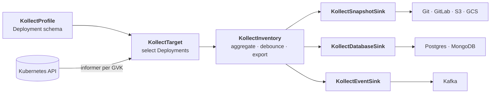
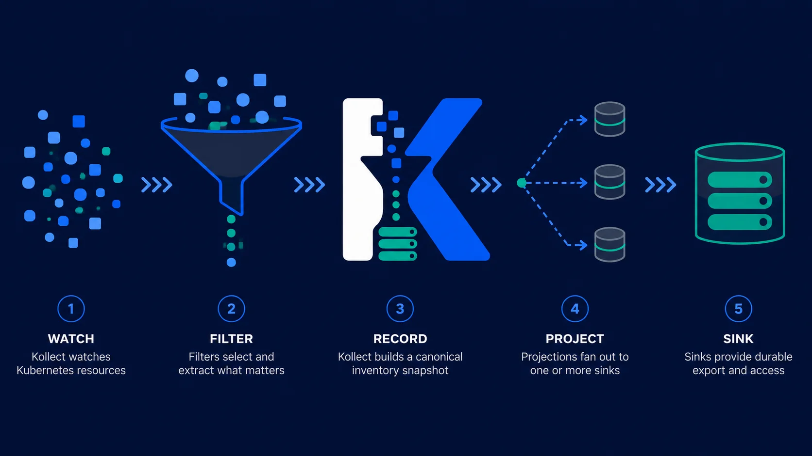

<p align="center">
  <a href="https://konih.github.io/kollect/">
    
  </a>
</p>

<p align="center">
<a href="https://securityscorecards.dev/viewer/?uri=github.com/konih/kollect"></a>
<a href="https://github.com/konih/kollect/actions/workflows/ci.yaml"></a>
<a href="https://github.com/konih/kollect/releases"></a>
<a href="https://codecov.io/gh/konih/kollect"></a>
<a href="https://github.com/konih/kollect/blob/main/LICENSE"></a>
</p>

<p align="center"><em>Git-simple to start · platform-grade to grow</em></p>

# Kollect

**Kubernetes knows what's running *right now*. Kollect turns that into a durable record your
whole platform can use** — a Git history you can `diff`, a database your portal can query, an
event stream your automation can react to. Declare what matters in a few CRs (select by GVK,
extract with CEL), and every sink receives the same rows, in parallel.

<!-- Hero GIF (generate locally): docs/assets/demo/hero-git-only.gif — see docs/DEMO-GIF-GUIDE.md -->

**Start with one Git repo. Grow to a whole platform.** On day one, a single pipeline gives you a
Git-committed inventory — `git log` is your audit trail, `git diff` is your drift report, no
scripts, no apiserver hammering. As adoption grows, nothing gets rebuilt: the same rows fan out to
Postgres, Kafka, and object storage, and `KollectScope` keeps it multi-tenant — every team owns
its inventory as **configuration, not code**, in its own namespace. Consumers read **export
data**, never unbounded list/watch against the live cluster.

**Read the docs:** **[konih.github.io/kollect](https://konih.github.io/kollect/)** — architecture,
quick start, CR reference, ADRs, and examples. This README is the front door; the site is the map.

> **Pre-beta.** APIs and defaults may change until the first release candidate. See the
> [roadmap](https://konih.github.io/kollect/ROADMAP/) for current status.

## Why Kollect?

- **Decoupled read model** — consumers query a sink, not the apiserver. No RBAC blast radius, no
  watch-storm risk, no etcd size limits ([why](https://konih.github.io/kollect/adr/0103-etcd-limit/)).
- **Event-driven, no polling** — one shared informer per GVK keeps inventory current as the cluster
  changes ([ADR-0301](https://konih.github.io/kollect/adr/0301-event-driven-informers/)).
- **Schema-flexible** — declare the attributes you want in a `KollectProfile`; no bespoke collector
  per resource kind.
- **Pluggable sinks, no privileged backend** — the same snapshot fans out to Git, Postgres, object
  store, or an event stream ([sink taxonomy](https://konih.github.io/kollect/adr/0401-sink-taxonomy-state-vs-stream/)).
- **Multi-tenant by design** — `KollectScope` gates which teams, namespaces, and sinks each tenant
  may use.
- **Fleet-ready** — **N single-mode operators → one shared sink**, partitioned by `spec.cluster`; no
  central hub tier to operate ([ADR-0501](https://konih.github.io/kollect/adr/0501-multi-cluster-fleet/)).
- **Built for scale** — a **10,000-row baseline validated in CI**, a **100,000-row design target**
  per cluster with export sharding, plus tunable reconcile/dispatch concurrency
  ([performance](https://konih.github.io/kollect/PERFORMANCE/)).

## See it end-to-end

A real pipeline is a handful of Kubernetes resources. This is the
[Deployment-inventory walkthrough](https://konih.github.io/kollect/examples/deployment-inventory/) —
collect container images from Deployments and export them to Postgres (for portals) and Git (for
audit) at the same time:



## Quick start (MVP)

Spin up the full pipeline on a local kind cluster in one command (needs Docker, kind, kubectl, and
[Task](https://taskfile.dev/)):

```sh
git clone https://github.com/konih/kollect.git && cd kollect
task dev-up                       # build, create kind cluster, install operator + sample CRs
kubectl get kinv,ktgt,ksnap,kdb -A    # watch the pipeline come up
```

`task dev-up` builds the manager, boots a `kollect-dev` kind cluster, installs the operator, and
applies the sample `Profile → Sink → Target → Inventory` pipeline. Watch the `KollectInventory`
`Ready` condition, then read your sink — the [live demo repo](https://github.com/konih/kollect-inventory-demo)
shows what the Git export looks like.

**Full walkthrough** — prerequisites, Helm install, maturity notes:
**[Quick start →](https://konih.github.io/kollect/QUICKSTART/)**

## How it works



The in-memory snapshot per inventory is **canonical**; every sink is a **projection** of it — no
single backend is privileged ([sink roles](https://konih.github.io/kollect/adr/0401-sink-taxonomy-state-vs-stream/)).
Sinks are split into three CRD families ([ADR-0414](https://konih.github.io/kollect/adr/0414-sink-family-crds/)):

| Sink family | Examples | Good for |
| --- | --- | --- |
| **`KollectSnapshotSink`** | Git, GitLab, S3, GCS | Audit, diff, GitOps-friendly history |
| **`KollectDatabaseSink`** | Postgres, MongoDB | Rich queries for portals and dashboards |
| **`KollectEventSink`** | Kafka, NATS | Change streams, downstream consumers |

### Supported & planned sinks

Honest maturity tiers — see the [roadmap](https://konih.github.io/kollect/ROADMAP/#supported-planned-sinks)
for release timing.

| Family CRD | `spec.type` | Status |
| --- | --- | --- |
| `KollectSnapshotSink` | `git` | **Core** — production-ready |
| `KollectSnapshotSink` | `gitlab` | **Core** |
| `KollectSnapshotSink` | `s3` | **Core** |
| `KollectSnapshotSink` | `gcs` | **Beta** — shipped, maturing |
| `KollectDatabaseSink` | `postgres` | **Core** |
| `KollectDatabaseSink` | `mongodb` | **Beta** |
| `KollectDatabaseSink` | `bigquery` | **Beta** — analytics SQL; v0.7.x hardening |
| `KollectEventSink` | `kafka` | **Beta** |
| `KollectEventSink` | `nats` | **Beta** — JetStream emitter; v0.7.x hardening |
| `KollectSnapshotSink` | `azureblob` | **Planned** — needs real backend ([roadmap](https://konih.github.io/kollect/roadmap/planned-features/)) |
| `KollectSnapshotSink` | Parquet on S3/GCS | **Planned** — layout on existing object-store sinks |

Full payload lives in sinks; CR `.status` holds summaries only ([etcd limits](https://konih.github.io/kollect/adr/0103-etcd-limit/)).

## Performance

Kollect is built for **large single clusters** and **multi-cluster fleets**, with honest, tested
targets ([ADR-0603](https://konih.github.io/kollect/adr/0603-performance-scalability/)) — **10,000+**
rows validated in nightly load tests, **100,000-row** design target per cluster, and fleet fan-in
with no hub merge tier. Tuning knobs (reconcile concurrency, export debounce, sharding) are in the
**[performance guide](https://konih.github.io/kollect/PERFORMANCE/)**.

## Learn more

| Topic | Link |
| --- | --- |
| Problem statement, CRD model, reconciliation | [Architecture](https://konih.github.io/kollect/ARCHITECTURE/) |
| Locked platform decisions | [Platform decisions](https://konih.github.io/kollect/PLATFORM-DECISIONS/) |
| CR fields, RBAC, failure modes | [CR reference](https://konih.github.io/kollect/CR-REFERENCE/) |
| Multi-cluster fleet | [ADR-0501](https://konih.github.io/kollect/adr/0501-multi-cluster-fleet/) |
| Sink taxonomy (state vs stream) | [ADR-0401](https://konih.github.io/kollect/adr/0401-sink-taxonomy-state-vs-stream/) |
| Build-order phases and status | [Roadmap](https://konih.github.io/kollect/ROADMAP/) |
| Examples index | [Examples](https://konih.github.io/kollect/examples/) |
| Example: Deployment → Git export | [Walkthrough](https://konih.github.io/kollect/examples/deployment-inventory/) |
| Live demo inventory (Git sink) | [kollect-inventory-demo](https://github.com/konih/kollect-inventory-demo) |

Developers: run `task lint`, `task test`, and `task verify` before opening a PR —
[CONTRIBUTING.md](CONTRIBUTING.md).

## Community

| | |
| --- | --- |
| **Contributing** | [CONTRIBUTING.md](CONTRIBUTING.md) — DCO, PR workflow, good first tasks |
| **Code of Conduct** | [CODE_OF_CONDUCT.md](CODE_OF_CONDUCT.md) — Contributor Covenant v2.1 |
| **Governance** | [GOVERNANCE.md](GOVERNANCE.md) — roles, decisions, continuity |

## Security

Report vulnerabilities privately — see [SECURITY.md](SECURITY.md). Security architecture:
[docs/ASSURANCE-CASE.md](docs/ASSURANCE-CASE.md).

## License

Copyright (c) 2026 Konrad Heimel. Licensed under the [MIT License](LICENSE).
