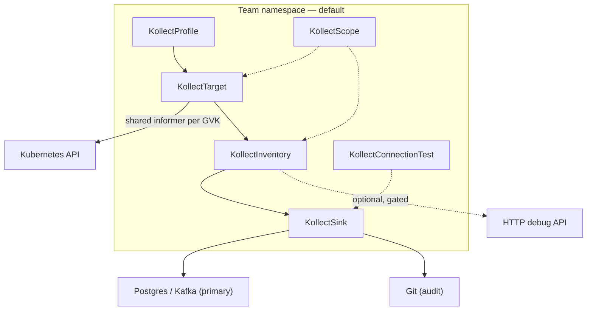
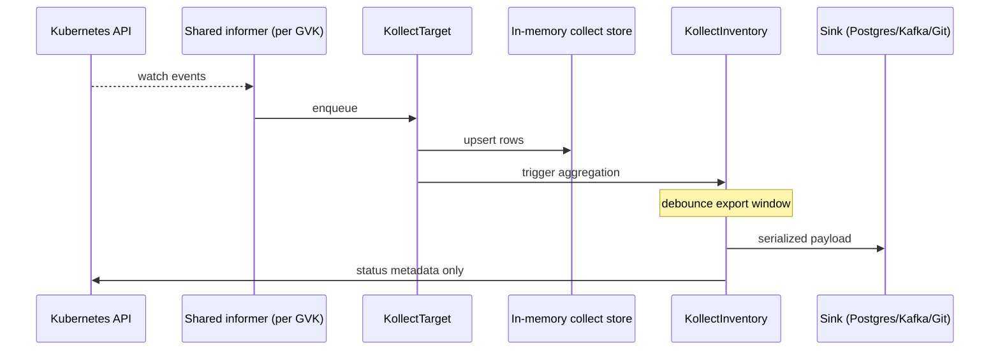

# kollect architecture

kollect is a Kubernetes operator that **collects inventory from arbitrary resources**, **aggregates
across targets (and later clusters)**, and **exports auditable snapshots to pluggable backends**
(Postgres, Kafka, Git, …) so portals and automation can query **durable export data** instead of
scraping the Kubernetes API at scale.

**Summary for implementers:** [PLATFORM-DECISIONS.md](PLATFORM-DECISIONS.md) · **ADR:** [adr/0032-platform-architecture-pivot.md](adr/0032-platform-architecture-pivot.md)

## Problem statement

Platform and application teams need **versioned, stakeholder-facing inventory** of what runs in
Kubernetes, but:

- Stakeholders should not depend on unbounded **kube-apiserver** list/watch for portal views.
- Raw API access does not produce audit-friendly, diffable history.
- Hardcoded inventory schemas break when new CRDs or attributes are needed.
- Large fleets must not produce **N export storms** or **N Git commits** per logical change.

kollect watches user-defined GVKs, extracts attributes via CEL/JSONPath, **aggregates** in memory,
**debounces export** to sinks, and keeps **Postgres/Kafka** as the primary integration path for
portals. **Templated documentation** (Confluence, wiki) stays **outside** the operator
([ADR-0011](adr/0011-doc-sync-templating.md)).

## CRD model

| Kind | Scope | Reconciled | Purpose |
| --- | --- | --- | --- |
| `KollectProfile` | Namespace | No | Extraction schema ([ADR-0031](adr/0031-namespaced-profiles.md)) |
| `KollectSink` | **Namespace** | Probe only | Export backend; `ConnectionVerified` ([ADR-0030](adr/0030-connection-test.md), [ADR-0032](adr/0032-platform-architecture-pivot.md)) |
| `KollectScope` | Namespace | No | Tenancy boundary ([ADR-0016](adr/0016-namespaced-multi-tenancy.md)) |
| `KollectTarget` | Namespace | Yes | Team-scoped collection (default) |
| `KollectClusterTarget` | Cluster | Yes | Platform cross-namespace collection ([ADR-0032](adr/0032-platform-architecture-pivot.md)) |
| `KollectInventory` | Namespace | Yes | Aggregate namespaced targets; export to sinks |
| `KollectConnectionTest` | Namespace | Yes | Audited sink/profile connectivity probes ([ADR-0032](adr/0032-platform-architecture-pivot.md)) |
| `KollectClusterProfile` | Cluster | No | Webhook only (Phase 1) — platform schemas |
| `KollectClusterSink` | Cluster | No | **Reserved** — shared backends |
| `KollectClusterInventory` | Cluster | Webhook only | Platform rollup — pairs with `KollectClusterTarget` |
| `KollectClusterScope` | Cluster | No | **Reserved** — platform policy |
| ~~`KollectHub`~~ | — | **Rejected / stub** | API types may remain in tree; **not** product surface — Helm `mode: hub` ([ADR-0032](adr/0032-platform-architecture-pivot.md)) |
| ~~`KollectPublication`~~ | — | **Rejected** | [ADR-0011](adr/0011-doc-sync-templating.md) |

See [adr/0004-crd-model.md](adr/0004-crd-model.md). Per-kind field reference:
[CR-REFERENCE.md](CR-REFERENCE.md). Reserved kinds are design placeholders — see
[PLATFORM-DECISIONS.md](PLATFORM-DECISIONS.md#reserved-crds--what-they-mean).

## Default deployment

**Per-team Helm** with `tenantMode: true` and `watchNamespaces: [team-ns]` is the **documented
default** for new installs. Platform-wide cluster operator remains supported.

## Reconciliation flow

Key properties:

- **Event-driven** informers ([ADR-0014](adr/0014-event-driven-informers.md)) — **one informer per GVK**.
- **Watch opt-in/out** ([ADR-0029](adr/0029-watch-labels.md)) — platform `watchMode: All`; teams
  exclude with `kollect.dev/watch: disabled`.
- **Export debouncing** — store updates immediately; sink export coalesced ([ADR-0032](adr/0032-platform-architecture-pivot.md)).
- **Status holds summaries only** — full payload in sinks ([ADR-0006](adr/0006-etcd-limit.md)).
- **HTTP inventory** — optional, off by default; debug/small installs only.

**Diagrams:** collection, debouncing, scope gates, and connection-test lifecycle —
[DATA-FLOWS.md](DATA-FLOWS.md).

## Where inventory lives

| Layer | Durability | Role |
| --- | --- | --- |
| Informer + collect store | Pod lifetime | Live collection |
| `KollectInventory.status` | etcd | Counts, conditions, export refs |
| **Postgres / Kafka sink** | Durable | **System of record** for portals |
| Git sink | Durable | Audit / diff |
| HTTP (if enabled) | Ephemeral | Debug snapshot |

## Sinks (priority)

1. **Postgres / Kafka** — portals, hub merge, automation at scale  
2. **Git** — recommended for **small single-cluster** installs without DB/Kafka  
3. **GitLab** — Phase 2 enterprise Git host (internal CA via `tls.caSecretRef`)  
4. **HTTP** — optional debug ([ADR-0032](adr/0032-platform-architecture-pivot.md))

## Multi-cluster (build order)

Hub = **`mode: hub`** on same image + `internal/hub/` merge — **no `KollectHub` CRD**
([ADR-0022](adr/0022-multi-cluster-sync-rfc.md)). Spokes push summaries; hub writes merged
Postgres/Kafka. Auth: [ADR-0028](adr/0028-hub-cluster-auth-istio-pattern.md).

Phases in docs are **build order**, not release milestones — see [PLATFORM-DECISIONS.md](PLATFORM-DECISIONS.md).

## Connection test

- **`KollectConnectionTest` CR** — primary for CI/audit ([ADR-0032](adr/0032-platform-architecture-pivot.md))
- Sink `connectionTest` + annotation — supplementary quick checks ([ADR-0030](adr/0030-connection-test.md))

## See also

- [REQUIREMENTS.md](REQUIREMENTS.md)
- [ROADMAP.md](ROADMAP.md)
- [PERFORMANCE.md](PERFORMANCE.md)
