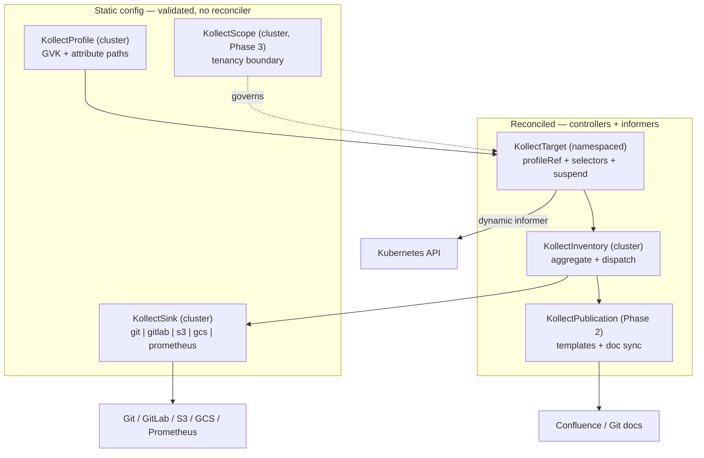
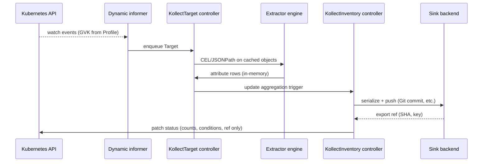
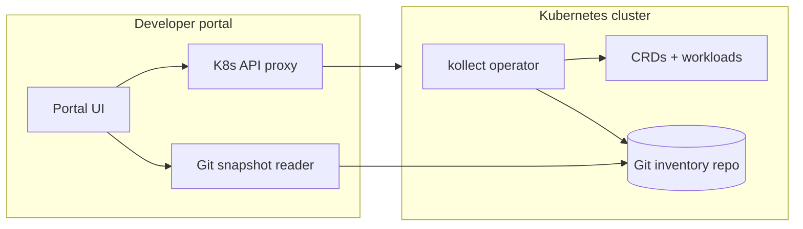

# kollect architecture

kollect is a Kubernetes operator that **collects inventory from arbitrary resources**, **exports
auditable snapshots to pluggable backends**, and (later) **syncs stakeholder documentation** —
so teams without direct cluster or Git access can still see versioned, traceable system state.

## Problem statement

Platform and application teams need **versioned, stakeholder-facing documentation** of what runs in
Kubernetes, but:

- Stakeholders often lack repo access, `kubectl` skills, or cluster credentials.
- Raw API access does not produce audit-friendly, diffable history.
- Hardcoded inventory schemas (batch collectors) break when new CRDs or attributes are needed.

kollect watches user-defined GVKs, extracts attributes via CEL/JSONPath, aggregates results, and
**exports to Git and other sinks** so a **developer portal** can combine the Kubernetes API with
exported state as a backend — making changes traceable and reviewable.

## CRD model

| Kind | Scope | Reconciled | Purpose |
| --- | --- | --- | --- |
| `KollectProfile` | Cluster | No | Extraction schema for a GVK |
| `KollectSink` | Cluster | No | Export backend configuration |
| `KollectScope` | Cluster | No | Allowed GVKs, namespaces, sinks (Phase 3) |
| `KollectTarget` | Namespace | Yes | Select resources, run collection |
| `KollectInventory` | Cluster | Yes | Aggregate and export to sinks |
| `KollectPublication` | Namespace | Yes | Render and sync documentation (Phase 2) |

See [adr/0004-crd-model.md](adr/0004-crd-model.md) for rationale and open tenancy questions.

## Reconciliation flow

Key properties ([ADR-0014](adr/0014-event-driven-informers.md)):

- **Event-driven** informers, not interval polling of the API.
- **Level-based** reconcile — safe to retry.
- **Status holds summaries only** — full payload goes to sinks ([ADR-0006](adr/0006-etcd-limit.md)).
- **SAR degradation** — cluster scope falls back to namespace scope when forbidden.

## Developer portal use case

1. Platform team defines `KollectProfile` + `KollectSink` (Git) + `KollectTarget` per namespace.
2. kollect exports **deterministic JSON/YAML** inventory on every meaningful change.
3. Portal reads **live API** (for authorized users) and **Git history** (for stakeholders / audit).
4. Phase 2 `KollectPublication` adds rendered Confluence/Git docs from templates.

**OPEN:** optional read-only HTTP `/inventory` on the operator for portal caching — not decided;
see [ADR-0006](adr/0006-etcd-limit.md).

## Phasing (summary)

| Phase | Focus |
| --- | --- |
| 0 | Bootstrap, guidelines, ADRs, CI, empty manager on kind |
| 1 | Profile + Target + Inventory + Git/GitLab sink |
| 2 | Publication, templating, Confluence/Git doc backends |
| 3 | S3/GCS/Prometheus, `KollectScope`, reserved Receiver/TargetSet design |
| 4 | kube-state-metrics-style metrics, richer aggregation |

## Further reading

- [Architecture Decision Records](adr/README.md)
- [GUIDELINES.md](https://github.com/konih/kollect/blob/main/GUIDELINES.md) — error handling, security, testing
