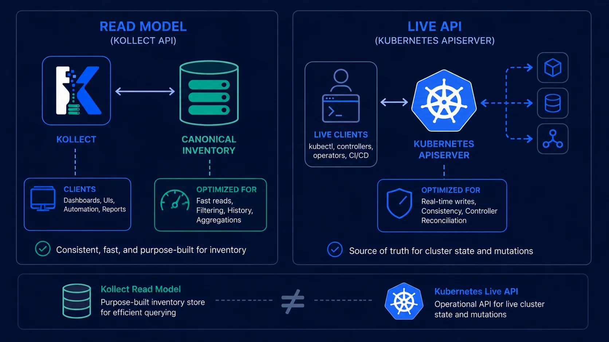
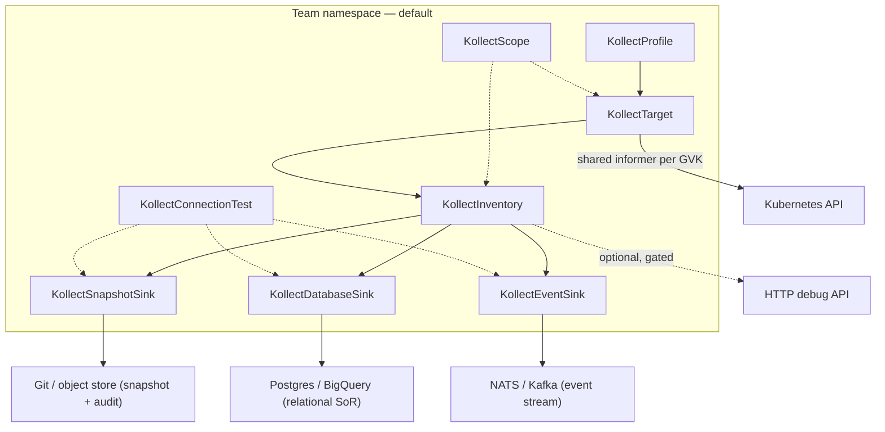
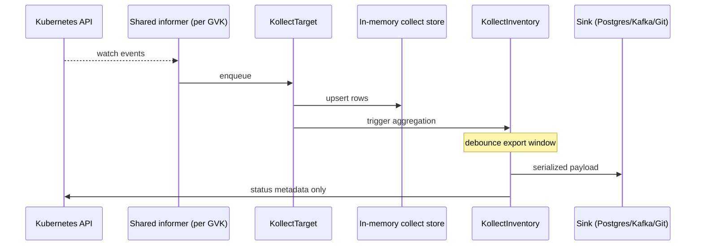

# Kollect architecture

Kollect is a Kubernetes operator that turns selected, live cluster state into a **durable, queryable,
diffable inventory** — decoupled from the apiserver's availability, RBAC, and scale limits — so portals,
automation, and auditors read **export data**, never the live API.

**Summary for implementers:** [PLATFORM-DECISIONS.md](PLATFORM-DECISIONS.md) · **ADR:** [adr/0201-crd-model.md](adr/0201-crd-model.md)

!!! info "Project maturity"
    Kollect is pre-beta (`v1alpha1`). Phases in this document describe **build order**, not GA
    release milestones. See [ROADMAP.md](ROADMAP.md) for current implementation status.

## Problem statement

**Kubernetes is the source of truth for what is running, but a poor *system of record* for it.** The
apiserver is built for control loops, not for portals, audits, and analytics: it is live and ephemeral,
RBAC-gated, etcd size-limited, schema-rigid, and per-cluster. Pointing stakeholders at it directly has
four recurring consequences:

- **Availability coupling** — portal views depend on unbounded **kube-apiserver** list/watch and on
  cluster uptime/RBAC.
- **No history** — raw API access yields no audit-friendly, diffable, point-in-time record.
- **Schema rigidity** — hardcoded collector schemas break whenever a new CRD or attribute is needed.
- **Fleet storms** — naive per-cluster export produces **N export/commit storms** per logical change.

{ .kollect-illus .kollect-illus--wide width="800" }

Kollect resolves this by maintaining a **read model** of the cluster: **select** resources by GVK →
**extract** the attributes that matter via CEL/JSONPath → **aggregate** in memory across targets (and,
optionally, clusters) → **debounce** → **export** to role-based pluggable sinks. The per-inventory
in-memory snapshot is **canonical**; every sink — relational store, object/Git snapshot, or event
stream — is a **projection** of it ([ADR-0401](adr/0401-sink-taxonomy-state-vs-stream.md)), so no single
backend is privileged. Inventory is **configuration, not code**, owned per-team in its own namespace.
Rendering and publishing docs/CMS stays **outside** the operator
([ADR-0702](adr/0702-doc-sync-templating.md)).

> Full first-principles argument (options weighed, users, assumptions): [REQUIREMENTS.md](REQUIREMENTS.md).

## CRD model



| Kind | Scope | Reconciled | Purpose |
| --- | --- | --- | --- |
| `KollectProfile` | Namespace | No | Extraction schema ([ADR-0204](adr/0204-namespaced-profiles.md)) |
| `KollectSnapshotSink` | **Namespace** | Probe only | Snapshot export; `ConnectionVerified` ([ADR-0414](adr/0414-sink-family-crds.md)) |
| `KollectDatabaseSink` | **Namespace** | Probe only | Relational SoR export |
| `KollectEventSink` | **Namespace** | Probe only | Event emitter export |
| `KollectCluster*Sink` | Cluster | Probe only | Platform-shared backends |
| `KollectScope` | Namespace | No | Tenancy boundary ([ADR-0203](adr/0203-namespaced-multi-tenancy.md)) |
| `KollectTarget` | Namespace | Yes | Team-scoped collection (default) |
| `KollectClusterTarget` | Cluster | Yes | Platform cross-namespace collection ([ADR-0201](adr/0201-crd-model.md)) |
| `KollectInventory` | Namespace | Yes | Aggregate namespaced targets; export to sinks |
| `KollectConnectionTest` | Namespace | Yes | Audited sink/profile connectivity probes ([ADR-0201](adr/0201-crd-model.md)) |
| `KollectClusterProfile` | Cluster | No | Admission only — platform schemas (no controller) |
| ~~`KollectSink`~~ | — | — | **Removed** — family CRDs ([ADR-0414](adr/0414-sink-family-crds.md)) |
| `KollectClusterInventory` | Cluster | Yes | Platform rollup — pairs with `KollectClusterTarget` |
| `KollectClusterScope` | Cluster | No | **Reserved** — platform policy |
| ~~`KollectHub`~~ | — | **Rejected / stub** | **Removed** from tree — was never product surface — Helm `| ~~`KollectPublication`~~ | — | **Rejected** | [ADR-0702](adr/0702-doc-sync-templating.md) |

See [adr/0201-crd-model.md](adr/0201-crd-model.md). Per-kind field reference:
[CR-REFERENCE.md](CR-REFERENCE.md). Reserved kinds are design placeholders — see
[PLATFORM-DECISIONS.md](PLATFORM-DECISIONS.md#reserved-crds--what-they-mean).

## Default deployment

!!! tip "Recommended install"
    **Per-team Helm** with `tenantMode: true` and `watchNamespaces: [team-ns]` is the documented
    default for new installs. Platform-wide cluster operator remains supported for cross-namespace
    collection via `KollectClusterTarget`.

!!! warning "Same-namespace sink refs"
    `KollectInventory` family sink refs must name family sink objects in the **same namespace** as the
    inventory. Cross-namespace sink references are rejected at admission.

## Reconciliation flow



Key properties:

- **Event-driven** informers ([ADR-0301](adr/0301-event-driven-informers.md)) — **one informer per GVK**.
- **Watch opt-in/out** ([ADR-0205](adr/0205-watch-labels.md)) — platform `watchMode: All`; teams
  exclude with `kollect.dev/watch: disabled`.
- **Export debouncing** — store updates immediately; sink export coalesced ([ADR-0201](adr/0201-crd-model.md)).
- **Status holds summaries only** — full payload in sinks ([ADR-0103](adr/0103-etcd-limit.md)).
- **HTTP inventory** — optional, off by default; debug/small installs only.

**Diagrams:** collection, debouncing, scope gates, and connection-test lifecycle —
[DATA-FLOWS.md](DATA-FLOWS.md).

## Where inventory lives

| Layer | Durability | Role |
| --- | --- | --- |
| Informer + collect store | Pod lifetime | Live collection |
| `KollectInventory.status` | etcd | Counts, conditions, export refs |
| **Postgres / Kafka sink** | Durable | **System of record** for portals |
| Git sink | Durable | Audit / diff |
| HTTP (if enabled) | Ephemeral | Debug snapshot |

## Sinks (by role)

Classified by role, not vendor ([ADR-0401](adr/0401-sink-taxonomy-state-vs-stream.md)). The
in-memory snapshot per Inventory is canonical; sinks are projections.

- **Snapshot stores** — **Git** (audit), **S3/GCS Parquet** (queryable via DuckDB, no DB server), **HTTP** (debug). Deletes free.
- **Relational SoR** — **Postgres** (rich portal SQL; needs delete reconciliation).
- **Event emitters** — **NATS JetStream** (lean default), **Kafka/Redpanda** (enterprise opt-in). Doubles as multi-cluster fan-in.
- **GitLab** — Phase 2 enterprise Git host (internal CA via `tls.caSecretRef`).

## Multi-cluster (build order)

!!! note "Fleet vs single-cluster"
    **Single-cluster** installs export directly to Postgres, Git, or Kafka — no hub required.
    **Fleet** topologies default to shared-sink fan-in (`spec.cluster` on each sink); the hub tier
    (`
Hub = **`([ADR-0501](adr/0501-multi-cluster-fleet.md)). Spokes push summaries; hub writes merged
Postgres/Kafka. Auth: ADR-0503.

Phases in docs are **build order**, not release milestones — see [PLATFORM-DECISIONS.md](PLATFORM-DECISIONS.md).

## Connection test

- **`KollectConnectionTest` CR** — primary for CI/audit ([ADR-0201](adr/0201-crd-model.md))
- Sink `connectionTest` + annotation — supplementary quick checks ([ADR-0403](adr/0403-connection-test.md))

## Package boundaries

Domain code under `internal/` is grouped into components (`controller`, `collect`, `aggregate`,
`sink`, `hub`, `spoke`, `inventory`, `export`, `transport`, `validation`, `webhook`, and shared
utilities). The **CRD types** in `api/v1alpha1` are a separate component every layer may import.

Intended dependency flow (simplified):

```text
api/v1alpha1  ←  controller  →  collect, aggregate, sink, hub, scope, validation, export
collect, aggregate  →  (no controller, no sink)
sink  →  transport, export (not controller)
hub  →  sink, aggregate, export (not controller reconciliation loops)
cmd  →  wires everything
```

CI enforces this graph with [go-arch-lint](https://github.com/fe3dback/go-arch-lint) via
`task arch-lint` (also part of `task lint`). Rules and any baseline `todo(arch-NN)` exceptions are
declared in [`.go-arch-lint.yml`](../.go-arch-lint.yml). Maintainer setup:
[tooling-setup.md](development/tooling-setup.md).

Regenerate the visual overview with `task arch-lint:graph` (DI view, vendors included). The SVG is
checked in at [`architecture-graph.svg`](architecture-graph.svg):


The graph shows **component dependencies** (`--type di`): arrows point from a component to what it
imports. Green vendor nodes come from the `vendors` / `canUse` blocks in `.go-arch-lint.yml` when
rendered with `--include-vendors`. For the reverse (execution-flow) view, use
`task arch-lint:graph:flow`.

## See also

- [REQUIREMENTS.md](REQUIREMENTS.md)
- [ROADMAP.md](ROADMAP.md)
- [PERFORMANCE.md](PERFORMANCE.md)
