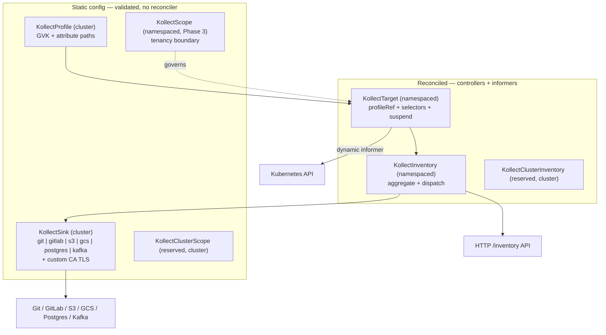
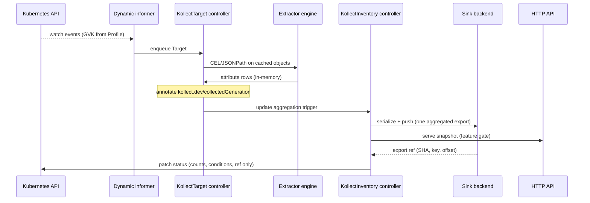
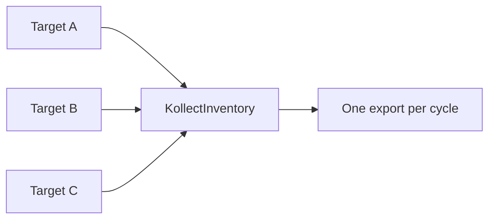
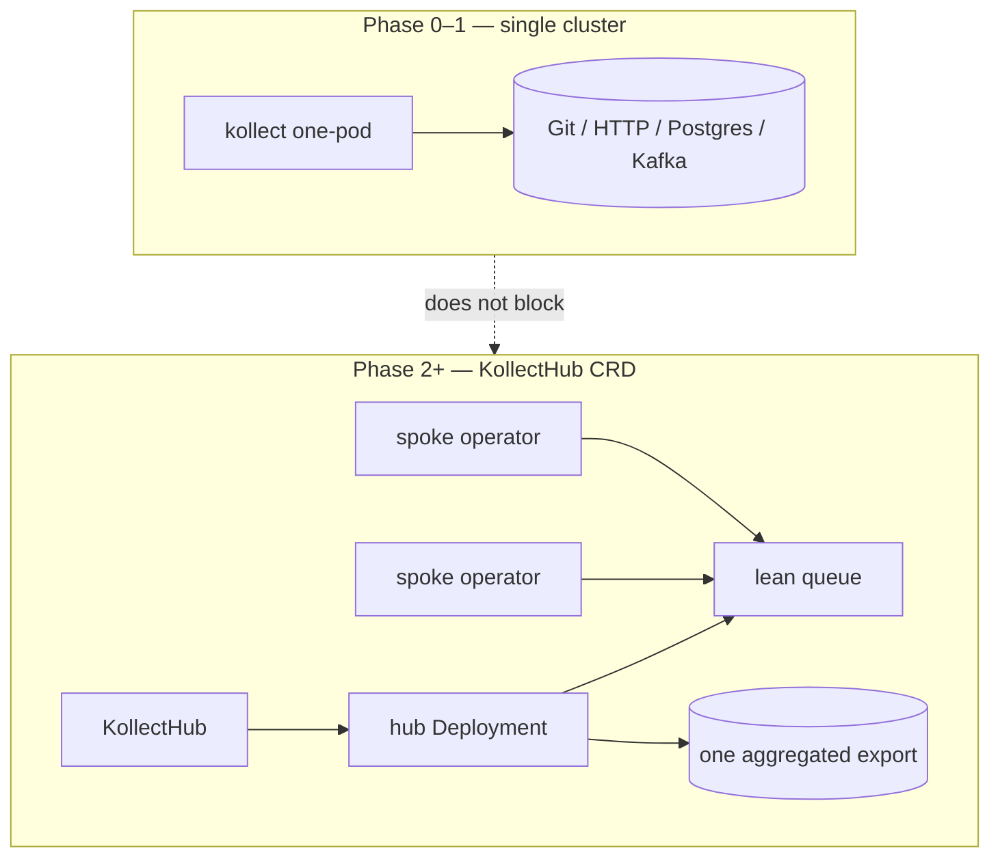
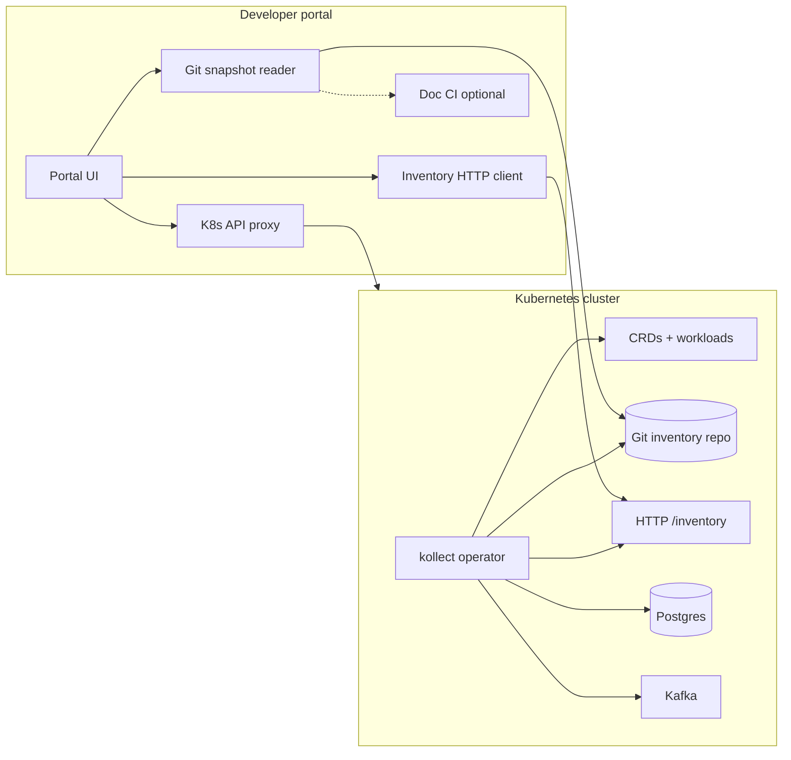

# kollect architecture

kollect is a Kubernetes operator that **collects inventory from arbitrary resources**, **aggregates
across targets (and later clusters)**, and **exports auditable snapshots to pluggable backends** so
teams without direct cluster or Git access can still see versioned, traceable system state via portals,
SQL, or event streams.

## Problem statement

Platform and application teams need **versioned, stakeholder-facing inventory** of what runs in
Kubernetes, but:

- Stakeholders often lack repo access, `kubectl` skills, or cluster credentials.
- Raw API access does not produce audit-friendly, diffable history.
- Hardcoded inventory schemas (batch collectors) break when new CRDs or attributes are needed.
- Large fleets (~60 clusters) must not produce **60 commits or 60 export events** per logical change.

kollect watches user-defined GVKs, extracts attributes via CEL/JSONPath, **aggregates** results, and
**exports to Git, HTTP, Postgres, Kafka, and other sinks** so a **developer portal** can combine live
API data with exported history. **Templated documentation** (Confluence, wiki pages) is handled **outside**
the operator — e.g. GitLab CI over Git export ([ADR-0011](adr/0011-doc-sync-templating.md)).

## CRD model

| Kind | Scope | Reconciled | Purpose |
| --- | --- | --- | --- |
| `KollectProfile` | Cluster | No | Extraction schema for a GVK |
| `KollectSink` | Cluster | No | Export backend + TLS trust (`caBundle` / `caSecretRef`) |
| `KollectScope` | Namespace | No | Allowed GVKs, namespaces, sinks (Phase 3 priority) |
| `KollectClusterScope` | Cluster | No | **Reserved** — platform tenancy (Phase 3+) |
| `KollectTarget` | Namespace | Yes | Select resources, run collection |
| `KollectInventory` | Namespace | Yes | Aggregate targets in namespace; export to sinks |
| `KollectClusterInventory` | Cluster | Yes | **Reserved** — platform rollup (not Phase 0–1) |
| ~~`KollectPublication`~~ | — | **Rejected** | Doc-sync / Confluence — never ([ADR-0011](adr/0011-doc-sync-templating.md)) |

See [adr/0004-crd-model.md](adr/0004-crd-model.md) for webhooks, CA TLS, and tenancy questions.
Postgres and Kafka sink design: [adr/0025-sink-backends-database-kafka.md](adr/0025-sink-backends-database-kafka.md).

## Reconciliation flow

Key properties:

- **Event-driven** informers, not interval polling ([ADR-0014](adr/0014-event-driven-informers.md)).
- **Level-based** reconcile — safe to retry.
- **Status holds summaries only** — full payload to sinks, HTTP, optional PVC ([ADR-0006](adr/0006-etcd-limit.md)).
- **SAR degradation** — cluster scope falls back to namespace scope when forbidden.
- **Connection test** — `SinkReachable` (or equivalent) condition + optional test annotation ([ADR-0015](adr/0015-static-vs-reconciled.md)).
- **Prometheus metrics** on operator `/metrics` only — not an export sink ([ADR-0012](adr/0012-prometheus-metrics-stub.md), [ADR-0020](adr/0020-error-taxonomy.md)).

## Aggregation (single cluster)

One inventory object rolls up many targets so portals and Git history show a **single** logical export
per change cycle when configured — prerequisite for multi-cluster hub merge ([REQUIREMENTS.md](REQUIREMENTS.md)).

## Multi-cluster outlook

Single-cluster install remains the default. For large fleets, see [ADR-0022](adr/0022-multi-cluster-sync-rfc.md).

Git is **one** transport option; agent-to-agent and object-storage fan-in are documented in the RFC.
Transformation may occur in the operator, at the sink repo, or in the portal — **schema clarity** matters
more than where rendering runs.

## Developer portal use case

1. Platform team defines `KollectProfile` + `KollectSink` (Git, Postgres, Kafka, custom CA) + `KollectTarget` per namespace.
2. kollect exports **deterministic JSON/YAML** inventory on meaningful changes — **aggregated** export.
3. Portal reads live API (authorized users), **HTTP inventory**, Git/DB/Kafka history (audit).
4. Optional Confluence/wiki updates run in **external CI** reading Git export — not in the operator.

## Phasing (summary)

| Phase | Focus |
| --- | --- |
| 0 | Bootstrap, guidelines, ADRs, **Helm day 1**, webhooks, metrics, connection test, samples in CI |
| 1 | Profile + Target + Inventory + Git/GitLab + **Postgres/Kafka sinks** + **HTTP API** + aggregation |
| 2 | `KollectHub` CRD + spoke/hub ([ADR-0022](adr/0022-multi-cluster-sync-rfc.md)); lean queue ([ADR-0023](adr/0023-lean-queue-transport.md)) |
| 3 | S3/GCS hardening, `KollectScope`, Receiver/TargetSet design |
| 4 | Richer KSM-style metrics config; advanced aggregation |

## Further reading

- [Product requirements](REQUIREMENTS.md)
- [Architecture Decision Records](adr/README.md)
- [GUIDELINES.md](https://github.com/konih/kollect/blob/main/GUIDELINES.md) — error handling, security, testing
