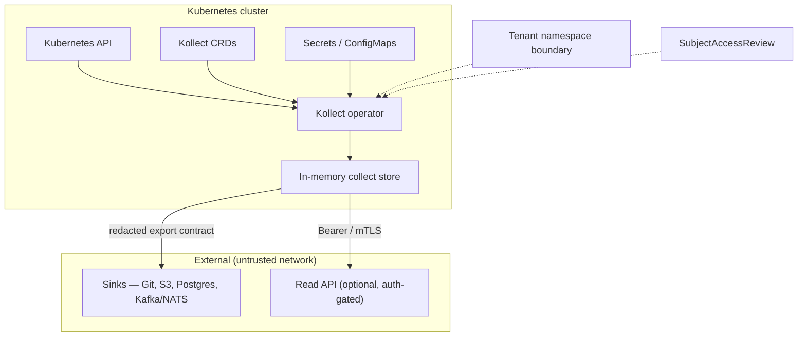

# Security assurance case

This document synthesizes Kollect's security claims, trust boundaries, and countermeasures.
It supports OpenSSF Best Practices **assurance_case** criteria and complements
[ADR-0104](adr/0104-security-model.md) (architecture) and [SECURITY.md](../SECURITY.md)
(disclosure policy).

**Last updated:** 2026-06-05

## Claims and scope

Kollect is a Kubernetes operator that reads selected cluster resources and exports
aggregated inventory to external sinks. The operator runs with cluster credentials and
must not leak secrets, exceed RBAC, or export data outside tenant boundaries.

Security requirements are tracked as NFR-SEC in [REQUIREMENTS.md](REQUIREMENTS.md#43-security-nfr-sec):

| ID | Requirement | Primary enforcement |
| --- | --- | --- |
| NFR-SEC-1 | Credentials only via `secretRef`; never in spec/status/logs | ADR-0104, ADR-0602, `logcheck` |
| NFR-SEC-2 | Default verify TLS; `insecureSkipVerify` opt-in and surfaced | ADR-0104, sink validators |
| NFR-SEC-3 | Tenancy via `KollectScope` + SAR; least-privilege RBAC | ADR-0203, ADR-0704, `task audit:rbac` |
| NFR-SEC-4 | Sensitive-key redaction before export | ADR-0303, ADR-0405 |
| NFR-SEC-5 | Distroless nonroot image; minimal attack surface | Dockerfile, ADR-0705 |

## Trust boundaries

| Boundary | Trust assumption | Controls |
| --- | --- | --- |
| **Operator ↔ Kubernetes API** | Apiserver is authentic; RBAC is correctly configured | Least-privilege ClusterRole/Role; SAR before cross-namespace reads |
| **Operator ↔ Secrets** | Secret objects are readable only where RBAC allows | `secretRef` only; secrets resolved in reconciler, never logged |
| **Operator ↔ Sinks** | Network path may be hostile | TLS verify by default; CA from secret/configmap; no skip for Git/hub |
| **Tenant ↔ Tenant** | Namespaced inventories must not read foreign namespaces | `KollectScope`, watch namespace limits, SAR-gated degrade |
| **Read API ↔ Client** | HTTP surface is optional and must be authenticated | Token/mTLS ([ADR-0404](adr/0404-inventory-api-auth.md)); off by default |
| **Supply chain ↔ Adopter** | Registry and release artifacts may be tampered | cosign signatures, SPDX SBOM, SLSA provenance ([ADR-0705](adr/0705-release-supply-chain.md)) |

## Threats and countermeasures

| Threat | Impact | Countermeasure | Verification |
| --- | --- | --- | --- |
| Cross-tenant data exfiltration | High | `KollectScope`, namespace-scoped watches, SAR checks | envtest tenancy tests; `task audit:rbac` |
| Secret leakage to sinks/logs/status | Critical | Redaction at extraction (`scrubKeys`); no secret logging; status summaries only | Unit/golden tests; `logcheck`; CodeQL |
| MITM on sink/cluster connections | High | TLS verify default; configurable CA; hub mTLS pattern | Integration tests; ADR-0503 |
| Over-broad operator RBAC | High | Minimal verbs; tenant mode Role instead of ClusterRole | Rendered RBAC audit; Polaris/kubeaudit |
| Compromised release artifact | High | cosign, SBOM, Trivy on release images | Release workflow; [SECURITY-REVIEW.md](SECURITY-REVIEW.md) |
| Dependency CVE in build/runtime | Medium–High | `govulncheck` CI gate; Dependabot; SCA policy | CI `vulncheck` job; [SCA policy](security/sca-remediation-policy.md) |
| Path traversal / injection via Git sink | Medium | Ref and path validators at admission and export | `internal/sink/git/validate.go` tests |
| Unauthenticated Read API access | High | Auth required; feature-gated deployment | ADR-0404; API tests |

## Residual risks

| Risk | Mitigation status | Owner action |
| --- | --- | --- |
| Solo maintainer (bus factor 1) | Documented in [GOVERNANCE.md](../GOVERNANCE.md) | Appoint co-maintainer when feasible |
| Encryption-at-rest for external sinks | **Recommended**, not enforced by operator | Adopter configures Postgres/S3 encryption |
| Built-in secret-leak scanner on payloads | Open question (ADR-0104) | Defense-in-depth beyond `scrubKeys` |
| Hub plain HTTP inside pod | TLS terminated at ingress/mesh | Documented in ADR-0503; deployer responsibility |

## Evidence and review cadence

| Artifact | Location |
| --- | --- |
| Security architecture ADR | [ADR-0104](adr/0104-security-model.md) |
| Operator guidelines | [guidelines § 3](development/guidelines.md#3-security) |
| Self security review (2026-06-05) | [SECURITY-REVIEW.md](SECURITY-REVIEW.md) |
| VEX / vulnerability exceptions | [docs/security/vex.json](security/vex.json) |
| SCA remediation SLAs | [SCA policy](security/sca-remediation-policy.md) |

Revisit this assurance case when adding sink backends, changing tenancy, or after a
security review or incident.
