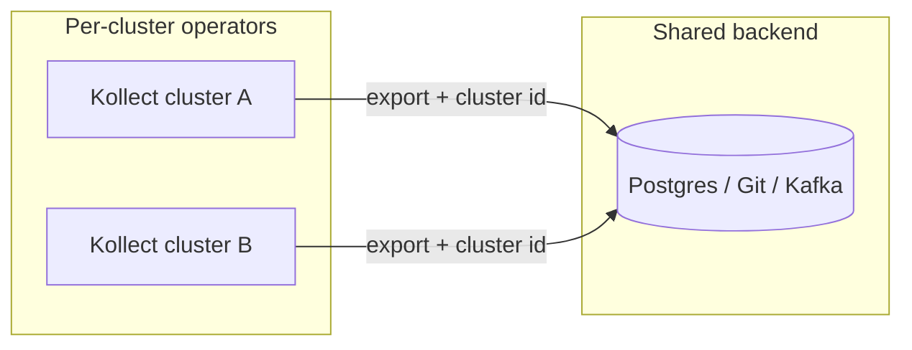

# Best practices

Platform-oriented guidance for designing **Kollect** scope, sinks, and multi-cluster topology.
For install defaults, see [Operator manual](OPERATOR-MANUAL.md).

!!! tip "Assumptions"
    Read [Understand the basics](UNDERSTAND-THE-BASICS.md) and [Platform decisions](PLATFORM-DECISIONS.md)
    before changing production values. Sink role taxonomy:
    [ADR-0401](adr/0401-sink-taxonomy-state-vs-stream.md).

!!! warning "Pre-beta API"
    `v1alpha1` fields may change until the first release candidate. Check [ROADMAP](ROADMAP.md)
    before fleet rollout.

## Scope design

### Per-team install (recommended default)

Install one operator per tenant boundary with namespaced RBAC and a restricted informer cache
([ADR-0203](adr/0203-namespaced-multi-tenancy.md), ADR-0703 (archived)):

```yaml
tenantMode: true
watchNamespaces:
  - team-a
mode: single
featureGates:
  inventoryHttp:
    enabled: false
```

Place `KollectProfile`, `KollectSink`, `KollectTarget`, and `KollectInventory` in the **team
namespace**. Portal read paths should use **Postgres or Kafka sink export** — not the optional HTTP
inventory API in production.

### Same-namespace references

Namespaced pipeline objects must reference peers in the **same namespace**:

| Field | Must resolve in |
| --- | --- |
| `KollectTarget.spec.profileRef` | Target namespace |
| `KollectInventory.spec.sinkRefs` | Inventory namespace |
| `KollectConnectionTest.spec.sinkRef` | Test namespace |

Cluster-wide rollup uses `KollectClusterInventory` with `spec.sinkNamespace` instead.

### Watch labels and `KollectScope`

- Exclude platform namespaces with Target `excludedNamespaces` or Scope `deniedNamespaces` — no
  Namespace patch RBAC ([ADR-0207](adr/0207-target-collection-filtering.md)).
- Trivy HIGH-only collection: `resourceRules` with label match OR CEL `matchPolicy` — see
  [examples/kollecttarget_trivy-high.yaml](examples/kollecttarget_trivy-high.yaml).
- Run platform targets with `watchMode: All`; let teams opt **out** noisy namespaces via
  `kollect.dev/namespace-watch: disabled` ([ANNOTATIONS-LABELS.md](ANNOTATIONS-LABELS.md)).
- Use `watchMode: OptIn` only in shared clusters where most tenants should be ignored by default.
- Enforce policy with `KollectScope` — violations set `Degraded=True` and block export (hard
  degrade, not silent skip).

!!! note "Scope vs Helm `watchNamespaces`"
    Helm `watchNamespaces` limits what the **operator informer cache** sees. `KollectScope` limits
    what a **tenant may configure**. Use both for defense in depth.

## Sink roles (ADR-0401)

Classify sinks by **role**, not vendor. The in-memory snapshot per `KollectInventory` is the
canonical artifact; every sink is a projection of it.

| Role | Backends | Answers | Deletes |
| --- | --- | --- | --- |
| **Snapshot store** | Git, S3/GCS Parquet, HTTP | Current state, written whole each cycle | **Free** — absent from snapshot = deleted |
| **Relational SoR** | Postgres | Queryable current state, SQL joins for portals | Requires **delete reconciliation** |
| **Event emitter** | NATS JetStream (lean default), Kafka/Redpanda | Change stream for downstream integration | Tombstone (consumer-owned) |

### Choosing a sink

| Need | Prefer |
| --- | --- |
| Audit trail, GitOps-friendly history | **Git** snapshot |
| Queryable inventory without running a DB | **S3/GCS Parquet** snapshot |
| Rich relational portal, BI joins | **Postgres** SoR |
| Event-driven integrations, fan-out | **NATS** or **Kafka** emitter |

!!! info "Not a sink type"
    Prometheus metrics come from the operator `/metrics` endpoint only — not a `KollectSink` type
    ([ADR-0601](adr/0601-prometheus-metrics-stub.md)).

### Postgres and event emitters

- Postgres must **delete rows** (or tombstone) for resources no longer in the snapshot — upsert-only
  drifts stale ([ADR-0401](adr/0401-sink-taxonomy-state-vs-stream.md)).
- Set `spec.cluster` on sinks in multi-cluster installs so the backend primary key merges rows
  across clusters.
- Tune per-sink `exportMinInterval` on structured `sinkRefs[]` before adding more backends —
  portal Postgres at **30s** + Git audit at **1h** is the default sample
  ([ADR-0413](adr/0413-export-interval-scheduling.md)). See [Performance tuning](PERFORMANCE.md).

### Connection testing

Keep `spec.connectionTest: false` in Git-managed manifests. Probe on demand with the
`kollect.dev/test-connection` annotation or a `KollectConnectionTest` CR
([Connection test example](examples/connection-test.md)).

## Multi-cluster fleet (shared sink)

**Default multi-cluster path:** each cluster runs the same single-mode operator and exports to a
**shared sink** (Postgres, Git, Kafka, NATS) with `spec.cluster` set (or `{cluster}` in
`pathTemplate`). The backend primary key merges rows across clusters — **no aggregation tier**
inside the operator ([ADR-0501](adr/0501-multi-cluster-fleet.md),
[ADR-0401](adr/0401-sink-taxonomy-state-vs-stream.md)).



Walkthrough: [Multi-cluster fleet](examples/multi-cluster-fleet.md).

## Operational checklist

| Area | Practice |
| --- | --- |
| Upgrades | Two-step: `kubectl apply -f dist/install-crds.yaml`, then `helm upgrade` — never delete CRDs |
| Secrets | Credentials in Kubernetes Secrets only; restrict operator SA Secret access |
| HTTP API | Keep `featureGates.inventoryHttp.enabled: false` unless debugging |
| Observability | Watch `ConnectionVerified`, `SinkReachable`, `Synced`; alert on `Degraded=True` |
| Performance | Restrict `watchNamespaces`, narrow target selectors, raise `exportMinInterval` under load |

## Related

- [ADR-0401: Sink taxonomy](adr/0401-sink-taxonomy-state-vs-stream.md)
- [ADR-0501: Multi-cluster sync](adr/0501-multi-cluster-fleet.md)
- [Operator manual](OPERATOR-MANUAL.md) · [Troubleshooting](TROUBLESHOOTING.md) · [FAQ](FAQ.md)
- [Examples](examples/README.md)
