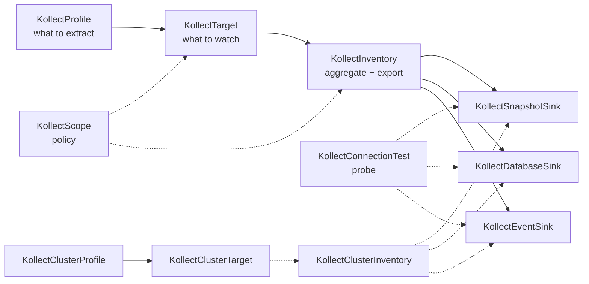

# Custom resource reference

Detailed reference for each Kollect API kind. These pages document **purpose**, **spec fields**,
**status conditions**, **RBAC**, **sample usage**, and **failure modes** for operators and platform
teams.

!!! warning "Pre-beta API"
    All kinds are **`v1alpha1`**. Field names, status conditions, and webhook rules may change before
    beta. Treat [PLATFORM-DECISIONS.md](PLATFORM-DECISIONS.md) as the locked decision summary; per-kind
    pages track current behavior.

## Architecture context

| Doc | Contents |
| --- | --- |
| [ARCHITECTURE.md](ARCHITECTURE.md) | CRD model, reconciliation, deployment defaults |
| [DATA-FLOWS.md](DATA-FLOWS.md) | Debouncing, collection pipeline, scope gates, connection tests |
| [PLATFORM-DECISIONS.md](PLATFORM-DECISIONS.md) | Locked product decisions (2026-06-05 pivot) |
| [examples/deployment-inventory.md](examples/deployment-inventory.md) | End-to-end Profile → Sink → Target → Inventory |
| [examples/helm-release-inventory.md](examples/helm-release-inventory.md) | Argo / Helm release walkthrough |

## Pipeline overview



**Typical team flow:** create Profile and family Sinks → bind Target to Profile → point Inventory at
snapshot/database/event sink refs.
Optional Scope constrains GVKs, namespaces, and sinks. Use ConnectionTest to verify sink reachability
before export.

!!! tip "Same-namespace rule"
    `profileRef`, family sink refs (`snapshotSinkRefs`, `databaseSinkRefs`, `eventSinkRefs`), and
    connection-test `sinkRef` must resolve CRs in the **same namespace** as the referring object.
    Cluster inventory resolves namespaced sinks in `spec.sinkNamespace`; cluster family sinks are
    cluster-scoped.

**Platform flow:** `KollectClusterProfile` → `KollectClusterTarget` → `KollectClusterInventory` for
cross-namespace rollup. `KollectClusterTarget` and `KollectClusterInventory` controllers reconcile
and export; `KollectClusterProfile` remains admission-only (no controller).

### Snapshot export layout and spill

`KollectSnapshotSink.spec.pathTemplate` selects the Git/object-store object path (default
`inventory/{namespace}/{name}.json`; placeholders `{cluster}`, `{namespace}`, `{name}`,
`{generation}`, `{extension}`) — see [ADR-0407](adr/0407-git-object-store-layout.md).

Payloads **≥ 1 MiB** warn; **> 1 MiB** require an `s3` or `gcs` snapshot sink in
`spec.snapshotSinkRefs` (Git receives smaller exports only). Hard cap ~**1.5 MiB** `maxExportBytes`
blocks export entirely.

Per-sink export cadence is configured on inventory/cluster-inventory family refs (string or object),
optional sink defaults, and scope floors — [ADR-0413](adr/0413-export-interval-scheduling.md).

## Kinds

| Kind | Scope | Reconciled | Reference |
| --- | --- | --- | --- |
| `KollectProfile` | Namespace | No | [crds/kollectprofile.md](crds/kollectprofile.md) |
| `KollectSnapshotSink` | Namespace | Probe only | [crds/kollectsnapshotsink.md](crds/kollectsnapshotsink.md) |
| `KollectDatabaseSink` | Namespace | Probe only | [crds/kollectdatabasesink.md](crds/kollectdatabasesink.md) |
| `KollectEventSink` | Namespace | Probe only | [crds/kollecteventsink.md](crds/kollecteventsink.md) |
| `KollectClusterSnapshotSink` | Cluster | Probe only | [crds/kollectsnapshotsink.md](crds/kollectsnapshotsink.md) |
| `KollectClusterDatabaseSink` | Cluster | Probe only | [crds/kollectdatabasesink.md](crds/kollectdatabasesink.md) |
| `KollectClusterEventSink` | Cluster | Probe only | [crds/kollecteventsink.md](crds/kollecteventsink.md) |
| `KollectTarget` | Namespace | Yes | [crds/kollecttarget.md](crds/kollecttarget.md) |
| `KollectInventory` | Namespace | Yes | [crds/kollectinventory.md](crds/kollectinventory.md) |
| `KollectScope` | Namespace | No (enforced) | [crds/kollectscope.md](crds/kollectscope.md) |
| `KollectConnectionTest` | Namespace | Yes | [crds/kollectconnectiontest.md](crds/kollectconnectiontest.md) |
| `KollectClusterProfile` | Cluster | No (webhook only) | [crds/kollectclusterprofile.md](crds/kollectclusterprofile.md) |
| `KollectClusterTarget` | Cluster | Yes | [crds/kollectclustertarget.md](crds/kollectclustertarget.md) |
| `KollectClusterInventory` | Cluster | Yes | [crds/kollectclusterinventory.md](crds/kollectclusterinventory.md) |

## Reserved kinds (stubs pending)

| Kind | Scope | Notes |
| --- | --- | --- |
| ~~`KollectSink`~~ | — | **Removed** — use family sinks ([ADR-0414](adr/0414-sink-family-crds.md)) |
| `KollectClusterScope` | Cluster | Platform policy boundary |
| ~~`KollectRemoteCluster`~~ | — | **Removed** — shared sink + `spec.cluster` ([ADR-0501](adr/0501-multi-cluster-fleet.md)) |

## Short names

| Kind | Short name | `kubectl` example |
| --- | --- | --- |
| `KollectInventory` | `kinv` | `kubectl get kinv -A` |
| `KollectTarget` | `ktgt` | `kubectl get ktgt -n default` |
| `KollectClusterProfile` | `kcprof` | `kubectl get kcprof` |
| `KollectClusterTarget` | `kctgt` | `kubectl get kctgt` |
| `KollectClusterInventory` | `kcinv` | `kubectl get kcinv` |
| `KollectConnectionTest` | `kconntest` | `kubectl get kconntest -A` |
| `KollectScope` | `kscope` | `kubectl get kscope -A` |

## Quick apply

```sh
kubectl apply -k config/samples/
kubectl get kprof,ksnap,kdb,kevt,ktgt,kinv,kscope,kconntest -A
```

See [QUICKSTART.md](QUICKSTART.md) for kind cluster install prerequisites.
