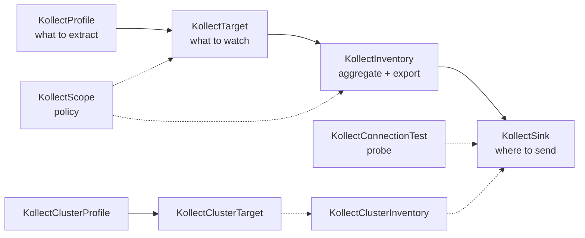

# Custom resource reference

Detailed reference for each kollect API kind. These pages document **purpose**, **spec fields**,
**status conditions**, **RBAC**, **sample usage**, and **failure modes** for operators and platform
teams.

## Architecture context

| Doc | Contents |
| --- | --- |
| [ARCHITECTURE.md](ARCHITECTURE.md) | CRD model, reconciliation, deployment defaults |
| [DATA-FLOWS.md](DATA-FLOWS.md) | Debouncing, collection pipeline, scope gates, connection tests |
| [PLATFORM-DECISIONS.md](PLATFORM-DECISIONS.md) | Locked product decisions (2026-06-05 pivot) |
| [examples/deployment-inventory.md](examples/deployment-inventory.md) | End-to-end Profile → Sink → Target → Inventory |
| [examples/helm-release-inventory.md](examples/helm-release-inventory.md) | Argo / Helm release walkthrough |

## Pipeline overview



**Typical team flow:** create Profile and Sink → bind Target to Profile → point Inventory at Sink.
Optional Scope constrains GVKs, namespaces, and sinks. Use ConnectionTest to verify sink reachability
before export.

**Platform flow:** `KollectClusterProfile` → `KollectClusterTarget` → `KollectClusterInventory` for
cross-namespace rollup — webhook-only in Phase 1 (no controller yet).

## Kinds

| Kind | Scope | Reconciled | Reference |
| --- | --- | --- | --- |
| `KollectProfile` | Namespace | No | [crds/kollectprofile.md](crds/kollectprofile.md) |
| `KollectSink` | Namespace | Probe only | [crds/kollectsink.md](crds/kollectsink.md) |
| `KollectTarget` | Namespace | Yes | [crds/kollecttarget.md](crds/kollecttarget.md) |
| `KollectInventory` | Namespace | Yes | [crds/kollectinventory.md](crds/kollectinventory.md) |
| `KollectScope` | Namespace | No (enforced) | [crds/kollectscope.md](crds/kollectscope.md) |
| `KollectConnectionTest` | Namespace | Yes | [crds/kollectconnectiontest.md](crds/kollectconnectiontest.md) |
| `KollectClusterProfile` | Cluster | Webhook only (Phase 1) | [crds/kollectclusterprofile.md](crds/kollectclusterprofile.md) |
| `KollectClusterTarget` | Cluster | Webhook only (Phase 1) | [crds/kollectclustertarget.md](crds/kollectclustertarget.md) |
| `KollectClusterInventory` | Cluster | Webhook only (Phase 1) | [crds/kollectclusterinventory.md](crds/kollectclusterinventory.md) |

## Reserved kinds (stubs pending)

| Kind | Scope | Notes |
| --- | --- | --- |
| `KollectClusterSink` | Cluster | Shared export backends |
| `KollectClusterScope` | Cluster | Platform policy boundary |
| `KollectRemoteCluster` | Namespace | Hub spoke registration ([ADR-0028](adr/0028-hub-cluster-auth-istio-pattern.md)) |

## Short names

| Kind | Short name | `kubectl` example |
| --- | --- | --- |
| `KollectInventory` | `kinv` | `kubectl get kinv -A` |
| `KollectTarget` | `ktgt` | `kubectl get ktgt -n default` |
| `KollectClusterProfile` | `kcprof` | `kubectl get kcprof` |
| `KollectClusterTarget` | `kctgt` | `kubectl get kctgt` |
| `KollectClusterInventory` | `kcinv` | `kubectl get kcinv` |
| `KollectConnectionTest` | `kconntest` | `kubectl get kconntest -A` |
| `KollectScope` | `kscope` | `kubectl get kscope -A` |

## Quick apply

```sh
kubectl apply -k config/samples/
kubectl get kprof,ksink,ktgt,kinv,kscope,kconntest -A
```

See [QUICKSTART.md](QUICKSTART.md) for kind cluster install prerequisites.
