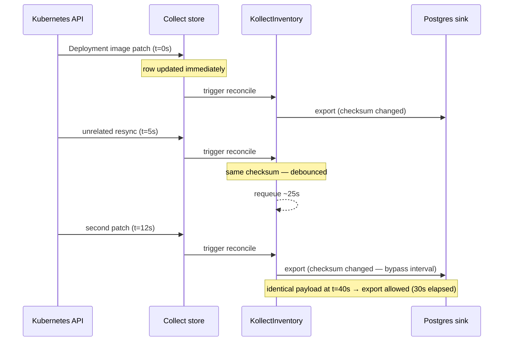
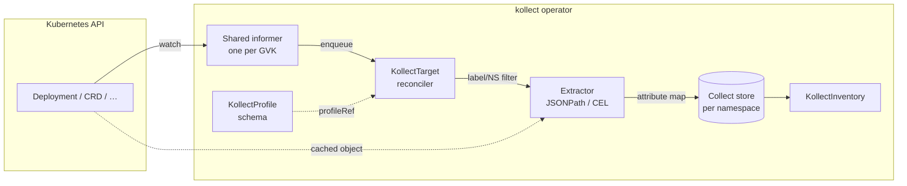
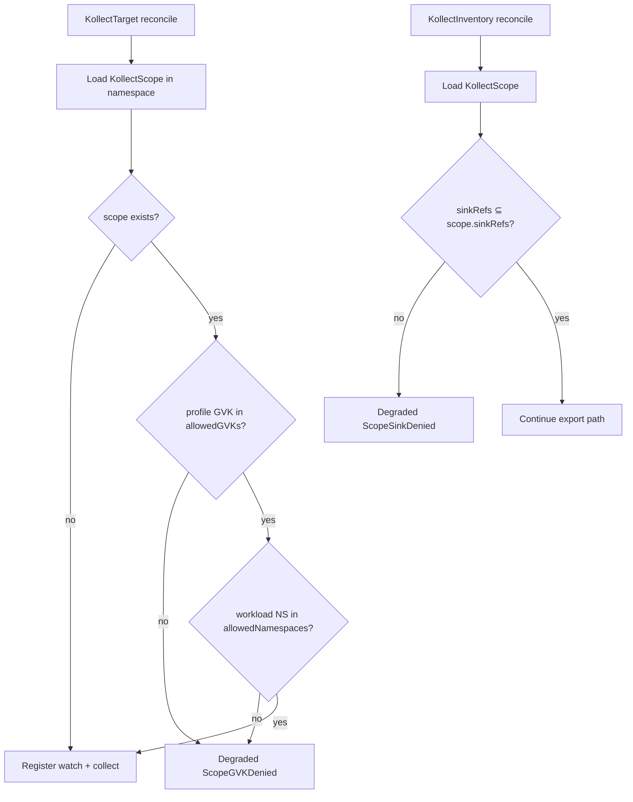
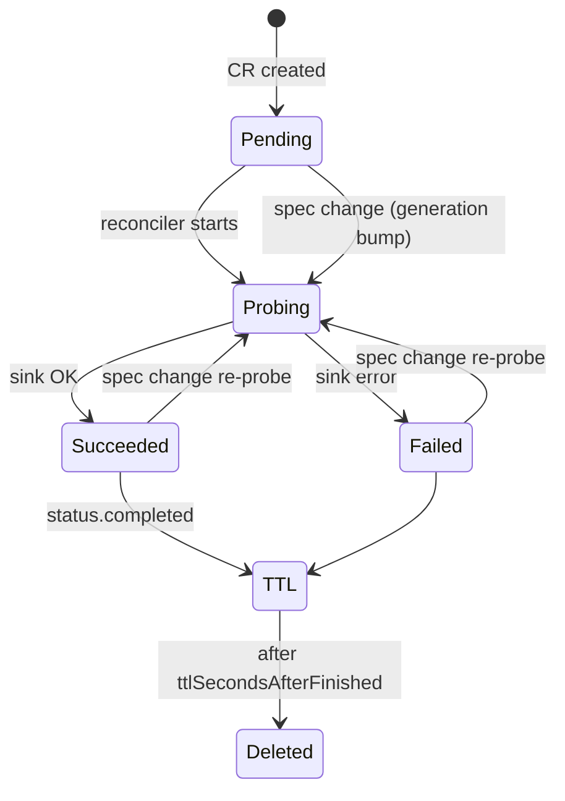
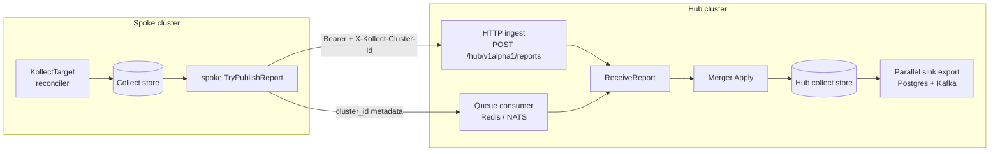
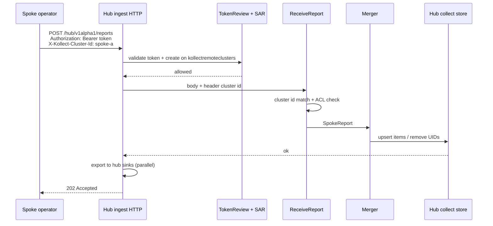
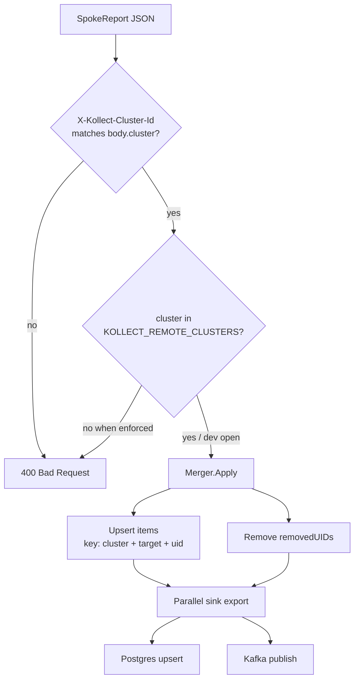
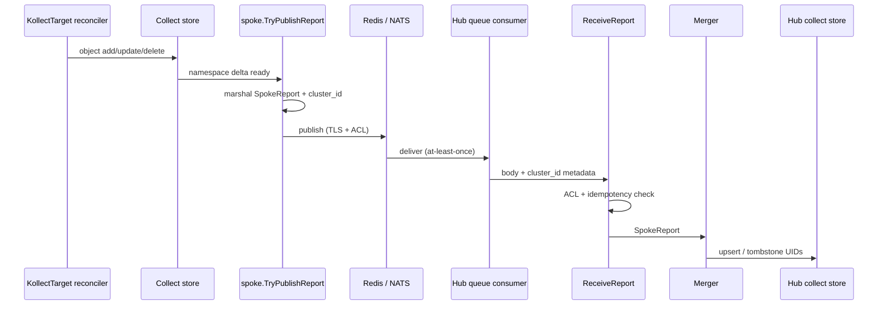
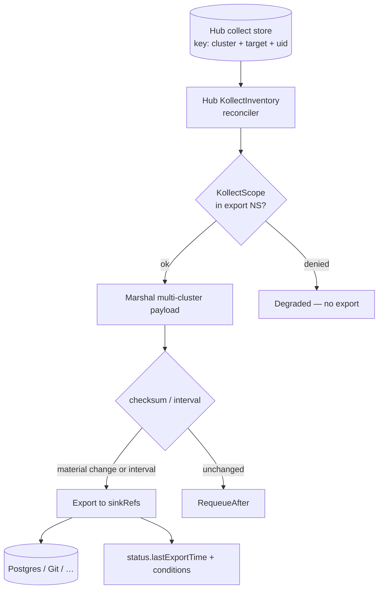

# kollect data flows

Visual walkthroughs of how data moves through the operator. For CRD roles see
[ARCHITECTURE.md](ARCHITECTURE.md); for locked decisions see
[PLATFORM-DECISIONS.md](PLATFORM-DECISIONS.md).

---

## 1. Export debouncing

**Problem:** Event-driven informers can fire hundreds of updates per minute. Without coalescing,
every watch event would trigger a Postgres upsert or Git commit.

**Design:** The in-memory collect store updates **immediately** on every target reconcile. Only the
**sink export** step is debounced per `KollectInventory`.

### Per-inventory state machine


### Timing example (default `exportMinInterval: 30s`)



### Configuration

| Field | Default | Effect |
| --- | --- | --- |
| `KollectInventory.spec.exportMinInterval` | **30s** (CRD default) | Min gap between exports of **identical** payload |
| `metadata.generation` bump | — | Immediate export (spec edit) |
| Payload checksum change | — | Immediate export (material inventory change) |

Operator `--export-debounce` is a **deprecated fallback** when the spec field is unset on legacy
manifests.

---

## 2. Collection pipeline

How a watched object becomes an inventory row.



**Key properties:**

- **One informer per GVK** across all targets ([ADR-0014](adr/0014-event-driven-informers.md)).
- Targets only differ by **namespace/label selectors** and **profileRef**.
- Extraction runs on the **cached unstructured object** — no per-target API list calls.

---

## 3. Attribute extraction (JSONPath arrays)

`KollectProfile` attributes are evaluated per object. Single-index paths return a scalar; wildcard
paths return a **JSON array** in the export row.

```mermaid
flowchart TD
  Obj[Unstructured object] --> Path{Path type?}
  Path -->|cel:…| CEL[CEL evaluator]
  Path -->|$.… or {.…}| JP[kubectl JSONPath]
  CEL --> Val[Go value]
  JP --> Matches{match count}
  Matches -->|1| Scalar[scalar in row]
  Matches -->|>1| List[array in row]
  Matches -->|0| Opt{optional?}
  Opt -->|yes| Skip[omit attribute]
  Opt -->|no| Null[null in row]
```

**Deployment containers example:**

| Path | Result for 2-container pod |
| --- | --- |
| `$.spec.template.spec.containers[0].image` | `"app:1.0"` (string) |
| `$.spec.template.spec.containers[*].image` | `["app:1.0", "sidecar:2.0"]` (list) |

See [ADR-0003](adr/0003-cel-jsonpath-extraction.md) for syntax rules.

---

## 4. `KollectScope` enforcement gate

Static scope object; enforced at **target** and **inventory** reconcile time (hard degrade).



Example: [ADR-0016](adr/0016-namespaced-multi-tenancy.md#enforcement-example-gvk-denied).

---

## 5. `KollectConnectionTest` lifecycle

One-shot probe CR for audited connectivity checks.



Default TTL: **300s**. Patch `spec.sinkRef` to force a fresh probe.

---

## 6. Hub merge and multi-cluster ingest

Spokes run the **same operator image** with `mode: spoke`; the hub runs `mode: hub-consumer`.
Spokes publish summarized **`SpokeReport`** JSON deltas; the hub merges them into a shared
in-memory store keyed by **`(cluster, namespace, name, uid)`** ([ADR-0022](adr/0022-multi-cluster-sync-rfc.md),
[ADR-0028](adr/0028-hub-cluster-auth-istio-pattern.md)).

### Spoke → hub transport



| Channel | Identity | Registration gate |
| --- | --- | --- |
| **HTTP push** (default) | `TokenReview` + SAR **`create`** on `kollectremoteclusters` | `KOLLECT_REMOTE_CLUSTERS` allowlist |
| **Queue** (Phase 2) | `cluster_id` wire field / header + TLS | Same allowlist; broker ACL is operator-owned |

### HTTP ingest sequence



### Merge semantics



**Post-merge export:** hub consumer resolves namespaced `KollectSink` objects from
`KOLLECT_HUB_EXPORT_NAMESPACE` + `KOLLECT_HUB_SINK_REFS`, marshals the merged target inventory
(`cluster` + `inventoryRef.name`), and fans out to **Postgres and Kafka in parallel** using the
same payload contract as namespaced `KollectInventory` export.

**Idempotency:** duplicate reports with the same `(cluster, namespace, name, uid)` overwrite the
stored row; `removedUIDs` tombstones delete stale rows. At-least-once delivery is safe.

**Status:** successful ingest marks `KollectRemoteCluster` **`Connected=True`** when the CR exists
in the hub platform namespace.

### Spoke queue publish (Phase 2)

When `transport: queue` is configured on the spoke, `spoke.TryPublishReport` enqueues a
`SpokeReport` JSON message instead of (or in addition to) HTTP push. The hub consumer drains the
broker and calls the same `ReceiveReport` → `Merger.Apply` path as HTTP ingest.



| Setting | Role |
| --- | --- |
| `KOLLECT_SPOKE_CLUSTER` | Wire `cluster_id` and report body `cluster` field |
| `KOLLECT_TRANSPORT` | `http` (default) or `queue` on spoke |
| Broker URL / credentials | Operator-owned secret; not in CR spec |
| `KOLLECT_REMOTE_CLUSTERS` | Hub allowlist — same gate as HTTP ingest |

Queue delivery is **at-least-once**; merge keys `(cluster, namespace, name, uid)` make replays safe.

### Post-merge hub export

After merge, hub `KollectInventory` objects use the **same debounced export path** as single-cluster
mode ([§1](#1-export-debouncing)): marshal the hub collect store slice, checksum, respect
`exportMinInterval`, dispatch to configured sinks.



Multi-cluster rows include a **`cluster`** dimension in each item so downstream consumers can filter
or partition by spoke. Hub export does **not** persist full payloads in CR `status` — only summaries
and last-export metadata ([ADR-0006](adr/0006-etcd-limit.md)).

### Configuration

| Env / setting | Role |
| --- | --- |
| `KOLLECT_SPOKE_CLUSTER` | Spoke identity; enables publish |
| `KOLLECT_HUB_INGEST_AUTH_MODE` | `kubernetes` (default) or `disabled` (dev/CI) |
| `KOLLECT_PLATFORM_NAMESPACE` | Namespace for ingest SAR on `kollectremoteclusters` |
| `KOLLECT_REMOTE_CLUSTERS` | Hub registration allowlist (comma-separated `spec.clusterName` values); **set (even empty) = fail-closed** |
| `KOLLECT_HUB_EXPORT_NAMESPACE` | Namespace for hub `KollectSink` resolution (Helm `hub.exportNamespace`) |
| `KOLLECT_HUB_SINK_REFS` | Comma-separated hub sink names for parallel export (Helm `hub.sinkRefs`) |

See [ADR-0028](adr/0028-hub-cluster-auth-istio-pattern.md) for RBAC grants and Istio-style remote
secret registration.

---

## See also

- [ARCHITECTURE.md](ARCHITECTURE.md) — CRD model and deployment defaults
- [PERFORMANCE.md](PERFORMANCE.md) — metrics and tuning
- [examples/deployment-inventory.md](examples/deployment-inventory.md) — end-to-end walkthrough
