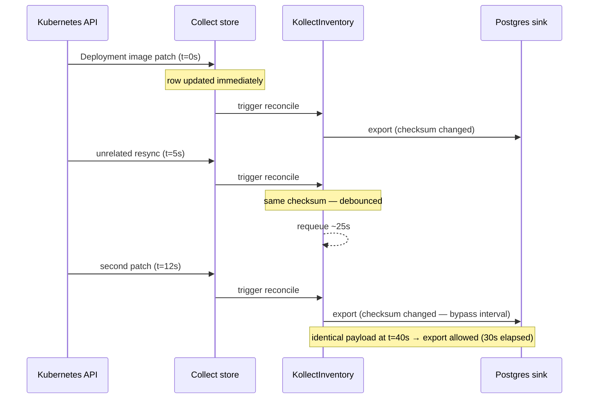
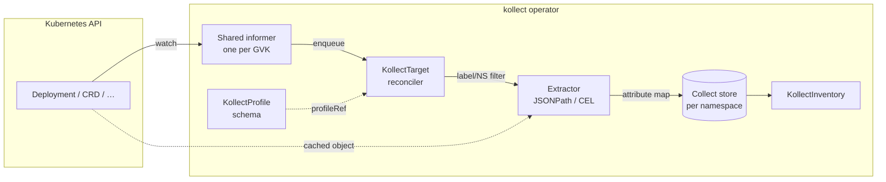
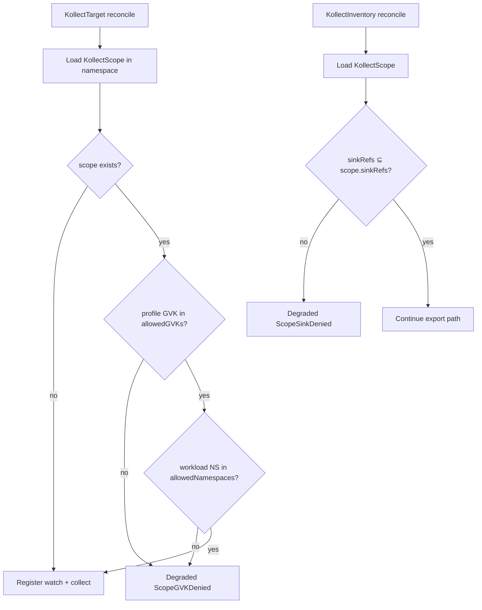
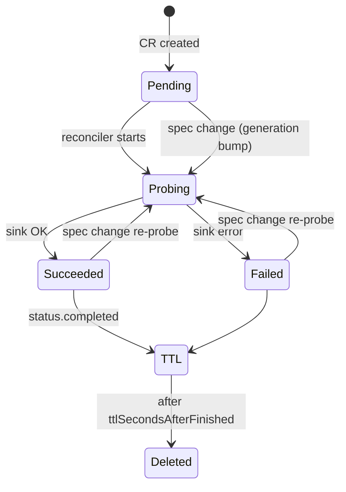

# kollect data flows

Visual walkthroughs of how data moves through the operator. For CRD roles see
[ARCHITECTURE.md](ARCHITECTURE.md); for locked decisions see
[PLATFORM-DECISIONS.md](PLATFORM-DECISIONS.md).

---

## 1. Export debouncing

**Problem:** Event-driven informers can fire hundreds of updates per minute. Without coalescing,
every watch event would trigger a Postgres upsert or Git commit.

**Design:** The in-memory collect store updates **immediately** on every target reconcile. Only the
**sink export** step is debounced per `KollectInventory`.

### Per-inventory state machine


### Timing example (default `exportMinInterval: 30s`)



### Configuration

| Field | Default | Effect |
| --- | --- | --- |
| `KollectInventory.spec.exportMinInterval` | **30s** (CRD default) | Min gap between exports of **identical** payload |
| `metadata.generation` bump | — | Immediate export (spec edit) |
| Payload checksum change | — | Immediate export (material inventory change) |

Operator `--export-debounce` is a **deprecated fallback** when the spec field is unset on legacy
manifests.

---

## 2. Collection pipeline

How a watched object becomes an inventory row.



**Key properties:**

- **One informer per GVK** across all targets ([ADR-0014](adr/0014-event-driven-informers.md)).
- Targets only differ by **namespace/label selectors** and **profileRef**.
- Extraction runs on the **cached unstructured object** — no per-target API list calls.

---

## 3. Attribute extraction (JSONPath arrays)

`KollectProfile` attributes are evaluated per object. Single-index paths return a scalar; wildcard
paths return a **JSON array** in the export row.

```mermaid
flowchart TD
  Obj[Unstructured object] --> Path{Path type?}
  Path -->|cel:…| CEL[CEL evaluator]
  Path -->|$.… or {.…}| JP[kubectl JSONPath]
  CEL --> Val[Go value]
  JP --> Matches{match count}
  Matches -->|1| Scalar[scalar in row]
  Matches -->|>1| List[array in row]
  Matches -->|0| Opt{optional?}
  Opt -->|yes| Skip[omit attribute]
  Opt -->|no| Null[null in row]
```

**Deployment containers example:**

| Path | Result for 2-container pod |
| --- | --- |
| `$.spec.template.spec.containers[0].image` | `"app:1.0"` (string) |
| `$.spec.template.spec.containers[*].image` | `["app:1.0", "sidecar:2.0"]` (list) |

See [ADR-0003](adr/0003-cel-jsonpath-extraction.md) for syntax rules.

---

## 4. `KollectScope` enforcement gate

Static scope object; enforced at **target** and **inventory** reconcile time (hard degrade).



Example: [ADR-0016](adr/0016-namespaced-multi-tenancy.md#enforcement-example-gvk-denied).

---

## 5. `KollectConnectionTest` lifecycle

One-shot probe CR for audited connectivity checks.



Default TTL: **300s**. Patch `spec.sinkRef` to force a fresh probe.

---

## See also

- [ARCHITECTURE.md](ARCHITECTURE.md) — CRD model and deployment defaults
- [PERFORMANCE.md](PERFORMANCE.md) — metrics and tuning
- [examples/deployment-inventory.md](examples/deployment-inventory.md) — end-to-end walkthrough
