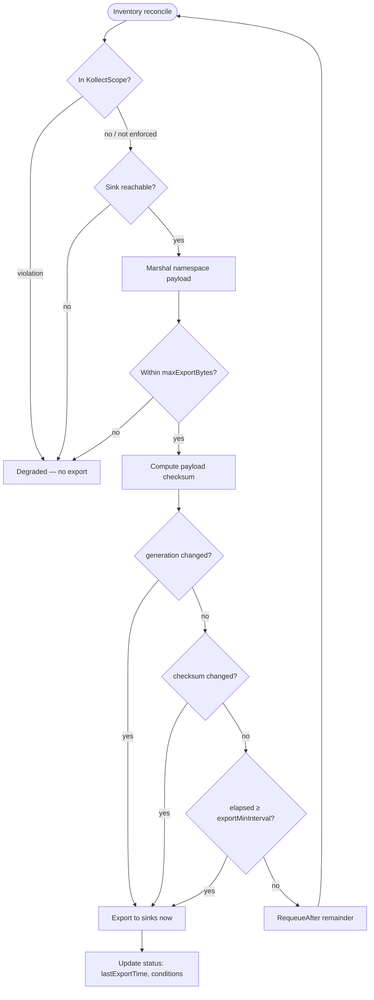
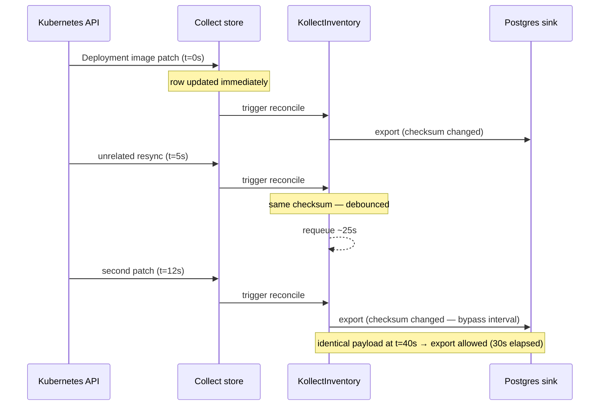
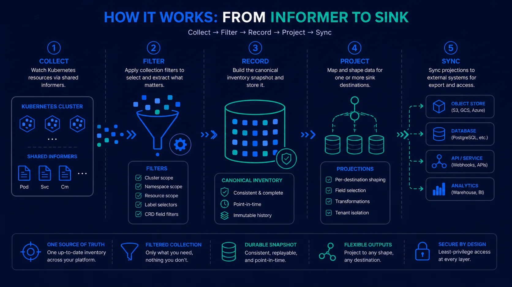
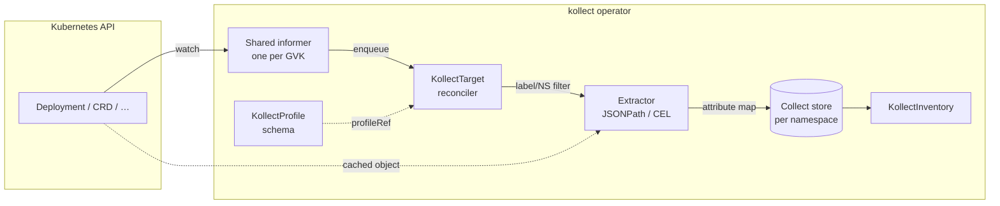
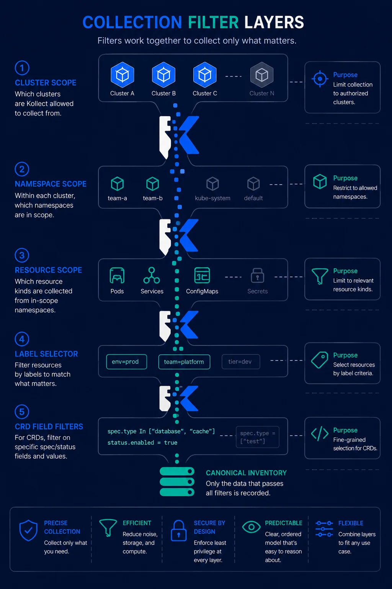
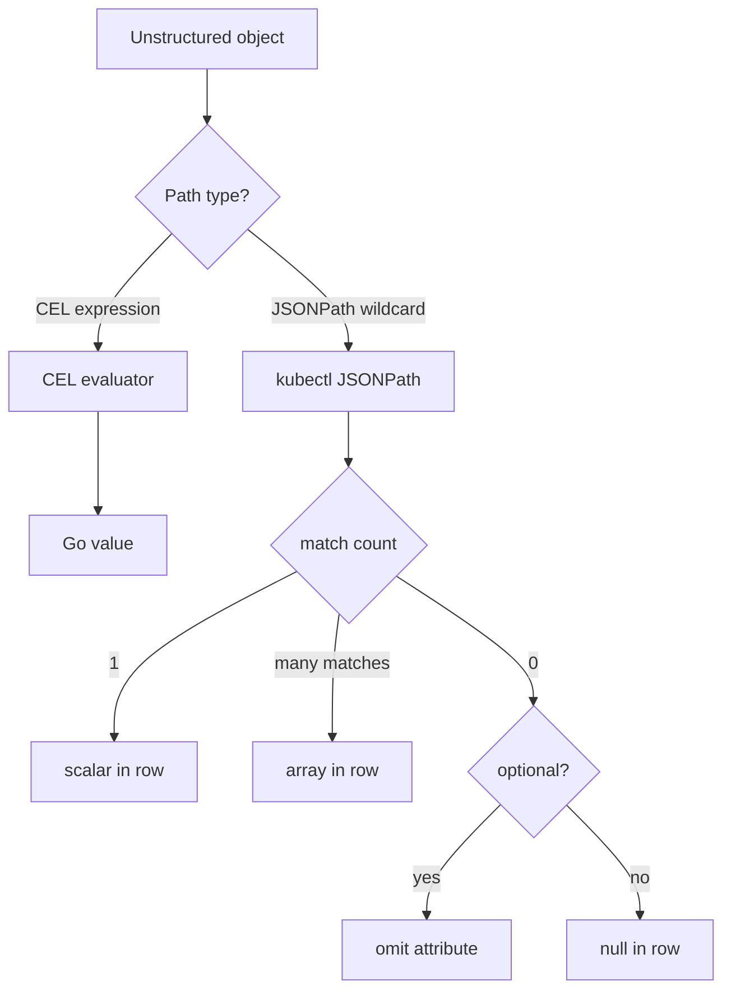
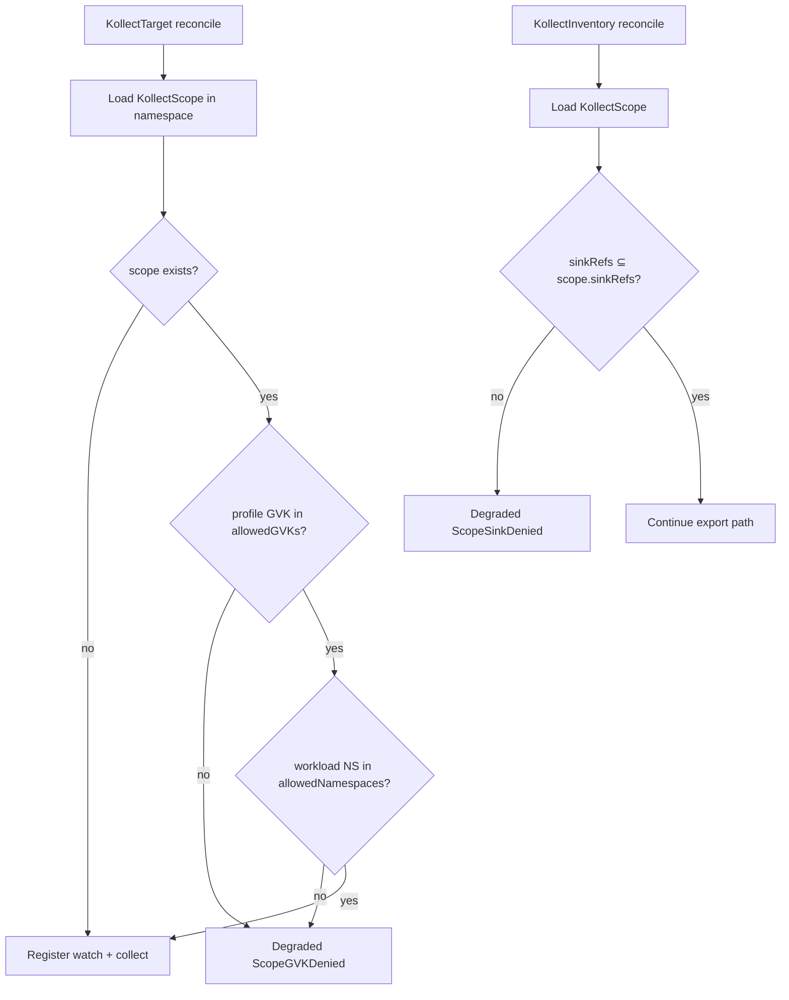
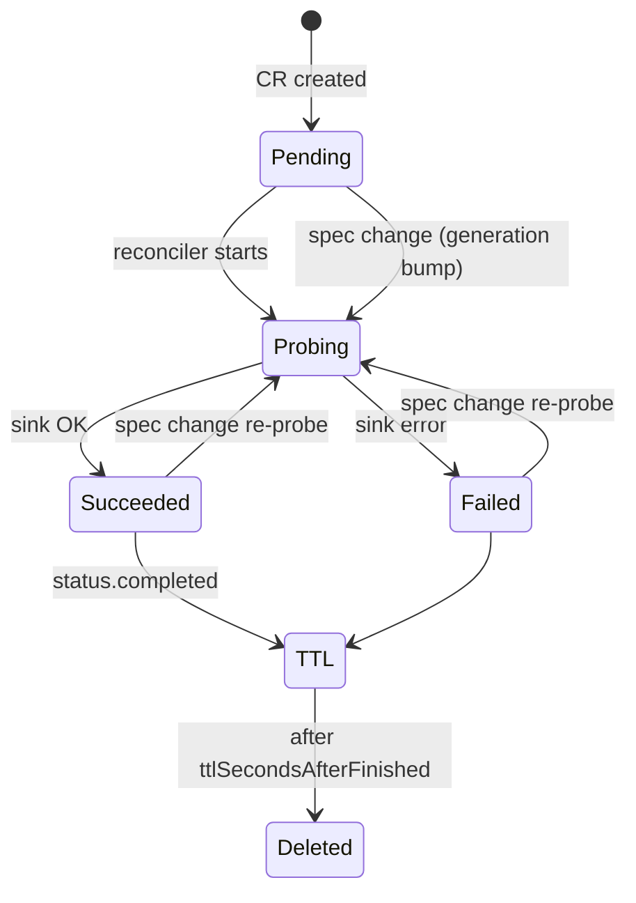
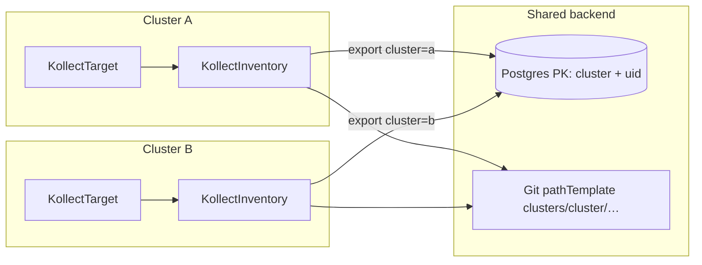

# Kollect data flows

Visual walkthroughs of how data moves through the operator. For CRD roles see
[ARCHITECTURE.md](ARCHITECTURE.md); for locked decisions see
[PLATFORM-DECISIONS.md](PLATFORM-DECISIONS.md).

!!! note "Sink roles on export paths"
    Export fans out to whatever `sinkRefs` name — each sink has a **role** (snapshot store, relational
    SoR, or event emitter), not a fixed Postgres+Kafka pair
    ([ADR-0401](adr/0401-sink-taxonomy-state-vs-stream.md)). Diagrams below may show Postgres and
    Kafka as examples; hub and inventory export use the same role-based contract for all seven shipped
    types.

---

## 1. Export debouncing

**Problem:** Event-driven informers can fire hundreds of updates per minute. Without coalescing,
every watch event would trigger a Postgres upsert or Git commit.

**Design:** The in-memory collect store updates **immediately** on every target reconcile. Only the
**sink export** step is debounced **per sink ref** on `KollectInventory` ([ADR-0413](adr/0413-export-interval-scheduling.md)).
One payload is marshalled per reconcile; each ref exports when its effective interval elapses or the
checksum/generation bypass rules fire for that sink.

### Per-inventory state machine



### Timing example (default `exportMinInterval: 30s`)



### Configuration

Effective interval per sink ref ([ADR-0413](adr/0413-export-interval-scheduling.md)):

```text
effectiveInterval(ref) =
  max(
    ref.exportMinInterval ?? sink.exportMinInterval ?? inventory.exportMinInterval ?? 30s,
    scope.minExportInterval ?? 0s
  )
```

| Field | Default | Effect |
| --- | --- | --- |
| `spec.sinkRefs[].exportMinInterval` | — | Per-sink override (string refs inherit inventory default) |
| `KollectSink.spec.exportMinInterval` | — | Sink default when ref and inventory omit override |
| `KollectInventory.spec.exportMinInterval` | **30s** (CRD default) | Inventory-wide default for plain string refs |
| `KollectScope.spec.minExportInterval` | — | Tenancy floor — webhook rejects intervals below this |
| `metadata.generation` bump | — | Immediate export to **all** sinks (spec edit) |
| Payload checksum change | — | Immediate export to **that** sink (material change) |
| `exportMinInterval: 0s` | — | Material-change only; controller requeues with 30s watchdog |

!!! tip "Dual-cadence fan-out"
    Portal Postgres at **30s** plus Git audit at **1h** is the canonical multi-role pattern — see
    `config/samples/kollect_v1alpha1_kollectinventory.yaml`
    and [deployment-inventory example](examples/deployment-inventory.md#step-4-kollectinventory).

When some sinks export and others are debounced, aggregate `Synced=False` with reason
**`PartiallySynced`**; per-sink detail lives in `status.sinkExports[]`.

---

## 2. Collection pipeline

How a watched object becomes an inventory row.

{ .kollect-illus .kollect-illus--wide width="800" }



**Key properties:**

- **One informer per GVK** across all targets ([ADR-0301](adr/0301-event-driven-informers.md)).
- Targets only differ by **namespace/label selectors** and **profileRef**.
- Extraction runs on the **cached unstructured object** — no per-target API list calls.

### Collection filter layers

Before a watched object reaches the collect store, it passes through stacked policy layers — Helm
watch boundary, Scope denials, Target include/exclude intent, `resourceRules`, CEL `matchPolicy`, and
watch labels ([ADR-0207](adr/0207-target-collection-filtering.md)).

{ .kollect-illus .kollect-illus--portrait width="360" }

---

## 3. Attribute extraction (JSONPath arrays)

`KollectProfile` attributes are evaluated per object. Single-index paths return a scalar; wildcard
paths return a **JSON array** in the export row.



**Deployment containers example:**

| Path | Result for 2-container pod |
| --- | --- |
| `$.spec.template.spec.containers[0].image` | `"app:1.0"` (string) |
| `$.spec.template.spec.containers[*].image` | `["app:1.0", "sidecar:2.0"]` (list) |

See [ADR-0302](adr/0302-cel-jsonpath-extraction.md) for syntax rules.

---

## 4. `KollectScope` enforcement gate

Static scope object; enforced at **target** and **inventory** reconcile time (hard degrade).



Example: [ADR-0203](adr/0203-namespaced-multi-tenancy.md#enforcement-example-gvk-denied).

---

## 5. `KollectConnectionTest` lifecycle

One-shot probe CR for audited connectivity checks.



Default TTL: **300s**. Patch `spec.sinkRef` to force a fresh probe.

---

## 6. Multi-cluster fleet (shared sink fan-in)

Each cluster runs the **same single-mode operator**. `KollectInventory` export includes a
**`cluster`** dimension via `spec.cluster` on database sinks or `{cluster}` in Git
`pathTemplate` so shared backends merge rows without an in-tree aggregation tier
([ADR-0501](adr/0501-multi-cluster-fleet.md)).



**Merge semantics:** Postgres delete reconciliation keys on `(cluster, namespace, name, uid)`.
Git and object-store layouts partition by `pathTemplate`. Event sinks include cluster in subject
or headers for downstream consumers.

**Export path:** identical per-sink debouncing as single-cluster mode ([§1](#1-export-debouncing)).
Multi-cluster rows carry **`cluster`** in each item; CR `status` stores summaries only
([ADR-0103](adr/0103-etcd-limit.md)).

Walkthrough: [Multi-cluster fleet](examples/multi-cluster-fleet.md).

---

## See also

- [ARCHITECTURE.md](ARCHITECTURE.md) — CRD model and deployment defaults
- [PERFORMANCE.md](PERFORMANCE.md) — metrics and tuning
- [examples/deployment-inventory.md](examples/deployment-inventory.md) — end-to-end walkthrough
