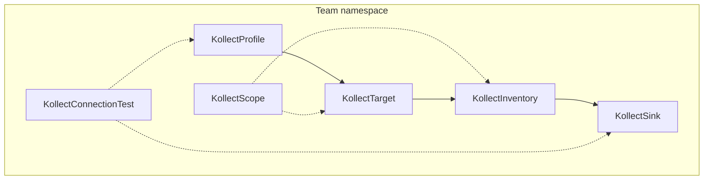

# Platform decisions — architecture summary

> **For coordinators and implementers.** Locked outcomes from architecture discussions (2026-06-05).
> Formal ADR: [adr/0032-platform-architecture-pivot.md](adr/0032-platform-architecture-pivot.md).
>
> **Phases = build order**, not release milestones. No public “release” until the tree is beta-quality.
> **No adopters** on `v1alpha1` — break APIs when needed.

## Coordinator brief (paste to workers)

### Non-negotiables

- **Namespaced default:** Profile, **Sink**, Target, Inventory, Scope in team namespace.
- **Cluster variants:** `KollectClusterTarget` (platform cross-namespace collection), `KollectClusterProfile`, `KollectClusterSink`, `KollectClusterInventory`, `KollectClusterScope`.
- **Default install:** per-team Helm — `tenantMode: true`, `watchNamespaces: [team-ns]`.
- **MVP:** collect → aggregate → export to **Postgres or Kafka** (Git sample OK for tests, not primary narrative).
- **HTTP inventory:** optional debug (`featureGates.inventoryHttp.enabled: false`); **not** MVP; hub read path uses merged store later.
- **No `KollectHub` CRD** — `mode: hub|spoke` + Helm values + `internal/hub/` library.
- **`KollectConnectionTest` CR** — implement (supersedes ADR-0030 rejection).
- **Shared informer per GVK** — one cache per GVK, Targets filter in reconcile.
- **Watch labels** — support `All` and `OptIn`; platform central + per-resource `kollect.dev/watch: disabled`.
- **Transport:** `inprocess` only default.
- **No doc-sync** in operator ([ADR-0011](adr/0011-doc-sync-templating.md)).

### Build order (not release gates)

1. Namespaced **Sink** + **Profile** (batch breaking change)
2. MVP export path — Deployment profile → Postgres (or Kafka) sink
3. `KollectScope` reconciler enforcement
4. `KollectConnectionTest` CR + keep Sink annotation/spec probes
5. Export **debouncing** — `KollectInventory.spec.exportMinInterval` (default **30s**; not global)
6. Argo **`Application`** sample + **contract test** (contract test **first**; then samples)
7. Hub `mode: hub|spoke` + merge lib (`inprocess`); no hub CRD
8. **`KollectClusterTarget`** — after namespaced MVP (platform operator path)

### Locked micro-decisions (2026-06-05, session 2)

| Topic | Decision |
| --- | --- |
| Argo contract test | **First** — golden fixture locks JSONPath + `history` ordering |
| Argo samples | Profile `argo-application-summary` + Target `team-argo-applications` |
| `KollectConnectionTest` GC | **`spec.ttlSecondsAfterFinished`** — default **300s** |
| Export debounce | **Per Inventory** — `spec.exportMinInterval`, default **30s**; **not** global `--export-debounce` |
| Hub federated mTLS | **Deferred** — ADR-0028 push-first path stands |
| Cluster rollup | **`KollectClusterInventory`** + **`KollectClusterTarget`** (no namespaced `inventoryRef` hack) |

### ADR micro-decisions (lock at implement — Phase 1 unless noted)

Coordinator defaults from session 2. **Phase 1** rows ship as written; **Phase 2+** may spike first.
Update the cited ADR when code merges.

#### HTTP API and auth ([ADR-0006](adr/0006-etcd-limit.md), [ADR-0024](adr/0024-inventory-api-auth.md))

| Topic | Default | Phase |
| --- | --- | --- |
| Inventory HTTP path | **`GET /v1alpha1/inventory`**; optional **`GET /v1alpha1/inventory/{namespace}/{name}`** | When HTTP enabled (debug; default off) |
| OpenAPI | **`openapi/v1alpha1/inventory.yaml`** beside handler | 1 |
| Inventory read SAR | **`get`** on `kollectinventories` in caller namespace; **`list`** for index | 1 |
| Hub ingest SAR | **`create`/`update`** on `kollectremoteclusters` or subresource **`kollectremoteclusters/ingest`** | 2 — pick one in RBAC doc |
| TokenReview/SAR cache | **30s TTL** in-memory per `(token hash, verb, resource)`; flag + `disabled` for dev | 1 |
| `maxExportBytes` | Global manager default (~**1.5 MiB**) + optional **`KollectInventory.spec.maxExportBytes`**; webhook rejects override > global cap | 1 |

#### Sinks and export ([ADR-0025](adr/0025-sink-backends-database-kafka.md), [ADR-0020](adr/0020-error-taxonomy.md))

| Topic | Default | Phase |
| --- | --- | --- |
| SQLite sink | **Skip** — Postgres testcontainers sufficient | — |
| Postgres upsert PK | **`(inventory_namespace, inventory_name, target_name, source_uid)`**; add `cluster` column when hub merge lands | 1 |
| Kafka message key | **`{cluster}:{inventory_ns}/{inventory_name}`** when hub; else **`{inventory_ns}/{inventory_name}`** | 2 hub |
| Kafka value | JSON row batch + metadata (`generation`, `checksum`); at-least-once | 1 |
| Sink error metric | **`kollect_sink_errors_total{reason}`** — separate from reconcile counter | 1 |
| Export duration histogram | Default buckets: `.005, .01, .025, .05, .1, .25, .5, 1, 2.5, 5, 10` seconds | 1 |
| Export debounce | **`KollectInventory.spec.exportMinInterval`** — default **30s**; material-change bypass | 1 |
| Connection test TTL | **`KollectConnectionTest.spec.ttlSecondsAfterFinished`** — default **300** | 1 |

#### Extraction and Helm ([ADR-0003](adr/0003-cel-jsonpath-extraction.md), [ADR-0027](adr/0027-helm-release-inventory.md))

| Topic | Default | Phase |
| --- | --- | --- |
| `helm:` decode | Prefix **`helm:release.<field>`** on attribute path; decoder expands `data.release` gzip JSON | 2+ |
| Values redaction | Global operator **`scrubKeys[]`**; per-attribute `redact: true` later | 2 |
| JSONPath filter validation | Webhook **warn** only; **reject** unsupported filters | 1 warn / 2 reject |
| CEL prefix | Webhook **requires** **`cel:`** prefix on CEL expressions | 1 |

#### Hub and transport ([ADR-0022](adr/0022-multi-cluster-sync-rfc.md), [ADR-0028](adr/0028-hub-cluster-auth-istio-pattern.md))

| Topic | Default | Phase |
| --- | --- | --- |
| Hub pull vs push | **Push default**; pull via `credentialsSecretRef` optional | 2 |
| Delivery semantics | **At-least-once**; idempotent merge on **`(cluster, ns, name, uid)`** | 2 |
| Spoke binary | **Same image**, **`mode: spoke`** — no split binary until size proof | 2 |
| Max spoke payload inline | **512 KiB** summarized JSON; larger → **`payloadRef`** object store | 2 spike |
| Hub shard routing | **`hash(clusterName) % shardCount`** via **Helm values / env** — **no `KollectHub` CRD** | 2 |
| Git `clusters/*` monorepo | Sufficient for **≤100** spokes; object-store spill beyond | 2+ |

#### CRD model ([ADR-0004](adr/0004-crd-model.md))

| Topic | Default | Phase |
| --- | --- | --- |
| `caBundle` vs `caSecretRef` | **Keep both** — `caSecretRef` preferred; **`caBundle` max 64 KiB** (webhook) | 1 |
| `KollectClusterInventory` selector | **Explicit namespace list** in spec — not cluster-wide implicit | 3+ |

### TODOs explicitly requested

- [x] **Argo `Application` contract test** — `internal/collect/argo_application_contract_test.go`
- [x] **Argo samples** — profile + target under `config/samples/`
- [ ] **`KollectConnectionTest` TTL** — add `spec.ttlSecondsAfterFinished` to API + reconciler GC
- [ ] **`exportMinInterval`** on `KollectInventory` — migrate off global debounce flag

---

## Tenancy and CRD model

| Kind | Scope | Notes |
| --- | --- | --- |
| `KollectProfile` | Namespace | Same-ns `profileRef` on Target |
| `KollectSink` | **Namespace** | Same-ns `sinkRefs` on Inventory |
| `KollectTarget` | Namespace | Default for `tenantMode`; same-ns `profileRef` |
| `KollectClusterTarget` | **Cluster** | Platform operator; `namespaceSelector` + `KollectClusterProfile` ref |
| `KollectInventory` | Namespace | Aggregates namespaced targets in namespace |
| `KollectScope` | Namespace | Webhook + reconciler enforcement |
| `KollectConnectionTest` | Namespace | One-shot / CI connectivity probes |
| `KollectClusterTarget` | **Cluster** | Platform cross-namespace collection — `namespaceSelector` + cluster profile ([ADR-0032](adr/0032-platform-architecture-pivot.md)) |
| `KollectClusterProfile` | Cluster | Platform-shared extraction schemas |
| `KollectClusterSink` | Cluster | Shared export backends (later) |
| `KollectClusterInventory` | Cluster | Rollup for cluster targets (later) |
| `KollectClusterScope` | Cluster | Reserved — platform policy |
| `KollectHub` | — | **Rejected / deprecated stub** — use Helm `mode: hub`; no controller on roadmap |
| `KollectPublication` | — | **Rejected** — external CI |
| `KollectReceiver` | — | Reserved — webhook trigger (future) |
| `KollectTargetSet` | — | Reserved — generator pattern (future) |
| `KollectRemoteCluster` | Namespace (hub) | Spoke registration; push auth [ADR-0028](adr/0028-hub-cluster-auth-istio-pattern.md) |

### Reserved CRDs — what they mean

**Reserved** kinds are **design placeholders**, not promises to ship soon:

| Kind | Intent | When |
| --- | --- | --- |
| **`KollectClusterTarget`** | One cluster object collects across namespaces (platform operator) | After namespaced MVP; needs `KollectClusterProfile` + merge/export path |
| `KollectClusterProfile` | One schema for all teams (like `ClusterSecretStore`) | With cluster target / platform operator |
| `KollectClusterSink` | Central Postgres/Git for all tenants | Namespaced sinks cover team-owned destinations first |
| `KollectClusterInventory` | Roll up all namespaces for platform portal | Hub merge + hub DB is the scale path; not single CRD status |
| `KollectClusterScope` | Cluster-wide policy when namespaced Scope is too weak | Phase 1 namespaced Scope first |
| `KollectReceiver` | Inbound webhook → trigger export (Flux Receiver) | No webhook trigger requirement yet |
| `KollectTargetSet` | Generate many Targets (ApplicationSet) | Manual Targets OK for MVP |
| ~~`KollectHub`~~ | Was: CRD spawns hub Deployment | **Rejected / deprecated stub** — Helm `mode: hub` only; remove from roadmap controllers |
| ~~`KollectPublication`~~ | Confluence/doc sync | **Rejected** — [ADR-0011](adr/0011-doc-sync-templating.md) |

Do not generate controllers or document samples for reserved kinds unless an ADR promotes them.

---

## Sinks and portals

| Role | Backend | When |
| --- | --- | --- |
| **Primary (portals, automation)** | Postgres, Kafka | Single-cluster and hub |
| **Audit / human diff** | Git, GitLab | Compliance, MR review — not live query at scale |
| **Debug / tiny install** | HTTP inventory (gated off) | kind, local dev |
| **Hub portal read** | Postgres/Kafka at hub | After merge — not spoke HTTP |

---

## Collection engine

- **One shared informer per GVK** ([ADR-0014](adr/0014-event-driven-informers.md)).
- **Watch labels** ([ADR-0029](adr/0029-watch-labels.md)): platform runs `watchMode: All`; teams opt out with `kollect.dev/watch: disabled` on a resource or namespace annotation.
- **Export debouncing:** in-memory store updates on every event; **export to sink coalesced** per
  Inventory via **`spec.exportMinInterval`** (default **30s**) + checksum/generation bump for
  material changes. **Not** a global manager flag.

---

## Where inventory lives

| Store | Content | Survives restart? |
| --- | --- | --- |
| Collect engine / informer cache | Extracted attribute rows | Rebuilt on resync after restart |
| `KollectInventory.status` | Counts, conditions, last export SHA/ref | Yes (metadata only) |
| **Postgres / Kafka sink** | Full inventory payload | **Yes — system of record** |
| Spoke HTTP (if enabled) | RAM snapshot | No — debug only |
| Hub DB | Merged multi-cluster rows | Yes — portal query target |

Never persist full payloads in etcd ([ADR-0006](adr/0006-etcd-limit.md)).

---

## Multi-cluster (build order)

1. Single-cluster export to Postgres/Kafka (**MVP**)
2. `internal/hub/` merge + `mode: spoke` push + `mode: hub` ingest (**inprocess** transport)
3. Optional external transport after e2e proof ([ADR-0023](adr/0023-lean-queue-transport.md))
4. Hub read API optional, backed by hub store — not required on spokes

Auth: [ADR-0028](adr/0028-hub-cluster-auth-istio-pattern.md) push-first.

---

## Helm / chart version sample

- **Primary:** `argoproj.io/v1alpha1` `Application` (not Flux `HelmRelease`)
- **Contract test required** — validate status field paths
- Secondary: Flux sample may remain; plain Helm Secret deferred (`helm:` decode)

---

## Connection test

- **`KollectConnectionTest` CR** — primary for audited/CI/composite probes
- **`spec.ttlSecondsAfterFinished`** — default **300s**; delete CR after probe completes
- Sink `connectionTest: false` in prod; annotation for quick sink-only retest
- See [ADR-0032](adr/0032-platform-architecture-pivot.md) (amends [ADR-0030](adr/0030-connection-test.md))

---

## Still open

| Topic | ADR |
| --- | --- |
| Hub federated mTLS behind external LB | **Deferred** — [0028](adr/0028-hub-cluster-auth-istio-pattern.md) |

---

## See also

- [ARCHITECTURE.md](ARCHITECTURE.md)
- [REQUIREMENTS.md](REQUIREMENTS.md)
- [ROADMAP.md](ROADMAP.md)
- [adr/README.md](adr/README.md)
