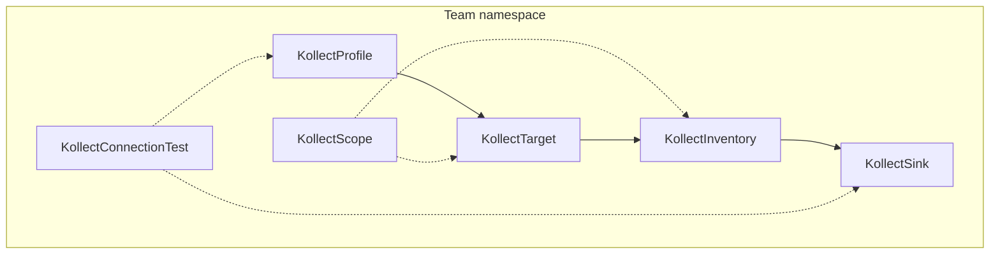

# Platform decisions — architecture summary

> **For coordinators and implementers.** Locked outcomes from architecture discussions (2026-06-05).
> Formal ADR: [adr/0032-platform-architecture-pivot.md](adr/0032-platform-architecture-pivot.md).
>
> **Phases = build order**, not release milestones. No public “release” until the tree is beta-quality.
> **No adopters** on `v1alpha1` — break APIs when needed.

## Coordinator brief (paste to workers)

### Non-negotiables

- **Namespaced default:** Profile, **Sink**, Target, Inventory, Scope in team namespace.
- **Cluster variants later:** `KollectClusterProfile`, `KollectClusterSink`, `KollectClusterInventory`, `KollectClusterScope`.
- **Default install:** per-team Helm — `tenantMode: true`, `watchNamespaces: [team-ns]`.
- **MVP:** collect → aggregate → export to **Postgres or Kafka** (Git sample OK for tests, not primary narrative).
- **HTTP inventory:** optional debug (`featureGates.inventoryHttp.enabled: false`); **not** MVP; hub read path uses merged store later.
- **No `KollectHub` CRD** — `mode: hub|spoke` + Helm values + `internal/hub/` library.
- **`KollectConnectionTest` CR** — implement (supersedes ADR-0030 rejection).
- **Shared informer per GVK** — one cache per GVK, Targets filter in reconcile.
- **Watch labels** — support `All` and `OptIn`; platform central + per-resource `kollect.dev/watch: disabled`.
- **Transport:** `inprocess` only default.
- **No doc-sync** in operator ([ADR-0011](adr/0011-doc-sync-templating.md)).

### Build order (not release gates)

1. Namespaced **Sink** + **Profile** (batch breaking change)
2. MVP export path — Deployment profile → Postgres (or Kafka) sink
3. `KollectScope` reconciler enforcement
4. `KollectConnectionTest` CR + keep Sink annotation/spec probes
5. Export **debouncing** (per Inventory)
6. Argo **`Application`** helm sample + **contract test** (TODO)
7. Hub `mode: hub|spoke` + merge lib (`inprocess`); no hub CRD

### TODOs explicitly requested

- [ ] **Argo `Application` contract test** — chart/version paths + status ordering
- [ ] **`KollectConnectionTest` CR** — API, reconciler, sample, docs

---

## Tenancy and CRD model

| Kind | Scope | Notes |
| --- | --- | --- |
| `KollectProfile` | Namespace | Same-ns `profileRef` on Target |
| `KollectSink` | **Namespace** | Same-ns `sinkRefs` on Inventory |
| `KollectTarget` | Namespace | Dynamic informer per Profile GVK |
| `KollectInventory` | Namespace | Aggregates targets in namespace |
| `KollectScope` | Namespace | Webhook + reconciler enforcement |
| `KollectConnectionTest` | Namespace | One-shot / CI connectivity probes |
| `KollectClusterProfile` | Cluster | Reserved — platform-shared schemas |
| `KollectClusterSink` | Cluster | Reserved — shared export backends |
| `KollectClusterInventory` | Cluster | Reserved — platform rollup |
| `KollectClusterScope` | Cluster | Reserved — platform policy |
| `KollectHub` | — | **Rejected** — use Helm `mode: hub` |
| `KollectPublication` | — | **Rejected** — external CI |
| `KollectReceiver` | — | Reserved — webhook trigger (future) |
| `KollectTargetSet` | — | Reserved — generator pattern (future) |
| `KollectRemoteCluster` | Namespace (hub) | Spoke registration; push auth [ADR-0028](adr/0028-hub-cluster-auth-istio-pattern.md) |

### Reserved CRDs — what they mean

**Reserved** kinds are **design placeholders**, not promises to ship soon:

| Reserved kind | Intent | Why not now |
| --- | --- | --- |
| `KollectClusterProfile` | One chart/schema for all teams (like `ClusterSecretStore`) | Namespaced profiles cover MVP; platform can copy YAML via GitOps |
| `KollectClusterSink` | Central Postgres/Git for all tenants | Namespaced sinks cover team-owned destinations first |
| `KollectClusterInventory` | Roll up all namespaces for platform portal | Hub merge + hub DB is the scale path; not single CRD status |
| `KollectClusterScope` | Cluster-wide policy when namespaced Scope is too weak | Phase 1 namespaced Scope first |
| `KollectReceiver` | Inbound webhook → trigger export (Flux Receiver) | No webhook trigger requirement yet |
| `KollectTargetSet` | Generate many Targets (ApplicationSet) | Manual Targets OK for MVP |
| ~~`KollectHub`~~ | Was: CRD spawns hub Deployment | **Rejected** — Helm mode avoids second lifecycle API |
| ~~`KollectPublication`~~ | Confluence/doc sync | **Rejected** — [ADR-0011](adr/0011-doc-sync-templating.md) |

Do not generate controllers or document samples for reserved kinds unless an ADR promotes them.

---

## Sinks and portals

| Role | Backend | When |
| --- | --- | --- |
| **Primary (portals, automation)** | Postgres, Kafka | Single-cluster and hub |
| **Audit / human diff** | Git, GitLab | Compliance, MR review — not live query at scale |
| **Debug / tiny install** | HTTP inventory (gated off) | kind, local dev |
| **Hub portal read** | Postgres/Kafka at hub | After merge — not spoke HTTP |

---

## Collection engine

- **One shared informer per GVK** ([ADR-0014](adr/0014-event-driven-informers.md)).
- **Watch labels** ([ADR-0029](adr/0029-watch-labels.md)): platform runs `watchMode: All`; teams opt out with `kollect.dev/watch: disabled` on a resource or namespace annotation.
- **Export debouncing:** in-memory store updates on every event; **export to sink coalesced** (min interval + checksum/generation bump). Prevents Git/DB write storms at 10k objects.

---

## Where inventory lives

| Store | Content | Survives restart? |
| --- | --- | --- |
| Collect engine / informer cache | Extracted attribute rows | Rebuilt on resync after restart |
| `KollectInventory.status` | Counts, conditions, last export SHA/ref | Yes (metadata only) |
| **Postgres / Kafka sink** | Full inventory payload | **Yes — system of record** |
| Spoke HTTP (if enabled) | RAM snapshot | No — debug only |
| Hub DB | Merged multi-cluster rows | Yes — portal query target |

Never persist full payloads in etcd ([ADR-0006](adr/0026-performance-scalability.md)).

---

## Multi-cluster (build order)

1. Single-cluster export to Postgres/Kafka (**MVP**)
2. `internal/hub/` merge + `mode: spoke` push + `mode: hub` ingest (**inprocess** transport)
3. Optional external transport after e2e proof ([ADR-0023](adr/0023-lean-queue-transport.md))
4. Hub read API optional, backed by hub store — not required on spokes

Auth: [ADR-0028](adr/0028-hub-cluster-auth-istio-pattern.md) push-first.

---

## Helm / chart version sample

- **Primary:** `argoproj.io/v1alpha1` `Application` (not Flux `HelmRelease`)
- **Contract test required** — validate status field paths
- Secondary: Flux sample may remain; plain Helm Secret deferred (`helm:` decode)

---

## Connection test

- **`KollectConnectionTest` CR** — primary for audited/CI/composite probes
- Sink `connectionTest: false` in prod; annotation for quick sink-only retest
- See [ADR-0032](adr/0032-platform-architecture-pivot.md) (amends [ADR-0030](adr/0030-connection-test.md))

---

## Still open

| Topic | ADR |
| --- | --- |
| Hub spoke identity details (federated mTLS behind external LB) | [0028](adr/0028-hub-cluster-auth-istio-pattern.md) |
| Debounce default interval | [0032](adr/0032-platform-architecture-pivot.md) |
| `KollectConnectionTest` garbage collection | [0032](adr/0032-platform-architecture-pivot.md) |

---

## See also

- [ARCHITECTURE.md](ARCHITECTURE.md)
- [REQUIREMENTS.md](REQUIREMENTS.md)
- [ROADMAP.md](ROADMAP.md)
- [adr/README.md](adr/README.md)
