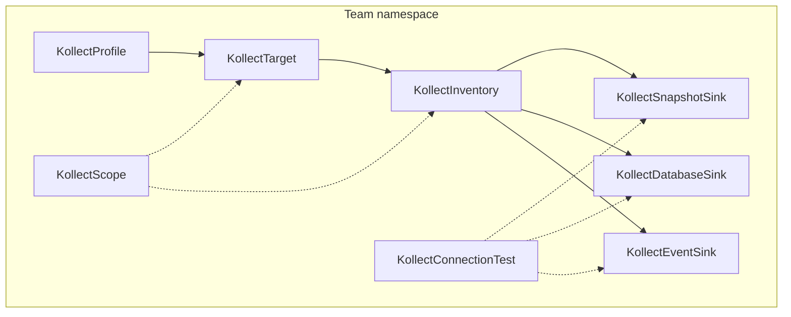

# Platform decisions — architecture summary

This page summarizes **locked platform decisions** from the architecture review of 2026-06-05. It is
the concise reference for **operators**, **contributors**, and **architects** evaluating or building
Kollect. For the full decision log and reasoning, see
[ADR-0201: Platform architecture pivot](adr/0201-crd-model.md).

!!! warning "Pre-beta API"
    The public API is **`v1alpha1`** and may change without notice while the project is pre-beta.
    Breaking changes are batched deliberately before a future `v1beta1` freeze (planned around the
    **v0.10 presentation gate**). Do not build production integrations on field names or behavior
    not yet covered by contract tests.

### Phases, releases, and API stability

**Phases describe build order**, not release milestones. Work proceeds in the sequence below;
individual features may land in parallel, but Kollect is not presented as a general-availability
product until the tree reaches **beta-quality** overall.

The public API is **`v1alpha1`** and **may change without notice** while the project is pre-beta.
There are no external adopters yet — tenancy, scalability, and correctness take priority over
backward compatibility. Breaking changes are batched deliberately before a future `v1beta1` freeze
(planned around the **v0.10 presentation gate** — see [RELEASE.md](RELEASE.md#versioning-policy)).

## Core decisions

### Non-negotiables

!!! warning "Same-namespace references"
    `profileRef`, `sinkRefs`, and `KollectConnectionTest.spec.sinkRef` resolve objects in the
    **same namespace** as the referring CR. Cluster-scoped kinds use `sinkNamespace` instead.

- **Namespaced default:** Profile, **Sink**, Target, Inventory, Scope in team namespace.
- **Cluster variants:** `KollectClusterTarget` (platform cross-namespace collection), `KollectClusterProfile`, `KollectClusterSink`, `KollectClusterInventory`, `KollectClusterScope`.
- **Default install:** per-team Helm — `tenantMode: true`, `watchNamespaces: [team-ns]`.
- **MVP:** collect → aggregate → export to **Postgres or Kafka** for portals/scale; **Git** is the
  recommended sink for **small single-cluster** installs without a database or Kafka broker.
- **HTTP inventory:** optional debug (`featureGates.inventoryHttp.enabled: false`); **not** MVP; hub read path uses merged store later.
- **No `KollectHub` CRD** — `- **`KollectConnectionTest` CR** — implement (supersedes ADR-0403 rejection).
- **Shared informer per GVK** — one cache per GVK, Targets filter in reconcile.
- **Watch labels** — support `All` and `OptIn`; platform central + per-resource `kollect.dev/watch: disabled`.
- **Transport:** `inprocess` only default.
- **No doc-sync** in operator ([ADR-0702](adr/0702-doc-sync-templating.md)).

### Build order

1. Namespaced **Sink** + **Profile** (batch breaking change)
2. MVP export path — Deployment profile → Postgres (or Kafka) sink
3. `KollectScope` reconciler enforcement
4. `KollectConnectionTest` CR + keep Sink annotation/spec probes
5. Export **debouncing** — per sink ref via `exportMinInterval` precedence ([ADR-0413](adr/0413-export-interval-scheduling.md)); inventory default **30s**
6. Argo **`Application`** sample + **contract test** (contract test **first**; then samples)
7. Hub `8. **`KollectClusterTarget`** — API + webhook only until namespaced MVP proven; controller later
9. **Secondary watches** — Profile → Targets, family Sink → Inventories (beta requirement)
10. **Generic CRD sample** — `cert-manager.io/Certificate` + contract test
11. **GitLab sink** — Phase 2 (custom CA via `tls.caSecretRef`; first enterprise presentation path)
12. **Hub ingest** — SAR **`create`** on `kollectremoteclusters`

### Sink and transport

Sink/transport reframe — [ADR-0401](adr/0401-sink-taxonomy-state-vs-stream.md).

| Topic | Decision |
| --- | --- |
| Sink taxonomy | **Role-based**: snapshot store (Git/Parquet/HTTP) · relational SoR (Postgres) · event emitter (NATS/Kafka) |
| Canonical artifact | **In-memory snapshot** per Inventory; all sinks are projections |
| Queryable, no DB | **Add S3/GCS Parquet sink** queryable by DuckDB/Athena; deletes free; 3 store tiers (Git + Parquet + Postgres) |
| Postgres deletes | **Add delete reconciliation** (diff vs last export) — upsert-only is a bug |
| Event default | **NATS JetStream** lean default; **Kafka/Redpanda** enterprise opt-in (one Kafka-API driver) |
| Sink ↔ transport | **Unified** — spoke publishing to a shared subject *is* the fan-in |
| Multi-cluster default | **Direct shared-sink fan-in** (`spec.cluster`); **hub optional** (Git fan-in / isolation / cred / schema decoupling) |

### Collection, cluster targets, and enterprise sinks

| Topic | Decision |
| --- | --- |
| Secondary watches | **Ship** — `KollectProfile` change enqueues referring Targets; family sink change enqueues Inventories with matching `snapshotSinkRefs`, `databaseSinkRefs`, or `eventSinkRefs` |
| Generic CRD sample | **`cert-manager.io/Certificate`** — contract test first, then profile + target + walkthrough |
| `KollectClusterTarget` controller | **Defer** — API + webhook + sample only until namespaced e2e solid |
| `profileRef` (cluster target) | Resolves **`KollectProfile` in platform namespace** (Helm `platformNamespace`); `KollectClusterProfile` later |
| `namespaceSelector` | **Required** — webhook rejects empty/missing selector |
| Helm values profile | **`helm-release-values-redacted`** + operator **`scrubKeys[]`** at extraction |
| GitLab sink | **Phase 2** — implement with **`tls.caSecretRef`** for internal CA; Git remains small-install default |
| Hub ingest SAR | **`create`** on **`kollectremoteclusters`** in hub namespace |

### Export debouncing, scope, and hub ingest

| Topic | Decision |
| --- | --- |
| `exportMinInterval` unset | **CRD default 30s** (`kubebuilder:default`); per-sink overrides on structured `sinkRefs[]` |
| `exportMinInterval` bypass | Immediate export on **payload checksum change** or **`metadata.generation`** bump |
| ConnectionTest re-run | **Re-probe on any spec change** (generation ≠ observedGeneration); TTL restarts after new run |
| `KollectScope` enforcement | **Hard degrade** — `Degraded` + no collect/export; see [ADR-0203](adr/0203-namespaced-multi-tenancy.md) example |
| Hub first milestone | **Postgres + Kafka in parallel** on hub ingest |
| `KollectClusterInventory` | **One CR rolls up all** `KollectClusterTarget`s; optional `targetRefs` for subset / 1:1 |
| ADR micro-decisions (Postgres PK, HTTP paths, Kafka keys, …) | **Confirmed** — see [Implementation defaults](#implementation-defaults) below |

### Samples, connection tests, and cluster rollup

| Topic | Decision |
| --- | --- |
| Argo contract test | **First** — golden fixture locks JSONPath + `history` ordering |
| Argo samples | Profile `argo-application-summary` + Target `team-argo-applications` |
| `KollectConnectionTest` GC | **`spec.ttlSecondsAfterFinished`** — default **300s** |
| Export debounce | **Per Inventory** — `spec.exportMinInterval`, default **30s** |
| Hub federated mTLS | **Deferred** — ADR-0503 push-first path stands |
| Cluster rollup | **`KollectClusterInventory`** + **`KollectClusterTarget`** (no namespaced `inventoryRef` hack) |

### Implementation defaults

These defaults apply unless a cited ADR specifies otherwise. **Phase 1** rows are expected to ship
as written; **Phase 2+** rows may require a spike before implementation. Update the cited ADR when
the corresponding code merges.

#### HTTP API and auth ([ADR-0103](adr/0103-etcd-limit.md), [ADR-0404](adr/0404-inventory-api-auth.md))

| Topic | Default | Phase |
| --- | --- | --- |
| Inventory HTTP path | **`GET /v1alpha1/inventory`**; optional **`GET /v1alpha1/inventory/{namespace}/{name}`** | When HTTP enabled (debug; default off) |
| OpenAPI | **`openapi/v1alpha1/inventory.yaml`** beside handler | 1 |
| Inventory read SAR | **`get`** on `kollectinventories` in caller namespace; **`list`** for index | 1 |
| Hub ingest SAR | **`create`** on **`kollectremoteclusters`** in hub namespace | 2 |
| GitLab sink | **`type: gitlab`** backend + custom CA TLS; Phase 2 after Git path proven | 2 |
| Secondary watches | Profile → Targets; family Sink → Inventories | 1 (beta) |
| TokenReview/SAR cache | **30s TTL** in-memory per `(token hash, verb, resource)`; flag + `disabled` for dev | 1 |
| `maxExportBytes` | Global manager default (~**1.5 MiB**) + optional **`KollectInventory.spec.maxExportBytes`**; webhook rejects override > global cap | 1 |

#### Sinks and export ([ADR-0402](adr/0402-sink-backends-database-kafka.md), [ADR-0602](adr/0602-error-taxonomy.md))

| Topic | Default | Phase |
| --- | --- | --- |
| SQLite sink | **Skip** — Postgres testcontainers sufficient | — |
| Postgres upsert PK | **`(inventory_namespace, inventory_name, target_name, source_uid)`**; add `cluster` column when hub merge lands | 1 |
| Kafka message key | **`{cluster}:{inventory_ns}/{inventory_name}`** when hub; else **`{inventory_ns}/{inventory_name}`** | 2 hub |
| Kafka value | JSON row batch + metadata (`generation`, `checksum`); at-least-once | 1 |
| Sink error metric | **`kollect_sink_errors_total{reason}`** — separate from reconcile counter | 1 |
| Export duration histogram | Default buckets: `.005, .01, .025, .05, .1, .25, .5, 1, 2.5, 5, 10` seconds | 1 |
| Export debounce | **Per sink ref** — ref override → sink default → inventory default **30s** → scope floor | 1 |
| Connection test TTL | **`KollectConnectionTest.spec.ttlSecondsAfterFinished`** — default **300** | 1 |

#### Extraction and Helm ([ADR-0302](adr/0302-cel-jsonpath-extraction.md), [ADR-0303](adr/0303-helm-release-inventory.md))

| Topic | Default | Phase |
| --- | --- | --- |
| `helm:` decode | Prefix **`helm:release.<field>`** on attribute path; decoder expands `data.release` gzip JSON | 2+ |
| Values redaction | Global operator **`scrubKeys[]`**; per-attribute `redact: true` later | 2 |
| JSONPath filter validation | Webhook **warn** only; **reject** unsupported filters | 1 warn / 2 reject |
| CEL prefix | Webhook **requires** **`cel:`** prefix on CEL expressions | 1 |

#### Hub and transport ([ADR-0501](adr/0501-multi-cluster-fleet.md), ADR-0503)

| Topic | Default | Phase |
| --- | --- | --- |
| Hub pull vs push | **Push default**; pull via `credentialsSecretRef` optional | 2 |
| Delivery semantics | **At-least-once**; idempotent merge on **`(cluster, ns, name, uid)`** | 2 |
| Spoke binary | **Same image**, **`| Max spoke payload inline | **512 KiB** summarized JSON; larger → **`payloadRef`** object store | 2 spike |
| Hub shard routing | **`hash(clusterName) % shardCount`** via **Helm values / env** — **no `KollectHub` CRD** | 2 |
| Git `clusters/*` monorepo | Sufficient for **≤100** spokes; object-store spill beyond | 2+ |

#### CRD model ([ADR-0201](adr/0201-crd-model.md))

| Topic | Default | Phase |
| --- | --- | --- |
| `caBundle` vs `caSecretRef` | **Keep both** — `caSecretRef` preferred; **`caBundle` max 64 KiB** (webhook) | 1 |
| `KollectClusterInventory` | **One platform rollup CR** — aggregates all `KollectClusterTarget`s; optional `targetRefs` | 3+ |

### Documentation status

- [x] **CR reference guide** — scaffold at [CR-REFERENCE.md](CR-REFERENCE.md) + [crds/](crds/);
  per-kind failure-mode detail is tracked in [CR-REFERENCE.md](CR-REFERENCE.md).
- [x] **Architecture data flows** — [DATA-FLOWS.md](DATA-FLOWS.md) (debounce + collection + scope + connection test).
- [x] **JSONPath `[*]` wildcard** — all array elements; deployment sample updated ([ADR-0302](adr/0302-cel-jsonpath-extraction.md)).

### Completed follow-ups

- [x] **Argo `Application` contract test** — `internal/collect/argo_application_contract_test.go`
- [x] **Argo samples** — profile + target under `config/samples/`
- [x] **`KollectConnectionTest` TTL** — API + reconciler GC (`ttlSecondsAfterFinished`, default 300s)
- [x] **`exportMinInterval`** on `KollectInventory` — wired; per-sink `sinkRefs[]` + `status.sinkExports[]` ([ADR-0413](adr/0413-export-interval-scheduling.md)); manager `--export-debounce` flag removed

---

## Tenancy and CRD model

| Kind | Scope | Notes |
| --- | --- | --- |
| `KollectProfile` | Namespace | Same-ns `profileRef` on Target |
| `KollectSnapshotSink` | **Namespace** | Same-ns `snapshotSinkRefs` on Inventory |
| `KollectDatabaseSink` | **Namespace** | Same-ns `databaseSinkRefs` on Inventory |
| `KollectEventSink` | **Namespace** | Same-ns `eventSinkRefs` on Inventory |
| `KollectTarget` | Namespace | Default for `tenantMode`; same-ns `profileRef` |
| `KollectClusterTarget` | **Cluster** | Platform operator; `namespaceSelector` + `KollectClusterProfile` ref |
| `KollectInventory` | Namespace | Aggregates namespaced targets in namespace |
| `KollectScope` | Namespace | Webhook + reconciler enforcement |
| `KollectConnectionTest` | Namespace | One-shot / CI connectivity probes |
| `KollectClusterTarget` | **Cluster** | Platform cross-namespace collection — `namespaceSelector` + cluster profile ([ADR-0201](adr/0201-crd-model.md)) |
| `KollectClusterProfile` | Cluster | Platform-shared extraction schemas |
| `KollectClusterSink` | Cluster | Shared export backends (later) |
| `KollectClusterInventory` | Cluster | Rollup for cluster targets (later) |
| `KollectClusterScope` | Cluster | Reserved — platform policy |
| `KollectHub` | — | **Removed** — use Helm `| `KollectPublication` | — | **Rejected** — external CI |
| `KollectReceiver` | — | Reserved — webhook trigger (future) |
| `KollectTargetSet` | — | Reserved — generator pattern (future) |
| `
### Reserved CRDs — what they mean

**Reserved** kinds are **design placeholders**, not promises to ship soon:

| Kind | Intent | When |
| --- | --- | --- |
| **`KollectClusterTarget`** | One cluster object collects across namespaces (platform operator) | After namespaced MVP; needs `KollectClusterProfile` + merge/export path |
| `KollectClusterProfile` | One schema for all teams (like `ClusterSecretStore`) | With cluster target / platform operator |
| `KollectClusterSink` | Central Postgres/Git for all tenants | Namespaced sinks cover team-owned destinations first |
| `KollectClusterInventory` | Roll up all namespaces for platform portal | Hub merge + hub DB is the scale path; not single CRD status |
| `KollectClusterScope` | Cluster-wide policy when namespaced Scope is too weak | Phase 1 namespaced Scope first |
| `KollectReceiver` | Inbound webhook → trigger export (Flux Receiver) | No webhook trigger requirement yet |
| `KollectTargetSet` | Generate many Targets (ApplicationSet) | Manual Targets OK for MVP |
| ~~`KollectHub`~~ | Was: CRD spawns hub Deployment | **Removed** — Helm `| ~~`KollectPublication`~~ | Confluence/doc sync | **Rejected** — [ADR-0702](adr/0702-doc-sync-templating.md) |

Do not add controllers or document samples for reserved kinds unless an ADR promotes them.

---

## Sinks and portals

Sinks are classified by **role**, not vendor ([ADR-0401](adr/0401-sink-taxonomy-state-vs-stream.md)).
The in-memory snapshot per Inventory is canonical; every sink is a projection.

| Role | Backends | When | Deletes |
| --- | --- | --- | --- |
| **Snapshot store** | Git (audit), **S3/GCS Parquet** (queryable via DuckDB, **no DB server**), HTTP (debug) | small/medium installs; audit; ad-hoc SQL without a database | free |
| **Relational SoR** | Postgres | rich portal queries/joins | needs delete reconciliation |
| **Event emitter** | **NATS JetStream** (lean default), **Kafka/Redpanda** (enterprise opt-in) | downstream integration / change feed | tombstone (consumer-owned) |

- **Postgres vs Kafka are not twins** — Postgres = queryable *state*; Kafka = *event* stream (consumer builds its view).
- **S3/GCS Parquet** is the recommended "queryable inventory without running a database" tier.
- **GitLab** (Phase 2) — enterprise Git host, internal CA via `tls.caSecretRef`.
- **Event sink = hub transport** — unified; spoke publishing to a shared subject *is* the fan-in.

---

## Collection engine

- **One shared informer per GVK** ([ADR-0301](adr/0301-event-driven-informers.md)).
- **Watch labels** ([ADR-0205](adr/0205-watch-labels.md)): platform runs `watchMode: All`; teams opt out with `kollect.dev/watch: disabled` on a resource or namespace annotation.
- **Export debouncing:** in-memory store updates on every event; **export to sink coalesced** per
  Inventory via **`spec.exportMinInterval`** (default **30s**) + checksum/generation bump for
  material changes. **Not** a global manager flag.

---

## Where inventory lives

| Store | Content | Survives restart? |
| --- | --- | --- |
| Collect engine / informer cache | Extracted attribute rows | Rebuilt on resync after restart |
| `KollectInventory.status` | Counts, conditions, last export SHA/ref | Yes (metadata only) |
| **Postgres / Kafka sink** | Full inventory payload | **Yes — system of record** |
| Spoke HTTP (if enabled) | RAM snapshot | No — debug only |
| Hub DB | Merged multi-cluster rows | Yes — portal query target |

Never persist full payloads in etcd ([ADR-0103](adr/0103-etcd-limit.md)).

---

## Multi-cluster (build order)

**Default topology = direct shared-sink fan-in** ([ADR-0401](adr/0401-sink-taxonomy-state-vs-stream.md)):
each operator exports to a shared Postgres/Kafka/object store with `spec.cluster` set; the backend
key/PK provides the merge. **No hub required.**

The **hub is an optional tier**, used only for:

- **Git** as multi-cluster SoR (direct Git fan-in = N-commits anti-pattern)
- **network isolation** (spokes can't reach a central backend)
- **credential centralization** (one DB/broker cred at hub vs N spokes)
- **schema decoupling** (spokes speak report schema; hub owns DB schema)

Hub auth (when used): ADR-0503 push-first, SAR `create`
on `kollectremoteclusters`. Transport unified with the event sink (ADR-0502).

---

## Helm / chart version sample

- **Primary:** `argoproj.io/v1alpha1` `Application` (not Flux `HelmRelease`)
- **Contract test required** — validate status field paths
- Secondary: Flux sample may remain; plain Helm Secret deferred (`helm:` decode)

---

## Connection test

- **`KollectConnectionTest` CR** — primary for audited/CI/composite probes
- **`spec.ttlSecondsAfterFinished`** — default **300s**; delete CR after probe completes
- Sink `connectionTest: false` in prod; annotation for quick sink-only retest
- See [ADR-0201](adr/0201-crd-model.md) (amends [ADR-0403](adr/0403-connection-test.md))

---

## Still open

| Topic | ADR |
| --- | --- |
| Hub federated mTLS behind external LB | **Deferred** — ADR-0503 |

---

## See also

- [ARCHITECTURE.md](ARCHITECTURE.md)
- [REQUIREMENTS.md](REQUIREMENTS.md)
- [ROADMAP.md](ROADMAP.md)
- [adr/README.md](adr/README.md)
