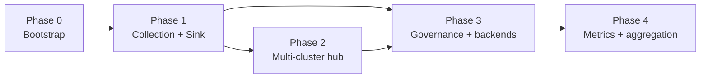

# kollect roadmap

Phased delivery plan for [kollect](https://github.com/konih/kollect) — a Kubernetes inventory
operator that watches arbitrary GVKs, aggregates extracted attributes, and exports to pluggable
sinks (Git, object storage, metrics) with a read-only HTTP API for portals.

**Last updated:** 2026-06-05

## Status legend

| Mark | Meaning |
| --- | --- |
| ✅ | Done |
| 🚧 | In progress |
| ⬜ | Planned |
| 🔮 | Deferred |
| ❓ | Open decision |

## Phase overview

| Phase | Focus | Summary |
| --- | --- | --- |
| **0** | Bootstrap | Scaffold, guidelines, ADRs, Helm, CI, webhooks, metrics, docs |
| **1** | Collection + Sink | Dynamic informers, CEL/JSONPath, namespaced inventory, Git/HTTP export |
| **2** | Multi-cluster | `KollectHub` CRD, spoke agents, lean queue fan-in |
| **3** | Governance + backends | `KollectScope`, S3/GCS/Prometheus, cluster inventory |
| **4** | Metrics + aggregation | kube-state-metrics-style config, richer rollups |

See [ARCHITECTURE.md](ARCHITECTURE.md), [REQUIREMENTS.md](REQUIREMENTS.md), and
[adr/README.md](adr/README.md) for design detail.

---

## Phase 0 — Bootstrap

| Item | Status |
| --- | --- |
| Kubebuilder v4 project scaffold | ✅ |
| MIT license | ✅ |
| CRDs: `KollectProfile`, `KollectSink`, `KollectTarget`, `KollectInventory` | ✅ |
| Taskfile, verify gate, golangci-lint, pre-commit, gitleaks | ✅ |
| CI: preflight, verify, lint, test, build, container image | ✅ |
| Helm chart (`charts/kollect/`) | ✅ |
| Helm docs / unittest / `values.schema.json` in CI | ⬜ |
| Core documentation + MkDocs (GitHub Pages) | ✅ |
| Architecture Decision Records (core set) | 🚧 |
| `GUIDELINES.md`, `SECURITY.md`, `CONTRIBUTING.md` | ✅ |
| Validating webhook — Profile CEL/JSONPath | ✅ |
| Validating webhook — Sink type enum | ⬜ |
| Prometheus custom metrics (early) | 🚧 |
| Connection test infrastructure | 🚧 |
| Golden OpenAPI contract tests (`test/schema/`) | ⬜ |
| Kind smoke / operator deploy | ✅ |
| Release pipeline (SBOM, signing) | ⬜ |
| Public demo Git inventory repo | ✅ |

**Counts:** ✅ 14 · 🚧 3 · ⬜ 6

---

## Phase 1 — Collection + Sink + HTTP

| Item | Status |
| --- | --- |
| CEL + JSONPath attribute extractor | ✅ |
| Dynamic informer engine (per Profile GVK) | ✅ |
| In-memory collection store + namespace aggregation | ✅ |
| `KollectTarget` controller | 🚧 |
| `KollectInventory` controller (namespaced rollup + export) | 🚧 |
| Event-driven path: informer changes → inventory export | ⬜ |
| Sink registry (factory by `type`) | ✅ |
| Git sink with custom CA TLS | ✅ |
| GitLab sink | ⬜ |
| S3 sink | 🚧 |
| SAR / RBAC scope degradation | ⬜ |
| Typed reconcile errors + circuit breakers | ⬜ |
| Secondary watches (Profile/Sink changes) | ⬜ |
| Finalizers | ⬜ |
| Read-only HTTP `GET /inventory` | 🚧 |
| Full Prometheus metrics per [ADR-0020](adr/0020-error-taxonomy.md) | ⬜ |
| Sample profiles: Deployment, Service, Ingress | ✅ |
| Sample: generic CRD | ⬜ |
| Sample contract tests in CI | 🚧 |
| Integration tests (testcontainers) in CI | ⬜ |
| End-to-end: install → collect → export → HTTP | 🚧 |
| `spec.suspend` on reconciled kinds | 🚧 |

**Counts:** ✅ 8 · 🚧 9 · ⬜ 18 · 🔮 2

---

## Phase 2 — Hub / multi-cluster

Multi-cluster support must **not** block single-cluster installs. See
[ADR-0022](adr/0022-multi-cluster-sync-rfc.md) and
[ADR-0023](adr/0023-lean-queue-transport.md).

| Item | Status |
| --- | --- |
| Multi-cluster topology RFC | ✅ |
| Lean queue transport ADR | ✅ |
| `KollectHub` CRD (hub Deployment + queue) | ⬜ |
| Spoke operator / agent snapshot reports | ⬜ |
| Hub merge and deduplication | ⬜ |
| Transport: in-process (dev/test) | 🚧 |
| Transport: NATS JetStream or Redis Streams | ⬜ |
| Kafka backend (optional) | 🔮 |
| Cross-cluster authentication | ❓ |
| `KollectPublication` (doc-sync) | 🔮 |

**Counts:** ✅ 3 · 🚧 1 · ⬜ 8 · 🔮 2 · ❓ 1

---

## Phase 3 — Governance + backends

| Item | Status |
| --- | --- |
| `KollectScope` (namespaced tenancy boundary) | ⬜ |
| `KollectClusterScope` (platform teams) | 🔮 |
| `KollectClusterInventory` (platform rollup) | ⬜ |
| GCS sink | ⬜ |
| Prometheus export sink | ⬜ |
| S3 sink CI hardening | 🚧 |
| `KollectReceiver` / `KollectTargetSet` (design only) | 🔮 |

**Counts:** ⬜ 6 · 🚧 1 · 🔮 4 · ❓ 1

---

## Phase 4 — Metrics + aggregation

| Item | Status |
| --- | --- |
| kube-state-metrics-style custom resource metrics config | ⬜ |
| Cardinality-safe operator metrics (counts, export latency) | ⬜ |
| Advanced cross-target / cross-cluster aggregation | ⬜ |

**Counts:** ⬜ 4

---

## Deferred

| Item | Rationale |
| --- | --- |
| `KollectPublication` (Confluence, Go templates) | Ship after collection and sinks are mature |
| Kafka as required hub transport | Lean queue first; Kafka optional only |
| `KollectReceiver`, `KollectTargetSet` implementation | Reserved for future phases |
| oauth2-proxy on HTTP API | After core HTTP export is complete |
| Helm release inventory sample | Requires secret-adjacent field redaction |

## Open questions

- **NATS vs Redis Streams** — pick default hub transport after Phase 2 spike
- **Connection test CR** vs annotation-only trigger on Sink/Inventory
- **Cluster vs namespaced sink** split timing (`KollectClusterSink`)
- **Operator deployment model** — one cluster-scoped operator vs namespaced per team
- **Cross-cluster identity** — mTLS, OIDC, or bootstrap tokens

## Breaking changes

### Namespaced `KollectInventory` (2026-06-05)

`KollectInventory` is **namespaced**. Each team owns an inventory object in their namespace that
aggregates `KollectTarget`s in the same namespace. Platform-wide rollup is reserved for
`KollectClusterInventory` (cluster-scoped, not yet implemented).

Migration: replace cluster-scoped inventory manifests with namespaced equivalents; update RBAC to
namespace scope where appropriate.

## CI and end-to-end testing

| Item | Status |
| --- | --- |
| PR CI: gitleaks, verify, lint, unit tests, build | ✅ |
| Manual e2e workflow (`workflow_dispatch`) | ✅ |
| Nightly kind smoke (Helm install + sample CRs) | 🚧 |
| Full e2e: conditions, Git export, HTTP body | ⬜ |
| Integration tests in CI (testcontainers) | ⬜ |

## Multi-cluster decisions

| Decision | Status |
| --- | --- |
| Single-cluster MVP is the default install | Accepted |
| Namespaced inventory is the hub input contract | Accepted |
| Hub-and-spoke via **`KollectHub` CRD** (declarative Deployment + queue) | Proposed |
| Transport: in-process → NATS or Redis → optional Kafka | Proposed |
| Git, object storage, and agent mesh documented as alternatives | Accepted |

## Further reading

- [Product requirements](REQUIREMENTS.md)
- [Architecture](ARCHITECTURE.md)
- [ADR-0004: CRD model](adr/0004-crd-model.md)
- [ADR-0006: etcd limit + HTTP API](adr/0006-etcd-limit.md)
- [ADR-0014: Event-driven informers](adr/0014-event-driven-informers.md)
- [ADR-0022: Multi-cluster RFC](adr/0022-multi-cluster-sync-rfc.md)
- [ADR-0023: Lean queue transport](adr/0023-lean-queue-transport.md)
