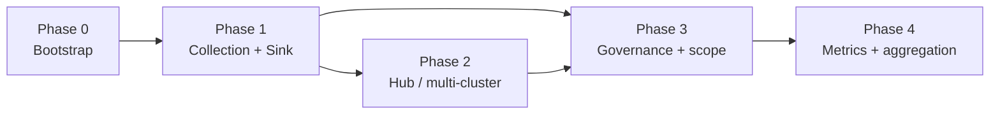

# kollect roadmap

Phased delivery plan for [kollect](https://github.com/konih/kollect) — a Kubernetes inventory
operator that watches arbitrary GVKs, aggregates extracted attributes, and exports to **role-based
pluggable sinks** — state stores (Git / object store, Postgres) and event emitters (NATS default,
Kafka opt-in) — with optional HTTP for debug. The in-memory snapshot is canonical; every sink is a
projection ([ADR-0401](adr/0401-sink-taxonomy-state-vs-stream.md)).

**Build order, not releases** — see [PLATFORM-DECISIONS.md](PLATFORM-DECISIONS.md), [ADR-0703](adr/0703-platform-architecture-pivot.md).

!!! warning "Pre-beta"
    kollect is not GA. API shapes, sink backends, and hub transport may change until the project
    reaches beta-quality overall. Check status marks (✅ / 🚧 / ⬜) before relying on a feature in
    production.

!!! info "Phases vs releases"
    Phases describe **implementation order**, not semver milestones. Items may land out of phase
    when dependencies allow; deferred (🔮) items are explicitly not on the near-term path.

**Last updated:** 2026-06-05 (sink taxonomy locked — [ADR-0401](adr/0401-sink-taxonomy-state-vs-stream.md);
ADR corpus renumbered into thematic ranges + 8 gap-fill ADRs)

## Status legend

| Mark | Meaning |
| --- | --- |
| ✅ | Done |
| 🚧 | In progress |
| ⬜ | Planned |
| 🔮 | Deferred |
| ❓ | Open decision |

## Phase overview

| Phase | Focus | Summary |
| --- | --- | --- |
| **0** | Bootstrap | Scaffold, guidelines, ADRs, Helm, CI, webhooks, metrics, docs |
| **1** | Collection + Sink | MVP: namespaced CRDs, export to role-based sinks (state store / event emitter); optional HTTP |
| **2** | Multi-cluster | Helm `mode: hub\|spoke`, merge lib, pluggable queue (no hub CRD) |
| **3** | Governance | `KollectScope`, cluster inventory APIs, S3/GCS hardening |
| **4** | Metrics + aggregation | kube-state-metrics-style config, richer rollups |

See [ARCHITECTURE.md](ARCHITECTURE.md), [REQUIREMENTS.md](REQUIREMENTS.md), and
[adr/README.md](adr/README.md) for design detail.

---

## Phase 0 — Bootstrap

| Item | Status |
| --- | --- |
| Kubebuilder v4 project scaffold | ✅ |
| MIT license | ✅ |
| CRDs: `KollectProfile`, `KollectSink`, `KollectTarget`, `KollectInventory` | ✅ |
| Taskfile, verify gate, golangci-lint, pre-commit, gitleaks | ✅ |
| CI: preflight, verify, lint, test, build, container image | ✅ |
| Helm chart (`charts/kollect/`) | ✅ |
| Helm `values.schema.json` + unittest in CI | ✅ |
| Helm docs generation (`helm-docs`) | ⬜ |
| Core documentation + MkDocs (GitHub Pages) | ✅ |
| CR reference guide (`docs/crds/`, failure modes) | ✅ |
| Data flows (`DATA-FLOWS.md`) | ✅ |
| Architecture Decision Records (34, thematic `0Txx` ranges) | ✅ |
| ADR-0603 performance & scalability | ✅ |
| `GUIDELINES.md`, `SECURITY.md`, `CONTRIBUTING.md` | ✅ |
| Validating webhook — Profile CEL/JSONPath | ✅ |
| Validating webhook — Profile Secret.data guard | ✅ |
| Validating webhook — Sink type enum | ⬜ |
| Prometheus custom metrics (early) | ✅ |
| Connection test infrastructure | ✅ ([ADR-0403](adr/0403-connection-test.md)) |
| Namespaced `KollectProfile` API | ✅ ([ADR-0204](adr/0204-namespaced-profiles.md)) |
| Golden OpenAPI contract tests (`test/schema/`, 7 kinds) | ✅ |
| Kind smoke / operator deploy | ✅ |
| Release pipeline (SBOM, signing) | 🚧 local dry-run PASS; GH `workflow_dispatch` untested |
| Public demo Git inventory repo | ✅ |

**Counts:** ✅ 20 · 🚧 1 · ⬜ 2

---

## Phase 1 — Collection + Sink + HTTP

| Item | Status |
| --- | --- |
| CEL + JSONPath attribute extractor | ✅ |
| Dynamic informer engine (per Profile GVK) | ✅ |
| In-memory collection store + namespace aggregation | ✅ |
| `KollectTarget` controller | ✅ |
| `KollectInventory` controller (namespaced rollup + export) | ✅ |
| Event-driven path: informer changes → inventory export | 🚧 |
| Sink registry (factory by `type`) | ✅ |
| Git sink with custom CA TLS | ✅ |
| GitLab sink (`tls.caSecretRef` for internal CA) | ✅ REST client + MR wire + feature-branch push |
| S3 sink | 🚧 (MinIO integration; nightly + PR `test-integration`) |
| S3/GCS **Parquet** snapshot sink (DuckDB-queryable, no DB server) | ⬜ [ADR-0401](adr/0401-sink-taxonomy-state-vs-stream.md) |
| Postgres sink (`type: postgres`) | ✅ |
| Postgres **delete reconciliation** (stale-row fix) | ✅ [ADR-0401](adr/0401-sink-taxonomy-state-vs-stream.md) |
| Kafka export sink (`type: kafka`) | ✅ |
| **NATS JetStream** emitter (`type: nats`, lean default) | ⬜ [ADR-0401](adr/0401-sink-taxonomy-state-vs-stream.md) |
| Postgres/Kafka testcontainers in CI | ✅ |
| SAR / RBAC scope degradation | ✅ |
| Typed reconcile errors + circuit breakers | 🚧 |
| Parallel reconcile workers (`MaxConcurrentReconciles`) | ✅ |
| Workqueue depth + reconcile latency metrics | ✅ |
| pprof server (feature-gated `:6060`) | ✅ |
| `task bench` / `task load-test` (bounded scale tests) | ✅ |
| Secondary watches (Profile → Targets, Sink → Inventories) | ✅ |
| Finalizers | ⬜ |
| Read-only HTTP `GET /v1alpha1/inventory` (+ OpenAPI; SSE watch) | 🚧 |
| Inventory HTTP auth: TokenReview + SAR (K8s bearer) | ✅ |
| `--inventory-auth-mode=kubernetes` (default) | ✅ |
| Full Prometheus metrics per [ADR-0602](adr/0602-error-taxonomy.md) | ✅ |
| Sample profiles: Deployment, Service, Ingress | ✅ |
| Sample profile: Helm release summary (**Argo `Application` primary**) | ✅ |
| Argo `Application` contract test (`internal/collect/`) | ✅ |
| Sample profile: Helm release summary (Flux `HelmRelease` secondary) | ✅ |
| Helm values profile + operator scrub | ⬜ |
| `helm:` decode for `helm.sh/v1` Secret releases | ⬜ |
| Sample: generic CRD (`cert-manager.io/Certificate` + contract test) | ✅ |
| Sample contract tests in CI | 🚧 |
| Integration tests (testcontainers) in CI | ✅ |
| End-to-end: install → collect → export → HTTP | ✅ (kind smoke green — run `26996964559` @ `42183693`) |
| `spec.suspend` on reconciled kinds | ✅ |
| **Multi-tenant (ASAP):** `watchNamespaces` / `tenantMode` Helm + `--watch-namespaces` | ✅ |
| **Multi-tenant:** `KollectScope` webhook + reconciler enforcement + sample | ✅ |
| **Multi-tenant e2e:** dynamic `kollect-tenant-a` / `kollect-tenant-b` isolation | ✅ |
| Inventory namespace isolation unit tests | ✅ |

**Counts:** ✅ 29 · 🚧 5 · ⬜ 5

---

## Phase 2 — Hub / multi-cluster

Multi-cluster support must **not** block single-cluster installs. Design for **many clusters**
(hub scale targets in [ADR-0603](adr/0603-performance-scalability.md)) and **giant spokes**
(10k+ resources). Hub **shards and aggregates** —
never O(spokes²). See [ADR-0501](adr/0501-multi-cluster-sync-rfc.md) and
[ADR-0502](adr/0502-lean-queue-transport.md).

| Item | Status |
| --- | --- |
| Multi-cluster topology RFC | ✅ |
| Lean queue transport ADR (pluggable factory) | ✅ |
| `KollectHub` CRD (rejected) → **Helm `mode: hub`** | ✅ ADR-0703 |
| Spoke operator / agent snapshot reports (lightweight, delta) | ✅ |
| Hub merge and deduplication (O(rows), sharded consumers) | ✅ |
| Hub Postgres + Kafka parallel export on ingest | ✅ |
| Transport: in-process (dev/test default) | ✅ |
| Transport: Redis Streams (Phase 2 spike, explicit opt-in) | ✅ |
| Transport: NATS JetStream (config alternative) | ✅ |
| Transport: Kafka backend (optional, integration-tested) | ✅ |
| Cross-cluster authentication (Istio-style + push TokenReview) | ✅ |
| `KollectRemoteCluster` CRD (hub registration stub) | ✅ |
| Spoke HTTP push auth (`Bearer` + `X-Kollect-Cluster-Id`) | ✅ |
| Hub ingest HTTP (`POST /hub/v1alpha1/reports`) | ✅ |
| Hub pull via `credentialsSecretRef` (optional ADR-0503) | ✅ |
| Hub Helm values / flags for transport + shard (no hub CRD) | ✅ |
| Queue transport TLS/ACL hardening | 🚧 (TLS shipped; ACL allowlist stub) |

**Counts:** ✅ 15 · 🚧 1

---

## Phase 3 — Governance + backends

| Item | Status |
| --- | --- |
| `KollectScope` reconciler-time enforcement | ✅ |
| `KollectScope` admission webhook | ✅ |
| `KollectClusterScope` (platform teams) | 🔮 |
| `KollectClusterTarget` API + webhook | ✅ |
| `KollectClusterProfile` API + webhook (no controller) | ✅ |
| `KollectClusterInventory` API + webhook | ✅ |
| `KollectClusterTarget` controller (engine + namespaceSelector) | ✅ |
| `KollectClusterInventory` controller (rollup + export to sinks) | ✅ |
| `KollectClusterSink` / namespaced sink split | 🔮 |
| GCS sink | ✅ |
| S3/GCS object-store CI gate (integration + nightly) | ✅ |
| Generic CRD proof (`cert-manager.io/Certificate` e2e) | ✅ |
| `KollectReceiver` / `KollectTargetSet` (design only) | 🔮 |

### Phase 3 exit criteria (before Phase 4 aggregation)

| Criterion | Status |
| --- | --- |
| Hub ingest → Postgres **and** Kafka parallel export | ✅ |
| `KollectClusterInventory` rollup + export to namespaced sinks | ✅ |
| `KollectClusterTarget` engine end-to-end | ✅ |
| `KollectClusterProfile` stub + profileRef resolution | ✅ |
| Generic CRD proof (`cert-manager.io/Certificate`) | ✅ |
| GitLab sink enterprise path (MR/API) | ✅ feature-branch push + REST MR client |
| S3/GCS production CI gate | ✅ PR integration + nightly |
| Scope at platform boundary (multitenant e2e) | ✅ |
| Release `workflow_dispatch` dry-run (cosign/SBOM/chart) | 🚧 local PASS; GH Actions untested |
| E2E asserts export (Target Ready, sink conditions, git SHA) | ✅ `68667ca6` — export asserts + multitenant + cert-manager |
| No `KollectPublication` | ✅ ADR-0702 honored |

**Counts:** ✅ 12 · 🚧 1 · 🔮 3

---

## Phase 4 — Metrics + aggregation

| Item | Status |
| --- | --- |
| kube-state-metrics-style custom resource metrics config | ✅ [ADR-0304](adr/0304-custom-resource-aggregation-rfc.md) — `KollectProfile.spec.metrics` spike + admission validation |
| Collect engine → `RecordCustomResourceSeries` on target snapshot | ✅ configured paths or auto-sum fallback + `object_count` per profile/GVK |
| `spec.metrics[].labels` → `kollect_custom_resource_labeled_series` | ✅ per-label-tuple sums on target snapshot |
| Hub spoke merge metrics (`kollect_hub_spoke_reports_total`, `kollect_hub_merged_items_total`) | ✅ consumer + HTTP ingest |
| Cardinality-safe operator metrics (counts, export latency) | ✅ ADR-0602 catalog complete |
| Cross-target dedupe spike (`internal/aggregate/`) | ✅ row identity, `DedupeByResourceUID`, `ExportCoalesce` checksum skip |
| Advanced cross-target / cross-cluster aggregation (controller wire) | ✅ `KollectClusterInventory` — `MergeRows` + `ExportCoalesce` |
| `task perf-report` optional CI gate | ✅ `ci.yaml` job + preflight note |

**Counts:** ✅ 8 · ⬜ 0

---

## Read API + UI console (planned — [ADR-0408](adr/0408-read-api-ui-architecture.md))

A read-only web console (searchable inventory catalog, export/freshness health, multi-cluster rollup,
attribute drift over time) is the priority adoption lever after v0.1.0. The UI depends only on a
**versioned Read API** with a **pluggable backing store** (memory → Postgres → Parquet), so the same
SPA serves a zero-infra console and a scale portal — and never reads the live cluster API.

| Milestone | Item | Status |
| --- | --- | --- |
| **v0.1.0** | Harden + freeze the Read API as the UI contract (filters, `schemaVersion`, OpenAPI) | ⬜ |
| **v0.2.0** | Read-only SPA on the **memory adapter** (operator-served, feature-gated): catalog, search/filter, freshness/health | ⬜ |
| **v0.3.0+** | Portal mode on **Postgres/Parquet** adapter; **drift-over-time** views; optional `kollect-server` split | ⬜ |

---

## Performance and scalability

Cross-cutting NFRs accepted in [ADR-0603](adr/0603-performance-scalability.md). Tuning guide:
[PERFORMANCE.md](PERFORMANCE.md).

### Scale targets

| Target | Value | ADR |
| --- | --- | --- |
| Watched objects per spoke (baseline) | **10,000+** | [ADR-0603](adr/0603-performance-scalability.md) |
| Giant single cluster | 1000+ nodes, 10k+ resources | [ADR-0603](adr/0603-performance-scalability.md) |
| Hub spoke count | many spokes (see [ADR-0603](adr/0603-performance-scalability.md)) | [ADR-0501](adr/0501-multi-cluster-sync-rfc.md) |
| Spoke working set (typical profiles) | ≤512 MiB at 10k rows | [ADR-0603](adr/0603-performance-scalability.md) |
| Hub merge complexity | O(total rows), sharded | [ADR-0501](adr/0501-multi-cluster-sync-rfc.md) |

### Developer perf tooling

| Item | Status |
| --- | --- |
| Metrics catalog + PromQL hints in PERFORMANCE.md | ✅ |
| `task perf-report` + `hack/perf-report.sh` | ✅ |
| `artifacts/bench/` from `task bench` | ✅ |
| CI upload of bench artifacts (nightly, optional) | ✅ nightly bench + perf-report |
| `task perf-report` optional CI job | ✅ non-blocking `ci.yaml` job |

**Counts:** ✅ 3 · 🚧 1

### Operator tuning and tests

| Item | Status |
| --- | --- |
| Scale target documented (10k+ objects per spoke) | ✅ |
| Hub-scale path documented | ✅ |
| Bounded test tiers (500 default / 2000 opt-in load) | ✅ |
| `task bench` (Go benchmarks, `-short`) | ✅ |
| `task load-test` (`KOLECT_LOAD_TEST=1`, `-tags=load`) | ✅ |
| `--max-concurrent-reconciles-*` flags + Helm values | ✅ |
| **`spec.exportMinInterval`** per Inventory (default 30s) | ✅ |
| `--reconcile-rate-limit` flag | ✅ |
| `--informer-resync-period` flag | ⬜ |
| pprof on `:6060` (feature gate) | ✅ |
| `kollect_workqueue_depth` / `kollect_reconcile_duration_seconds` metrics | ✅ |
| `kollect_informer_objects` / `kollect_export_bytes_total` metrics | ✅ |
| `BenchmarkExtract` in `internal/collect/` | ✅ |
| envtest synthetic scale harness (cap 500) | ✅ |
| Load test package (`test/load/`, `-tags=load`) | ✅ |

**Counts:** ✅ 16 · ⬜ 1

---

## Rejected

| Item | Rationale |
| --- | --- |
| `KollectPublication` (Confluence, Go templates, doc-sync) | Out of scope — external CI over Git/Kafka export ([ADR-0702](adr/0702-doc-sync-templating.md)) |
| `KollectSink.type: prometheus` | Operator `/metrics` only — not an inventory export sink ([ADR-0601](adr/0601-prometheus-metrics-stub.md)) |

## Deferred

| Item | When |
| --- | --- |
| `KollectClusterSink` + namespaced `KollectSink` split | Phase 3 — cluster-scoped sinks + `KollectScope.sinkRefs` until then ([ADR-0204](adr/0204-namespaced-profiles.md)) |
| Kafka as **required** hub transport | Pluggable optional backend only; `inprocess` default ([ADR-0502](adr/0502-lean-queue-transport.md)) |
| `KollectReceiver`, `KollectTargetSet` implementation | Reserved for future phases |
| oauth2-proxy sidecar (OIDC browser auth) | Optional Helm sidecar (`oauth2Proxy.enabled: false`); K8s bearer auth is primary — [ADR-0404](adr/0404-inventory-api-auth.md) |
| Hub federated mTLS | ADR-0503 deferred — push TokenReview default |
| Queue transport TLS/ACL production hardening | Beyond `cluster_id` wire metadata |

## Resolved questions

- ✅ **Hub ingest SAR shape** — `create` on `kollectremoteclusters` locked ([ADR-0503](adr/0503-hub-cluster-auth-istio-pattern.md))
- ✅ **SinkReachable** on Inventory/Target — implemented with `Synced` export conditions ([ADR-0403](adr/0403-connection-test.md))

See [PLATFORM-DECISIONS.md](PLATFORM-DECISIONS.md) for locked vs still-open items.

## Breaking changes

### Namespaced `KollectInventory` (2026-06-05)

`KollectInventory` is **namespaced**. Each team owns an inventory object in their namespace that
aggregates `KollectTarget`s in the same namespace. Platform-wide rollup uses
`KollectClusterInventory` (cluster-scoped rollup + export shipped).

Migration: replace cluster-scoped inventory manifests with namespaced equivalents; update RBAC to
namespace scope where appropriate.

### Namespaced `KollectProfile` (2026-06-05)

`KollectProfile` is **namespaced**. Each `KollectTarget.spec.profileRef` resolves a profile in the
**same namespace** as the Target. Platform-wide shared schemas use `KollectClusterProfile`
(cluster-scoped API shipped; controller pending).

Migration: re-apply profile manifests into each team namespace (or use GitOps templating). Remove
cluster-scoped profile objects before upgrade.

### Namespaced `KollectSink` (2026-06-05)

`KollectSink` is **namespaced** (breaking — was cluster-scoped). Each `KollectInventory.spec.sinkRefs`
entry resolves a sink in the **same namespace** as the Inventory. Cross-namespace sink refs are
forbidden (webhook rejects `namespace/name`). Platform-shared backends are reserved for
`KollectClusterSink` (not yet implemented).

Migration: re-apply sink manifests into each team namespace alongside profiles and inventories.
Remove cluster-scoped sink objects before upgrade. Update `KollectScope.spec.sinkRefs` allowlists
to names in the scope namespace.

## GitLab sink — merge request workflow

Scaffold (`553117cc`) reuses the shared **HTTPS git push** path: `internal/sink/gitlab` resolves
`spec.endpoint` + `tls.caSecretRef` / `caBundle`, then delegates to `internal/sink/git.Export`
(direct push to the default branch). Connection probe runs `git ls-remote` with custom CA trust.

**Partial** — CRD + validation + export wire + REST client + feature-branch git push landed:

| Gap | Status |
| --- | --- |
| **CRD fields** | ✅ `spec.gitlab.mergeRequest` (mode `direct` \| `merge_request`), `targetBranch`, `branchPrefix`, `titleTemplate`, `autoMerge` |
| **Branch + push** | ✅ `merge_request` mode clones `targetBranch`, pushes feature branch via `git.ExportWithBranch` |
| **GitLab REST API v4** | ✅ `RESTClient` list/create MR; `EnsureMergeRequest` after export when token + `merge_request` mode |
| **Token scopes** | ✅ document `write_repository` + `api` in sink CR reference |
| **Export integration** | ✅ `Backend.Export` pushes feature branch then calls `EnsureMergeRequest` |
| **Integration test** | ✅ httptest MR client unit tests + file-remote feature-branch export test |
| **Hub/cluster sinks** | Same contract applies to `KollectClusterSink` when implemented (Phase 3) |

**Default:** `direct` mode pushes to the default branch. `merge_request` mode opens/updates an MR via
GitLab API v4 when `secretRef` provides an API token (`token` or `password` key).

## CI and end-to-end testing

| Item | Status |
| --- | --- |
| PR CI: gitleaks, verify, lint, unit tests, build | ✅ |
| PR CI: integration (testcontainers) | ✅ |
| PR CI: Helm lint + unittest | ✅ |
| Manual e2e workflow (`workflow_dispatch`, kind smoke parity) | ✅ |
| Nightly kind smoke (Helm + samples + cert-manager CRD + HTTP probe) | ✅ |
| Full e2e: conditions, Git export SHA, HTTP body, multitenant | ✅ |
| Object store sinks (S3/GCS MinIO) in PR integration + nightly | ✅ |
| Release workflow (`workflow_dispatch` dry-run) | 🚧 `task release-dry-run` PASS locally; GH Actions rc via `workflow_dispatch` (see [RELEASE.md](RELEASE.md#rc-pre-release-on-github-actions)) |

## Architecture decisions (2026-06-05)

Full locked table: **[PLATFORM-DECISIONS.md](PLATFORM-DECISIONS.md)**.

| Decision | Status |
| --- | --- |
| Single-cluster MVP is the default install | Accepted |
| Namespaced inventory is the hub input contract | Accepted |
| **`KollectProfile` namespaced**; `KollectClusterProfile` reserved | Accepted ([ADR-0204](adr/0204-namespaced-profiles.md)) |
| **`KollectScope` Phase 1** — webhook + reconciler enforcement | Accepted ([ADR-0203](adr/0203-namespaced-multi-tenancy.md)) |
| **No `KollectHub` CRD** — Helm `mode: hub\|spoke` | Accepted ([ADR-0703](adr/0703-platform-architecture-pivot.md)) |
| **Namespaced `KollectSink`**; `KollectClusterSink` reserved | Accepted ([ADR-0703](adr/0703-platform-architecture-pivot.md)) |
| **Role-based sinks** — state stores (Git/object store, Postgres) vs event emitters (NATS default, Kafka opt-in); no single "primary"; HTTP debug optional | Accepted ([ADR-0401](adr/0401-sink-taxonomy-state-vs-stream.md)) |
| **`KollectConnectionTest` CR** + **`spec.ttlSecondsAfterFinished`** default **300s** | Accepted ([ADR-0703](adr/0703-platform-architecture-pivot.md)) |
| **`spec.exportMinInterval`** default **30s** (not global debounce flag) | Accepted ([ADR-0703](adr/0703-platform-architecture-pivot.md)) |
| HTTP **`GET /v1alpha1/inventory`** + **`openapi/v1alpha1/inventory.yaml`** when enabled | Accepted ([ADR-0103](adr/0103-etcd-limit.md), [ADR-0404](adr/0404-inventory-api-auth.md)) |
| Inventory SAR: **`get`/`list`** on `kollectinventories`; TokenReview cache **30s** | Accepted ([ADR-0404](adr/0404-inventory-api-auth.md)) |
| **`maxExportBytes`** global + per-Inventory override (webhook capped) | Accepted ([ADR-0103](adr/0103-etcd-limit.md)) |
| Postgres PK **`(inventory_namespace, inventory_name, target_name, source_uid)`** | Accepted ([ADR-0402](adr/0402-sink-backends-database-kafka.md)) |
| **`kollect_sink_errors_total{reason}`** + export histogram buckets (ADR-0602) | Accepted |
| Hub shard: **`hash(clusterName) % shardCount`** via Helm/env — **no `KollectHub` CRD** | Accepted ([ADR-0703](adr/0703-platform-architecture-pivot.md)) |
| Hub federated mTLS | **Deferred** ([ADR-0503](adr/0503-hub-cluster-auth-istio-pattern.md)) |
| **`KollectClusterInventory`** + **`KollectClusterTarget`** rollup (no `inventoryRef` hack) | Accepted ([ADR-0703](adr/0703-platform-architecture-pivot.md)) |
| Same image **`mode: hub\|spoke`** | Accepted ([ADR-0501](adr/0501-multi-cluster-sync-rfc.md)) |
| Transport: **`inprocess` only default**; Redis/NATS/Kafka explicit opt-in | Accepted ([ADR-0502](adr/0502-lean-queue-transport.md)) |
| Transport backend rule: no merge without integration/e2e proof | Accepted |
| Connection test: **`KollectConnectionTest` CR** + sink probes; prod `connectionTest: false` | Accepted ([ADR-0703](adr/0703-platform-architecture-pivot.md)) |
| Helm sample: **Argo `Application` primary** + contract test | Accepted ([ADR-0303](adr/0303-helm-release-inventory.md)) |
| Generic CRD sample: **`cert-manager.io/Certificate`** + contract test | Accepted |
| Default install: **`tenantMode: true`** per-team | Accepted ([ADR-0203](adr/0203-namespaced-multi-tenancy.md)) |
| Shared informer per GVK | Accepted ([ADR-0301](adr/0301-event-driven-informers.md)) |
| Postgres (relational SoR) + Kafka (event emitter) as first-class sinks; in-memory snapshot canonical, sinks are projections | Accepted ([ADR-0401](adr/0401-sink-taxonomy-state-vs-stream.md), [ADR-0402](adr/0402-sink-backends-database-kafka.md)) |
| Doc-sync / `KollectPublication` | Rejected ([ADR-0702](adr/0702-doc-sync-templating.md)) |
| **Read API + read-only UI console** — versioned API, pluggable backing store (memory→Postgres→Parquet); SPA reads the read model, never live API | Accepted, planned v0.2/v0.3 ([ADR-0408](adr/0408-read-api-ui-architecture.md)) |
| Inventory HTTP auth: **K8s TokenReview + SAR**; `--inventory-auth-mode=kubernetes` default | Accepted |
| oauth2-proxy: **optional** Helm sidecar for OIDC browsers; not primary auth | Accepted |
| Git, object storage, and agent mesh documented as alternatives | Accepted |
| Extreme scale: many clusters, 10k+ objects/spoke, hub shard not O(n²) | Accepted ([ADR-0501](adr/0501-multi-cluster-sync-rfc.md), [ADR-0603](adr/0603-performance-scalability.md)) |
| Hub cluster auth: **Istio remote-secret registration + push TokenReview** | Accepted ([ADR-0503](adr/0503-hub-cluster-auth-istio-pattern.md)) |
| Namespaced `KollectProfile`; `profileRef` same namespace | Accepted ([ADR-0204](adr/0204-namespaced-profiles.md)) |
| **`KollectClusterSink` deferred Phase 3** | Deferred |

## Further reading

- [Platform decisions (2026-06-05)](PLATFORM-DECISIONS.md)
- [Product requirements](REQUIREMENTS.md)
- [Architecture](ARCHITECTURE.md)
- [Helm chart README](../charts/kollect/README.md) — inventory HTTP auth
- [ADR-0201: CRD model](adr/0201-crd-model.md)
- [ADR-0103: etcd limit + HTTP API](adr/0103-etcd-limit.md)
- [ADR-0301: Event-driven informers](adr/0301-event-driven-informers.md)
- [ADR-0501: Multi-cluster RFC](adr/0501-multi-cluster-sync-rfc.md)
- [ADR-0502: Lean queue transport](adr/0502-lean-queue-transport.md)
- [ADR-0404: Inventory API auth](adr/0404-inventory-api-auth.md)
- [ADR-0702: Doc-sync rejected](adr/0702-doc-sync-templating.md)
- [ADR-0402: Postgres and Kafka sinks](adr/0402-sink-backends-database-kafka.md)
- [ADR-0603: Performance and scalability](adr/0603-performance-scalability.md)
- [PERFORMANCE.md](PERFORMANCE.md) — tuning guide and metrics catalog
