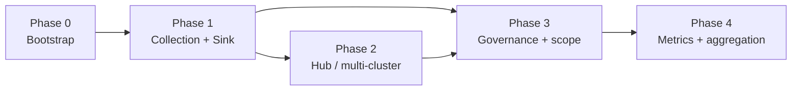

# kollect roadmap

Phased delivery plan for [kollect](https://github.com/konih/kollect) — a Kubernetes inventory
operator that watches arbitrary GVKs, aggregates extracted attributes, and exports to pluggable
sinks (Git, object storage, Postgres, Kafka) with a read-only HTTP API for portals.

**Last updated:** 2026-06-05

## Status legend

| Mark | Meaning |
| --- | --- |
| ✅ | Done |
| 🚧 | In progress |
| ⬜ | Planned |
| 🔮 | Deferred |
| ❓ | Open decision |

## Phase overview

| Phase | Focus | Summary |
| --- | --- | --- |
| **0** | Bootstrap | Scaffold, guidelines, ADRs, Helm, CI, webhooks, metrics, docs |
| **1** | Collection + Sink | Dynamic informers, CEL/JSONPath, namespaced inventory, Git/HTTP export |
| **2** | Multi-cluster | `KollectHub` CRD, spoke agents, pluggable lean queue fan-in |
| **3** | Governance | `KollectScope`, S3/GCS hardening, cluster inventory |
| **4** | Metrics + aggregation | kube-state-metrics-style config, richer rollups |

See [ARCHITECTURE.md](ARCHITECTURE.md), [REQUIREMENTS.md](REQUIREMENTS.md), and
[adr/README.md](adr/README.md) for design detail.

---

## Phase 0 — Bootstrap

| Item | Status |
| --- | --- |
| Kubebuilder v4 project scaffold | ✅ |
| MIT license | ✅ |
| CRDs: `KollectProfile`, `KollectSink`, `KollectTarget`, `KollectInventory` | ✅ |
| Taskfile, verify gate, golangci-lint, pre-commit, gitleaks | ✅ |
| CI: preflight, verify, lint, test, build, container image | ✅ |
| Helm chart (`charts/kollect/`) | ✅ |
| Helm docs / unittest / `values.schema.json` in CI | ⬜ |
| Core documentation + MkDocs (GitHub Pages) | ✅ |
| Architecture Decision Records (core set) | 🚧 |
| ADR-0026 performance & scalability | ✅ |
| `GUIDELINES.md`, `SECURITY.md`, `CONTRIBUTING.md` | ✅ |
| Validating webhook — Profile CEL/JSONPath | ✅ |
| Validating webhook — Sink type enum | ⬜ |
| Prometheus custom metrics (early) | 🚧 |
| Connection test infrastructure | ✅ |
| Golden OpenAPI contract tests (`test/schema/`) | ⬜ |
| Kind smoke / operator deploy | ✅ |
| Release pipeline (SBOM, signing) | ⬜ |
| Public demo Git inventory repo | ✅ |

**Counts:** ✅ 14 · 🚧 2 · ⬜ 6

---

## Phase 1 — Collection + Sink + HTTP

| Item | Status |
| --- | --- |
| CEL + JSONPath attribute extractor | ✅ |
| Dynamic informer engine (per Profile GVK) | ✅ |
| In-memory collection store + namespace aggregation | ✅ |
| `KollectTarget` controller | ✅ |
| `KollectInventory` controller (namespaced rollup + export) | 🚧 |
| Event-driven path: informer changes → inventory export | 🚧 |
| Sink registry (factory by `type`) | ✅ |
| Git sink with custom CA TLS | ✅ |
| GitLab sink | ⬜ |
| S3 sink | 🚧 |
| Postgres sink (`type: postgres`) | ✅ |
| Kafka export sink (`type: kafka`) | ✅ |
| Postgres/Kafka testcontainers in CI | ✅ |
| SAR / RBAC scope degradation | ✅ |
| Typed reconcile errors + circuit breakers | ⬜ |
| Parallel reconcile workers (`MaxConcurrentReconciles`) | ✅ |
| Workqueue depth + reconcile latency metrics | ✅ |
| pprof server (feature-gated `:6060`) | ✅ |
| `task bench` / `task load-test` (bounded scale tests) | ✅ |
| Secondary watches (Profile/Sink changes) | ⬜ |
| Finalizers | ⬜ |
| Read-only HTTP `GET /inventory` (+ SSE watch) | ✅ |
| Inventory HTTP auth: TokenReview + SAR (K8s bearer) | ✅ |
| `--inventory-auth-mode=kubernetes` (default) | ✅ |
| Full Prometheus metrics per [ADR-0020](adr/0020-error-taxonomy.md) | ✅ |
| Sample profiles: Deployment, Service, Ingress | ✅ |
| Sample: generic CRD | ⬜ |
| Sample contract tests in CI | 🚧 |
| Integration tests (testcontainers) in CI | 🚧 |
| End-to-end: install → collect → export → HTTP | 🚧 |
| `spec.suspend` on reconciled kinds | ✅ |

**Counts:** ✅ 14 · 🚧 5 · ⬜ 12

---

## Phase 2 — Hub / multi-cluster

Multi-cluster support must **not** block single-cluster installs. See
[ADR-0022](adr/0022-multi-cluster-sync-rfc.md) and
[ADR-0023](adr/0023-lean-queue-transport.md).

| Item | Status |
| --- | --- |
| Multi-cluster topology RFC | ✅ |
| Lean queue transport ADR (pluggable factory) | ✅ |
| `KollectHub` CRD (`spec.transport.type`) | ✅ |
| Spoke operator / agent snapshot reports | ⬜ |
| Hub merge and deduplication | ⬜ |
| Transport: in-process (dev/test) | ✅ |
| Transport: Redis Streams (Phase 2 spike default) | ✅ |
| Transport: NATS JetStream (config alternative) | 🚧 |
| Transport: Kafka backend (optional, integration-tested) | 🔮 |
| Cross-cluster authentication | ❓ |

**Counts:** ✅ 6 · 🚧 1 · ⬜ 4 · ❓ 1

---

## Phase 3 — Governance + backends

| Item | Status |
| --- | --- |
| `KollectScope` (namespaced tenancy boundary) | ✅ |
| `KollectClusterScope` (platform teams) | 🔮 |
| `KollectClusterInventory` (platform rollup) | ⬜ |
| GCS sink | ✅ |
| S3 sink CI hardening | 🚧 |
| `KollectReceiver` / `KollectTargetSet` (design only) | 🔮 |

**Counts:** ✅ 2 · 🚧 1 · ⬜ 1 · 🔮 4 · ❓ 1

---

## Phase 4 — Metrics + aggregation

| Item | Status |
| --- | --- |
| kube-state-metrics-style custom resource metrics config | ⬜ |
| Cardinality-safe operator metrics (counts, export latency) | ✅ |
| Advanced cross-target / cross-cluster aggregation | ⬜ |

**Counts:** ✅ 1 · ⬜ 3

---

## Performance and scalability

Cross-cutting NFRs accepted in [ADR-0026](adr/0026-performance-scalability.md). Tuning guide:
[PERFORMANCE.md](PERFORMANCE.md).

| Item | Status |
| --- | --- |
| Scale target documented (10k+ objects) | ✅ |
| Bounded test tiers (500 default / 2000 opt-in load) | ✅ |
| `task bench` (Go benchmarks, `-short`) | ✅ |
| `task load-test` (`KOLECT_LOAD_TEST=1`, `-tags=load`) | ✅ |
| `--max-concurrent-reconciles-*` flags + Helm values | ✅ |
| `--export-debounce` / `--reconcile-rate-limit` flags | ✅ |
| `--informer-resync-period` flag | ⬜ |
| pprof on `:6060` (feature gate) | ✅ |
| `kollect_workqueue_depth` / `kollect_reconcile_duration_seconds` metrics | ✅ |
| `kollect_informer_objects` / `kollect_export_bytes_total` metrics | ✅ |
| `BenchmarkExtract` in `internal/collect/` | ✅ |
| envtest synthetic scale harness (cap 500) | ⬜ |
| Load test package (`test/load/`, `-tags=load`) | ✅ |

**Counts:** ✅ 11 · ⬜ 2

---

## Rejected

| Item | Rationale |
| --- | --- |
| `KollectPublication` (Confluence, Go templates, doc-sync) | Out of scope — external CI over Git/Kafka export ([ADR-0011](adr/0011-doc-sync-templating.md)) |
| `KollectSink.type: prometheus` | Operator `/metrics` only — not an inventory export sink ([ADR-0012](adr/0012-prometheus-metrics-stub.md)) |

## Deferred

| Item | Rationale |
| --- | --- |
| Kafka as **required** hub transport | Pluggable optional backend only; Redis spike first ([ADR-0023](adr/0023-lean-queue-transport.md)) |
| `KollectReceiver`, `KollectTargetSet` implementation | Reserved for future phases |
| oauth2-proxy sidecar (OIDC browser auth) | Optional Helm sidecar (`oauth2Proxy.enabled: false`); K8s bearer auth is primary — [ADR-0024](adr/0024-inventory-api-auth.md) |
| Helm release inventory sample | Requires secret-adjacent field redaction |

## Open questions

- **Connection test CR** vs annotation-only trigger on Sink/Inventory
- **Cluster vs namespaced sink** split timing (`KollectClusterSink`)
- **Operator deployment model** — one cluster-scoped operator vs namespaced per team
- **Cross-cluster identity** — mTLS, OIDC, or bootstrap tokens (hub/spoke; distinct from inventory HTTP auth)

## Breaking changes

### Namespaced `KollectInventory` (2026-06-05)

`KollectInventory` is **namespaced**. Each team owns an inventory object in their namespace that
aggregates `KollectTarget`s in the same namespace. Platform-wide rollup is reserved for
`KollectClusterInventory` (cluster-scoped, not yet implemented).

Migration: replace cluster-scoped inventory manifests with namespaced equivalents; update RBAC to
namespace scope where appropriate.

## CI and end-to-end testing

| Item | Status |
| --- | --- |
| PR CI: gitleaks, verify, lint, unit tests, build | ✅ |
| Manual e2e workflow (`workflow_dispatch`) | ✅ |
| Nightly kind smoke (Helm install + sample CRs + HTTP probe) | 🚧 |
| Full e2e: conditions, Git export, HTTP body | 🚧 |
| Integration tests in CI (testcontainers) | 🚧 |

## Architecture decisions (2026-06-05)

| Decision | Status |
| --- | --- |
| Single-cluster MVP is the default install | Accepted |
| Namespaced inventory is the hub input contract | Accepted |
| Hub-and-spoke via **`KollectHub` CRD** (declarative Deployment + queue) | Accepted |
| Transport: **`Transport` interface**; `inprocess` → **Redis** spike → NATS/Kafka via `spec.transport.type` | Accepted |
| Transport backend rule: no merge without integration/e2e proof | Accepted |
| Postgres + Kafka as first-class export sinks | Accepted ([ADR-0025](adr/0025-sink-backends-database-kafka.md)) |
| Doc-sync / `KollectPublication` | Rejected ([ADR-0011](adr/0011-doc-sync-templating.md)) |
| Inventory HTTP auth: **K8s TokenReview + SAR**; `--inventory-auth-mode=kubernetes` default | Accepted |
| oauth2-proxy: **optional** Helm sidecar for OIDC browsers; not primary auth | Accepted |
| Git, object storage, and agent mesh documented as alternatives | Accepted |

## Further reading

- [Product requirements](REQUIREMENTS.md)
- [Architecture](ARCHITECTURE.md)
- [Helm chart README](../charts/kollect/README.md) — inventory HTTP auth
- [ADR-0004: CRD model](adr/0004-crd-model.md)
- [ADR-0006: etcd limit + HTTP API](adr/0006-etcd-limit.md)
- [ADR-0014: Event-driven informers](adr/0014-event-driven-informers.md)
- [ADR-0022: Multi-cluster RFC](adr/0022-multi-cluster-sync-rfc.md)
- [ADR-0023: Lean queue transport](adr/0023-lean-queue-transport.md)
- [ADR-0024: Inventory API auth](adr/0024-inventory-api-auth.md)
- [ADR-0011: Doc-sync rejected](adr/0011-doc-sync-templating.md)
- [ADR-0025: Postgres and Kafka sinks](adr/0025-sink-backends-database-kafka.md)
- [ADR-0026: Performance and scalability](adr/0026-performance-scalability.md)
- [PERFORMANCE.md](PERFORMANCE.md) — tuning guide
