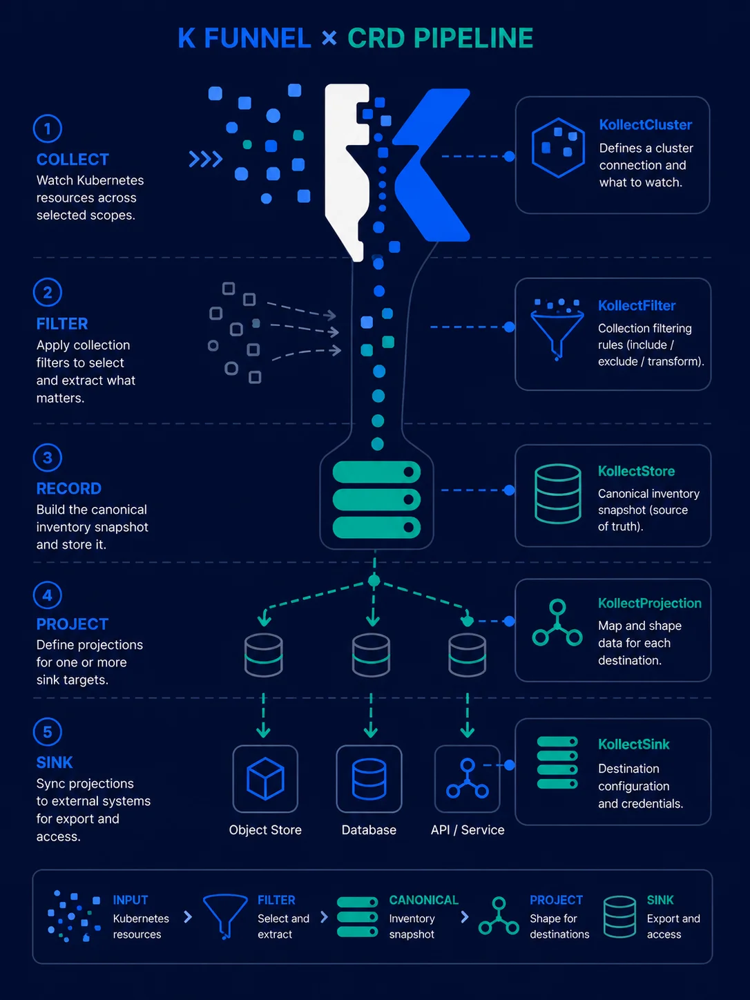

# Understand the basics

Curated prerequisites before you install Kollect or apply sample custom resources. You do not need
to be a Kubernetes expert, but comfort with the concepts below makes [QUICKSTART.md](QUICKSTART.md)
and the [examples](examples/README.md) much easier to follow.

!!! tip "Who this page is for"
    Platform engineers evaluating Kollect on **kind**, SREs wiring sinks for a tenant namespace, and
    contributors reading [ARCHITECTURE.md](ARCHITECTURE.md). If you already run CRD-based operators
    daily, skip to [Quick start](QUICKSTART.md).

## Kubernetes fundamentals

Kollect is a **namespaced operator** — you install one controller deployment (typically via Helm) and
declare inventory pipelines as Custom Resources in tenant namespaces.

| Concept | Why it matters for Kollect |
| --- | --- |
| **Pods, Deployments, Namespaces** | Sample targets watch `Deployment` objects; multitenant installs scope by namespace |
| **RBAC** (`Role`, `ClusterRole`, `ServiceAccount`) | The manager needs list/watch on GVKs your profiles select; SAR checks degrade gracefully |
| **Secrets** | Git, Postgres, Kafka, and NATS sinks read credentials from `spec.secretRef` |
| **Labels and annotations** | `kollect.dev/watch` opt-in/opt-out ([ADR-0205](adr/0205-watch-labels.md)) |

Useful primers:

- [Kubernetes basics](https://kubernetes.io/docs/tutorials/kubernetes-basics/) — official interactive tour
- [kubectl cheat sheet](https://kubernetes.io/docs/reference/kubectl/cheatsheet/) — `get`, `describe`, `apply -k`
- [kind quick start](https://kind.sigs.k8s.io/docs/user/quick-start/) — local clusters for evaluation

## Custom resources (CRDs)

Kollect extends the API with **nine** `kollect.dev/v1alpha1` kinds. You declare *what* to collect
(`KollectProfile`), *where* to export (`KollectSink`), *which resources* (`KollectTarget`), and
*how to roll up* (`KollectInventory`). Cluster-scoped kinds (`KollectCluster*`) add cross-namespace
rollup on platform clusters.

| Term | Meaning |
| --- | --- |
| **CRD** | CustomResourceDefinition — schema registered with the apiserver |
| **CR** | A concrete custom resource instance (your YAML) |
| **Reconciler** | Controller loop that drives CR `.status` toward `.spec` |
| **Webhook** | Admission validation before create/update (CEL paths, sink enum, scope rules) |

Start here after this page:

- [CR-REFERENCE.md](CR-REFERENCE.md) — pipeline diagram and per-kind index
- [adr/0201-crd-model.md](adr/0201-crd-model.md) — why these kinds exist

{ .kollect-illus .kollect-illus--portrait width="320" }

!!! note "Pre-beta API"
    Fields and status conditions may change until beta. Check [ROADMAP.md](ROADMAP.md) before
    production rollout.

## CEL and JSONPath extraction

`KollectProfile` defines **named attributes** — field paths evaluated against each watched object.
Cluster targets reference a namespaced `KollectProfile` by `name` + `namespace`
([ADR-0208](adr/0208-cluster-static-refs-via-namespace.md)); there is no `KollectClusterProfile`
kind. Kollect supports:

- **JSONPath** — kubectl-style (`{.metadata.name}`) or `$`-prefixed paths; use `[*]` for all array
  elements ([ADR-0302](adr/0302-cel-jsonpath-extraction.md))
- **CEL** — `cel:`-prefixed expressions for computed values and filters

Example attribute row:

```yaml
attributes:
  - name: image
    path: "{.spec.template.spec.containers[0].image}"
  - name: ready
    path: 'cel:has(object.status.conditions) && object.status.conditions.exists(c, c.type == "Available" && c.status == "True")'
```

Walkthrough with expected output: [examples/deployment-inventory.md](examples/deployment-inventory.md).

External references:

- [CEL in Kubernetes](https://kubernetes.io/docs/reference/using-api/cel/) — language used by admission and Kollect profiles
- [JSONPath support in kubectl](https://kubernetes.io/docs/reference/kubectl/jsonpath/) — path syntax Kollect mirrors

## Event-driven informers

Kollect does **not** poll the API on a cron. For each profile GVK it registers a **dynamic
informer** — shared watches that emit add/update/delete events. Target controllers extract
attributes on change; inventory controllers debounce and export to sinks
([ADR-0301](adr/0301-event-driven-informers.md), [DATA-FLOWS.md](DATA-FLOWS.md)).

!!! warning "Watch scope"
    Large clusters need deliberate `watchNamespaces`, `KollectScope`, and profile GVK choice.
    See [PERFORMANCE.md](PERFORMANCE.md) and [examples/multi-tenant-watch-namespaces.md](examples/multi-tenant-watch-namespaces.md).

## Export sinks and GitOps context

The in-memory inventory snapshot is **canonical**; sinks are **projections** classified by role
([ADR-0401](adr/0401-sink-taxonomy-state-vs-stream.md)):

{ .kollect-illus .kollect-illus--wide width="800" }

| Role | Shipped `spec.type` values | Typical use |
| --- | --- | --- |
| **Snapshot store** | `git`, `gitlab`, `s3`, `gcs` | Auditable JSON history; S3/GCS **`format: parquet`** for analytics ([ADR-0401](adr/0401-sink-taxonomy-state-vs-stream.md)) |
| **Relational SoR** | `postgres` | Queryable tables; delete reconciliation removes stale rows |
| **Event emitter** | `nats`, `kafka` | Change streams for automation and downstream consumers |

Git/GitLab exports produce **commits** portals and compliance workflows can diff. Postgres holds
**queryable state**; NATS/Kafka emit **events** — many teams pair Postgres + NATS in `sinkRefs`.
See [examples/postgres-state-store.md](examples/postgres-state-store.md) and
[examples/nats-event-sink.md](examples/nats-event-sink.md).

!!! tip "GitOps-friendly, not a GitOps engine"
    Kollect exports inventory **to** Git or other backends; it does not replace Argo CD or Flux.
    For Helm release inventory, see [examples/helm-release-inventory.md](examples/helm-release-inventory.md).

## Multi-cluster (optional)

Single-cluster installs are fully supported. **Multi-cluster fleet** mode runs one operator per
cluster and partitions shared sinks via `spec.cluster` and optional `spec.pathTemplate`
([ADR-0501](adr/0501-multi-cluster-fleet.md), [ADR-0407](adr/0407-git-object-store-layout.md),
[examples/multi-cluster-fleet.md](examples/multi-cluster-fleet.md)).
`KollectClusterTarget` and `KollectClusterInventory` controllers reconcile cluster-scoped rollup
and export to namespaced sinks.

## Next steps

| Goal | Page |
| --- | --- |
| Install on kind and apply samples | [QUICKSTART.md](QUICKSTART.md) |
| Build, test, and debug locally | [DEVELOPMENT.md](DEVELOPMENT.md) |
| Architecture and CRD relationships | [ARCHITECTURE.md](ARCHITECTURE.md) |
| Locked design decisions | [PLATFORM-DECISIONS.md](PLATFORM-DECISIONS.md) |
| Scenario walkthroughs | [examples/README.md](examples/README.md) |
