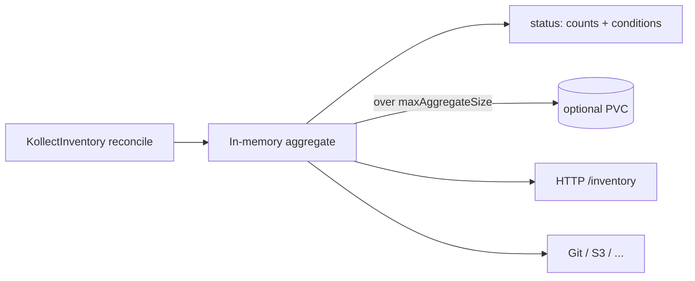

# ADR-0006: Data storage and etcd size limit

## Status

Accepted

## Context

Kubernetes etcd imposes a **~1.5 MB** limit per object (request size). Inventory operators that
store full collected payloads in CRD `.status` will eventually hit admission failures and destabilize
the apiserver.

OSS validation:

- **kube-state-metrics** never persists collected state in etcd — it projects informer cache into
  Prometheus metrics or serves them from memory.
- **Flux** source-controller stores **artifact metadata** in status (revision, digest, conditions),
  not artifact bytes.
- **external-secrets** stores sync status and references, not secret values, in status.
- **Argo CD** Application status holds sync/health summaries and revision metadata, not full manifests
  (those live in Git or the live cluster).

kollect aggregates attributes from many resources; a naive "put everything in status" design fails
at scale. Developer portals also need a **read path** without scraping Git — addressed here via HTTP.

## Decision

1. **`KollectInventory.status` holds metadata only:** item counts, per-target summaries,
   `metav1.Condition`, `observedGeneration`, `lastExportTime`, and **references** to last export
   (commit SHA, object key, page ID) — never the full payload.
2. **Collected payload flows directly to sinks** (Git commit, S3 object, etc.) on each reconcile
   export cycle. In-memory aggregation during reconcile is bounded and not persisted to etcd.
3. **Stable ordering** of serialized output (sort keys, deterministic iteration) so Git diffs and
   golden tests are reproducible.
4. **Bounded lists:** paginate API `List` calls; scope informer caches with namespace/label selectors.
5. **Status patch discipline:** patch status only when changed; avoid hot loops writing large status.
6. **Read-only HTTP inventory API (optional):** expose aggregated inventory via operator HTTP
   for **debug and small installs only** — feature-gated, **off in production Helm defaults**
   ([ADR-0032](0032-platform-architecture-pivot.md)). Scalable portal read uses **sink export**
   (Postgres/Kafka) and hub merged store — not spoke HTTP at fleet scale. Same schema as sink
   export where possible when enabled.
   - **Auth (primary):** delegate to Kubernetes API auth — **TokenReview** + **SubjectAccessReview**;
     callers use standard `Authorization: Bearer` service account tokens;
     `--inventory-auth-mode=kubernetes` (default). See [ADR-0024](0024-inventory-api-auth.md).
   - **Auth (optional):** **oauth2-proxy** Helm sidecar/subchart for OIDC browser access —
     `oauth2Proxy.enabled: false` by default; documented, not required for service-to-service.
   - **TODO:** Async push to clients — **SSE** or **watch** endpoint when inventory changes, not only GET snapshot.
7. **Optional PVC buffer:** when in-memory aggregate exceeds `maxAggregateSize`, spill full payload
   to a mounted volume for export and HTTP serve — still not written to etcd status.
8. **`maxAggregateSize` configuration:** manager flag or `KollectInventory` spec field with a
   conservative default. Research basis: etcd ~1.5 MB object limit → default **512 KiB** for data
   kept in status *summaries* and in-memory hot path; full payload only to PVC/sink/HTTP body.

## Consequences

### Positive

- Safe at scale for clusters with thousands of collected objects.
- Aligns with how mature operators treat status as **observed state summary**, not a database.
- Git/S3 exports remain the **auditable source of truth** for stakeholders and developer portals.
- HTTP API enables portal caching without CRD reads.

### Negative

- HTTP surface adds auth, TLS, and network policy obligations.
- PVC spill path adds storage class and backup considerations.
- Consumers must still use sink or HTTP for full payload — `kubectl get kinv -o yaml` is not enough.

## Open questions

- **OPEN:** Exact HTTP paths and OpenAPI schema versioning (`/v1alpha1/inventory` vs negotiation).
- **OPEN:** Whether `maxAggregateSize` is global manager default only or per-Inventory override.
- **RESOLVED (2026-06-05):** Optional Helm sidecar/subchart for oauth2-proxy; K8s-native auth is
  primary — [ADR-0024](0024-inventory-api-auth.md).
