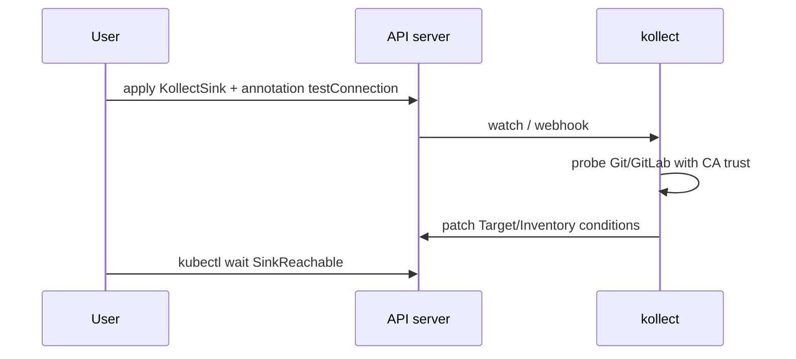

# ADR-0015: Static config vs reconciled CRDs

## Status

Accepted

## Context

Operators differ on whether configuration CRDs get their own reconciler:

- **Flux notification-controller `Provider` and `Alert`** have **no status subresource** and no
  dedicated controller — they are referenced by reconciled `Receiver` and event dispatch logic.
- **external-secrets `SecretStore`** is reconciled (validates provider, writes status conditions).
- **Flux source-controller `GitRepository`** is fully reconciled with rich status (artifact revision).

kollect has configuration objects (`KollectProfile`, `KollectSink`) that change infrequently and
work objects (`KollectTarget`, `KollectInventory`) that drive continuous collection and export.

At **~60 clusters**, shared GVK definitions via cluster `KollectProfile` matter, but per-target
overrides may be needed later without forking profiles.

## Decision

| Category | Kinds | Controller | Status | Validation |
| --- | --- | --- | --- | --- |
| Static config | `KollectProfile`, `KollectSink`, `KollectScope` | None | None (or minimal metadata only) | CEL `x-kubernetes-validations`, **validating webhook** |
| Reconciled | `KollectTarget`, `KollectInventory`, `KollectPublication` (deferred) | Yes | Full conditions + `observedGeneration` | Same + runtime SAR checks |

Rationale (Flux-aligned):

- Cuts controllers and status write churn for rarely changing config.
- Profile/Sink edits still trigger dependent reconciles via secondary watches on referencing objects.
- `spec.suspend` on **reconciled** kinds only; static objects are always "active" when referenced.

**Explicitly reject** reconciling `KollectProfile`/`KollectSink` like ESO SecretStore — the
validation benefit does not justify status/etcd churn for kollect's read-mostly config.

### Shared GVK, optional per-target overrides

- **Default:** `KollectTarget.spec.profileRef` points to cluster `KollectProfile` (shared GVK schema).
- **Future door:** optional inline attribute overrides or `profileRef` + patch fields on Target —
  design keeps API evolvable without breaking shared profiles ([ADR-0004](0004-crd-model.md)).

### Concurrent GVK watches

Research and document an informed default for **maximum concurrent GVK informers** before memory/API
pressure. Expose manager configuration:

- `maxConcurrentWatches` — soft limit with warning Event when approached
- Tune with envtest/load tests; document default in Helm `values.yaml` comments

Prefer **one shared informer per GVK** across Targets ([ADR-0014](0014-event-driven-informers.md)).

### Connection test (first-class)

Without reconciling static sinks, still provide **discoverable connectivity feedback**:

| Mechanism | Behavior |
| --- | --- |
| **Status on `KollectInventory` / `KollectTarget`** | Condition e.g. `SinkReachable` with reason, latency, last probe time |
| **Annotation trigger** | `kollect.dev/testConnection=true` on Sink or Inventory requests one-shot probe |
| **`kubectl`-friendly** | `kubectl wait --for=condition=SinkReachable` on reconciled objects |

Connection tests run from the operator with the same TLS trust as export ([ADR-0004](0004-crd-model.md)
`caBundle` / `caSecretRef`). Errors are **visible and informative** (HTTP status, DNS, TLS handshake)
— sanitized, no secrets in messages.

### Collected object generation annotation

When exporting or summarizing a source object, record the source `metadata.generation` on collected
rows or export metadata via annotation:

- `kollect.dev/collectedGeneration: "<n>"`

Enables consumers to detect stale inventory vs live object without full payload in status.

## Consequences

### Positive

- Fewer moving parts, fewer leader-election reconciler loops.
- Clear mental model: config CRDs are like Flux Providers; workload CRDs are like GitRepositories.
- Connection test gives human-user-0 fast feedback without a Sink reconciler.

### Negative

- Invalid sink credentials may still first appear at export unless user runs connection test.
- `kubectl wait --for=condition=Ready` does not apply to Profile/Sink.
- `maxConcurrentWatches` tuning is cluster-dependent — wrong default causes silent memory pressure.

## Open questions

- **OPEN:** Dedicated `KollectConnectionTest` CR vs annotation-only trigger?
- **OPEN:** Per-target profile override API shape — inline map vs `KollectProfilePatch` kind?
