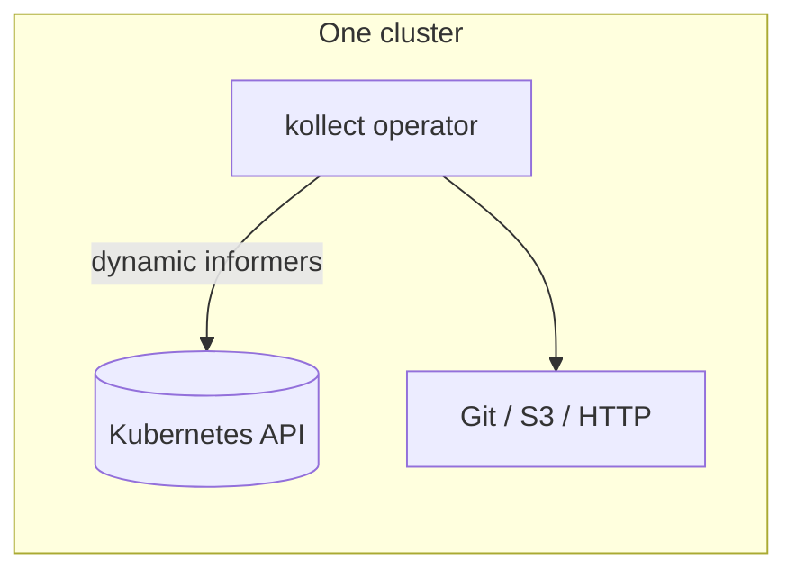
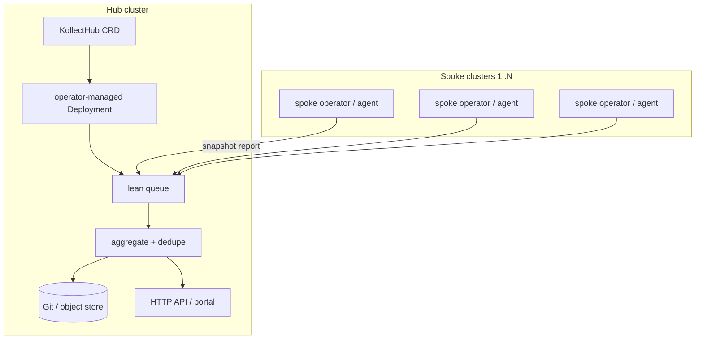
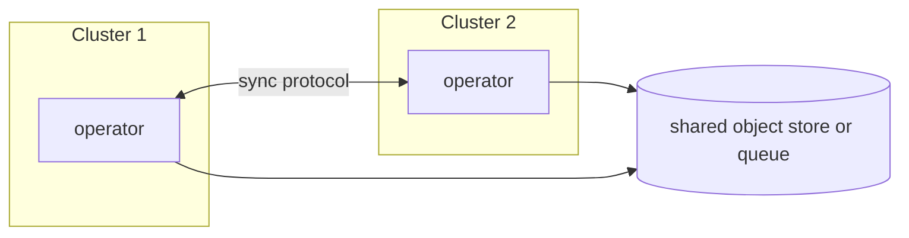

# ADR-0022: Multi-cluster sync topology (RFC)

## Status

Proposed (user-aligned, 2026-06-05)

## Context

Many installations need inventory from **~60 Kubernetes clusters** without:

- 60 separate Git commits or export events per logical change
- Blocking the **single-cluster** path while multi-cluster is designed
- Premature commitment to **Git-only** fan-in (agent mesh or object storage may fit better)

Phase 0 favors **one pod does all** (collect → aggregate → export). Multi-cluster must layer on
without rewriting the single-cluster CRD model ([ADR-0004](0004-crd-model.md)).

`KollectInventory` is **namespaced** (team-owned rollup per namespace). Platform-wide single-cluster
views use reserved **`KollectClusterInventory`** (cluster-scoped, not implemented in Phase 0–1).

## Topology options

### A — Single cluster (baseline)

One or more **namespaced** `KollectInventory` objects aggregate `KollectTarget`s in their namespace;
export per reconcile cycle when aggregation rules say so ([REQUIREMENTS.md](../REQUIREMENTS.md)).

### B — Hub-and-spoke collector (CRD-driven hub)

- **Spoke** — per-cluster kollect operator (or lean agent) runs collection and **pushes** summarized
  inventory reports to the hub transport ([ADR-0023](0023-lean-queue-transport.md)).
- **Hub** — **`KollectHub`** CRD (proposed name) in the hub cluster; the hub reconciler ensures an
  operator-managed **Deployment** (hub collector) and wires a **lean queue** consumer that merges
  spoke reports before **one** aggregated export.
- Hub is a **first-class CRD**, not only standalone hub software — same operator image can run
  `mode: spoke|hub` or split binaries later (open).

### C — Agent mesh (no Git hub)

Peers or a lightweight bus exchange inventory revisions; Git becomes optional archive, not the
control plane.

## Sync vs async transport

| Approach | Pros | Cons |
| --- | --- | --- |
| **Lean queue** (NATS JetStream, Redis Streams, in-process channel) | Low ops footprint; flexible consumers; **Phase 1 hub prototype** | Ordering, retention, auth per org |
| **Kafka topic** | Durable log, enterprise standard | Heavier ops; topic design lock-in — **optional backend only** |
| **Git as transport** | Audit trail, familiar PR flow | 60 repos or 60 branches = noise without aggregation |
| **Object storage (S3/GCS)** | Large payloads, cheap | Eventing needs companion (SQS, notification) |
| **Agent HTTPS API** | Direct, testable ([REQUIREMENTS](../REQUIREMENTS.md)) | mTLS, CA bundles, auth at scale |

**Decision:** investigate **lean queue first** ([ADR-0023](0023-lean-queue-transport.md)); Kafka is an
optional enterprise plug-in — never a hard dependency.

**Open:** whether spokes push on change (event-driven) or hub pulls on interval (only for
*external* freshness — not for in-cluster watches per [ADR-0014](0014-event-driven-informers.md)).

## Aggregation strategies

Goal: **one logical inventory view** per product/tenant, not per cluster.

| Strategy | Description |
| --- | --- |
| **Hub merge** | Collector keys rows by `(cluster, namespace, name, uid)`; export once |
| **Federated Git** | Monorepo path `clusters/<name>/inventory.json` + single rendered index |
| **Single portal view** | Hub merge + Postgres/Kafka/Git export; rendered docs via external CI ([ADR-0011](0011-doc-sync-templating.md)) |
| **Metrics-only fan-in** | Prometheus labels include `cluster`; docs still need aggregated export |

## Recommended phasing (non-blocking)

| Phase | Path | Multi-cluster impact |
| --- | --- | --- |
| **0** | One pod, one cluster, Helm, webhooks, metrics, connection test | CRDs and status model stay cluster-local |
| **1** | Namespaced `KollectInventory` aggregation, HTTP `/inventory`, Git/GitLab sink + **custom CA** | Export contract stable for hub to consume |
| **2** | **`KollectHub` CRD** + spoke agent posting to hub queue or HTTPS | Hub Deployment + lean queue prototype |
| **3** | Queue-backed async (pluggable per [ADR-0023](0023-lean-queue-transport.md)) | Spokes decoupled from hub uptime; optional Kafka |
| **Later** | `KollectClusterInventory` | After aggregation proven; doc-sync rejected ([ADR-0011](0011-doc-sync-templating.md)) |

Single-cluster users never enable hub/spoke CRs or flags.

## Decision (proposed, user-aligned)

1. **Do not block Phase 0/1** on multi-cluster CRDs — use labels/annotations; hub CRD in Phase 2.
2. **Design namespaced `KollectInventory` aggregation** as if multiple targets (and later clusters) feed hub export.
3. **Prefer hub-and-spoke with `KollectHub` CRD** for 60-cluster ops maturity; keep agent mesh and Git-as-transport as documented alternatives.
4. **Lean queue first**, Kafka optional — see [ADR-0023](0023-lean-queue-transport.md).

## Consequences

### Positive

- Clear narrative for platform teams at 60-cluster scale.
- Single-cluster MVP remains the default install story.
- Hub lifecycle (Deployment, queue wiring) is declarative via CRD.

### Negative

- RFC leaves cross-cluster auth unset — implementation must not bake in Git-only assumptions.
- `KollectHub` API shape not finalized until Phase 2 spike.

## Open questions

- **OPEN:** Spoke agent vs full operator per cluster — binary split or one image with `mode: spoke|hub`?
- **OPEN:** Identity for cross-cluster auth (mTLS, OIDC, bootstrap tokens)?
- **OPEN:** Maximum spoke payload size before hub spills to PVC ([ADR-0006](0006-etcd-limit.md))?
- **OPEN:** Is Git monorepo with `clusters/*` paths sufficient for Phase 2, or object store required?
