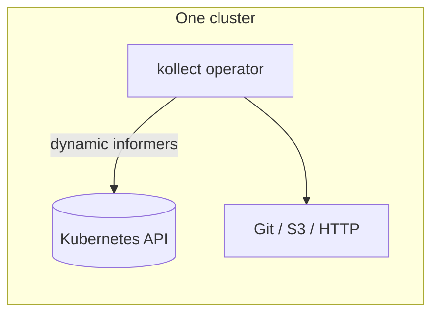
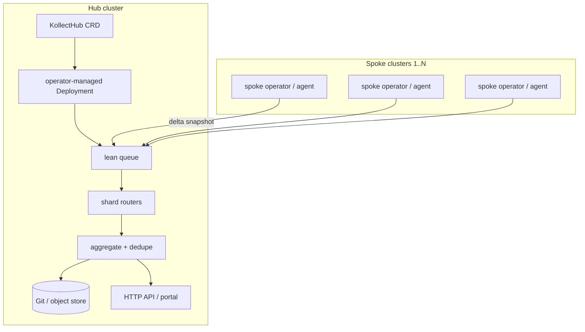
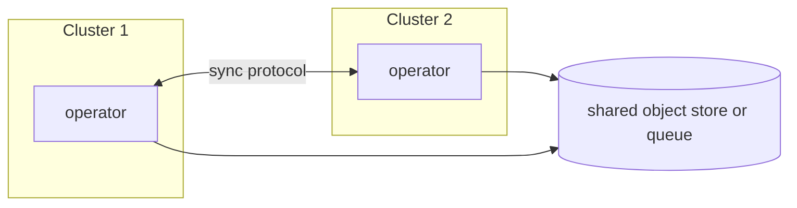

# ADR-0022: Multi-cluster sync topology (RFC)

## Status

Accepted (2026-06-05)

## Context

Many installations need inventory from **100+ Kubernetes clusters** (and growing) without:

- N separate Git commits or export events per logical change (must not scale O(n²) with cluster count)
- Blocking the **single-cluster** path while multi-cluster is designed
- Premature commitment to **Git-only** fan-in (agent mesh or object storage may fit better)

**60 clusters is not the ceiling** — design for **hundreds of spokes** and **giant single clusters**
(1000s of nodes, 10k+ watched resources per spoke). The hub must **shard and aggregate**, not
maintain pairwise or full-mesh relationships between spokes.

Phase 0 favors **one pod does all** (collect → aggregate → export). Multi-cluster must layer on
without rewriting the single-cluster CRD model ([ADR-0004](0004-crd-model.md)).

`KollectInventory` is **namespaced** (team-owned rollup per namespace). Platform-wide single-cluster
views use reserved **`KollectClusterInventory`** (cluster-scoped, not implemented in Phase 0–1).

## Scale targets

| Dimension | Target | Design implication |
| --- | --- | --- |
| **Spoke count** | 100–500+ clusters | Hub merge is **O(spokes)** ingest + **O(rows)** dedupe, never O(spokes²) cross-talk |
| **Spoke size** | 10k+ watched resources, 1000+ nodes | Spoke stays **lightweight** — summarize before push; no full payload fan-in to hub RAM |
| **Hub throughput** | 1 logical export per tenant change | Queue consumers shard by `(tenant, shard)`; horizontal hub replicas |
| **Spoke memory** | Bounded per [ADR-0026](0026-performance-scalability.md) | Scoped informers, paginated list, delta snapshots only |

### Anti-patterns (explicitly rejected at scale)

- Hub holding full inventory of all clusters in one process without sharding
- Spoke pushing on every object change without coalescing (export debounce + snapshot windows)
- Git commit per spoke per reconcile cycle
- Pairwise agent mesh at 100+ nodes

## Topology options

### A — Single cluster (baseline)

One or more **namespaced** `KollectInventory` objects aggregate `KollectTarget`s in their namespace;
export per reconcile cycle when aggregation rules say so ([REQUIREMENTS.md](../REQUIREMENTS.md)).

### B — Hub-and-spoke collector (CRD-driven hub)

- **Spoke** — **lightweight** per-cluster operator (or lean agent): scoped watches, in-memory
  aggregation, **pushes summarized deltas** on debounced intervals — not raw object streams.
  Memory and CPU bounded per [ADR-0026](0026-performance-scalability.md).
- **Hub** — **`KollectHub`** CRD (proposed name) in the hub cluster; reconciler ensures
  operator-managed **Deployment(s)** with **horizontally scalable** queue consumers.
- **Sharding** — queue partitions or consumer groups keyed by `tenant` / `cluster` / hash bucket so
  hub work is **O(rows merged)**, not O(spokes × spokes).
- Hub is a **first-class CRD**, not only standalone hub software — **same operator image** runs
  **`mode: spoke|hub`** (manager flag / Helm values); no second binary until proven necessary.

### C — Agent mesh (no Git hub)

Peers or a lightweight bus exchange inventory revisions; Git becomes optional archive, not the
control plane. **Not recommended beyond ~20 peers** without a hub tier — documented for edge cases.

## Sync vs async transport

| Approach | Pros | Cons |
| --- | --- | --- |
| **Lean queue** (NATS JetStream, Redis Streams, in-process channel) | Low ops footprint; flexible consumers; **shardable**; **Phase 1 hub prototype** | Ordering, retention, auth per org |
| **Kafka topic** | Durable log, enterprise standard; natural partitioning | Heavier ops; topic design lock-in — **optional backend only** |
| **Git as transport** | Audit trail, familiar PR flow | N repos or branches = noise without aggregation |
| **Object storage (S3/GCS)** | Large payloads, cheap; spoke spillover for giant clusters | Eventing needs companion (SQS, notification) |
| **Agent HTTPS API** | Direct, testable ([REQUIREMENTS](../REQUIREMENTS.md)) | mTLS, CA bundles, auth at 100+ scale |

**Decision:** investigate **lean queue first** ([ADR-0023](0023-lean-queue-transport.md)); Kafka is an
optional enterprise plug-in — never a hard dependency. Partition count must scale with spoke count.

**Open:** whether spokes push on change (event-driven, coalesced) or hub pulls on interval (only for
*external* freshness — not for in-cluster watches per [ADR-0014](0014-event-driven-informers.md)).

## Aggregation strategies

Goal: **one logical inventory view** per product/tenant, not per cluster.

| Strategy | Description |
| --- | --- |
| **Hub merge (sharded)** | Consumers merge by `(cluster, namespace, name, uid)`; shard by tenant hash; **one** export |
| **Federated Git** | Monorepo path `clusters/<name>/inventory.json` + single rendered index |
| **Single portal view** | Hub merge + Postgres/Kafka/Git export; rendered docs via external CI ([ADR-0011](0011-doc-sync-templating.md)) |
| **Metrics-only fan-in** | Prometheus labels include `cluster`; docs still need aggregated export |

## MVP-first layering (no throwaway hub work)

Single-cluster MVP ships **first** and must not be reworked for scale. Hub work layers on the same
primitives:

| Layer | Ships when | Reuse |
| --- | --- | --- |
| **L1 — Single cluster** | First | Namespaced inventory, export to Postgres/Kafka, `Transport` with `inprocess` only |
| **L2 — Hub library** | Next | Merge/dedupe + shard routing in `internal/hub/`; `inprocess` tests |
| **L3 — Helm hub mode** | Next | Chart values / `--mode=hub\|spoke` on **same image** — **no `KollectHub` CRD** ([ADR-0032](0032-platform-architecture-pivot.md)) |

**Rule:** do not build hub-only merge or transport code that single-cluster export cannot exercise.
Hub is **Helm configuration**, not a CRD lifecycle.

## Recommended phasing (non-blocking)

| Phase | Path | Multi-cluster impact |
| --- | --- | --- |
| **0** | One pod, one cluster, Helm, webhooks, metrics, connection test | CRDs and status model stay cluster-local |
| **1** | Namespaced `KollectInventory` aggregation, HTTP `/inventory`, Git/GitLab sink + **custom CA** | Export contract stable for hub to consume; operator metrics + bounded benchmarks ([ADR-0026](0026-performance-scalability.md)) |
| **2** | **`mode: hub\|spoke`** + spoke push to hub ingest / queue | Helm hub Deployment + merge lib + shard routing |
| **3** | Queue-backed async (pluggable per [ADR-0023](0023-lean-queue-transport.md)) | Spokes decoupled from hub uptime; optional Kafka partitions |
| **Later** | `KollectClusterInventory` | After aggregation proven at 100+ spoke scale; doc-sync rejected ([ADR-0011](0011-doc-sync-templating.md)) |

Single-cluster users never enable hub/spoke CRs or flags.

## Decision

1. **Do not block MVP** on multi-cluster — hub is Helm `mode` + library, not a hub CRD ([ADR-0032](0032-platform-architecture-pivot.md)).
2. **Design namespaced `KollectInventory` aggregation** as if 100+ clusters feed a sharded hub export.
3. **Hub-and-spoke** via same image `mode: hub|spoke`; portal reads **hub Postgres/Kafka**, not Git per spoke.
4. **Lean queue pluggable**, **`inprocess` default only** ([ADR-0023](0023-lean-queue-transport.md)).
5. **Spokes must stay lightweight** — delta snapshots, bounded RAM, debounced export.
6. **Reject `KollectHub` CRD** — configuration via Helm values and flags only.

## Consequences

### Positive

- Clear narrative for platform teams at **100+ cluster** scale and giant single clusters.
- Single-cluster MVP remains the default install story.
- Hub lifecycle is Helm-native (`mode`, transport, shard flags).
- Early perf visibility via operator metrics and bounded benchmarks ([ADR-0026](0026-performance-scalability.md)) reduces architectural lock-in risk.

### Negative

- Cross-cluster auth is hybrid (Istio-style secrets + push TokenReview) — see [ADR-0028](0028-hub-cluster-auth-istio-pattern.md).
- `KollectHub` API shape not finalized until Phase 2 spike; sharding strategy needs load proof.
- Spoke summary format must version cleanly as attribute cardinality grows.

## Open questions

- **RESOLVED (2026-06-05):** One operator image with **`mode: spoke|hub`** — no binary split until load proof says otherwise.
- **RESOLVED (ADR-0028):** Push-first **TokenReview + `X-Kollect-Cluster-Id`**; optional Istio-style remote credential `Secret` for hub pull.
- **OPEN (ADR-0028):** Spoke cross-cluster identity details (mTLS, OIDC, bootstrap tokens) — see [PLATFORM-DECISIONS.md](../PLATFORM-DECISIONS.md).
- **OPEN:** Maximum spoke payload size before hub spills to object store ([ADR-0006](0006-etcd-limit.md))?
- **OPEN:** Hub shard count formula — fixed partitions vs dynamic by spoke registration?
- **OPEN:** Is Git monorepo with `clusters/*` paths sufficient for Phase 2, or object store required at 100+ spokes?
