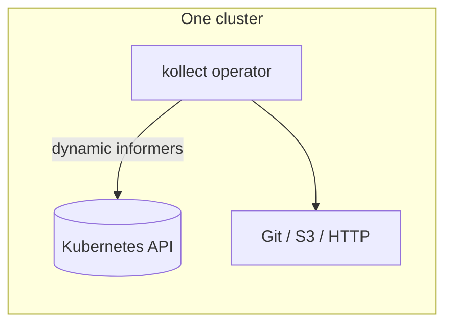
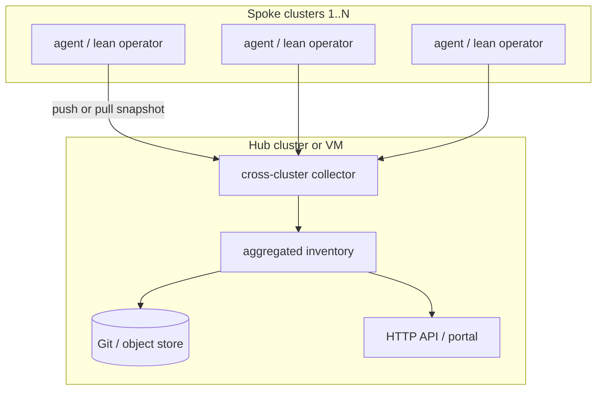
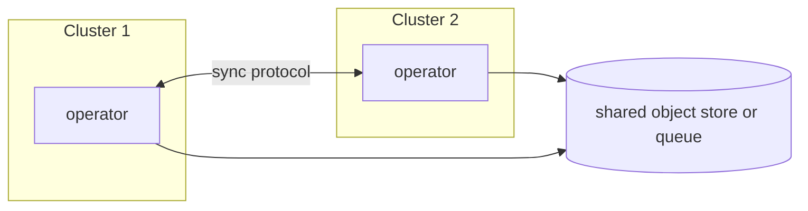

# ADR-0022: Multi-cluster sync topology (RFC)

## Status

Proposed

## Context

Many installations need inventory from **~60 Kubernetes clusters** without:

- 60 separate Confluence pages or Git commits per logical change
- Blocking the **single-cluster** path while multi-cluster is designed
- Premature commitment to **Git-only** fan-in (agent mesh or object storage may fit better)

Phase 0 favors **one pod does all** (collect → aggregate → export). Multi-cluster must layer on
without rewriting the single-cluster CRD model ([ADR-0004](0004-crd-model.md)).

## Topology options

### A — Single cluster (baseline)

One `KollectInventory` aggregates all `KollectTarget`s in that cluster; one export per reconcile
cycle when aggregation rules say so ([REQUIREMENTS.md](../REQUIREMENTS.md)).

### B — Hub-and-spoke collector

Spokes run collection (or ship raw snapshots); hub **deduplicates and merges** before one commit /
one doc page. Fits 60-cluster scale if payload is summarized ([ADR-0006](0006-etcd-limit.md)).

### C — Agent mesh (no Git hub)

Peers or a lightweight bus exchange inventory revisions; Git becomes optional archive, not the
control plane.

## Sync vs async transport

| Approach | Pros | Cons |
| --- | --- | --- |
| **Lean queue** (NATS, Redis Streams) | Low ops footprint; flexible consumers | Ordering, retention, auth per org |
| **Kafka topic** | Durable log, enterprise standard | Heavier ops; topic design lock-in |
| **Git as transport** | Audit trail, familiar PR flow | 60 repos or 60 branches = noise without aggregation |
| **Object storage (S3/GCS)** | Large payloads, cheap | Eventing needs companion (SQS, notification) |
| **Agent HTTPS API** | Direct, testable ([REQUIREMENTS](../REQUIREMENTS.md)) | mTLS, CA bundles, auth at scale |

**Open:** whether spokes push on change (event-driven) or hub pulls on interval (only for
*external* freshness — not for in-cluster watches per [ADR-0014](0014-event-driven-informers.md)).

## Aggregation strategies

Goal: **one logical inventory view** per product/tenant, not per cluster.

| Strategy | Description |
| --- | --- |
| **Hub merge** | Collector keys rows by `(cluster, namespace, name, uid)`; export once |
| **Federated Git** | Monorepo path `clusters/<name>/inventory.json` + single rendered index |
| **Single doc page** | Publication phase merges cluster sections (deferred until collection mature) |
| **Metrics-only fan-in** | Prometheus labels include `cluster`; docs still need aggregated export |

## Recommended phasing (non-blocking)

| Phase | Path | Multi-cluster impact |
| --- | --- | --- |
| **0** | One pod, one cluster, Helm, webhooks, metrics, connection test | CRDs and status model stay cluster-local |
| **1** | Aggregation in `KollectInventory`, HTTP `/inventory`, Git/GitLab sink + **custom CA** | Export contract stable for hub to consume |
| **2** | Optional **spoke agent** (Deployment or DaemonSet) posting to hub API or object store | Hub collector can be separate binary or feature gate |
| **3** | Queue-backed async (NATS/Redis/Kafka — **pluggable**) | Spokes decoupled from hub uptime |
| **Later** | `KollectPublication`, advanced doc merge | After aggregation proven |

Single-cluster users never enable hub/spoke CRs or flags.

## Decision (proposed)

1. **Do not block Phase 0/1** on multi-cluster CRDs — use labels/annotations and hub software later.
2. **Design `KollectInventory` aggregation** as if multiple targets (and later clusters) feed one export.
3. **Prefer hub-and-spoke** for 60-cluster ops maturity; keep agent mesh and Git-as-transport as
   documented alternatives in this RFC.
4. **Investigate lean queue first**, Kafka as optional enterprise backend — avoid hard dependency.

## Consequences

### Positive

- Clear narrative for platform teams at 60-cluster scale.
- Single-cluster MVP remains the default install story.

### Negative

- RFC leaves transport and auth unset — implementation must not bake in Git-only assumptions.

## Open questions

- **OPEN:** Spoke agent vs full operator per cluster — binary split or one image with `mode: spoke|hub`?
- **OPEN:** Identity for cross-cluster auth (mTLS, OIDC, bootstrap tokens)?
- **OPEN:** Maximum spoke payload size before hub spills to PVC ([ADR-0006](0006-etcd-limit.md))?
- **OPEN:** Is Git monorepo with `clusters/*` paths sufficient for Phase 2, or object store required?
- **OPEN:** NATS vs Redis Streams vs in-cluster Channel for first async prototype?
