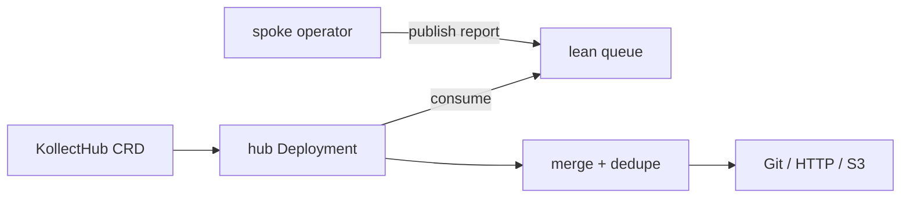

# ADR-0023: Lean queue transport for hub fan-in

## Status

Proposed (2026-06-05)

## Context

Multi-cluster hub aggregation ([ADR-0022](0022-multi-cluster-sync-rfc.md)) needs a transport between
**spoke** operators (per cluster) and the **hub** (`KollectHub` CRD → operator-managed Deployment).
Requirements:

- **Low operational burden** for a Phase 1–2 hub prototype (personal/small-platform scale first).
- **Pluggable** — no hard dependency on Kafka or a specific vendor.
- **At-least-once** delivery acceptable; hub merge is idempotent on `(cluster, namespace, name, uid)`.
- Payloads are **summarized inventory JSON** (not full object dumps) per [ADR-0006](0006-etcd-limit.md).

## Options evaluated

| Transport | Ops footprint | Ordering / retention | Fit for Phase 1 hub prototype |
| --- | --- | --- | --- |
| **In-process channel** | None (single process) | In-memory only; lost on restart | **Best for unit/integration tests** and local dev; not production hub |
| **NATS JetStream** | Small binary; single server or K8s Deployment | Streams, consumer groups, replay | **Strong candidate** — lightweight, K8s-friendly, no JVM |
| **Redis Streams** | Often already present in platform | `XREADGROUP`, trimming, persistence | **Strong candidate** if Redis is standard; else extra moving part |
| **Kafka** | Cluster + ZooKeeper/KRaft, topic ops | Durable log, enterprise tooling | **Optional enterprise backend** — defer until lean path proven |

### NATS JetStream

- Pros: purpose-built messaging; small footprint; good Go client; stream retention policies.
- Cons: another service to run if not already in the estate; TLS/auth configuration.

### Redis Streams

- Pros: many orgs already run Redis; simple stream semantics; easy local testcontainer in CI.
- Cons: Redis not universal; memory pressure if retention unbounded.

### In-process channel

- Pros: zero deps; fastest TDD loop for hub merge logic inside one binary.
- Cons: no cross-pod or cross-cluster delivery — only for **prototype wiring** before external bus.

### Kafka

- Pros: enterprise standard, long retention, ecosystem.
- Cons: heavy for Phase 1; topic/partition design lock-in; **must remain optional** per product direction.

## Decision (proposed)

1. **Phase 1 hub prototype (dev / CI):** implement hub ingest behind a **`Transport` interface** with
   an **in-process** implementation first to validate merge + export without external infra.
2. **Phase 2 hub default (production-shaped):** prefer **NATS JetStream** as the first external lean
   queue — investigate in a spike (Helm subchart, auth, stream naming `kollect.hub.<tenant>`).
3. **Alternative:** **Redis Streams** when the platform already operates Redis — same interface, second
   driver.
4. **Enterprise optional:** **Kafka** as a pluggable backend only; never required for install or CI.

Spoke → hub message schema (sketch, not API):

```json
{
  "cluster": "prod-eu-1",
  "inventoryRef": { "namespace": "team-a", "name": "team-inventory" },
  "generation": 42,
  "summary": { "itemCount": 120, "checksum": "sha256:..." },
  "payloadRef": "optional object-store key for large bodies"
}
```

## Hub wiring (reference)



## Consequences

### Positive

- Clear spike order: in-process → NATS (or Redis) → optional Kafka.
- Hub collector testable in envtest with in-process transport.

### Negative

- Two lean backends (NATS + Redis) may both need maintenance if both ship — pick one default after spike.
- Message schema versioning not specified here — impl agent must add `apiVersion` field.

## Open questions

- **OPEN:** NATS vs Redis Streams — run spike against user's likely platform (single binary decision)?
- **OPEN:** Hub pulls from queue vs queue pushes to hub webhook sidecar?
- **OPEN:** Exactly-once needed for billing/audit, or is at-least-once + idempotent merge enough?
