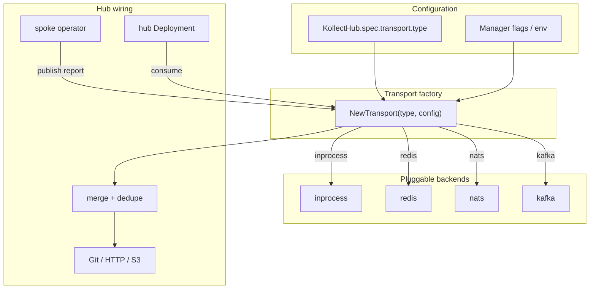
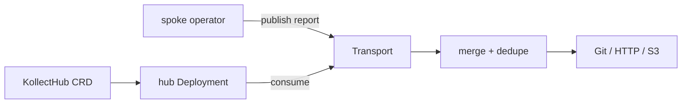

# ADR-0023: Lean queue transport for hub fan-in

## Status

Accepted (2026-06-05)

## Context

Multi-cluster hub aggregation ([ADR-0022](0022-multi-cluster-sync-rfc.md)) needs a transport between
**spoke** operators (per cluster) and the **hub** (`KollectHub` CRD → operator-managed Deployment).
Requirements:

- **Low operational burden** for a Phase 1–2 hub prototype (personal/small-platform scale first).
- **Pluggable** — no hard dependency on Kafka or a specific vendor; teams that standardize on Kafka
  must be able to select it via configuration without forking kollect.
- **At-least-once** delivery acceptable; hub merge is idempotent on `(cluster, namespace, name, uid)`.
- Payloads are **summarized inventory JSON** (not full object dumps) per [ADR-0006](0006-etcd-limit.md).
- Every shipped backend must be **provable in integration or e2e tests** with reasonable effort
  (testcontainers or kind-sidecar).

## Options evaluated

| Transport | Ops footprint | Ordering / retention | testcontainers-go | Fit |
| --- | --- | --- | --- | --- |
| **In-process channel** | None (single process) | In-memory only; lost on restart | N/A (no container) | **Dev/test default** — unit, envtest, local kind |
| **Redis Streams** | Often already present; single Deployment | `XREADGROUP`, trimming, persistence | `modules/redis` — mature, fast CI spin-up | **Phase 2 spike candidate only** — not production default |
| **NATS JetStream** | Small binary; single server or K8s Deployment | Streams, consumer groups, replay | `modules/nats` — available | **Second lean driver** — same interface, config-selected |
| **Kafka** | Cluster + KRaft, topic ops | Durable log, enterprise tooling | Heavier (KRaft or Redpanda module) | **Optional enterprise backend** — only when team needs it |

### Redis Streams (Phase 2 spike pick)

- Pros: `testcontainers-go/modules/redis` is lightweight and widely used in CI; many platforms already
  run Redis; `XREADGROUP` gives consumer groups and at-least-once semantics.
- Cons: Redis not universal; memory pressure if retention unbounded — configure `MAXLEN` / trimming.

### NATS JetStream

- Pros: purpose-built messaging; small footprint; good Go client; stream retention policies.
- Cons: another service if not already in the estate; TLS/auth configuration.

### In-process channel

- Pros: zero deps; fastest TDD loop for hub merge logic inside one binary.
- Cons: no cross-pod or cross-cluster delivery — only for **prototype wiring** before external bus.

### Kafka

- Pros: enterprise standard, long retention, ecosystem — matches teams that already operate Kafka.
- Cons: heavy for Phase 1; topic/partition design; **must remain optional** and config-pluggable.

## Decision

1. **Transport abstraction:** all hub and in-operator messaging goes through a **`Transport` interface**
   (`Publisher` / `Subscriber` in `internal/transport/`). Backends implement the same contract; no
   controller imports a vendor SDK directly.

2. **Configurable backend selection** (manager flags and/or `KollectHub.spec.transport`):

   | `spec.transport.type` | When |
   | --- | --- |
   | `inprocess` | **Default everywhere** until an external backend passes integration/e2e proof |
   | `redis` | Phase 2 **spike** backend — testcontainers validation; explicit opt-in only |
   | `nats` | Alternative lean backend — same interface, explicit opt-in |
   | `kafka` | Optional enterprise backend — never required for install or CI |

   **No transport type is a silent production default except `inprocess`.** Helm chart and
   `KollectHub` samples must not pre-select Redis/NATS/Kafka.

   Connection details (URL, credentials, stream/topic names) live under `spec.transport.config` or
   equivalent secret refs — exact CRD shape is an implementation detail.

3. **Phase order:**
   - **Phase 1 / dev:** `inprocess` — validate merge + export without external infra.
   - **Phase 2 spike:** **Redis Streams** — prove hub fan-in via testcontainers; **not** promoted
     to production default until load test at target spoke count; operators choose backend explicitly.
   - **Phase 2+:** NATS JetStream driver behind the same factory (config, not compile-time).
   - **Enterprise optional:** Kafka driver — ship only when integration-tested; never a hard dependency.

4. **Backend admission rule:** **do not merge a transport backend** unless it can be exercised in an
   integration or e2e test with reasonable effort (testcontainers module or documented kind sidecar).
   In-process is exempt (no container). Kafka is deferred until that bar is met.

5. Spoke → hub message schema (sketch, not API):

```json
{
  "apiVersion": "kollect.dev/v1alpha1",
  "cluster": "prod-eu-1",
  "inventoryRef": { "namespace": "team-a", "name": "team-inventory" },
  "generation": 42,
  "summary": { "itemCount": 120, "checksum": "sha256:..." },
  "payloadRef": "optional object-store key for large bodies"
}
```

## Transport factory (reference)



## Hub wiring (reference)



## Consequences

### Positive

- Clear spike order: in-process → Redis → NATS (config) → optional Kafka.
- Hub collector testable in envtest with in-process transport; Redis provable via testcontainers.
- Enterprise Kafka teams select backend via CRD — no fork required.
- Factory pattern keeps vendor SDKs out of reconcilers.

### Negative

- Multiple lean backends (Redis + NATS) may both need maintenance if both ship — none are implicit
  defaults; `inprocess` remains fallback until ops selects an external type.
- Message schema versioning requires discipline — `apiVersion` field is mandatory in payloads.

## Open questions

- **OPEN:** Hub pulls from queue vs queue pushes to hub webhook sidecar?
- **OPEN:** Exactly-once needed for billing/audit, or is at-least-once + idempotent merge enough?
