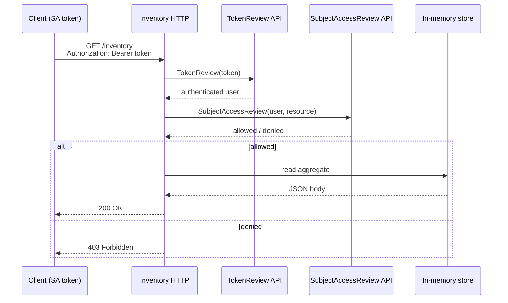
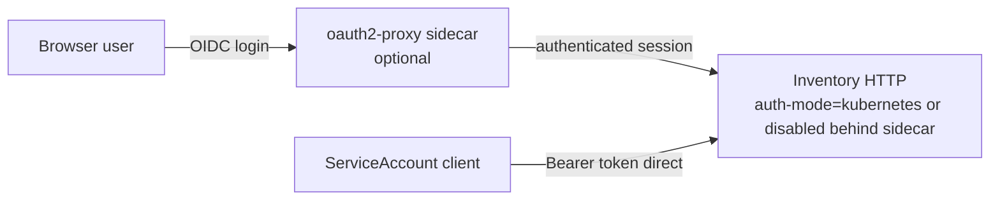

# ADR-0024: Inventory HTTP API authentication

## Status

Accepted (2026-06-05)

## Context

The read-only inventory HTTP API ([ADR-0006](0006-etcd-limit.md)) exposes aggregated collection
data for portals and automation. Production deployments require authentication and authorization without
forcing every consumer to run inside the cluster network.

Options considered:

| Approach | Pros | Cons |
| --- | --- | --- |
| **Kubernetes API auth delegation** | Native SA tokens; TokenReview + SAR; no extra identity stack | Callers need a valid K8s token; RBAC must grant inventory read |
| **oauth2-proxy sidecar** | OIDC/login flows for human browsers; familiar ingress pattern | Extra container; not primary for service-to-service |
| **Static API keys in operator** | Simple | Secret rotation burden; not K8s-native |
| **mTLS only** | Strong transport identity | Certificate lifecycle; awkward for portal browsers |

Early design notes mentioned oauth2-proxy as a possible auth layer. User feedback (2026-06-05):
oauth2-proxy remains a **well-documented optional sidecar**, not the primary auth mechanism.

## Decision

1. **Primary auth: Kubernetes-native delegation.** When inventory HTTP is enabled, the operator
   validates callers using the Kubernetes API:
   - **`TokenReview`** — verify the bearer token (`Authorization: Bearer <token>`) and resolve the
     authenticated user (typically a `ServiceAccount` or user subject).
   - **`SubjectAccessReview`** — authorize the subject for the inventory read action (e.g.
     `get` on `kollectinventories` or a dedicated non-resource URL / subresource — exact SAR shape
     is an implementation detail tied to RBAC markers).

2. **Default auth mode:** manager flag **`--inventory-auth-mode=kubernetes`** (default). Modes:
   - `kubernetes` — TokenReview + SAR (production default).
   - `disabled` — no auth (local dev / CI only; must log a startup warning).

3. **Caller contract:** standard **`Authorization: Bearer`** header with a Kubernetes service account
   token (bound or legacy) or other token accepted by the apiserver's TokenReview. No custom kollect
   API-key header in the core path.

4. **Optional oauth2-proxy sidecar (Helm):** for human/browser access via OIDC, document an optional
   **Helm subchart or sidecar** pattern:
   - `oauth2Proxy.enabled: false` **by default** in `charts/kollect/values.yaml`.
   - When enabled, oauth2-proxy terminates OIDC login and forwards to the operator inventory port;
     service-to-service callers should still use K8s bearer tokens directly (bypass sidecar or use
     internal Service without oauth2-proxy).
   - Document in `charts/kollect/README.md` — not implemented until HTTP API ships; values reserved.

5. **RBAC:** chart and docs ship ClusterRole/Role rules for inventory HTTP consumers; SAR checks align
   with least-privilege read of inventory data in the caller's permitted namespaces.

## Auth flow (reference)

## Optional oauth2-proxy (browser path)

When oauth2-proxy is enabled, configure it in front of the inventory port for ingress-facing browser
traffic. Automated clients with service account tokens connect directly to the operator Service on the
inventory port — no oauth2-proxy hop.

## Consequences

### Positive

- Reuses cluster identity — no parallel user database or API-key store.
- SAR enforces namespace/tenant boundaries consistent with `KollectScope` (Phase 3).
- oauth2-proxy available for OIDC/browser UX without blocking service-to-service auth.
- `disabled` mode keeps local kind smoke and unit tests simple.

### Negative

- External callers outside the cluster need a valid K8s token (e.g. projected SA token, exec credential).
- TokenReview + SAR adds apiserver round-trips per request — cache short-lived auth decisions if hot path.
- oauth2-proxy sidecar not implemented in Phase 1 — documented pattern only until HTTP ships.

## Open questions

- **OPEN:** Exact SAR resource (subresource on `KollectInventory` vs custom non-resource URL)?
- **OPEN:** Cache TTL for TokenReview/SAR results under high portal traffic?
- **OPEN:** HTTP path versioning (`/v1alpha1/inventory` vs `/inventory`) — see ADR-0006.

## See also

- [ADR-0006: Data storage and etcd limit](0006-etcd-limit.md) — HTTP API scope
- [charts/kollect/README.md](../../charts/kollect/README.md) — Helm auth configuration
