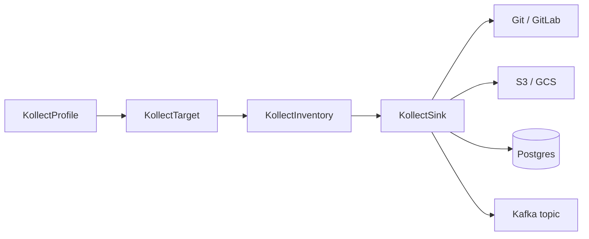

# ADR-0025: Sink backends — Postgres and Kafka

## Status

Accepted (2026-06-05)

## Context

kollect exports aggregated inventory to pluggable **`KollectSink`** backends ([ADR-0004](0004-crd-model.md),
sink registry). Git and object storage are in flight; the user's platform also needs:

- **Durable queryable storage** (Postgres) for portals and SQL analytics
- **Event streaming** (Kafka) for downstream consumers (audit, fan-out, hub-adjacent pipelines)

Doc-sync / Confluence is **out of scope** ([ADR-0011](0011-doc-sync-templating.md)). Database and
Kafka sinks are **first-class export targets** alongside Git, S3, and GCS — not deferred to a
separate "documentation" phase.

Operator **Prometheus metrics** remain on the controller `/metrics` endpoint ([ADR-0012](0012-prometheus-metrics-stub.md));
they are not a `KollectSink` export type.

## Decision

### Sink types

Extend `KollectSink.spec.type` enum (webhook allow-list + Go registry):

| `type` | Library (preferred) | Role |
| --- | --- | --- |
| `postgres` | `github.com/jackc/pgx/v5` (or `database/sql` + driver) | Upsert keyed rows and/or append JSON events |
| `kafka` | `github.com/IBM/sarama` or `github.com/twmb/franz-go` | Publish inventory change messages to a topic |

Existing types unchanged: `git`, `gitlab`, `s3`, `gcs`.

### Data shape

**Default contract:** one JSON document per inventory export cycle (aggregated namespace snapshot),
stable key ordering ([GUIDELINES.md](https://github.com/konih/kollect/blob/main/GUIDELINES.md)).

| Backend | Mode | Notes |
| --- | --- | --- |
| **Postgres** | **Upsert** keyed rows (`inventory_id`, `cluster`, `namespace`, `target`, `gvk`, `name`, `uid`, `generation`, `payload` jsonb, `exported_at`) | Schema/table configurable on sink spec |
| **Postgres** | **Append-only events** table (optional alternate `spec.postgres.mode`) | Full snapshot JSON per row |
| **Kafka** | **Message per export** (aggregated) | Key = `inventory.namespace/name`; value = JSON payload |
| **Kafka** | **Optional:** finer-grained change events later | Phase 1+ ships aggregated export messages first |

### `KollectSink` spec (sketch)

**Postgres**

- `secretRef` — connection string or `username`/`password`/`host` keys (never inline secrets)
- `database`, `schema`, `table` (required)
- `tls` — same CA patterns as Git ([ADR-0004](0004-crd-model.md))
- `mode`: `upsert` | `append` (default `upsert`)

**Kafka**

- `brokers[]`, `topic` (required)
- `secretRef` — optional SASL/SCRAM or TLS client certs
- `headers` — optional static map; operator adds `kollect.dev/cluster`, `namespace`, `gvk` when known
- `compression`, `acks` — sensible defaults; advanced fields optional

### End-to-end testing (merge gate)

Before marking either backend **done** in [ROADMAP.md](../ROADMAP.md):

- **testcontainers-go** — Postgres official image; **Redpanda** or Kafka-compatible image for broker
- Integration tests: apply sample CRs → export → assert row count / consumed message headers+body
- CI job runs integration package (same bar as Git/S3 sinks)

### Architecture

## Consequences

### Positive

- Fits team Kafka usage without overloading hub transport ([ADR-0023](0023-lean-queue-transport.md)).
- SQL backends enable portal queries without cloning Git repos.
- Clear separation from rejected doc-sync ([ADR-0011](0011-doc-sync-templating.md)).

### Negative

- Postgres schema migrations are operator-external unless we ship opinionated DDL in docs.
- Kafka ordering/idempotency is consumer's responsibility; document at-least-once export semantics.
- Two more backends to test and harden (connection test, circuit breaker per [ADR-0020](0020-error-taxonomy.md)).

## Open questions

- **OPEN:** SQLite embedded sink for dev-only vs skip entirely (Postgres testcontainers sufficient)?
- **OPEN:** Kafka message key strategy for multi-cluster hub merge — cluster label in key vs value only?
- **OPEN:** Postgres `upsert` primary key — `(inventory, target, uid)` vs hash of row body?

## See also

- [ADR-0004: CRD model](0004-crd-model.md)
- [ADR-0020: Error taxonomy](0020-error-taxonomy.md)
- [REQUIREMENTS.md](../REQUIREMENTS.md)
