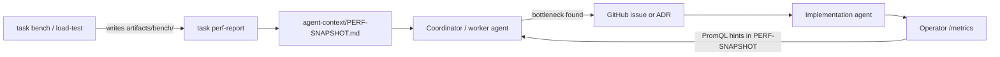

# ADR-0027: Agent-visible performance observability

## Status

Accepted

## Context

kollect must scale to **100+ clusters** and **giant single clusters** (1000s of nodes, 10k+
watched resources). Performance bottlenecks must be identified **before** architectural lock-in.

Human operators use Prometheus and pprof. **Coordinator and worker agents** building the repo need
structured, low-cost signals they can read without running full clusters or burning dev machines on
every iteration. Today, benchmark output is scattered across terminal history and CI logs.

## Decision

1. **`task perf-report`** — single entry point that emits **JSON** (default) or human-readable text:
   - Last `task build` duration (from `.task/` cache metadata when available)
   - Last `task test` / `task bench` duration and exit status
   - Latest `go test -bench` results from `artifacts/bench/` (written by `task bench`)
   - Key metric names with **PromQL hints** (see [PERFORMANCE.md](../PERFORMANCE.md))
   - Scale tier labels (`dev`, `load`, `ci`) so agents know which bounds apply

2. **`agent-context/PERF-SNAPSHOT.md`** — local-only, gitignored snapshot regenerated by
   `task perf-report --format=markdown`. Coordinator agents read this before assigning perf work;
   workers append deltas after benchmark or load-test runs. Never committed.

3. **CI benchmark artifacts** — optional upload of `artifacts/bench/*.txt` on nightly or
   `workflow_dispatch` workflows (`retention-days: 14`). PR CI does **not** require bench artifacts.

4. **Metrics catalog** — [PERFORMANCE.md](../PERFORMANCE.md) documents every operator metric with
   name, type, labels, PromQL examples, and **agent interpretation** (what rising values imply).

5. **Feedback loop** — agents use perf-report → PERF-SNAPSHOT → bottleneck identification → issue or
   ADR amendment; implementation agents wire new metrics before optimizing blind.

## Consequences

### Positive

- Agents can triage perf regressions without re-running 10k-object load tests locally.
- Single catalog ties runtime metrics, benchmarks, and scale targets ([ADR-0026](0026-performance-scalability.md)).
- CI artifacts give a historical baseline for coordinator review.

### Negative

- `perf-report` depends on local artifact layout; task definitions must stay stable.
- PERF-SNAPSHOT is stale unless agents run `task perf-report` after meaningful changes.

## Implementation notes (for agents)

| Deliverable | Owner phase | Status |
| --- | --- | --- |
| `task perf-report` in Taskfile | Phase 1 | ⬜ |
| `artifacts/bench/` output from `task bench` | Phase 1 | ⬜ |
| PERF-SNAPSHOT markdown template | Phase 1 | ⬜ |
| CI artifact upload (nightly) | Phase 1 | ⬜ |
| Metrics catalog section in PERFORMANCE.md | Phase 1 | ✅ |

## References

- [ADR-0026](0026-performance-scalability.md) — scale targets and operator tuning
- [ADR-0022](0022-multi-cluster-sync-rfc.md) — hub/spoke scale path
- [PERFORMANCE.md](../PERFORMANCE.md) — metrics catalog and PromQL hints
