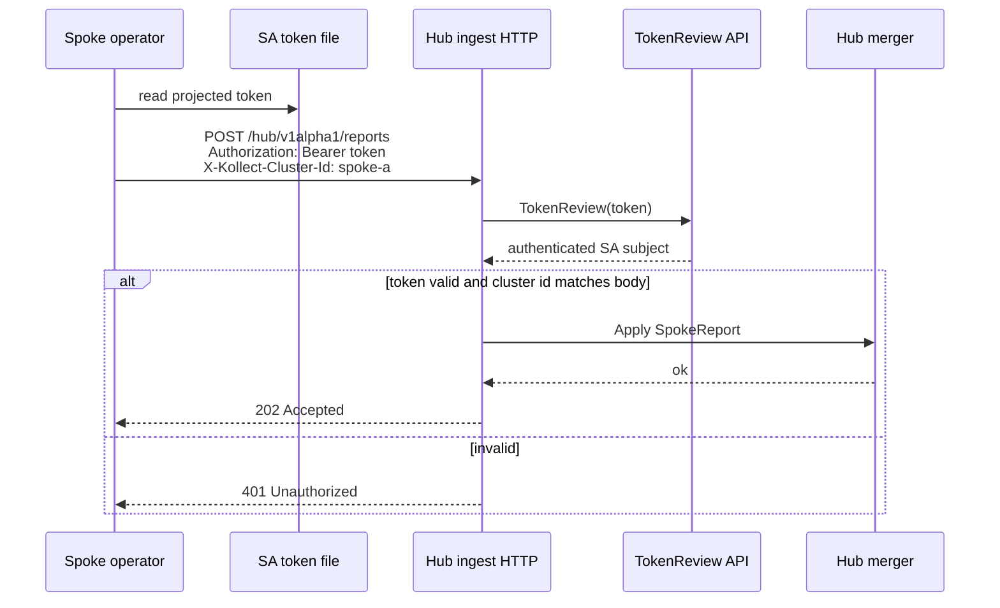

# ADR-0028: Hub cluster authentication (Istio remote-secret pattern)

## Status

Accepted (2026-06-05)

## Context

Multi-cluster inventory fan-in ([ADR-0022](0022-multi-cluster-sync-rfc.md)) requires **authenticated
spoke → hub** channels at 100+ cluster scale. Inventory HTTP read auth is already settled
([ADR-0024](0024-inventory-api-auth.md)); hub/spoke transport auth is a **separate concern** —
spokes push summarized deltas, hubs validate identity before merge.

[Istio multicluster](https://istio.io/latest/docs/setup/install/multicluster/) solves a related
problem: a **primary** control plane must reach **remote** Kubernetes API servers. The established
pattern is:

| Istio mechanism | Purpose |
| --- | --- |
| **Remote secret** | `Secret` in primary cluster with base64 kubeconfig fragment (API URL + SA token + CA) |
| **Label** `istio/multiCluster: "true"` | Tells Istiod to watch and register the secret |
| **Annotation** `networking.istio.io/cluster: <name>` | Stable cluster identity for routing and discovery |
| **`istioctl create-remote-secret`** | GitOps-friendly generator from remote-cluster SA credentials |
| **Trust** | Shared root or federated CA; **mTLS** for east-west workload traffic |
| **Topologies** | Primary-remote (one control plane) and multi-primary (peered control planes) |

kollect maps to **hub-and-spoke** ([ADR-0022](0022-multi-cluster-sync-rfc.md)): hub aggregates;
spokes stay lightweight. We do **not** need Istio's full mesh trust plane for inventory deltas, but
the **credential registration model** transfers cleanly.

Options considered:

| Approach | Pros | Cons |
| --- | --- | --- |
| **Istio-style remote credential `Secret` + `KollectRemoteCluster` CR** | GitOps-friendly; optional hub pull; familiar to platform teams | Secret lifecycle; hub must list/watch secrets |
| **Push-only Bearer SA token + TokenReview** | Scales to 100+ spokes; no hub API reach into spokes; reuses [ADR-0024](0024-inventory-api-auth.md) | Spokes need routable hub ingress; token rotation |
| **mTLS client certs per spoke** | Strong transport identity | Cert ops at 100+ scale; CSR/bootstrap complexity |
| **OIDC / static API keys** | Simple for non-K8s spokes | Parallel identity stack; rotation burden |

## Decision

Adopt a **hybrid** model aligned with Istio's remote-secret **registration** pattern and kollect's
**push-first** scale target.

### 1. `KollectRemoteCluster` CR (namespaced on hub)

Declarative registration of a spoke cluster in the hub namespace (platform team scope):

| Field | Role | Istio parallel |
| --- | --- | --- |
| `spec.clusterName` | DNS-1123 spoke identity | `networking.istio.io/cluster` annotation |
| `spec.credentialsSecretRef` | Optional kubeconfig fragment for **hub pull** | `istio-remote-secret-*` data key |
| `spec.apiServerURL` | Optional spoke API URL (pull / health only) | kubeconfig `server` field |
| `spec.trustBundle` | PEM CA for spoke API or future mTLS | kubeconfig `certificate-authority-data` |

Status stub: `Connected` condition (minimal; full reconciler deferred).

### 2. Istio-like credential `Secret` (optional pull path)

For GitOps and hub-pull scenarios, spokes (or a bootstrap Job) apply a labeled secret to the hub:

```yaml
apiVersion: v1
kind: Secret
metadata:
  name: kollect-remote-secret-spoke-a
  namespace: platform
  labels:
    kollect.dev/multiCluster: "true"
  annotations:
    kollect.dev/cluster: spoke-a
type: Opaque
data:
  spoke-a: <base64-kubeconfig-fragment>
```

`KollectRemoteCluster.spec.credentialsSecretRef` points at this secret — same ergonomics as
`istioctl create-remote-secret | kubectl apply` ([Istio primary-remote install](https://istio.io/latest/docs/setup/install/multicluster/primary-remote/)).

### 3. Push path (default at 100+ clusters)

Spokes POST summarized `SpokeReport` JSON to hub ingress:

- **`Authorization: Bearer <in-cluster SA token>`** — validated on hub via **`TokenReview`**
  ([ADR-0024](0024-inventory-api-auth.md) pattern).
- **`X-Kollect-Cluster-Id: <spec.clusterName>`** — must match `SpokeReport.cluster` body field.
- Hub flag **`--hub-ingest-auth-mode=kubernetes`** (default); `disabled` for dev/CI only.

Lean queue transports (Redis/NATS/Kafka) remain **unauthenticated at the wire** in Phase 2 spike;
HTTP push is the reference authenticated channel. Queue ACLs/TLS are a later hardening step.

### 4. `KollectHub` references remote clusters

`KollectHub` continues to own transport + Deployment; platform teams pair it with
`KollectRemoteCluster` objects per registered spoke. Full `spec.remoteClusters[]` on `KollectHub`
is **deferred** — discovery via `KollectRemoteCluster` list in the hub namespace is sufficient
for Phase 2.

## Push auth flow (default)



## Optional pull registration (Istio-style)

```mermaid
sequenceDiagram
  participant GitOps as GitOps / bootstrap Job
  participant HubNS as Hub namespace
  participant CR as KollectRemoteCluster
  participant Hub as Hub operator (future)

  GitOps->>HubNS: apply Secret<br/>label kollect.dev/multiCluster=true<br/>annotation kollect.dev/cluster=spoke-a
  GitOps->>HubNS: apply KollectRemoteCluster<br/>credentialsSecretRef → secret
  Note over Hub: Future reconciler reads kubeconfig<br/>for pull/health; push remains default
  CR-->>Hub: spec.clusterName + trustBundle
```

## Comparison: Istio vs kollect

| Dimension | Istio multicluster | kollect hub-and-spoke |
| --- | --- | --- |
| **Registration** | Labeled `Secret` + cluster annotation | `KollectRemoteCluster` CR + optional same-label `Secret` |
| **Generator** | `istioctl create-remote-secret` | GitOps manifest / future `kollect` CLI |
| **Default data plane** | mTLS east-west between workloads | Summarized inventory deltas (no workload mesh) |
| **Default control traffic** | Istiod → remote API (pull watches) | Spoke → hub HTTP push (TokenReview) |
| **Identity** | SA token in kubeconfig + mesh CA | SA bearer token + `X-Kollect-Cluster-Id` |
| **Trust** | Shared/federated mesh CA | Hub apiserver TokenReview; optional `trustBundle` for pull/mTLS later |
| **Topology** | Primary-remote / multi-primary | Hub-and-spoke only ([ADR-0022](0022-multi-cluster-sync-rfc.md)) |
| **Scale bias** | Tens of clusters per mesh | **100+** spokes, push-first |

## Consequences

### Positive

- Platform teams already running Istio multicluster recognize the credential secret + cluster name model.
- Push + TokenReview avoids hub→spoke API connectivity requirements at scale.
- Pull path remains available for health checks and future hub-initiated collection without redesign.
- Reuses Kubernetes-native auth from [ADR-0024](0024-inventory-api-auth.md).

### Negative

- Two paths (push auth vs pull secrets) must stay documented to avoid confusion.
- Queue transports need separate TLS/ACL hardening before production multi-tenant hubs.
- `KollectRemoteCluster` reconciler (Connected status, secret rotation) not implemented in this ADR — stub only.

## Open questions

- **OPEN:** SAR shape for hub ingest — `create` on `kollectremoteclusters` vs custom non-resource URL?
- **OPEN:** `kollect create-remote-secret` CLI — wrap kubeconfig generation like `istioctl`?
- **OPEN:** Federated trust / mTLS for HTTP ingress behind non-Kubernetes load balancers?
- **OPEN:** Map `KollectRemoteCluster` list into `KollectHub` spec for shard routing?

## See also

- [ADR-0022: Multi-cluster sync topology](0022-multi-cluster-sync-rfc.md)
- [ADR-0023: Lean queue transport](0023-lean-queue-transport.md)
- [ADR-0024: Inventory HTTP API authentication](0024-inventory-api-auth.md)
- [Istio: Install multi-cluster — primary-remote](https://istio.io/latest/docs/setup/install/multicluster/primary-remote/)
- [Istio: `istioctl create-remote-secret`](https://github.com/istio/istio/blob/master/istioctl/pkg/multicluster/remote_secret.go)
