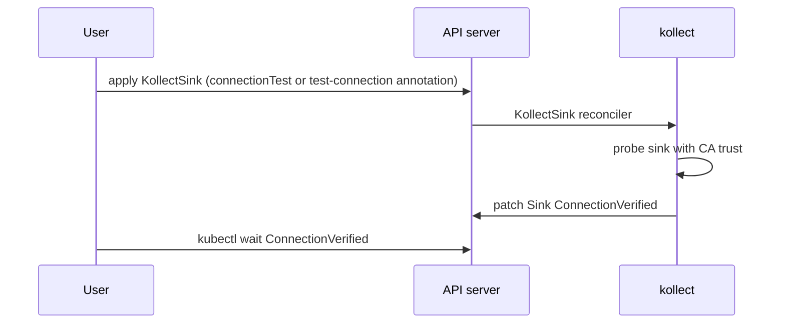

# ADR-0202: Static config vs reconciled CRDs

> Config kinds (`Profile`, `Scope`) are static with no controller; work kinds are reconciled.

**Theme:** 02 · API & tenancy · **Status:** Current

## Context

Operators differ on whether configuration CRDs get their own reconciler:

- **Flux notification-controller `Provider` and `Alert`** have **no status subresource** and no
  dedicated controller — they are referenced by reconciled `Receiver` and event dispatch logic.
- **external-secrets `SecretStore`** is reconciled (validates provider, writes status conditions).
- **Flux source-controller `GitRepository`** is fully reconciled with rich status (artifact revision).

Kollect has configuration objects (`KollectProfile`, `KollectSink`) that change infrequently and
work objects (`KollectTarget`, `KollectInventory`) that drive continuous collection and export.

At **large fleet scale**, shared GVK definitions may be duplicated per namespace or published via future
`KollectClusterProfile`; per-target overrides may be needed later without forking profiles.

## Decision

| Category | Kinds | Controller | Status | Validation |
| --- | --- | --- | --- | --- |
| Static config | `KollectProfile`, `KollectScope` (namespaced) | None | None | CEL `x-kubernetes-validations`, **validating webhook** ([ADR-0203](0203-namespaced-multi-tenancy.md)) |
| Static + probe | `KollectSink` | **Minimal** — connection test only ([ADR-0403](0403-connection-test.md)) | `ConnectionVerified`, `TLSInsecure`, `Degraded` | Webhook + probe reconciler |
| Reconciled | `KollectTarget`, `KollectInventory` | Yes | Full conditions + `observedGeneration` | Same + runtime SAR checks |

Rationale (Flux-aligned):

- Cuts controllers and status write churn for rarely changing config.
- Profile edits still trigger dependent reconciles via secondary watches on referencing objects.
- `spec.suspend` on **reconciled** kinds only; static objects are always "active" when referenced.

**Reject** full reconciliation of `KollectProfile` like ESO `SecretStore`. **`KollectSink`** is the
exception: a narrow reconciler for connectivity only ([ADR-0403](0403-connection-test.md)).

### Shared GVK, optional per-target overrides

- **Default:** `KollectTarget.spec.profileRef` names a `KollectProfile` in the **same namespace**
  ([ADR-0204](0204-namespaced-profiles.md)).
- **Future door:** optional inline attribute overrides or `profileRef` + patch fields on Target —
  design keeps API evolvable without breaking shared profiles ([ADR-0201](0201-crd-model.md)).

### Concurrent GVK watches

Research and document an informed default for **maximum concurrent GVK informers** before memory/API
pressure. Expose manager configuration:

- `maxConcurrentWatches` — soft limit with warning Event when approached
- Tune with envtest/load tests; document default in Helm `values.yaml` comments

Prefer **one shared informer per GVK** across Targets ([ADR-0301](0301-event-driven-informers.md)).

### Connection test (first-class)

See **[ADR-0403](0403-connection-test.md)** — **no `KollectConnectionTest` CR**.

| Mechanism | Behavior |
| --- | --- |
| **`spec.connectionTest: true`** on `KollectSink` | Probe on create/update |
| **Annotation `kollect.dev/test-connection: "true"`** | One-shot re-test on the sink |
| **`ConnectionVerified` on `KollectSink`** | `kubectl wait --for=condition=ConnectionVerified=...` |
| **Pipeline conditions (follow-up)** | `SinkReachable` (or export conditions) on `KollectInventory` / `KollectTarget` |

Connection tests run from the operator with the same TLS trust as export ([ADR-0201](0201-crd-model.md)
`caBundle` / `caSecretRef`). Errors are **visible and informative** (HTTP status, DNS, TLS handshake)
— sanitized, no secrets in messages.

### Collected object generation annotation

When exporting or summarizing a source object, record the source `metadata.generation` on collected
rows or export metadata via annotation:

- `kollect.dev/collectedGeneration: "<n>"`

Enables consumers to detect stale inventory vs live object without full payload in status.

## Consequences

### Positive

- Fewer moving parts, fewer leader-election reconciler loops.
- Clear mental model: config CRDs are like Flux Providers; workload CRDs are like GitRepositories.
- Connection test gives human-user-0 fast feedback via minimal Sink reconciler ([ADR-0403](0403-connection-test.md)).

### Negative

- Invalid sink credentials may still first appear at export unless user runs connection test.
- `kubectl wait --for=condition=Ready` does not apply to Profile/Sink.
- `maxConcurrentWatches` tuning is cluster-dependent — wrong default causes silent memory pressure.

## Open questions

- **RESOLVED (2026-06-05):** No `KollectConnectionTest` CR — spec + annotation on Sink ([ADR-0403](0403-connection-test.md)).
- **OPEN:** Per-target profile override API shape — inline map vs `KollectProfilePatch` kind?
