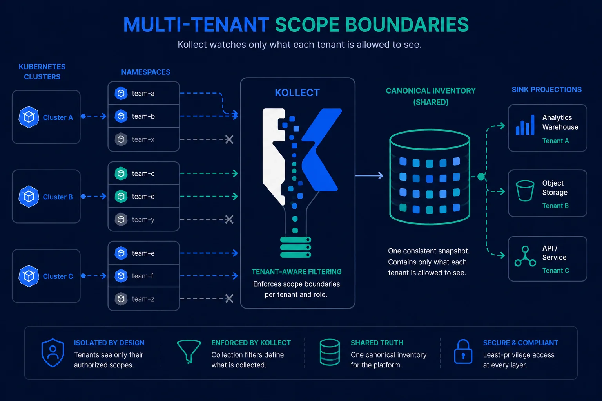

# ADR-0203: Namespaced multi-tenancy and operator watch scope

> Namespaced-by-default tenancy; `KollectScope` hard-degrades a target/inventory that violates it.

**Theme:** 02 · API & tenancy · **Status:** Current

## Context

{ .kollect-illus .kollect-illus--wide width="800" }

Platform teams need Kollect to run safely alongside many tenant teams on one cluster. Prior art
([ADR-0102](0102-prior-art.md)) compares:

- **external-secrets** — one cluster-scoped controller reconciling both `ClusterSecretStore` and
  namespaced `SecretStore`, plus optional **per-namespace controller** installs via Helm
  `controller.watchNamespaces` / `scopedNamespace`.
- **Argo CD** — `AppProject` tenancy boundary with a single cluster-scoped controller.

Kollect already ships **namespaced** `KollectTarget`, `KollectInventory`, and `KollectScope`
([ADR-0201](0201-crd-model.md)). The open question was whether tenancy enforcement and operator
deployment scope should wait until Phase 3.

## Decision

**Namespaced multi-tenancy is Phase 1 priority (ASAP), not Phase 3.**

Support **both** deployment models. **Golden path (default):** platform cluster-wide operator
with per-tenant namespaced **`KollectScope`**. Team-owned operator installs are supported but
**lowest priority** for documentation and chart defaults.

| Model | When | Mechanism |
| --- | --- | --- |
| **Cluster-scoped manager (golden path)** | Platform team operates one shared operator | Watches all namespaces; **`KollectScope`** per tenant namespace governs GVKs, workload namespaces, and sink refs |
| **Per-team manager** | Delegated / team-owned installs | Helm with `watchNamespaces: [team-a]` and **`tenantMode: true`** — namespaced Role RBAC; namespaced Profile/Sink/Target/Inventory in team namespace ([ADR-0201](0201-crd-model.md)) |

### Operator watch scope

- **Documented default for new installs (golden path):** cluster-scoped manager (empty
  `watchNamespaces`) with per-tenant **`KollectScope`** objects.
- **Platform option:** empty `watchNamespaces` → watches **all namespaces** (cluster-scoped operator).
- **Team-scoped (supported, lowest doc priority):** non-empty `watchNamespaces` + `tenantMode: true`
  → `cache.Options{DefaultNamespaces}` restricts informers and reconcilers to those namespaces only
  ([controller-runtime cache options](https://pkg.go.dev/sigs.k8s.io/controller-runtime/pkg/cache#Options)).

### RBAC expectations

- **CRD install** requires cluster-level permissions (standard for any operator).
- **Reconciler runtime** for team-owned installs must work with **namespace-scoped Role RBAC only**
  when `tenantMode: true` — no cluster-wide list/watch beyond what cluster owners accept for CRD
  bootstrap.
- Platform golden-path installs use ClusterRole as today.

### Overlapping operator installs

Multiple independent operator deployments **may** watch the same GVK/namespace data intentionally.
Kollect does **not** enforce namespace ownership or reject overlapping watch scopes via webhook.
Operational policy and optional sink dedupe ([ADR-0305](0305-aggregation-dedupe.md)) are the
backstop when duplicate collection is undesirable — not admission guardrails.

Helm values:

```yaml
watchNamespaces: []          # empty = all namespaces
tenantMode: false            # true → Role instead of ClusterRole for the manager SA
```

Manager flag: `--watch-namespaces=team-a,team-b` (comma-separated).

### `KollectScope` (namespaced, static)

- **Scope:** namespaced ([ADR-0201](0201-crd-model.md)); one object per tenant namespace.
- **Validation:** validating webhook rejects invalid GVK entries, duplicate `sinkRefs`, and blank
  allowlist entries at admission ([ADR-0202](0202-static-vs-reconciled.md)).
- **Enforcement (Phase 1):** **both** validating webhook **and** reconciler-time checks — **hard
  degrade** (no collection / no export) when a `KollectTarget` or `KollectInventory` violates scope.
  Set **`Degraded=True`** with reason `ScopeGVKDenied`, `ScopeNamespaceDenied`, or `ScopeSinkDenied`;
  emit Warning event. Do **not** soft-warn and continue reconciling forbidden config.

`KollectClusterScope` remains reserved for platform-wide policy when namespaced scope is
insufficient ([ADR-0201](0201-crd-model.md)). **Frozen/minimal** — no new behavioral knobs without
a concrete platform blocker.

### `KollectClusterInventory` federation

Platform rollups use **`KollectClusterInventory`** to compose namespace snapshots/shards — explicit
federation, not implicit whole-cluster capture:

- **`spec.namespaces` (optional):** explicit namespace names when set; empty or absent carries
  documented semantics (not a required field)
- Optional namespace selectors for additive discovery when enabled
- Rollup export built from shard references; status should eventually expose per-namespace shard
  metadata (see [ROADMAP.md](../ROADMAP.md))

### Enforcement example (GVK denied)

`KollectScope` in `team-a` allows only `apps/v1 Deployment`. A team applies a `KollectTarget` whose
`profileRef` resolves to a Profile targeting Flux `HelmRelease`:

```yaml
# team-a/kollectscope.yaml — allowlist
apiVersion: kollect.dev/v1alpha1
kind: KollectScope
metadata:
  name: team-a-scope
  namespace: team-a
spec:
  allowedGVKs:
    - group: apps
      version: v1
      kind: Deployment
  allowedNamespaces: [team-a]
  sinkRefs: [team-a-postgres]
---
# team-a/kollecttarget.yaml — violates allowedGVKs
apiVersion: kollect.dev/v1alpha1
kind: KollectTarget
metadata:
  name: helm-releases
  namespace: team-a
spec:
  profileRef: helm-release-summary   # Profile targets helm.toolkit.fluxcd.io/HelmRelease
```

**Outcome:** Target reconciler does not register the informer watch. Status:

```yaml
status:
  conditions:
    - type: Degraded
      status: "True"
      reason: ScopeGVKDenied
      message: 'profile GVK "helm.toolkit.fluxcd.io/v2/HelmRelease" not in scope allowedGVKs'
```

**Inventory sink denied** — same pattern when `spec.sinkRefs` lists a sink not in
`KollectScope.spec.sinkRefs` (`ScopeSinkDenied`). Envtest: `internal/controller/kollecttarget_scope_test.go`.

## Consequences

### Positive

- Teams can adopt Kollect early with explicit tenancy boundaries.
- Platform can offer either shared or per-team operator installs without forking the binary.
- Overlapping multi-operator installs are allowed — no false sense of exclusive namespace ownership.
- Aligns with ESO and Flux Helm patterns operators already understand.

### Negative

- Two deployment models require chart and doc clarity to avoid misconfigured RBAC.
- Overlapping collection when multiple operators watch the same scope is possible — operators must
  plan sink dedupe or accept duplicate rows ([ADR-0305](0305-aggregation-dedupe.md)).
- **Resolved ([ADR-0204](0204-namespaced-profiles.md)):** `KollectProfile` moves to **namespaced**
  scope so `tenantMode` installs do not need cluster profile RBAC; `KollectClusterProfile` reserved
  for platform-shared schemas.
- Reconciler enforcement adds controller complexity and must stay consistent with webhook rules.

## Open questions

- **RESOLVED:** Family sink CRDs ship with namespaced + cluster variants; **`KollectCluster*Sink`**
  kinds are **retained long-term** — not removed pre-v1 ([ADR-0414](0414-sink-family-crds.md)).
