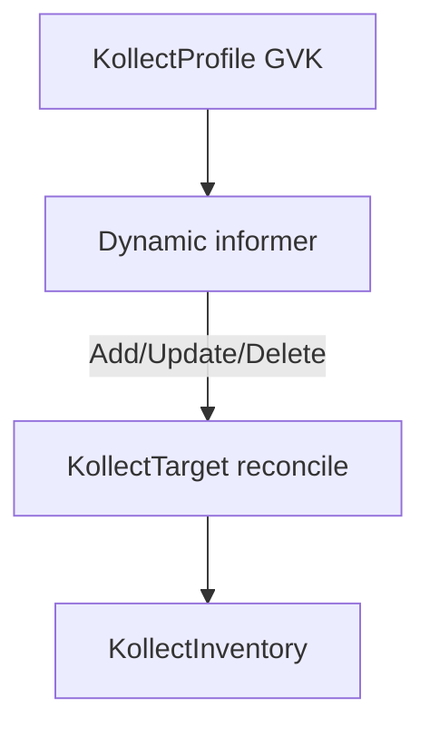

# ADR-0301: Event-driven dynamic informers

> One shared dynamic informer per GVK; collection reacts to events, never polls on an interval.

**Theme:** 03 · Collection & extraction · **Status:** Current

## Context

Kollect must watch **arbitrary GVKs** defined by `KollectProfile`, not a fixed built-in schema.
The legacy fleet-inventory-collector used batch listing on an interval — high API load, latent updates,
and poor fit for an operator.

**kube-state-metrics** registers generic informers per configured GVK and reacts to add/update/delete
events. **external-secrets** uses controller-runtime watches with dynamic scope. **Flux**
source-controller reconciles on spec changes and artifact polling intervals — a hybrid, but still
informer-backed for Kubernetes objects.

Polling the API on a short `RequeueAfter` loop would duplicate informer work and violate GUIDELINES.

## Decision

1. **Dynamic informer registration** per active `KollectProfile` GVK using controller-runtime cache
   (`unstructured.Unstructured`) and/or `client-go` `dynamicinformer`.
2. **Level-based reconcile:** each event enqueues `KollectTarget`; reconcile computes desired export
   from current cache state — idempotent, safe to repeat.
3. **Scoped watches:** honor `namespaceSelector`, `labelSelector`, and name lists on `KollectTarget`
   to bound cache memory.
4. **Long resync period** as correctness backstop only (missed events, bookmark gaps) — not a
   freshness knob.
5. **`RequeueAfter`** reserved for **external sink freshness** or time-based doc sync, never for
   watching in-cluster objects.
6. **Secondary watches:** Profile/Sink/Scope changes enqueue dependent Targets/Inventories via
   enqueue mappers.
7. **SAR-gated degradation:** if cluster-scoped list is forbidden, degrade to namespace scope and
   record `skipped:forbidden` in status (port collector logic).
8. **One shared informer per GVK** across all `KollectTarget`s referencing that profile GVK —
   not per-Target caches. The engine registers one dynamic informer per distinct
   `(group, version, kind)`; Targets filter in reconcile. Rationale: kube-state-metrics pattern;
   memory scales with watched objects × GVKs, not Targets ([ADR-0603](0603-performance-scalability.md)).
9. **Committed sample catalog** — maintain **many tested samples** for common use cases, checked into
   `config/samples/` and documented under `docs/examples/`:

| Sample | GVK / focus | CI |
| --- | --- | --- |
| Deployment inventory | `apps/v1 Deployment` | Contract / envtest where feasible |
| Service endpoints | `v1 Service` | Same |
| Ingress rules | `networking.k8s.io/v1 Ingress` | Same |
| Generic CRD | user-defined CRD instance | Golden extraction tests |
| Helm release summary | `helm.toolkit.fluxcd.io/v2` `HelmRelease` | Sample + example ([ADR-0303](0303-helm-release-inventory.md)) |
| Helm release values (gated) | Same GVK + scrubbed `spec.values` | `helm-release-values-redacted` sample + `scrubKeys[]` |
| Plain Helm releases | `helm.sh/v1` `Secret` (`owner=helm`) | Deferred until `helm:` decode |

Samples double as **documentation and regression contracts** — breaking extractor or selector behavior
should fail CI before release.

10. **Periodic end-to-end tests** — in addition to unit/envtest and sample decode checks, run a
   **full-path e2e** workflow on a schedule and on demand:

   - **Trigger:** `cron` (nightly) and `workflow_dispatch` for release validation.
   - **Scope (minimum):** install operator (Helm or kustomize), apply tested samples, assert
     `KollectTarget` / namespaced `KollectInventory` reach expected conditions or HTTP `/inventory`
     responds when enabled.
   - **Goal:** catch wiring regressions (RBAC, webhooks, informer registration, export) that fast
     tests miss.

   Documented as a binding requirement in [REQUIREMENTS.md](../REQUIREMENTS.md).

## Consequences

### Positive

- Near-real-time updates with far fewer API reads than batch polling.
- Matches controller-runtime best practices and kube-state-metrics informer model.
- Natural fit for multi-GVK profiles without codegen per type.
- Samples give human-user-0 a copy-paste path and protect refactors.

### Negative

- Dynamic informer lifecycle (register on Profile add, tear down on remove) is more complex than
  static typed informers.
- Memory scales with watched objects — requires selector discipline and profiling.
- CI must install CRDs/fixtures for generic CRD and Helm samples.

## Open questions

- **RESOLVED (2026-06-05):** **Single shared informer per GVK** across all Targets watching that GVK
  (kube-state-metrics pattern) — reduces memory vs per-Target caches.
- **RESOLVED (2026-06-05):** Primary Helm sample GVK is Flux `HelmRelease` v2 ([ADR-0303](0303-helm-release-inventory.md)).
