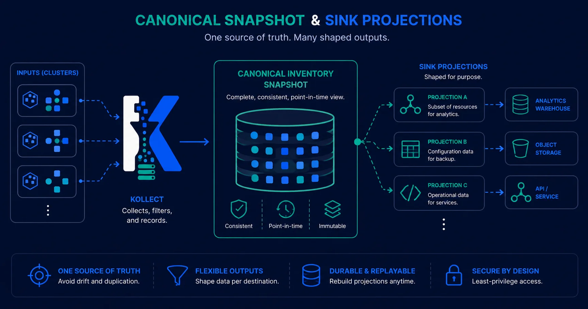

# ADR-0401: Sink taxonomy — state stores vs event emitters

> Sinks classified by role — snapshot store, relational SoR, event emitter. The in-memory snapshot is canonical.

**Theme:** 04 · Export & sinks · **Status:** Current

## Context

Postgres and Kafka serve different roles: Postgres answers *"what is deployed now?"* (queryable state);
Kafka answers *"what changed?"* (event log). Listing them as co-equal "primary sinks"
([ADR-0402](0402-sink-backends-database-kafka.md)) obscures that distinction.

Multi-cluster fan-in uses **direct shared-sink export** with `spec.cluster`
([ADR-0501](0501-multi-cluster-fleet.md)) — no operator merge tier.

Critical gaps addressed in this ADR:

1. **Role clarity** — classify backends as snapshot store, relational SoR, or event emitter.
2. **Postgres deletes** — upsert-only drifts when resources disappear; delete reconciliation is required.
3. **Event emitters** — NATS JetStream (lean default) and Kafka (enterprise opt-in) share one abstraction.

## Decision

### 1. Classify sinks by role, not by vendor

{ .kollect-illus .kollect-illus--wide width="800" }

| Role | Backends | Answers | Deletes |
| --- | --- | --- | --- |
| **Snapshot store** | Git, **S3/GCS Parquet**, HTTP | current state, written whole each cycle | **free** (absent = deleted) |
| **Relational SoR** | Postgres | current state, rich SQL/joins for portals | requires **delete reconciliation** |
| **Event emitter** | **NATS JetStream** (lean default), **Kafka/Redpanda** (enterprise opt-in) | change stream for downstream integration | tombstone (consumer-owned) |

The **in-memory snapshot per `KollectInventory` is the canonical artifact.** Every sink is a
projection of it. Snapshot stores serialize it directly; relational/event sinks derive from it via a
shared diff step.

### 2. S3/GCS Parquet snapshot sink (queryable without a database)

Write one Parquet file per inventory per export, partitioned:

```
s3://bucket/inventory/cluster=<c>/ns=<ns>/name=<inv>/generation=<g>.parquet
```

- "Current inventory" = the **latest generation** per partition (documented view/macro).
- **Queryable by DuckDB / Athena** with **no database server** — predicate pushdown + partition
  pruning read only needed byte ranges.
- **Deletes are correct by construction** — absent from the latest snapshot = gone.
- Arbitrary profile attributes serialize to a JSON/struct column (DuckDB queries JSON natively).
- Frequent exports → many small files: rely on **`exportMinInterval`** (default 30s) and document a
  periodic compaction job. ACID update-in-place (Iceberg/DuckLake) is **out of scope** — Kollect
  overwrites whole snapshots, so no table catalog/metadata DB is required.

This is the recommended **"small/medium platform wants queryable inventory without running a DB"**
option, complementing Git (audit) and Postgres (rich relational portal).

### 3. Postgres gains delete reconciliation

The Postgres sink must diff the current snapshot against the prior export per `(cluster, inventory)`
and **delete rows** for resources no longer present (or write a `deleted_at` tombstone). Upsert-only
is a correctness bug.

### 4. Event emit: NATS default, Kafka opt-in

- **NATS JetStream** is the **lean default** event backbone — single binary, sub-ms latency.
- **Kafka (and Redpanda via the Kafka API)** is the **enterprise opt-in** when an org already
  operates Kafka connectors and schema registry.
- Multi-cluster fan-in: each operator publishes to a **shared** NATS/Kafka destination with a
  cluster label ([ADR-0501](0501-multi-cluster-fleet.md)).

### 5. Multi-cluster = shared sink

Direct **shared-sink fan-in** is the fleet topology: each operator exports with `spec.cluster` set;
Postgres PK, Git `pathTemplate`, or event subject provides merge semantics
([ADR-0501](0501-multi-cluster-fleet.md)).

## Consequences

### Positive

- Honest model: **state stores vs event emitters**, not redundant twin primaries.
- Parquet snapshot gives queryable inventory with **no server** and **correct deletes**.
- One event-emitter abstraction (NATS/Kafka) with clear fleet fan-in story.
- Most multi-cluster installs use **shared sinks only** — no aggregation tier in the operator.

### Negative

- New Parquet writer dependency + attribute→column mapping; compaction guidance needed.
- Postgres delete-reconciliation is new logic (diff vs last export).
- NATS is a new system for Kafka-only shops; mitigated by Kafka opt-in.
- Sink enum gains `nats`; object-store sinks gain a `format: parquet` mode — codegen + webhook + tests.

## Related

- [ADR-0402](0402-sink-backends-database-kafka.md) — Postgres/Kafka backends
- [ADR-0501](0501-multi-cluster-fleet.md) — fleet topology
- [ADR-0405](0405-export-data-contract.md) — export row shape

## Open questions

- **DECIDED :** Parquet schema is **hybrid** — typed identity columns (`cluster`,
  `namespace`, `name`, `uid`, `group/version/kind`, `exportedAt`) + a JSON/variant `attributes` column,
  and a **promoted allowlist of hot attributes** (e.g. `image`, `version`) materialized as typed columns
  from the start. Stable across profiles; no per-profile schema migration ([ADR-0405](0405-export-data-contract.md)).
- **DECIDED:** The NATS emit channel is a **JetStream stream** (not KV) — durable, replayable,
  with `Nats-Msg-Id` dedupe.
- **OPEN:** Compaction — operator-run job, external (S3 Tables auto-compaction), or documented only?
