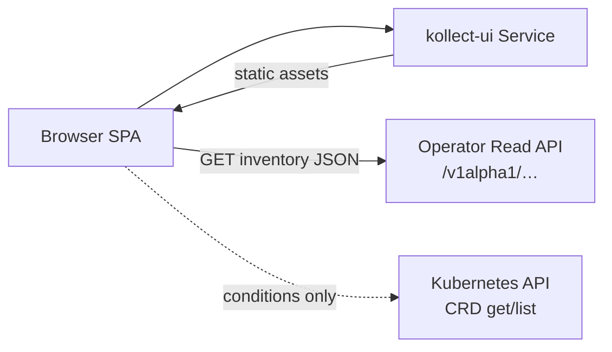
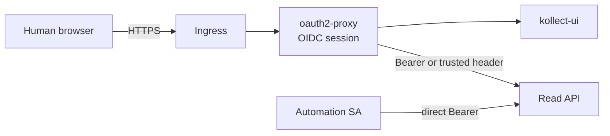

# ADR-0409: Kollect UI deployment

> Ship the read-only Kollect console as a **separate static SPA container** (`kollect-ui`) with its
> own Helm subchart, optional ingress, and post-MVP oauth2-proxy auth offload — decoupled from the
> operator controller lifecycle.

**Theme:** 04 · Export & sinks (read side) · **Status:** Current (accepted 2026-06-05)

## Context

[ADR-0408](0408-read-api-ui-architecture.md) locks a read-only SPA that consumes the Read API for
inventory rows. Maintainer decision **OQ-1** rejects embedding the UI in the operator binary for MVP:
UI release cadence, static asset serving, and CSP hardening should not ride on controller upgrades.

Operators still need a predictable install path: enable UI alongside the operator, point the SPA at the
Read API, and optionally expose both through ingress with OIDC — without putting inventory HTTP on
ingress by default (**OQ-10**).

## Decision

### 1. Container image

| Property | Value |
| --- | --- |
| **Image** | `ghcr.io/konih/kollect-ui` (alongside `ghcr.io/konih/kollect`) |
| **Contents** | Vite-built static assets from monorepo `ui/dist` |
| **Server** | nginx or distroless static file server with security headers |
| **Build** | `task build-ui` → Docker multi-stage (Node build + minimal runtime) |
| **SBOM** | Syft on `ui/dist` + image ([ADR-0705](0705-release-supply-chain.md)) |

The operator image **does not** embed or serve the SPA in MVP.

### 2. Helm subchart `charts/kollect-ui/`

Parent chart `charts/kollect` optionally depends on the UI subchart (umbrella pattern):

```text
charts/kollect-ui/
  Chart.yaml
  values.yaml
  templates/
    deployment.yaml      # static SPA server
    service.yaml
    ingress.yaml         # optional — disabled by default
    configmap.yaml       # runtime config (Read API base URL)
```

| Resource | Purpose |
| --- | --- |
| **Deployment** | Serves static files; liveness/readiness on `/` or `/healthz` |
| **Service** | ClusterIP; port 8080 (conventional) |
| **Ingress** | **Disabled by default**; enable when exposing UI outside cluster |
| **ConfigMap / env** | `READ_API_BASE_URL` — cluster Service URL of operator Read API |

**Feature gate wiring** (parent `charts/kollect/values.yaml`):

```yaml
ui:
  enabled: false          # default off — matches conservative feature gates ([ADR-0704](0704-helm-chart-crd-lifecycle.md))
  image:
    repository: ghcr.io/konih/kollect-ui
    tag: ""               # defaults to chart appVersion
  ingress:
    enabled: false
  readApi:
    # In-cluster default: http://kollect-manager.kollect-system.svc:8081
    baseUrl: ""
  portalMode: false       # v0.3+ — postgres adapter hints for SPA
```

When `ui.enabled: true`, parent chart renders the subchart and documents required companion gates:
`featureGates.inventoryHttp.enabled: true` for Read API access.

### 3. Relationship to operator Read API



| Concern | Pattern |
| --- | --- |
| **Backend URL** | SPA reads `READ_API_BASE_URL` at runtime (injected ConfigMap/env); build-time default for dev |
| **Same-origin vs cross-origin** | In-cluster: UI and Read API may be different Services — configure CORS on Read API **deny by default**; allow UI origin only when cross-origin ([ADR-0404](0404-inventory-api-auth.md)) |
| **Auth (MVP)** | **No auth in frontend** — assume cluster-network, port-forward, or dev SA token in `sessionStorage`; Read API SAR enforced when bearer present |
| **Auth (post-MVP)** | **oauth2-proxy at ingress** (below) — session cookie; Read API still validates forwarded identity or bearer |
| **Inventory HTTP ingress** | **Off by default** (OQ-10) — enable Read API ingress only with explicit values; UI ingress independent |

Dev loop: `kubectl port-forward svc/kollect-ui 8080:8080` + port-forward Read API or in-cluster curl.

### 4. oauth2-proxy — post-MVP ingress overlay (OQ-2)

MVP ships **without** oauth2-proxy templates. Production browser auth is documented as an **ingress
overlay pattern** for v0.3+:



**Pattern (not shipped in MVP chart):**

1. Deploy oauth2-proxy as Ingress backend or sidecar in front of `kollect-ui` + Read API paths.
2. Configure OIDC provider; oauth2-proxy sets **httpOnly** session cookie (`SameSite=Lax`).
3. Service accounts and in-cluster clients **bypass** oauth2-proxy — connect directly to Read API Service
   with Kubernetes bearer tokens ([ADR-0404](0404-inventory-api-auth.md)).
4. Optional thin BFF (Phase 3) if cookie model must hide kube tokens from the browser entirely
   ([ADR-0408](0408-read-api-ui-architecture.md)).

Helm values stub in parent chart (`oauth2Proxy.enabled: false`) remains documentation-only until
post-MVP implementation.

### 5. Security

| Control | Requirement |
| --- | --- |
| **No secrets in static bundle** | No sink DSNs, `secretRef` contents, or production tokens in Vite env baked into `dist/` |
| **CSP** | Enforced by static server — `default-src 'self'`; no `unsafe-eval`; see [ADR-0410](0410-ui-engineering-and-quality-gates.md) |
| **SRI** | Subresource Integrity on hashed asset URLs in container image |
| **Separate lifecycle** | UI Deployment rolls independently of operator; UI outage does not block collection/export |
| **frame-ancestors** | `'none'` — no clickjacking |
| **Rate limiting** | Read API middleware (operator) — optional Phase 2 |

### 6. Optional co-location (v0.3+)

When Read API splits to **`kollect-server`** ([ADR-0504](0706-testing-merge-gate-architecture.md)),
`kollect-ui` may share a namespace and ingress host with `kollect-server` — still separate Deployments
and images.

## Consequences

### Positive

- UI and controller release independently; static surface area isolated from reconciler.
- Feature gate defaults keep clusters without UI/HTTP exposure conservative.
- oauth2-proxy documented without blocking MVP UI development.

### Negative

- Two images and Deployments to version, scan, and document.
- Cross-origin CORS configuration required when UI and Read API Services differ.
- MVP assumes cluster-network access or port-forward — not internet-facing without post-MVP auth.

## See also

- [ADR-0404: Inventory HTTP API authentication](0404-inventory-api-auth.md)
- [ADR-0408: Read API and UI architecture](0408-read-api-ui-architecture.md)
- [ADR-0410: UI engineering and quality gates](0410-ui-engineering-and-quality-gates.md)
- [ADR-0704: Helm chart and CRD lifecycle](0704-helm-chart-crd-lifecycle.md)
- [Operator manual — Helm values](../operator-manual/helm-values.md)
