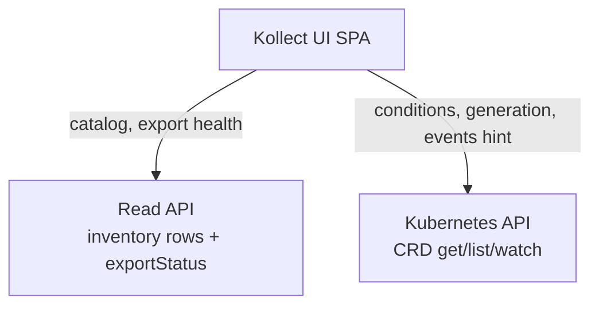

# ADR-0411: Read API extensions for UI

> Extend the versioned Read API and OpenAPI contract with pagination, filters, export status, and the
> ADR-0405 envelope — while allowing a **hybrid** Kubernetes API path for CRD conditions in MVP.

**Theme:** 04 · Export & sinks (read side) · **Status:** Current (accepted 2026-06-05)

## Context

The existing inventory HTTP handler (`internal/inventory/server.go`) exposes minimal endpoints:

| Method | Path | Today |
| --- | --- | --- |
| `GET` | `/v1alpha1/inventory` | Namespace index; SAR `list` |
| `GET` | `/v1alpha1/inventory/{namespace}/{name}` | Single inventory; SAR `get` |
| `GET` | `/v1alpha1/inventory/watch` | SSE; same auth |

OpenAPI (`openapi/v1alpha1/inventory.yaml`) describes `InventorySummary` only — no pagination,
filters, `schemaVersion` envelope, or per-sink export metadata. These gaps block UI MVP
([ADR-0408](0408-read-api-ui-architecture.md) blockers B2, B3, B6).

Maintainer decision **OQ-3** allows the UI to call the Kubernetes API for CRD conditions alongside the
Read API. This ADR specifies what the Read API must grow vs what stays on the hybrid path.

## Decision

### 1. OpenAPI as source of truth

`openapi/v1alpha1/inventory.yaml` is the **authoritative contract** for Read API request/response
shapes. Changes flow:

1. Edit OpenAPI.
2. Regenerate Go handlers/types and UI TS client (`task verify` drift gate).
3. Update contract tests (`pnpm test:contract`, backend golden fixtures).

Publish JSON Schema fragments for `Item` alongside the OpenAPI bundle when the envelope milestone
closes ([ADR-0405](0405-export-data-contract.md)).

### 2. Response envelope (ADR-0405)

All Read API list/get responses wrap payload in the versioned envelope:

```json
{
  "schemaVersion": "kollect.dev/v1alpha1",
  "itemCount": 42,
  "exportedAt": "2026-06-05T12:00:00Z",
  "cluster": "prod-west",
  "checksum": "sha256:…",
  "items": [ … ],
  "exportStatus": [ … ]
}
```

| Field | Source |
| --- | --- |
| `schemaVersion` | Export contract version ([ADR-0405](0405-export-data-contract.md), [ADR-0206](0206-api-versioning-conversion.md)) |
| `items[]` | `collect.Item` rows — identity + `attributes` |
| `itemCount` | Len(items) or total before pagination |
| `exportStatus[]` | Per-sink outcomes from `KollectInventory.status` (see §4) |
| `checksum`, `exportedAt`, `cluster` | Export metadata mirror |

Until envelope ships, UI contract tests use MSW fixtures matching the **target** shape; backend gap
tracked in [ADR-0405](0405-export-data-contract.md) implementation table.

### 3. Pagination and filters

**List items** — extend or add route (exact path finalized in OpenAPI; candidate
`GET /v1alpha1/inventory/{namespace}/{name}/items`):

| Query param | Purpose |
| --- | --- |
| `limit`, `continue` | Cursor/page pagination (K8s-style continue token or offset — pick one in OpenAPI) |
| `namespace` | Filter rows (repeatable or comma-separated) |
| `gvk` | Filter by `group/version/kind` |
| `target` | Filter by `targetNamespace/targetName` |
| `q` | Free-text search on name / selected attributes |
| `attribute.<key>` | Exact or prefix match on extracted attributes |

**List inventories** — extend `GET /v1alpha1/inventory` with namespace/cluster filters.

Server-side filter preferred for large catalogs; client-side debounced filter (300 ms) only when server
filter unavailable ([ADR-0410](0410-ui-engineering-and-quality-gates.md) perf budget).

SAR continues to enforce tenancy — forbidden namespaces return **403**, not empty lists with misleading
totals ([ADR-0203](0203-namespaced-multi-tenancy.md)).

### 4. Export status per sink

Each inventory response includes **`exportStatus[]`** — one entry per bound sink:

```json
{
  "sinkRef": { "name": "postgres-team-a", "namespace": "team-a" },
  "type": "postgres",
  "condition": "Synced",
  "reason": "ExportSucceeded",
  "message": "…",
  "exportedAt": "2026-06-05T11:58:00Z",
  "checksum": "abc123…"
}
```

Derived from `KollectInventory.status` sink conditions — sanitized messages only (no secret leakage).
UI export health bar ([ADR-0408](0408-read-api-ui-architecture.md)) reads this from Read API, not
live CRD status, when available.

### 5. Real-time (cross-ref OQ-4)

| Adapter | Endpoint | Behavior |
| --- | --- | --- |
| **memory** | `GET /v1alpha1/inventory/watch` | SSE; filter params mirror list endpoint when implemented |
| **postgres** | Poll list endpoint | Default 30 s; no SSE requirement in v0.3 MVP |

### 6. CRD status strategy — hybrid (OQ-3)

Two supported paths; **hybrid recommended for MVP**:



| Data | MVP source | Rationale |
| --- | --- | --- |
| Inventory **rows**, attributes, counts | **Read API only** | FR-READ-1; no apiserver list at scale |
| Per-sink **exportStatus** on inventory views | **Read API** (preferred) | Single contract; SAR on Read API |
| **Conditions** (`Ready`, `Synced`, `Degraded`) on Target/Inventory/Scope | **Kubernetes API** (hybrid) | Parity with `kubectl describe`; already on CRD status |
| **Events** hint / link | **Kubernetes API** or docs link | Optional list by involvedObject |
| **KollectConnectionTest** outcome | **Kubernetes API** or Read API extension | Defer unified route unless needed for v0.2 |

**Kubernetes API rules for UI client:**

- `get`/`list`/`watch` on `kollecttargets`, `kollectinventories`, `kollectscopes`, etc. — **metadata +
  status only**; never used to paginate collected object rows.
- Use caller's bearer token (same as Read API) or in-cluster SA from projected volume when BFF lands.
- RBAC: standard CRD RBAC; UI does not implement field masking in MVP ([ADR-0408](0408-read-api-ui-architecture.md)).

**Future optional proxy (post-MVP):** `GET /v1alpha1/status/{kind}/{namespace}/{name}` on Read API
aggregates CRD conditions server-side for browsers that cannot reach apiserver. Not required for v0.2;
document as extension point. When implemented, SAR wraps both inventory and status routes.

### 7. `InventoryReader` interface (OQ-11)

Read API handlers delegate to **`InventoryReader`** — distinct from sink **`Backend`**
([ADR-0406](0406-sink-registry.md)):

```go
// conceptual — internal/inventory/reader.go
type InventoryReader interface {
    ListInventories(ctx context.Context, filter ListFilter) ([]InventoryMeta, error)
    GetInventory(ctx context.Context, ns, name string) (InventorySnapshot, error)
    ListItems(ctx context.Context, filter ItemFilter) (Page[Item], error)
    Watch(ctx context.Context, filter ItemFilter) (<-chan InventoryEvent, error)
}
```

| Adapter | Backs |
| --- | --- |
| `memory` | `collect.Store` |
| `postgres` | Sink projection tables (read-only queries) |
| `parquet` | Object-store snapshots |

Sink write path unchanged; reader adapters registered separately at operator startup.

### 8. Implementation priority (v0.1.0 gate)

| Priority | Deliverable | Blocks |
| --- | --- | --- |
| **P0** | OpenAPI: envelope, pagination, filters, `exportStatus` | UI contract tests, v0.2 catalog |
| **P0** | `InventoryReader` + memory adapter wiring | Read API handler refactor |
| **P1** | Handler implementation + SAR on new routes | UI e2e |
| **P2** | Postgres reader adapter | Portal mode v0.3 |
| **P2** | Optional `/v1alpha1/status/{kind}` proxy | Browsers without apiserver access |

## Consequences

### Positive

- One OpenAPI contract drives backend, UI codegen, and MSW mocks.[^mock-layer]
- Hybrid CRD status avoids duplicating condition logic in Read API for MVP.
- `exportStatus` in Read API powers export health UI without N+1 CRD fetches per row.

### Negative

- Envelope migration breaks existing bare-array consumers — coordinate with pre-beta milestone
  ([ADR-0405](0405-export-data-contract.md)).
- Hybrid path requires UI to manage two clients (Read API + K8s) and two failure modes.
- Filter/query semantics must stay deterministic with export ordering ([ADR-0305](0305-aggregation-dedupe.md)).

## See also

- [ADR-0404: Inventory HTTP API authentication](0404-inventory-api-auth.md)
- [ADR-0405: Export data contract and schema versioning](0405-export-data-contract.md)
- [ADR-0406: Sink registry and Backend interface](0406-sink-registry.md)
- [ADR-0408: Read API and UI architecture](0408-read-api-ui-architecture.md)
- [ADR-0410: UI engineering and quality gates](0410-ui-engineering-and-quality-gates.md)
- [ADR-0412: Mock Read API for UI development](0412-mock-read-api-for-ui-development.md)
- `openapi/v1alpha1/inventory.yaml` · `internal/inventory/server.go`

[^mock-layer]: MSW + optional Prism mock stack for local dev and e2e — see [ADR-0412](0412-mock-read-api-for-ui-development.md).
