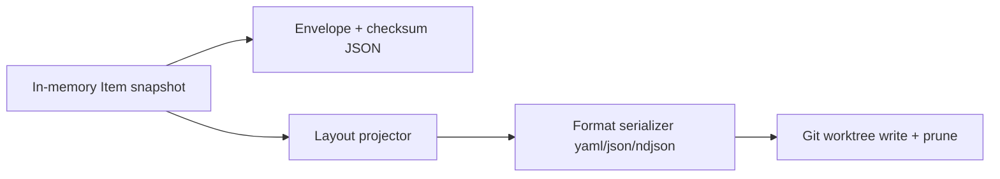

# ADR-0419: Git export serialization and layout

> Readable YAML in Git sync repos **by default with zero extra config** — override format, layout, or
> paths only when you need something different.

**Theme:** 04 · Export & sinks · **Status:** Exploring

## Context

Git and GitLab snapshot sinks write **one JSON file per inventory** at a predictable path
([ADR-0407](0407-git-object-store-layout.md)):

```text
inventory/<inventory-namespace>/<inventory-name>.json
```

The payload is a JSON array of `Item` rows ([ADR-0405](0405-export-data-contract.md)). That layout is
stable and easy to test, but poor for human review:

- Diffs are noisy (one huge JSON line or a wall of escaped strings).
- Reviewers cannot open a single resource in an editor and read it like `kubectl get -o yaml`.
- Fleet repos accumulate `.json` blobs that do not match how platform teams organize GitOps trees.

Cross-cutting **`spec.serialization`** already exists ([ADR-0416](0416-sink-config-layering.md)) with
`format: json | parquet | csv | ndjson`, but the **Git/GitLab capability matrix today only honors
`json`**. Object-store backends own Parquet; Git never got a human-oriented format.

Separately, [ADR-0306](0306-full-resource-export-pruning.md) proposes embedding pruned Kubernetes
objects in export rows. The natural Git presentation is **one manifest file per resource**, not a
single inventory document — but that requires layout semantics this ADR defines.

**Prior art**

| Project | Pattern | Takeaway |
| --- | --- | --- |
| **Flux / Kustomize** | Native YAML manifests in folder trees | Humans read `kind/name.yaml`, not aggregate JSON |
| **Argo CD** | Application spec in Git; live state compared | Git holds desired/readable YAML; cluster holds truth |
| **Kyverno / policy repos** | One resource per file | Small, reviewable diffs |
| **Kollect today** | Canonical snapshot in memory; Git is a projection ([ADR-0401](0401-sink-taxonomy-state-vs-stream.md)) | Format/layout are **sink projection** concerns — safe to vary per sink |

## Decision

**Principle:** a Git snapshot sink needs only `type` + `endpoint` (+ `secretRef` when auth is
required). Everything in this ADR is **optional override** — same posture as [ADR-0416](0416-sink-config-layering.md)
(`json` / `ensure` defaults today). Authors should not have to specify format, layout, path templates,
or prune behaviour to get a readable repo.

### Zero-config baseline

This is the **entire** Git sink spec most teams need:

```yaml
apiVersion: kollect.dev/v1alpha1
kind: KollectSnapshotSink
metadata:
  name: inventory-git
  namespace: team-a
spec:
  type: git
  endpoint: https://git.example.com/acme/inventory.git
  secretRef:
    name: git-credentials
```

That yields:

```text
inventory/team-a/<inventory-name>.yaml
```

…containing the full inventory as a **YAML list of `Item` rows** — readable, diffable, no JSON blob.
Commit messages, push policy, and author identity keep their existing defaults
([ADR-0415](0415-git-sink-commit-ergonomics.md)).

When the inventory's profile uses **`export.mode: Resource`** ([ADR-0306](0306-full-resource-export-pruning.md)),
the **same zero-field sink** automatically switches to a **per-resource manifest tree** (no `layout`
block required):

```text
default/team-a/deployment/api.yaml
default/team-a/deployment/web.yaml
```

Set `layout.mode: document` explicitly to keep a single inventory file even with Resource profiles.

### Sane defaults (binding)

All defaults apply when the field or block is **omitted**. The operator resolves effective config at
export time; `status.preview` ([ADR-0416](0416-sink-config-layering.md)) shows the resolved shape.

| Field / block | Default (Git / GitLab) | Notes |
| --- | --- | --- |
| `serialization` | *(absent)* | Git-specific default layer — see below |
| `serialization.format` | **`yaml`** | **`json`** remains default for S3/GCS/HTTP — unchanged |
| `serialization.compression` | `none` | Git stores loose files; no gzip at rest |
| `pathTemplate` | `inventory/{namespace}/{name}{extension}` | `{extension}` → `.yaml`, `.json`, … from format |
| `layout` | *(absent)* | Equivalent to `layout.mode: document` |
| `layout.mode` | **`document`** | One file per inventory |
| `layout.content` | **`item`** | Full `Item` row per file (in `perResource` mode) |
| `layout.pathTemplate` | `{cluster}/{sourceNamespace}/{kind}/{sourceName}{extension}` | Used only when `mode ≠ document` |
| `layout.index.enabled` | `false` in `document` / `perResource`; **`true` in `split`** | Index is opt-in except split mode |
| `layout.filename.groupInPath` | `auto` | Omit `{group}` segment for core types |
| `layout.filename.lowercaseKind` | `true` | `Deployment` → `deployment` in paths |
| `layout.filename.maxSegmentLength` | `63` | DNS-safe path segments |
| `git.prune` | `false` in **`document`**; **`true` when `layout.mode: perResource` or `split`** | Auto-enabled — do not require users to set it |
| `git.pushPolicy` | `Commit` | Unchanged ([ADR-0407](0407-git-object-store-layout.md)) |
| Commit subject / author | Rich template defaults | Unchanged ([ADR-0415](0415-git-sink-commit-ergonomics.md)) |

**Convention over configuration (auto-inference):**

| Trigger | Auto behaviour |
| --- | --- |
| Referenced profile has `export.mode: Resource` ([ADR-0306](0306-full-resource-export-pruning.md)) | **`layout.mode` upgrades to `perResource`** unless explicitly set to `document` |
| Profile `export.mode: Resource` + `layout.mode: perResource` | **`layout.content` defaults to `manifest`** (kubectl-like YAML) |
| `layout.mode: perResource` or `split` | **`git.prune: true`** — stale files removed without user action |
| `spec.cluster` set | `{cluster}` segment in default `layout.pathTemplate` uses it; `default` when empty |

Authors who want the old JSON document export set **one field**: `serialization.format: json`.

### What we extend

Extend snapshot Git/GitLab sinks with:

1. **`serialization.format: yaml`** as the **Git default** (replacing implicit JSON).
2. An optional **`spec.layout`** block (snapshot sinks only) for document shape and folder layout.
3. **`{extension}`** on path templates, derived from format when not spelled out.

The in-memory snapshot and envelope checksum ([ADR-0305](0305-aggregation-dedupe.md)) remain
**JSON-normalized** internally; YAML/layout is applied only at Git write time.

### Override example (only when you need it)

Most teams never need this block. Use it for fleet manifest trees or custom folder layouts:

```yaml
spec:
  type: git
  endpoint: https://git.example.com/platform/inventory.git
  cluster: prod-west
  layout:
    mode: perResource          # only field many teams add besides endpoint
    # pathTemplate, content, git.prune, serialization.format — all defaulted
```

With a Resource-export profile ([ADR-0306](0306-full-resource-export-pruning.md)), the above alone
produces:

```text
prod-west/team-a/deployment/api.yaml
prod-west/team-a/deployment/web.yaml
…
```

Each file is native Kubernetes YAML (pruned object), not a wrapped `Item`.

### CRD shape (proposed)

`layout` is added to `SinkCommonFields` (namespaced + cluster snapshot sinks). **The entire block is
optional.** GitLab inherits the same semantics via shared export code.

Full field reference (defaults shown — omit any row you do not need to change):

```yaml
spec:
  type: git
  endpoint: https://git.example.com/platform/inventory.git

  # --- all optional from here ---
  serialization:
    format: yaml              # default git/gitlab
    compression: none
  pathTemplate: inventory/{namespace}/{name}{extension}
  layout:
    mode: document            # document | perResource | split
    content: item             # item | attributes | manifest
    pathTemplate: '{cluster}/{sourceNamespace}/{kind}/{sourceName}{extension}'
    index:
      enabled: false          # true by default only in split mode
      pathTemplate: inventory/{namespace}/{name}{extension}
    filename:
      groupInPath: auto
      lowercaseKind: true
      maxSegmentLength: 63
  git:
    prune: false              # true when layout.mode is perResource or split
    pushPolicy: Commit
```

**OpenAPI sketch:**

```go
type LayoutSpec struct {
    // +kubebuilder:validation:Enum=document;perResource;split
    // +kubebuilder:default=document
    Mode string `json:"mode,omitempty"`

    // +kubebuilder:validation:Enum=item;attributes;manifest
    // +kubebuilder:default=item
    Content string `json:"content,omitempty"`

    // Per-item path when mode is perResource or split items dir.
    PathTemplate string `json:"pathTemplate,omitempty"`

    Index *LayoutIndexSpec `json:"index,omitempty"`
    Filename *LayoutFilenameSpec `json:"filename,omitempty"`
}

type LayoutIndexSpec struct {
    Enabled      *bool  `json:"enabled,omitempty"`
    PathTemplate string `json:"pathTemplate,omitempty"`
}

type LayoutFilenameSpec struct {
    GroupInPath      string `json:"groupInPath,omitempty"` // auto | always | never
    LowercaseKind    *bool  `json:"lowercaseKind,omitempty"`
    MaxSegmentLength *int32 `json:"maxSegmentLength,omitempty"`
}

// SerializationSpec.Format enum gains yaml (ADR-0419).
```

### Serialization (`spec.serialization.format`)

| Format | Git / GitLab | S3 / GCS / Azure | HTTP | Notes |
| --- | --- | --- | --- | --- |
| **`yaml`** | **default** | — | — | Block style, 2-space indent, stable key order |
| `json` | supported | default | default | Compact or indented (`serialization.jsonIndent`) |
| `ndjson` | supported | — | supported | One `Item` per line — streaming/ETL |
| `parquet` | **rejected** | supported | — | Not meaningful in Git |
| `csv` | **rejected** | supported | — | Lossy for nested attributes |

**Default resolution (Git/GitLab only):**

```text
EffectiveSerializationFormat:
  spec.serialization.format
  → default yaml   # NEW — replaces implicit json for git/gitlab
```

Object-store and HTTP defaults stay **`json`**. Pin legacy Git JSON with a single override:

```yaml
serialization:
  format: json
```

**YAML encoder rules (binding):**

- Use `sigs.k8s.io/yaml` (Kubernetes-compatible field ordering via JSON struct tags when content is
  `item`; `json.Marshal` → `yaml.Marshal` pipeline for `map[string]any`).
- **Stable key sort** on maps before encode ([ADR-0405](0405-export-data-contract.md)).
- Block style (not flow); indent **2** (fixed — not configurable in Phase 1).
- Document separator `---` only for multi-document files (not used in Phase 1 single-doc files).
- `.yaml` extension canonical (not `.yml`).

No `serialization.yaml.*` tuning knobs in Phase 1 — fewer choices, predictable output.

### Layout modes

| Mode | Files written | Typical use |
| --- | --- | --- |
| **`document`** (default) | One file at `spec.pathTemplate` | Whole inventory snapshot; backwards-compatible shape |
| **`perResource`** | One file per `Item` at `layout.pathTemplate` | Reviewable diffs; pairs with [ADR-0306](0306-full-resource-export-pruning.md) `export.mode: Resource` |
| **`split`** | Index sidecar + `layout.pathTemplate` tree | Summary/metadata file for CI + human tree for resources |

#### `document` mode (default)

Same semantics as today, different encoding:

```yaml
# inventory/team-a/deployments.yaml
- targetNamespace: team-a
  targetName: deployments
  namespace: team-a
  name: api
  version: v1
  kind: Deployment
  uid: 8f3c…
  attributes:
    image: nginx:1.27
```

Path when `pathTemplate` unset (the common case):

```text
inventory/{namespace}/{name}{extension}    # → inventory/team-a/deployments.yaml
```

#### `perResource` mode

Each collected row maps to one repo path. **Minimal spec** — one field:

```yaml
layout:
  mode: perResource
```

Effective defaults: `content: manifest` when profile uses Resource export, else `item`; `git.prune:
true`; path `{cluster}/{sourceNamespace}/{kind}/{sourceName}{extension}`.

Placeholders (only needed when overriding `layout.pathTemplate`):

| Placeholder | Source |
| --- | --- |
| `{cluster}` | `spec.cluster` |
| `{namespace}` | inventory namespace |
| `{name}` | inventory name |
| `{targetNamespace}` | `Item.targetNamespace` |
| `{targetName}` | `Item.targetName` |
| `{sourceNamespace}` | `Item.namespace` |
| `{sourceName}` | `Item.name` |
| `{group}` | `Item.group` (empty → omit segment when `groupInPath: auto`) |
| `{kind}` | `Item.kind` (lowered when `lowercaseKind: true`) |
| `{uid}` | `Item.uid` (optional — disambiguate same name across deletes) |
| `{generation}` | export generation |
| `{extension}` | from format |

Default `layout.pathTemplate` (when `mode: perResource` or `split` items tree):

```text
{cluster}/{sourceNamespace}/{kind}/{sourceName}{extension}
```

When `spec.cluster` is unset, `{cluster}` renders as `default` — no need to set cluster for
single-cluster installs.

**Deletion semantics:** when a resource drops out of the snapshot, its file is **removed** on
export. **`git.prune` defaults to `true`** for `perResource` and `split` — users must not configure
this manually unless overriding back to `false` (discouraged; webhook warns).

**Collision policy:** if two rows render the same path, export fails with `ErrTerminal` and a target
condition — silent overwrite is forbidden.

#### `split` mode

Opt-in for teams that want CI gating on a checksum file **and** a manifest tree. **Minimal spec:**

```yaml
layout:
  mode: split
```

Defaults: index at `inventory/{namespace}/{name}{extension}` with checksum metadata; items at
`{cluster}/{sourceNamespace}/{kind}/{sourceName}{extension}`; `git.prune: true`; index `enabled:
true`.

Writes:

1. **Index** — envelope summary: `schemaVersion`, `itemCount`, `checksum`, `exportedAt`, `cluster`,
   row path list (not full payloads).
2. **Items** — same tree as `perResource`.

### Content shape (`layout.content`)

Controls what bytes each **per-resource** file (or document rows) contain:

| Value | Payload | When it applies |
| --- | --- | --- |
| **`item`** (default) | Full `Item` row | Explicit attributes profile, or override |
| `attributes` | `Item.attributes` map only | Opt-in — smaller files, no identity envelope |
| **`manifest`** (auto) | Native Kubernetes object YAML | **Default when profile uses `export.mode: Resource`** ([ADR-0306](0306-full-resource-export-pruning.md)) |

Authors do **not** set `layout.content: manifest` in the common Resource-export + Git tree case —
the operator infers it. Set `content: item` explicitly to keep the `Item` wrapper in per-resource
files.

`manifest` writes the pruned object — readable like `kubectl get -o yaml`. Identity fields stay on
`Item` in memory; not duplicated in the manifest body when profile `dedupeIdentity` is enabled
(default).

Webhook: reject explicit `layout.content: manifest` when the profile is not in Resource export mode.

### Filename safety

`layout.filename` is **optional** — omit entirely in normal use. When present, defaults above apply;
the operator always sanitizes path segments (no `/`, `\`, `:`, `..`; max length 63).

### GitLab

GitLab snapshot sinks reuse the same serializer and layout engine; MR mode
([ADR-0407](0407-git-object-store-layout.md)) shows aggregate diff stats in MR description
(deferred template — [ADR-0415](0415-git-sink-commit-ergonomics.md)).

### Examples

**1. Zero-config (typical team sink)** — see [Zero-config baseline](#zero-config-baseline).

**2. Manifest tree (Resource profile)** — zero extra sink fields:

```yaml
spec:
  type: git
  endpoint: https://git.example.com/platform/inventory.git
  cluster: prod-west   # optional; omit → cluster segment is "default"
```

Profile uses `export.mode: Resource` — operator infers `layout.mode: perResource`, `content:
manifest`, `git.prune: true`, and the default path template. Override with `layout.mode: document`
to force a single inventory file.

**2b. Manifest tree (attributes profile)** — one field when you want per-resource files without
Resource export:

```yaml
spec:
  type: git
  endpoint: https://git.example.com/platform/inventory.git
  layout:
    mode: perResource
```

**3. Legacy JSON document** — one override:

```yaml
spec:
  type: git
  endpoint: https://git.example.com/acme/inventory.git
  serialization:
    format: json
```

→ `inventory/team-a/deployments.json` (pre-change behaviour).

**4. Custom folder layout** — override only the path:

```yaml
spec:
  type: git
  endpoint: https://git.example.com/platform/inventory.git
  layout:
    mode: perResource
    pathTemplate: 'clusters/{cluster}/{sourceNamespace}/{kind}/{sourceName}{extension}'
```

**5. NDJSON for automation** — format override only:

```yaml
spec:
  type: git
  endpoint: https://git.example.com/acme/inventory.git
  serialization:
    format: ndjson
```

One `Item` JSON object per line; still single-file `document` mode by default.

### Capability matrix update ([ADR-0416](0416-sink-config-layering.md))

| Family / type | `serialization.format` |
| --- | --- |
| **git, gitlab** | **yaml (default), json, ndjson** |
| s3, gcs, azureblob | json (default), parquet, csv |
| http | json (default), ndjson |
| database, event | json only |

### Internal pipeline



- **Checksum / debounce** always computed on canonical JSON envelope ([ADR-0305](0305-aggregation-dedupe.md)).
- Layout projection is **pure** — golden tests per `(mode, content, format)` tuple.
- `status.preview` ([ADR-0416](0416-sink-config-layering.md)) shows sample paths and first file snippet.

### Migration / compatibility

| Audience | Impact |
| --- | --- |
| Existing Git sinks with no `serialization` block | **Breaking default** — next export writes `.yaml` unless `serialization.format: json` is set |
| Explicit `pathTemplate` ending in `.json` | Webhook **warning**: `{extension}` placeholder preferred; trailing `.json` honored when format is json |
| Object store / Postgres / Kafka | Unchanged |

Pre-GA (`v1alpha1`): acceptable breaking default per [ADR-0415](0415-git-sink-commit-ergonomics.md).
Document in CHANGELOG and upgrade guide: add `serialization.format: json` to pin legacy behaviour.

## Consequences

### Positive

- **`type` + `endpoint` is enough** for readable YAML exports — no layout block required.
- Git sync repos become human-readable without abandoning the canonical `Item` contract.
- Resource profiles + `layout.mode: perResource` (one field) → kubectl-like manifest trees.
- Convention over configuration: prune, content, and path templates inferred — not boilerplate.
- JSON/NDJSON remain one-field overrides for automation-focused teams.

### Negative

- YAML round-trip is lossy for `int64` and floating values — same as Kubernetes YAML everywhere;
  document in CR reference.
- `perResource` exports are **O(n) files** per cycle — large inventories mean slower Git pushes;
  gate with `exportMinInterval` ([ADR-0413](0413-export-interval-scheduling.md)) and document limits
  in [PERFORMANCE.md](../PERFORMANCE.md).
- Default format change surprises adopters who relied on `.json` — migration note required.
- `manifest` content without Resource export mode is a foot-gun — webhook must block it.

## Implementation phases

1. **Phase 1:** `yaml` format; `layout.mode: document`; `{extension}` in path templates; Git default
   yaml; golden tests for encoder stability.
2. **Phase 2:** `layout.mode: perResource`; placeholders; `git.prune` enforcement; `content: item |
   attributes`.
3. **Phase 3:** `layout.content: manifest` + [ADR-0306](0306-full-resource-export-pruning.md);
   `split` mode with index sidecar; `status.preview` samples.

## Open questions

- **DECIDED :** Default `perResource` path is `{cluster}/{sourceNamespace}/{kind}/{sourceName}{extension}`;
  `{cluster}` → `default` when unset.
- **DECIDED :** Auto-enable `perResource` + `manifest` content when profile uses `export.mode: Resource`
  (explicit `layout.mode: document` opts out).
- **DECIDED :** No `serialization.yaml.*` tuning in Phase 1 — fixed block style, 2-space indent.
- **OPEN:** Ship optional index sidecar in `document` mode for checksum-only CI gating (off by default)?
- **OPEN:** `{uid}` suffix in paths for unstable names (Job pods) — Phase 2, off by default.

## References

- [ADR-0401](0401-sink-taxonomy-state-vs-stream.md) · [ADR-0405](0405-export-data-contract.md)
- [ADR-0407](0407-git-object-store-layout.md) · [ADR-0415](0415-git-sink-commit-ergonomics.md)
- [ADR-0416](0416-sink-config-layering.md) · [ADR-0306](0306-full-resource-export-pruning.md)
