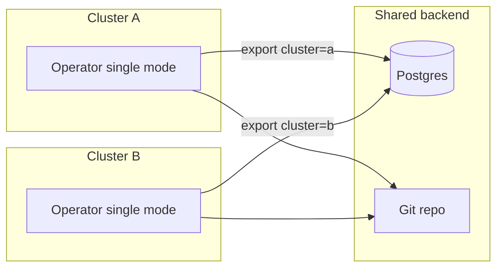

# ADR-0501: Multi-cluster fleet (shared sink fan-in)

**Theme:** 05 · Multi-cluster · **Status:** Current

## Context

Installations often run **many Kubernetes clusters** that must contribute to one inventory view
(Postgres row set, Git repo layout, or event stream) without an aggregation tier inside the operator.

Each cluster runs the same **single-mode** operator (`mode: cluster`). Exports include
`spec.cluster` (or `pathTemplate` placeholders such as `{cluster}`) so downstream sinks merge or
partition rows by cluster id.

Prior `archive/hub-spoke-pre-removal` for reference only — not supported in current releases.

## Decision

### Fleet model

| Layer | Responsibility |
| --- | --- |
| **Per cluster** | `KollectTarget` → in-memory store → `KollectInventory` → family sinks |
| **Shared sink** | Postgres PK `(cluster, namespace, name, uid)`; Git `pathTemplate: clusters/{cluster}/…`; Kafka/NATS subject/key with cluster label |
| **No operator hub** | No `

### Sink configuration

- **Postgres / database sinks:** set `spec.cluster` on `KollectDatabaseSink` (and cluster-scoped
  variants). Delete reconciliation uses `(cluster, uid)` identity ([ADR-0305](0305-aggregation-dedupe.md)).
- **Git / object store:** use `pathTemplate` with `{cluster}` ([ADR-0407](0407-git-object-store-layout.md)).
  Per-cluster commits are acceptable for audit trails.
- **Event sinks (NATS/Kafka):** include cluster in subject or message headers; consumers merge
  externally if needed ([ADR-0402](0402-sink-backends-database-kafka.md)).

### Scale expectations

Per-cluster targets remain in [ADR-0603](0603-performance-scalability.md) (10k+ watched resources).
Fleet scale is bounded by **sink capacity** and **export coalesce** ([ADR-0413](0413-export-interval-scheduling.md)),
not by a central hub process.

### Rejected alternatives

| Alternative | Why rejected |
| --- | --- |
| **Hub merge tier** | Duplicated sink merge logic; ~6k LOC; pre-beta transport |
| **Pairwise agent mesh** | O(n²) operational cost at fleet scale |
| **Git commit per reconcile per cluster** | Export debounce + snapshot windows required ([ADR-0413](0413-export-interval-scheduling.md)) |

## Consequences

### Positive

- One operator image and Helm chart for all clusters; no mode-specific wiring.
- Postgres and Git backends already implement cluster-scoped merge semantics.
- Removes transport, remote-cluster CRD, and hub metrics from the security/RBAC surface.

### Negative

- **Single Git commit** fan-in across clusters requires external CI or a merge job — not built into the operator.
- **DMZ egress-only** clusters need private link/VPN to shared Postgres/S3; no DMZ hub relay.

## References

- Sample: [`config/samples/e2e/team-inventory.yaml`](../../config/samples/e2e/team-inventory.yaml) (single cluster); fleet walkthrough [`../examples/multi-cluster-fleet.md`](../examples/multi-cluster-fleet.md)
- Archive: `git show archive/hub-spoke-pre-removal:internal/hub/` (historical only)
- Related: [ADR-0401](0401-sink-taxonomy-state-vs-stream.md), [ADR-0305](0305-aggregation-dedupe.md)
