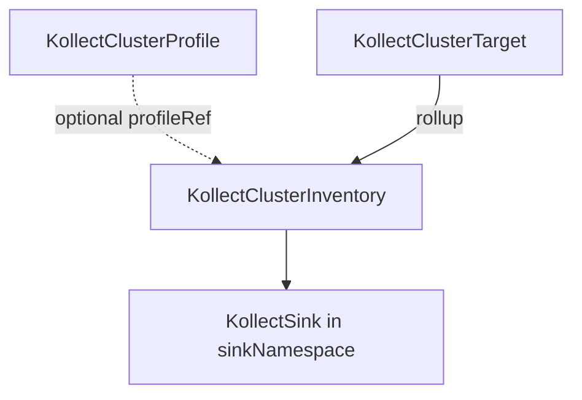

# KollectClusterInventory

**Scope:** Cluster · **Reconciled:** Yes · **Short name:** `kcinv`

!!! note "Sink namespace"
    `spec.sinkRefs[]` resolve `KollectSink` objects in `spec.sinkNamespace` (default
    `kollect-system`), not the inventory CR's namespace.

## What it is for

A `KollectClusterInventory` is the **platform-operator** rollup CR: it aggregates rows from one or
more `KollectClusterTarget` objects and exports to sinks configured in a designated export namespace.
One cluster inventory can roll up **all** cluster targets or a subset via `targetRefs`
([ADR-0703](../adr/0703-platform-architecture-pivot.md)).

The controller aggregates rows from matching `KollectClusterTarget` objects and exports to sinks
in `spec.sinkNamespace`.

## How it fits the pipeline



| Relationship | Rule |
| --- | --- |
| Targets | `spec.targetRefs[]` names cluster targets; empty = all matching `targetSelector` (or all targets) |
| Namespaces | `namespaceSelector` **required** — empty selector rejected (no cluster-wide wildcard) |
| Sinks | `spec.sinkRefs[]` resolved in `spec.sinkNamespace` (default `kollect-system`) |
| Profile | Optional `spec.profileRef` names a `KollectClusterProfile` (rollup schema override, future) |

**Sink design (MVP):** namespaced `KollectSink` objects in the export namespace (`sinkNamespace`).
`KollectClusterSink` is reserved for a later platform-shared backend.

## Spec fields

| Field | Type | Required | Default | Description |
| --- | --- | --- | --- | --- |
| `spec.profileRef` | string | No | — | `KollectClusterProfile` name (optional rollup override) |
| `spec.targetRefs[]` | list | No | all targets | `KollectClusterTarget` names (name only) |
| `spec.targetSelector` | labelSelector | No | — | Filter cluster targets when `targetRefs` empty |
| `spec.namespaceSelector` | labelSelector | **Yes** | — | Explicit namespace scope for rollup |
| `spec.sinkRefs[]` | list | No | — | Sink names (string) or `{ name, exportMinInterval? }` in `sinkNamespace` — max 20 |
| `spec.sinkNamespace` | string | No | `kollect-system` | Namespace for sink resolution |
| `spec.exportMinInterval` | duration | No | **30s** | Default min gap for refs without override; bypass on checksum or generation change |
| `spec.suspend` | bool | No | false | Pause reconciliation (reserved) |

## Sample usage

```sh
# Prerequisites: cluster profile, cluster target, sink in kollect-system
kubectl apply -f config/samples/kollect_v1alpha1_kollectclusterprofile.yaml
kubectl apply -f config/samples/kollect_v1alpha1_kollectsink_postgres.yaml -n kollect-system
kubectl apply -f config/samples/kollect_v1alpha1_kollectclustertarget.yaml
kubectl apply -f config/samples/kollect_v1alpha1_kollectclusterinventory.yaml

kubectl get kcinv platform-rollup -o yaml
```

```sh
kubectl get kcinv platform-rollup -w
kubectl describe kcinv platform-rollup
```

Walkthrough: [examples/cluster-rollup.md](../examples/cluster-rollup.md).

## Status conditions

| Type | When set | Meaning | Remediation |
| --- | --- | --- | --- |
| `Ready=True` | Healthy | Rollup and export healthy | None |
| `Synced=True` | Export OK | All sinks exported on last reconcile | Check `status.lastExportTime` |
| `Synced=False` `PartiallySynced` | Mixed cadence | Some sinks exported; others debounced | Inspect `status.sinkExports[]` ([ADR-0413](../adr/0413-export-interval-scheduling.md)) |
| `ExportSucceeded=True` | Last export OK | Sink write succeeded (legacy alias) | Check `status.lastExportTime` |
| `Degraded=True` | Blocked | Scope, targets, size, or export error | See reasons below |

### Per-sink status (`status.sinkExports[]`)

Same shape as [KollectInventory](kollectinventory.md#per-sink-status-statussinkexports): per-ref
`lastExportTime`, `lastChecksum`, and `Synced` conditions. Interval precedence matches namespaced
inventory ([ADR-0413](../adr/0413-export-interval-scheduling.md)).

### Common `Degraded` reasons

| Reason | Cause | Fix |
| --- | --- | --- |
| `NoTargets` | No matching cluster targets | Create `KollectClusterTarget`; check `targetRefs` / `targetSelector` |
| `TargetDegraded` | One or more targets not `Ready` | Fix upstream `kctgt` status first |
| `SinkNotFound` | Bad `sinkRefs` in `sinkNamespace` | Create sink in export namespace |
| `ExportUnavailable` | Sink registry not configured | Check operator startup / Helm values |
| `ExportTerminal` | Non-retryable sink error | Fix sink config; check operator logs |

## RBAC

| Actor | Verbs | Resource | Notes |
| --- | --- | --- | --- |
| Platform admins | `create`, `update`, `patch`, `delete` | `kollectclusterinventories` | Cluster-scoped |
| Platform readers | `get`, `list`, `watch` | `kollectclusterinventories` | Audit platform config |
| Operator | `get`, `list`, `watch` | `kollectclusterinventories`, `kollectclustertargets`, `kollectsinks` | Rollup + export |

## Common failure modes

| Symptom | Cause | Fix |
| --- | --- | --- |
| Admission denied | Missing `namespaceSelector` | Add explicit label selector |
| Admission denied | `targetRefs` or `sinkRefs` contains `/` | Use name only — no `namespace/name` |
| No export | Targets not `Ready` or sink misconfigured | `kubectl describe kctgt`; verify sink in `sinkNamespace` |
| `SinkNotFound` | Bad `sinkRefs` in `sinkNamespace` | Create sink in export namespace |
| `Degraded` | Payload too large or terminal sink error | Check operator logs and [KollectSink](kollectsink.md) status |

## See also

- [KollectClusterProfile](kollectclusterprofile.md) — platform extraction schema
- [KollectClusterTarget](kollectclustertarget.md) — pairs with this kind
- [KollectInventory](kollectinventory.md) — namespaced equivalent (shipped)
- [CR-REFERENCE.md](../CR-REFERENCE.md)
- [ADR-0703](../adr/0703-platform-architecture-pivot.md)
