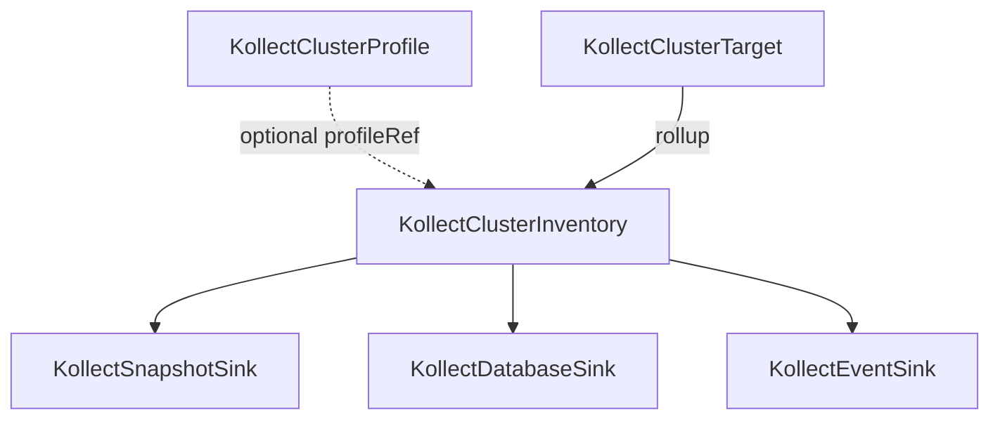

# KollectClusterInventory

**Scope:** Cluster · **Reconciled:** Yes · **Short name:** `kcinv`

!!! note "Sink namespace"
    Family sink refs (`snapshotSinkRefs`, `databaseSinkRefs`, `eventSinkRefs`) resolve namespaced
    sinks in `spec.sinkNamespace` (default `kollect-system`), or cluster-scoped `KollectCluster*Sink`
    when no namespaced match exists.

## What it is for

A `KollectClusterInventory` is the **platform-operator** rollup CR: it aggregates rows from one or
more `KollectClusterTarget` objects and exports to sinks configured in a designated export namespace.
One cluster inventory can roll up **all** cluster targets or a subset via `targetRefs`
([ADR-0201](../adr/0201-crd-model.md)).

The controller aggregates rows from matching `KollectClusterTarget` objects and exports to sinks
in `spec.sinkNamespace`.

## How it fits the pipeline



| Relationship | Rule |
| --- | --- |
| Targets | `spec.targetRefs[]` names cluster targets; empty = all matching `targetSelector` (or all targets) |
| Namespaces | Optional `spec.namespaces` (explicit list) **intersected** with `spec.namespaceSelector` when both set; at least one scope mechanism should be configured for intentional rollups |
| Sinks | Family ref lists resolved in `spec.sinkNamespace` (default `kollect-system`) |
| Profile | Optional `spec.profileRef` names a `KollectClusterProfile` (rollup schema override, future) |

**Sink design:** namespaced family sinks in the export namespace, or cluster-scoped
`KollectCluster*Sink` for platform-wide backends ([ADR-0414](../adr/0414-sink-family-crds.md)).

## Spec fields

| Field | Type | Required | Default | Description |
| --- | --- | --- | --- | --- |
| `spec.profileRef` | string | No | — | `KollectClusterProfile` name (optional rollup override) |
| `spec.targetRefs[]` | list | No | all targets | `KollectClusterTarget` names (name only) |
| `spec.targetSelector` | labelSelector | No | — | Filter cluster targets when `targetRefs` empty |
| `spec.namespaces[]` | list | No | — | Explicit namespace allow-list (DNS-1123 labels); intersected with `namespaceSelector` |
| `spec.namespaceSelector` | labelSelector | No | — | Label filter for namespace scope; intersected with `namespaces` when both set |
| `spec.snapshotSinkRefs[]` | list | No | — | Snapshot sink refs (string or `{ name, exportMinInterval? }`) |
| `spec.databaseSinkRefs[]` | list | No | — | Database sink refs (same shape) |
| `spec.eventSinkRefs[]` | list | No | — | Event sink refs (same shape); combined max **20** |
| `spec.sinkNamespace` | string | No | `kollect-system` | Namespace for namespaced family sink resolution |
| `spec.exportMinInterval` | duration | No | **30s** | Default min gap for refs without override; bypass on checksum or generation change |
| `spec.suspend` | bool | No | false | Pause reconciliation (reserved) |

## Example

A platform rollup that aggregates one cluster target and exports to a Postgres sink in
`kollect-system` ([`config/samples/kollect_v1alpha1_kollectclusterinventory.yaml`](https://github.com/konih/kollect/blob/main/config/samples/kollect_v1alpha1_kollectclusterinventory.yaml)):

```yaml
apiVersion: kollect.dev/v1alpha1
kind: KollectClusterInventory
metadata:
  name: platform-rollup            # cluster-scoped — no namespace
spec:
  targetRefs:
    - platform-argo-applications
  namespaces:                      # optional explicit list — intersected with namespaceSelector
    - platform-apps
  namespaceSelector:
    matchLabels:
      kollect.dev/tenant: platform
  databaseSinkRefs:
    - postgres
  sinkNamespace: kollect-system    # where namespaced family sinks are resolved
```

## Sample usage

```sh
# Prerequisites: cluster profile, cluster target, sink in kollect-system
kubectl apply -f config/samples/kollect_v1alpha1_kollectclusterprofile.yaml
kubectl apply -f config/samples/kollect_v1alpha1_kollectdatabasesink.yaml -n kollect-system
kubectl apply -f config/samples/kollect_v1alpha1_kollectclustertarget.yaml
kubectl apply -f config/samples/kollect_v1alpha1_kollectclusterinventory.yaml

kubectl get kcinv platform-rollup -o yaml
```

```sh
kubectl get kcinv platform-rollup -w
kubectl describe kcinv platform-rollup
```

Walkthrough: [examples/cluster-rollup.md](../examples/cluster-rollup.md).

## Status conditions

| Type | When set | Meaning | Remediation |
| --- | --- | --- | --- |
| `Ready=True` | Healthy | Rollup and export healthy | None |
| `Synced=True` | Export OK | All sinks exported on last reconcile | Check `status.lastExportTime` |
| `Synced=False` `PartiallySynced` | Mixed cadence | Some sinks exported; others debounced | Inspect `status.sinkExports[]` ([ADR-0413](../adr/0413-export-interval-scheduling.md)) |
| `ExportSucceeded=True` | Last export OK | Sink write succeeded (legacy alias) | Check `status.lastExportTime` |
| `Degraded=True` | Blocked | Scope, targets, size, or export error | See reasons below |

### Per-sink status (`status.sinkExports[]`)

Same shape as [KollectInventory](kollectinventory.md#per-sink-status-statussinkexports): per-ref
`lastExportTime`, `lastChecksum`, and `Synced` conditions. Interval precedence matches namespaced
inventory ([ADR-0413](../adr/0413-export-interval-scheduling.md)).

### Common `Degraded` reasons

| Reason | Cause | Fix |
| --- | --- | --- |
| `NoTargets` | No matching cluster targets | Create `KollectClusterTarget`; check `targetRefs` / `targetSelector` |
| `TargetDegraded` | One or more targets not `Ready` | Fix upstream `kctgt` status first |
| `SinkNotFound` | Bad family sink ref in `sinkNamespace` | Create family sink in export namespace |
| `ExportUnavailable` | Sink registry not configured | Check operator startup / Helm values |
| `ExportTerminal` | Non-retryable sink error | Fix sink config; check operator logs |

## RBAC

| Actor | Verbs | Resource | Notes |
| --- | --- | --- | --- |
| Platform admins | `create`, `update`, `patch`, `delete` | `kollectclusterinventories` | Cluster-scoped |
| Platform readers | `get`, `list`, `watch` | `kollectclusterinventories` | Audit platform config |
| Operator | `get`, `list`, `watch` | `kollectclusterinventories`, `kollectclustertargets`, family sinks | Rollup + export |

## Common failure modes

| Symptom | Cause | Fix |
| --- | --- | --- |
| Admission denied | Invalid or duplicate `namespaces` entry | Use unique DNS-1123 namespace names |
| Admission denied | `targetRefs` or family sink refs contain `/` | Use name only — no `namespace/name` |
| No export | Targets not `Ready` or sink misconfigured | `kubectl describe kctgt`; verify sink in `sinkNamespace` |
| `SinkNotFound` | Bad family sink ref in `sinkNamespace` | Create family sink in export namespace |
| `Degraded` | Payload too large or terminal sink error | Check operator logs and family sink status |

## See also

- [KollectClusterProfile](kollectclusterprofile.md) — platform extraction schema
- [KollectClusterTarget](kollectclustertarget.md) — pairs with this kind
- [KollectInventory](kollectinventory.md) — namespaced equivalent (shipped)
- [CR-REFERENCE.md](../CR-REFERENCE.md)
- [ADR-0201](../adr/0201-crd-model.md)
