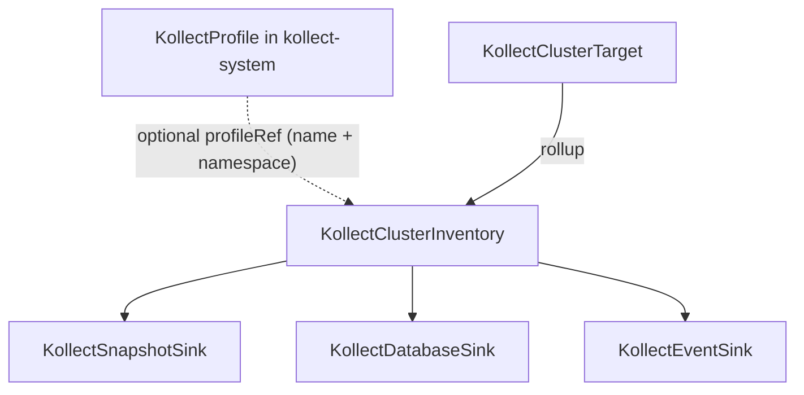

# KollectClusterInventory

**Scope:** Cluster · **Reconciled:** Yes · **Short name:** `kcinv`

!!! note "Sink namespace"
    Family sink refs (`snapshotSinkRefs`, `databaseSinkRefs`, `eventSinkRefs`) resolve namespaced
    sinks by `name` + `namespace`. A ref that omits `namespace` defaults to `spec.sinkNamespace`
    (default `kollect-system`). There is **no** cluster-scoped sink fallback (ADR-0208).

## What it is for

A `KollectClusterInventory` is the **platform-operator** rollup CR: it aggregates rows from one or
more `KollectClusterTarget` objects and exports to sinks configured in a designated export namespace.
One cluster inventory can roll up **all** cluster targets or a subset via `targetRefs`
([ADR-0201](../adr/0201-crd-model.md)).

The controller aggregates rows from matching `KollectClusterTarget` objects and exports to sinks
in `spec.sinkNamespace`.

## How it fits the pipeline



| Relationship | Rule |
| --- | --- |
| Targets | `spec.targetRefs[]` names cluster targets; empty = all matching `targetSelector` (or all targets) |
| Namespaces | Optional `spec.namespaces` (explicit list) **intersected** with `spec.namespaceSelector` when both set; at least one scope mechanism should be configured for intentional rollups |
| Sinks | Family ref lists resolved by `name` + `namespace`; refs omitting `namespace` default to `spec.sinkNamespace` (default `kollect-system`) |
| Profile | Optional `spec.profileRef` names a namespaced `KollectProfile` by `name` + `namespace` (rollup schema override, future) |

**Sink design:** namespaced family sinks resolved per ref namespace; publish platform-wide backends
once in `kollect-system` and reference them from cluster inventories (ADR-0208,
[ADR-0414](../adr/0414-sink-family-crds.md)).

## Spec fields

| Field | Type | Required | Default | Description |
| --- | --- | --- | --- | --- |
| `spec.profileRef` | object | No | — | Namespaced `KollectProfile` ref (`{ name, namespace }`, optional rollup override) |
| `spec.targetRefs[]` | list | No | all targets | `KollectClusterTarget` names (name only) |
| `spec.targetSelector` | labelSelector | No | — | Filter cluster targets when `targetRefs` empty |
| `spec.namespaces[]` | list | No | — | Explicit namespace allow-list (DNS-1123 labels); intersected with `namespaceSelector` |
| `spec.namespaceSelector` | labelSelector | No | — | Label filter for namespace scope; intersected with `namespaces` when both set |
| `spec.snapshotSinkRefs[]` | list | No | — | Snapshot sink refs (string or `{ name, namespace?, exportMinInterval?, maxExportBytes? }`) |
| `spec.databaseSinkRefs[]` | list | No | — | Database sink refs (same shape) |
| `spec.eventSinkRefs[]` | list | No | — | Event sink refs (same shape); combined max **20** |
| `spec.sinkNamespace` | string | No | `kollect-system` | Default namespace for sink refs that omit `namespace` |
| `spec.exportMinInterval` | duration | No | **30s** | Debounce for **identical payloads** per ref without override; material changes always export immediately; `0s` = material-change only |
| `spec.suspend` | bool | No | false | Pause reconciliation (reserved) |

!!! info "Export size ceiling (per sink binding)"
    A cluster inventory has **no** spec-wide `maxExportBytes` field — each sink ref uses the
    **operator global cap** (default **1.5 MiB**, [ADR-0103](../adr/0103-etcd-limit.md)) unless the
    ref sets its own `maxExportBytes` override. The webhook rejects overrides that are non-positive
    or above the global cap; payloads exceeding the effective ceiling are split into multiple
    export parts. Same override semantics as
    [KollectInventory](kollectinventory.md#spec-fields).

!!! info "Interval semantics"
    Same rules as `KollectInventory`: the interval never delays a changed payload — material checksum
    or generation changes export immediately per sink; `0s` means material-change only (30s status
    watchdog, no re-export); sub-second values are accepted but floor at 1s wake-ups. See
    [DATA-FLOWS §1](../DATA-FLOWS.md#1-export-debouncing) and
    [ADR-0413](../adr/0413-export-interval-scheduling.md).

## Example

A platform rollup that aggregates one cluster target and exports to a Postgres sink in
`kollect-system` ([`config/samples/kollect_v1alpha1_kollectclusterinventory.yaml`](https://github.com/platformrelay/kollect/blob/main/config/samples/kollect_v1alpha1_kollectclusterinventory.yaml)):

```yaml
apiVersion: kollect.dev/v1alpha1
kind: KollectClusterInventory
metadata:
  name: platform-rollup            # cluster-scoped — no namespace
spec:
  targetRefs:
    - platform-argo-applications
  namespaces:                      # optional explicit list — intersected with namespaceSelector
    - team-a
    - team-b
  namespaceSelector:
    matchLabels:
      kollect.dev/tenant: platform
  sinkNamespace: kollect-system    # default namespace for sink refs omitting namespace
  databaseSinkRefs:
    - name: postgres               # resolves in sinkNamespace (kollect-system)
  snapshotSinkRefs:
    - name: team-git               # explicit cross-namespace export
      namespace: team-a
```

## Sample usage

```sh
# Prerequisites: namespaced profile, cluster target, sink in kollect-system
kubectl apply -f config/samples/kollect_v1alpha1_kollectprofile_platform-argo-summary.yaml
kubectl apply -f config/samples/kollect_v1alpha1_kollectdatabasesink.yaml -n kollect-system
kubectl apply -f config/samples/kollect_v1alpha1_kollectclustertarget.yaml
kubectl apply -f config/samples/kollect_v1alpha1_kollectclusterinventory.yaml

kubectl get kcinv platform-rollup -o yaml
```

```sh
kubectl get kcinv platform-rollup -w
kubectl describe kcinv platform-rollup
```

Walkthrough: [examples/cluster-rollup.md](../examples/cluster-rollup.md).

## Status conditions

| Type | When set | Meaning | Remediation |
| --- | --- | --- | --- |
| `Ready=True` | Healthy | Rollup and export healthy | None |
| `Synced=True` | Export OK | All sinks exported on last reconcile | Check `status.lastExportTime` |
| `Synced=False` `PartiallySynced` | Mixed cadence | Some sinks exported; others debounced | Inspect `status.sinkExports[]` ([ADR-0413](../adr/0413-export-interval-scheduling.md)) |
| `ExportSucceeded=True` | Last export OK | Sink write succeeded (legacy alias) | Check `status.lastExportTime` |
| `Degraded=True` | Blocked | Scope, targets, size, or export error | See reasons below |

### Per-sink status (`status.sinkExports[]`)

Same shape as [KollectInventory](kollectinventory.md#per-sink-status-statussinkexports): per-ref
`lastExportTime`, `lastChecksum`, and `Synced` conditions. Interval precedence matches namespaced
inventory ([ADR-0413](../adr/0413-export-interval-scheduling.md)).

### Common `Degraded` reasons

| Reason | Cause | Fix |
| --- | --- | --- |
| `NoTargets` | No matching cluster targets | Create `KollectClusterTarget`; check `targetRefs` / `targetSelector` |
| `TargetDegraded` | One or more targets not `Ready` | Fix upstream `kctgt` status first |
| `SinkNotFound` | Bad family sink ref in `sinkNamespace` | Create family sink in export namespace |
| `ExportUnavailable` | Sink registry not configured | Check operator startup / Helm values |
| `ExportTerminal` | Non-retryable sink error | Fix sink config; check operator logs |

## RBAC

| Actor | Verbs | Resource | Notes |
| --- | --- | --- | --- |
| Platform admins | `create`, `update`, `patch`, `delete` | `kollectclusterinventories` | Cluster-scoped |
| Platform readers | `get`, `list`, `watch` | `kollectclusterinventories` | Audit platform config |
| Operator | `get`, `list`, `watch` | `kollectclusterinventories`, `kollectclustertargets`, family sinks | Rollup + export |

## Common failure modes

| Symptom | Cause | Fix |
| --- | --- | --- |
| Admission denied | Invalid or duplicate `namespaces` entry | Use unique DNS-1123 namespace names |
| Admission denied | `targetRefs` entry contains `/` | Use name only — cluster targets are cluster-scoped |
| `SinkNotFound` | Sink ref namespace wrong/empty | Set `name` (+ optional `namespace`); refs without `namespace` default to `sinkNamespace` |
| No export | Targets not `Ready` or sink misconfigured | `kubectl describe kctgt`; verify sink in `sinkNamespace` |
| `SinkNotFound` | Bad family sink ref in `sinkNamespace` | Create family sink in export namespace |
| `Degraded` | Payload too large or terminal sink error | Check operator logs and family sink status |

## See also

- [KollectProfile](kollectprofile.md) — namespaced extraction schema referenced by `profileRef`
- [KollectClusterTarget](kollectclustertarget.md) — pairs with this kind
- [KollectInventory](kollectinventory.md) — namespaced equivalent (shipped)
- [CR-REFERENCE.md](../CR-REFERENCE.md)
- [ADR-0208](../adr/0208-cluster-static-refs-via-namespace.md)
- [ADR-0201](../adr/0201-crd-model.md)
