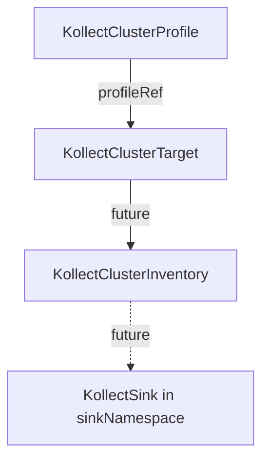

# KollectClusterProfile

**Scope:** Cluster · **Reconciled:** No (static schema) · **Short name:** `kcprof`

!!! info "Admission only (Phase 1)"
    Cluster profiles validate at admission but no controller reads them yet. Until the platform
    controller ships, `KollectClusterTarget` may reference a namespaced `KollectProfile` in the
    platform namespace as an MVP fallback.

## What it is for

A `KollectClusterProfile` is the **platform-operator** variant of `KollectProfile`: a cluster-scoped
extraction schema shared across namespaces. Platform teams publish one profile object; multiple
`KollectClusterTarget` resources reference it by name via `spec.profileRef`
([ADR-0204](../adr/0204-namespaced-profiles.md), [ADR-0201](../adr/0201-crd-model.md)).

**Phase 1:** API types, validating webhook, and sample YAML only — **no controller** reads cluster
profiles yet. `KollectClusterTarget` may still reference a namespaced `KollectProfile` in the
platform namespace until the cluster collection controller ships.

## How it fits the pipeline



| Relationship | Rule |
| --- | --- |
| `KollectClusterTarget` → Profile | `spec.profileRef` names a `KollectClusterProfile` (name only, no namespace) |
| `KollectClusterInventory` → Profile | Optional `spec.profileRef` for future rollup schema override |
| Namespaced pipeline | Team flows use `KollectProfile` + `KollectTarget` in tenant namespaces |

## Spec fields

| Field | Type | Required | Description |
| --- | --- | --- | --- |
| `spec.targetGVK.group` | string | No | API group (empty for core) |
| `spec.targetGVK.version` | string | Yes | API version (e.g. `v1alpha1`) |
| `spec.targetGVK.kind` | string | Yes | Resource kind (e.g. `Application`) |
| `spec.attributes[]` | list | No | Extraction rules (same as `KollectProfile`) |
| `spec.attributes[].name` | string | Yes | Attribute key in export rows |
| `spec.attributes[].path` | string | Yes | JSONPath (`$.…`) or `cel:…` expression |
| `spec.attributes[].type` | string | No | Hint: `string`, `int`, `list`, … |
| `spec.attributes[].optional` | bool | No | Non-fatal when extraction yields no value |
| `spec.metrics[]` | list | No | KSM-style Prometheus series (same shape as `KollectProfile`; [ADR-0304](../adr/0304-custom-resource-aggregation-rfc.md)) |

Validation reuses the `KollectProfile` admission rules: CEL compile, JSONPath shape, duplicate
attribute names, and forbidden `Secret.data` paths (unless
`kollect.dev/allow-secret-extraction: "true"`).

## Example

A cluster-scoped Argo CD `Application` summary schema shared across namespaces
([`config/samples/kollect_v1alpha1_kollectclusterprofile.yaml`](https://github.com/konih/kollect/blob/main/config/samples/kollect_v1alpha1_kollectclusterprofile.yaml)):

```yaml
apiVersion: kollect.dev/v1alpha1
kind: KollectClusterProfile
metadata:
  name: argo-application-summary    # cluster-scoped — no namespace
spec:
  targetGVK:
    group: argoproj.io
    version: v1alpha1
    kind: Application
  attributes:
    - name: chart
      path: '$.spec.source.chart'
      type: string
      optional: true
    - name: targetRevision
      path: '$.spec.source.targetRevision'
      type: string
      optional: true
    - name: syncStatus
      path: '$.status.sync.status'
      type: string
      optional: true
```

## Sample usage

```sh
kubectl apply -f config/samples/kollect_v1alpha1_kollectclusterprofile.yaml
kubectl get kcprof argo-application-summary -o yaml

# Pair with cluster target (profileRef must match)
kubectl apply -f config/samples/kollect_v1alpha1_kollectclustertarget.yaml
kubectl apply -f config/samples/kollect_v1alpha1_kollectclusterinventory.yaml
```

**Today:** expect admission success only; no collection until the cluster controller ships.

## Status conditions

| Type | When set | Meaning |
| --- | --- | --- |
| *(none wired)* | — | Static CR — no controller updates status today |

Admission webhook failures surface as Kubernetes events on create/update. Check
`kubectl describe kcprof <name>` for validation messages.

## RBAC

| Actor | Verbs | Resource | Notes |
| --- | --- | --- | --- |
| Platform admins | `create`, `update`, `patch`, `delete` | `kollectclusterprofiles` | Cluster-scoped |
| Platform readers | `get`, `list`, `watch` | `kollectclusterprofiles` | Audit shared schemas |
| Future operator | `get`, `list`, `watch` | `kollectclusterprofiles` | Cluster target controller resolves `profileRef` |

Cluster-scoped resources require elevated RBAC — restrict to platform SRE roles.

## Common failure modes

| Symptom | Cause | Fix |
| --- | --- | --- |
| Admission denied: invalid CEL | Expression does not compile | Prefix with `cel:`; see [ADR-0302](../adr/0302-cel-jsonpath-extraction.md) |
| Admission denied: empty path | `spec.attributes[].path` missing | Set JSONPath or CEL for every attribute |
| Admission denied: duplicate name | Two attributes share `name` | Use unique attribute keys |
| Admission denied: Secret.data | Path targets `Secret.data` | Add `kollect.dev/allow-secret-extraction: "true"` or avoid data paths |
| Admission warning: JSONPath filter | Filter expression in path | Phase 1 ignores filters — simplify path |
| Cluster target `profileRef` mismatch | Target references wrong profile name | Align `KollectClusterTarget.spec.profileRef` with `metadata.name` |
| No collection | Phase 1 — controller not registered | Use namespaced `KollectProfile` + `KollectTarget` for MVP |

## See also

- [KollectProfile](kollectprofile.md) — namespaced equivalent (shipped)
- [KollectClusterTarget](kollectclustertarget.md) — references this profile
- [KollectClusterInventory](kollectclusterinventory.md) — platform rollup
- [CR-REFERENCE.md](../CR-REFERENCE.md)
- [ADR-0204](../adr/0204-namespaced-profiles.md)
