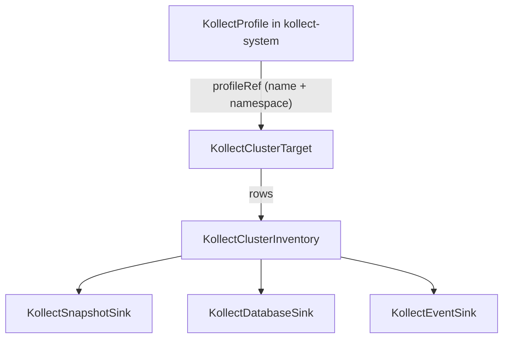

# KollectClusterTarget

**Scope:** Cluster · **Reconciled:** Yes · **Short name:** `kctgt`

!!! tip "Platform vs team scope"
    Use `KollectClusterTarget` for cross-namespace platform collection. Team-scoped flows use
    namespaced `KollectTarget` + `KollectInventory` instead.

## What it is for

A `KollectClusterTarget` is the **platform-operator** variant of `KollectTarget`: it collects
across multiple namespaces using a cluster-scoped object and a required `namespaceSelector`. It
pairs with `KollectClusterInventory` for platform-wide rollup export
([ADR-0201](../adr/0201-crd-model.md)).

The controller registers shared informers per profile GVK and filters events across namespaces
matched by `spec.namespaceSelector`.

## How it fits the pipeline



| Relationship | Rule |
| --- | --- |
| Profile | `spec.profileRef` resolves to a namespaced **`KollectProfile`** by explicit `name` + `namespace` (ADR-0208 — no cluster profile, no implicit fallback) |
| Namespaces | `namespaceSelector` **required** — empty selector rejected at admission |
| Namespaced pipeline | Team flows use `KollectTarget` + `KollectInventory` instead |

Walkthrough: [examples/cluster-rollup.md](../examples/cluster-rollup.md).

## Spec fields

| Field | Type | Required | Description |
| --- | --- | --- | --- |
| `spec.profileRef.name` | string | Yes | Name of the `KollectProfile` to resolve |
| `spec.profileRef.namespace` | string | **Yes** | Namespace of the `KollectProfile` — required on cluster kinds (no implicit `kollect-system` fallback) |
| `spec.namespaceSelector` | labelSelector | **Yes** | Required — webhook rejects empty selector (no cluster-wide implicit scrape) |
| `spec.suspend` | bool | No | Pause reconciliation (reserved) |

## Example

A cluster target that collects Argo `Application`s across namespaces labelled
`kollect.dev/tenant=platform` ([`config/samples/kollect_v1alpha1_kollectclustertarget.yaml`](https://github.com/konih/kollect/blob/main/config/samples/kollect_v1alpha1_kollectclustertarget.yaml)):

```yaml
apiVersion: kollect.dev/v1alpha1
kind: KollectClusterTarget
metadata:
  name: platform-argo-applications   # cluster-scoped — no namespace
spec:
  profileRef:
    name: argo-application-summary
    namespace: kollect-system         # required — namespaced KollectProfile
  namespaceSelector:                  # required — empty selector is rejected at admission
    matchLabels:
      kollect.dev/tenant: platform
```

## Sample usage

```sh
# Namespaced platform profile in kollect-system, then the cluster target
kubectl apply -f config/samples/kollect_v1alpha1_kollectprofile_platform-argo-summary.yaml
kubectl apply -f config/samples/kollect_v1alpha1_kollectclustertarget.yaml

kubectl get kctgt platform-argo-applications -o yaml
kubectl describe kctgt platform-argo-applications
```

Label namespaces for the sample selector:

```sh
kubectl label namespace argocd kollect.dev/tenant=platform --overwrite
```

```sh
kubectl get kctgt platform-argo-applications -w
kubectl describe kctgt platform-argo-applications
```

## Status conditions

| Type | When set | Meaning | Remediation |
| --- | --- | --- | --- |
| `Ready=True` | Collecting | Profile resolved; informer registered across matched namespaces | None |
| `Degraded=True` | Blocked | See `reason` below | Fix root cause; generation bump re-reconciles |

### Common `Degraded` reasons

| Reason | Cause | Fix |
| --- | --- | --- |
| `Suspended` | `spec.suspend: true` | Set `suspend: false` |
| `ProfileNotFound` | No `KollectProfile` in `profileRef.namespace` | Create the `KollectProfile` in the referenced namespace |
| `InformerRegistrationFailed` | Dynamic client / GVK error | Verify CRD installed; check operator logs |

## RBAC

| Actor | Verbs | Resource | Notes |
| --- | --- | --- | --- |
| Platform admins | `create`, `update`, `patch`, `delete` | `kollectclustertargets` | Cluster-scoped |
| Platform readers | `get`, `list`, `watch` | `kollectclustertargets` | Audit platform config |
| Operator | `get`, `list`, `watch` + target GVK verbs | cluster + dynamic | Cross-namespace list |

Cluster-scoped resources require elevated RBAC — restrict to platform SRE roles.

## Common failure modes

| Symptom | Cause | Fix |
| --- | --- | --- |
| Admission denied | Missing `profileRef.name` | Set the profile name |
| Admission denied | Missing `profileRef.namespace` | Set the profile namespace — required on cluster kinds (ADR-0208) |
| Admission denied | Missing `namespaceSelector` | Add explicit label selector |
| No collection | Empty `namespaceSelector` match or RBAC denied | Label namespaces; extend operator ClusterRole for target GVK |
| `ProfileNotFound` | No `KollectProfile` in `profileRef.namespace` | Create the profile in the referenced namespace |
| `Degraded` / `Forbidden` | SAR denies list in scoped NS | Grant operator read on target GVK in workload namespaces |

## See also

- [KollectProfile](kollectprofile.md) — namespaced extraction schema referenced by `profileRef`
- [KollectClusterInventory](kollectclusterinventory.md) — pairs with this kind
- [KollectTarget](kollecttarget.md) — namespaced equivalent (shipped)
- [CR-REFERENCE.md](../CR-REFERENCE.md) — cluster reconciled kinds
- [PLATFORM-DECISIONS.md](../PLATFORM-DECISIONS.md)
- [ADR-0208](../adr/0208-cluster-static-refs-via-namespace.md)
- [ADR-0201](../adr/0201-crd-model.md)
