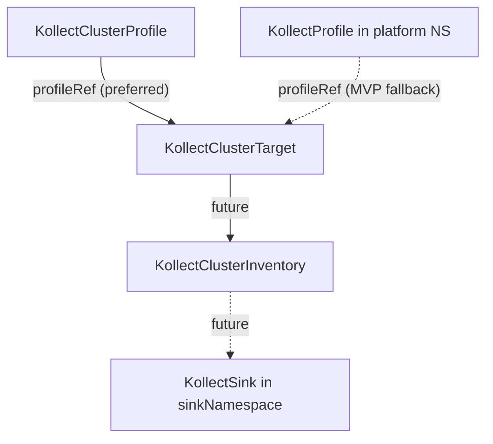

# KollectClusterTarget

**Scope:** Cluster · **Reconciled:** Webhook only (Phase 1) · **Short name:** `kctgt`

!!! info "API only (Phase 1)"
    Cluster targets validate at admission but **do not reconcile** until the platform controller
    ships. Use namespaced `KollectTarget` for working collection today.

## What it is for

A `KollectClusterTarget` is the **platform-operator** variant of `KollectTarget`: it collects
across multiple namespaces using a cluster-scoped object and a required `namespaceSelector`. It
pairs with `KollectClusterInventory` for platform-wide rollup export
([ADR-0703](../adr/0703-platform-architecture-pivot.md)).

**Phase 1:** API types, validating webhook, and sample YAML only — **no controller** is registered.
Objects persist and validate at admission; collection/export requires a future controller milestone.

## How it fits the pipeline



| Relationship | Rule |
| --- | --- |
| Profile | `spec.profileRef` resolves to **`KollectClusterProfile`** (preferred) or `KollectProfile` in **platform namespace** (MVP fallback) |
| Namespaces | `namespaceSelector` **required** — empty selector rejected at admission |
| Namespaced pipeline | Team flows use `KollectTarget` + `KollectInventory` instead |

Build order: namespaced MVP first, then cluster controller — [PLATFORM-DECISIONS.md](../PLATFORM-DECISIONS.md).

## Spec fields

| Field | Type | Required | Description |
| --- | --- | --- | --- |
| `spec.profileRef` | string | Yes | Name of `KollectClusterProfile` or platform-namespace `KollectProfile` (name only) |
| `spec.namespaceSelector` | labelSelector | **Yes** | Required — webhook rejects empty selector (no cluster-wide implicit scrape) |
| `spec.suspend` | bool | No | Pause reconciliation (reserved) |

## Sample usage

```sh
# Cluster profile (preferred) or namespaced profile in platform namespace
kubectl apply -f config/samples/kollect_v1alpha1_kollectclusterprofile.yaml
kubectl apply -f config/samples/kollect_v1alpha1_kollectclustertarget.yaml

kubectl get kctgt platform-argo-applications -o yaml
kubectl describe kctgt platform-argo-applications
```

Label namespaces for the sample selector:

```sh
kubectl label namespace argocd kollect.dev/tenant=platform --overwrite
```

**Today:** expect admission success only; no `Ready` status or collection until controller ships.

## Status conditions

| Type | When set | Meaning |
| --- | --- | --- |
| *(reserved)* | Future controller | `Ready`, `Degraded` — not wired in Phase 1 |

Watch webhook validation via `kubectl apply` errors until controller lands.

## RBAC

| Actor | Verbs | Resource | Notes |
| --- | --- | --- | --- |
| Platform admins | `create`, `update`, `patch`, `delete` | `kollectclustertargets` | Cluster-scoped |
| Platform readers | `get`, `list`, `watch` | `kollectclustertargets` | Audit platform config |
| Future operator | `get`, `list`, `watch` + target GVK verbs | cluster + dynamic | Cross-namespace list |

Cluster-scoped resources require elevated RBAC — restrict to platform SRE roles.

## Common failure modes

| Symptom | Cause | Fix |
| --- | --- | --- |
| Admission denied | Missing `profileRef` | Set profile name (not `namespace/name`) |
| Admission denied | Missing `namespaceSelector` | Add explicit label selector |
| Admission denied | `profileRef` contains `/` | Use name only — profile lives in platform namespace |
| No collection | Phase 1 — controller not registered | Use namespaced `KollectTarget` for MVP |
| *(future)* `ProfileNotFound` | No `KollectClusterProfile` or platform profile | Create `kcprof` or namespaced profile in `platformNamespace` |
| *(future)* `Degraded` | Scope or RBAC denies cross-namespace list | Extend operator ClusterRole; add `KollectClusterScope` |

## See also

- [KollectClusterProfile](kollectclusterprofile.md) — platform extraction schema
- [KollectClusterInventory](kollectclusterinventory.md) — pairs with this kind
- [KollectTarget](kollecttarget.md) — namespaced equivalent (shipped)
- [CR-REFERENCE.md](../CR-REFERENCE.md) — reserved cluster kinds
- [PLATFORM-DECISIONS.md](../PLATFORM-DECISIONS.md)
- [ADR-0703](../adr/0703-platform-architecture-pivot.md)
