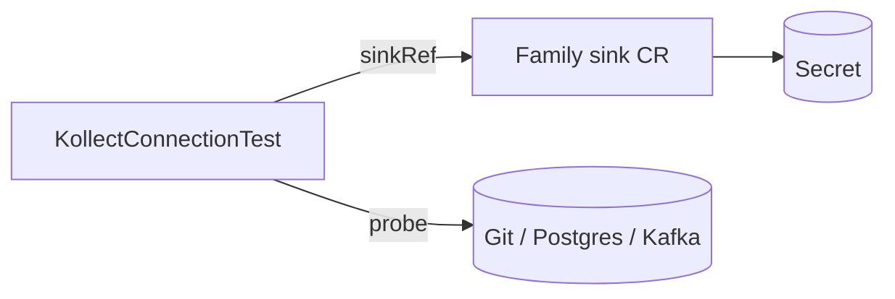

# KollectConnectionTest

**Scope:** Namespace · **Reconciled:** Yes · **Short name:** `kconntest`

!!! tip "Audited probes"
    Prefer this CR over `spec.connectionTest: true` in production — it leaves a probe record without
    leaving continuous probe side effects on the sink spec. Default TTL auto-deletes the CR after 300s.

## What it is for

A `KollectConnectionTest` runs a **one-shot, audited** connectivity probe against a **family sink**
(`KollectSnapshotSink`, `KollectDatabaseSink`, or `KollectEventSink`). Use it in CI pipelines, runbooks, or after credential rotation when you need a
durable record of probe outcome without mutating the sink spec.

Supplements sink `spec.connectionTest` and the `kollect.dev/test-connection` annotation
([ADR-0403](../adr/0403-connection-test.md), [ADR-0201](../adr/0201-crd-model.md)).

## How it fits the pipeline



| Relationship | Rule |
| --- | --- |
| Sink | `spec.sinkRef` object — exactly one of `snapshotSinkRef`, `databaseSinkRef`, or `eventSinkRef` |
| Profile | `spec.profileRef` reserved for future composite probes |
| Owner | `spec.ownerSink: true` (default) sets ownerReference on sink |

Lifecycle: [DATA-FLOWS.md §5](../DATA-FLOWS.md#5-kollectconnectiontest-lifecycle).

## Spec fields

| Field | Type | Required | Default | Description |
| --- | --- | --- | --- | --- |
| `spec.sinkRef.snapshotSinkRef` | string | One of three | — | `KollectSnapshotSink` name (same namespace) |
| `spec.sinkRef.databaseSinkRef` | string | One of three | — | `KollectDatabaseSink` name |
| `spec.sinkRef.eventSinkRef` | string | One of three | — | `KollectEventSink` name |
| `spec.profileRef` | string | No | — | Reserved for composite probes |
| `spec.ownerSink` | bool | No | true | Set ownerReference to sink |
| `spec.ttlSecondsAfterFinished` | int32 | No | **300** | Delete CR after completion + TTL |

## Sample usage

```sh
kubectl apply -f config/samples/kollect_v1alpha1_kollectdatabasesink.yaml
kubectl apply -f config/samples/kollect_v1alpha1_kollectconnectiontest.yaml

kubectl wait --for=condition=ConnectionVerified kollectconnectiontest/postgres-sink-probe \
  -n default --timeout=120s
kubectl get kconntest postgres-sink-probe -n default -o wide
```

Re-run after fixing credentials:

```sh
kubectl delete kconntest postgres-sink-probe -n default
kubectl apply -f config/samples/kollect_v1alpha1_kollectconnectiontest.yaml
```

Or patch `spec.sinkRef` (same value) to bump generation and trigger re-probe:

```sh
kubectl patch kconntest postgres-sink-probe -n default --type=merge \
  -p '{"spec":{"ttlSecondsAfterFinished":600}}'
```

## Status conditions

| Type | When set | Meaning | Remediation |
| --- | --- | --- | --- |
| `ConnectionVerified=True` | Probe OK | `reason`: `ConnectionOK` | None |
| `ConnectionVerified=False` | Probe failed | See reasons below | Fix sink Secret, network, TLS |
| `Ready=True/False` | Mirrors probe | `ProbeSucceeded` or failure reason | Same as above |

### Status fields

| Field | Description |
| --- | --- |
| `status.completed` | True after probe finishes |
| `status.completedAt` | Timestamp for TTL cleanup |
| `status.latencyMs` | Last probe duration |
| `status.observedGeneration` | Generation last reconciled |

### Failure reasons

| Reason | Cause | Fix |
| --- | --- | --- |
| `SinkNotFound` | Missing sink | Apply family sink CR first |
| `SecretResolveFailed` | Bad `secretRef` / `databaseRef` | Create Secret with expected keys |
| `ConnectionTestFailed` | Backend unreachable or auth failure | Curl endpoint from cluster; verify DSN/brokers |

After success or failure, the CR is deleted automatically after `ttlSecondsAfterFinished` (default
**300s**).

## RBAC

| Actor | Verbs | Resource | Notes |
| --- | --- | --- | --- |
| CI / developers | `create`, `delete`, `get`, `list`, `watch` | `kollectconnectiontests` | Trigger probes |
| Operator | `update`, `patch` | `kollectconnectiontests/status` | Write outcome |
| Operator | `get`, `list`, `watch` | family sinks, `secrets` | Resolve sink + credentials |

## Common failure modes

| Symptom | Likely cause | Fix |
| --- | --- | --- |
| CR deleted before inspection | TTL elapsed | Increase `ttlSecondsAfterFinished` or watch with `-w` |
| No re-probe after fix | Same generation | Patch any spec field to bump generation |
| Probe succeeds; inventory fails | Different namespace Secret | Connection test uses sink spec in same namespace |
| Owner reference warning | `ownerSink: true` on missing sink | Create sink before test CR |
| Duplicate probes | CI creates many CRs | Use unique names or rely on TTL GC |

## See also

- [KollectSnapshotSink](kollectsnapshotsink.md) · [KollectDatabaseSink](kollectdatabasesink.md) · [KollectEventSink](kollecteventsink.md)
- [DATA-FLOWS.md](../DATA-FLOWS.md#5-kollectconnectiontest-lifecycle)
- [QUICKSTART.md](../QUICKSTART.md) — sink annotation quick test
