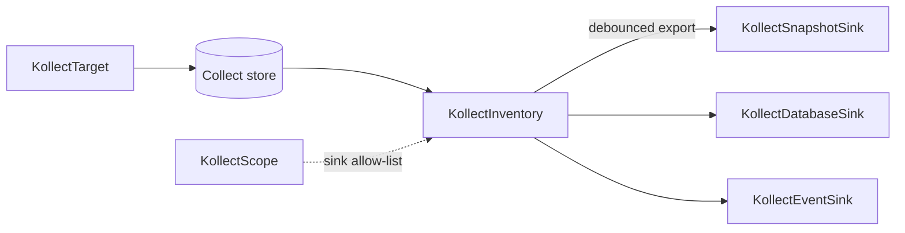

# KollectInventory

**Scope:** Namespace · **Reconciled:** Yes · **Short name:** `kinv`

!!! note "Payload location"
    Full export payloads live in sinks — `status` holds counts, conditions, and metadata refs only
    ([ADR-0103](../adr/0103-etcd-limit.md)). Query Postgres or Git for the authoritative snapshot.

## What it is for

A `KollectInventory` aggregates all collected rows from `KollectTarget` objects in the **same
namespace** and exports the marshalled JSON payload to one or more **family sink** backends
(`KollectSnapshotSink`, `KollectDatabaseSink`, `KollectEventSink`). The
in-memory store updates immediately on every watch event; sink writes coalesce **per sink ref** —
each backend may use a different effective `exportMinInterval`
([ADR-0413](../adr/0413-export-interval-scheduling.md)).

Postgres and Kafka are the **primary** portal integration path; Git suits small single-cluster
installs. Full payloads live in sinks; `status` holds counts, conditions, and export metadata only
([ADR-0103](../adr/0103-etcd-limit.md)).

## How it fits the pipeline



| Relationship | Rule |
| --- | --- |
| Targets | All active targets in namespace contribute rows |
| Sinks | `spec.snapshotSinkRefs`, `spec.databaseSinkRefs`, `spec.eventSinkRefs` — names in same namespace |
| Scope | When present, every sink must appear in the matching family list on `KollectScope` |

Debouncing state machine: [DATA-FLOWS.md §1](../DATA-FLOWS.md#1-export-debouncing).

!!! info "Effective interval precedence"
    For each family ref: **ref override** → **family sink `spec.exportMinInterval`** →
    **`spec.exportMinInterval`** (default **30s**) → clamped to **`KollectScope.spec.minExportInterval`**
    floor when scope exists. Material checksum or `metadata.generation` changes bypass debounce **per
    sink**. See [ADR-0413](../adr/0413-export-interval-scheduling.md).

!!! info "Interval semantics — debounce, not rate limit"
    `exportMinInterval` only throttles re-export of an **identical payload**. Material changes
    (payload checksum or generation bump) export **immediately, regardless of the interval** —
    distinct payloads are never delayed or rate-limited. `0s` is valid and means *material-change
    only*: instant export on change, no periodic re-export (a 30s status watchdog still requeues
    without exporting). Sub-second values (e.g. `500ms`) are accepted up to the **24h** cap, but
    requeue wake-ups floor at **1s** — prefer `0s`, which event sinks (Kafka/NATS) typically use.
    Full semantics: [DATA-FLOWS §1](../DATA-FLOWS.md#1-export-debouncing).

!!! info "Export size ceiling precedence (per sink binding)"
    For each sink ref: **ref `maxExportBytes`** → **`spec.maxExportBytes`** → **operator global cap**
    (default **1.5 MiB**, [ADR-0103](../adr/0103-etcd-limit.md)). A ref override **replaces** the
    inventory-wide ceiling wholesale (override, not clamp), so a binding may set a smaller **or
    larger** ceiling than `spec.maxExportBytes` — the webhook only rejects values that are
    non-positive or above the operator global cap. Payloads exceeding the effective ceiling are
    split into multiple export parts. Typical use: keep a large ceiling for Postgres while forcing
    smaller parts for a Git audit sink.

## Spec fields

| Field | Type | Required | Default | Description |
| --- | --- | --- | --- | --- |
| `spec.snapshotSinkRefs[]` | list | No | — | Snapshot sink names (string) or `{ name, exportMinInterval?, maxExportBytes? }` |
| `spec.databaseSinkRefs[]` | list | No | — | Database sink refs (same shape) |
| `spec.eventSinkRefs[]` | list | No | — | Event sink refs (same shape); combined max **20** refs |
| `spec.exportMinInterval` | duration | No | **30s** | Debounce for **identical payloads** per ref without override; material changes always export immediately; `0s` = material-change only |
| `spec.maxExportBytes` | int64 | No | global cap | Inventory-wide export size ceiling; per-ref `maxExportBytes` overrides it per sink binding |
| `spec.suspend` | bool | No | false | Pause reconciliation |
| `spec.httpEndpoint.enabled` | bool | No | false | Per-CR HTTP debug (operator gate also required) |
| `spec.httpEndpoint.port` | int32 | No | 8082 | Listen port when HTTP enabled |

## Example

A dual-cadence inventory: export to Postgres every 30s for portals, and to a Git audit repo
hourly ([`config/samples/kollect_v1alpha1_kollectinventory.yaml`](https://github.com/konih/kollect/blob/main/config/samples/kollect_v1alpha1_kollectinventory.yaml)):

```yaml
apiVersion: kollect.dev/v1alpha1
kind: KollectInventory
metadata:
  name: team-inventory
  namespace: default
spec:
  exportMinInterval: 30s          # default cadence for refs without an override
  databaseSinkRefs:
    - postgres-inventory-demo
  snapshotSinkRefs:
    - name: git-inventory-demo     # per-ref override: audit trail at a slower cadence
      exportMinInterval: 1h
  suspend: false
```

See [`config/samples/kollect_v1alpha1_kollectinventory_sharded.yaml`](https://github.com/konih/kollect/blob/main/config/samples/kollect_v1alpha1_kollectinventory_sharded.yaml)
for a large-profile sharded variant, and
[`config/samples/kollect_v1alpha1_kollectinventory_export-partitioning.yaml`](https://github.com/konih/kollect/blob/main/config/samples/kollect_v1alpha1_kollectinventory_export-partitioning.yaml)
for a per-sink-binding `maxExportBytes` override (1 MiB inventory-wide ceiling, 512 KiB Git parts).

## Sample usage

```sh
# Prerequisites: profile, target, sink in default namespace
kubectl apply -f config/samples/kollect_v1alpha1_kollectprofile.yaml
kubectl apply -f config/samples/kollect_v1alpha1_kollectdatabasesink.yaml
kubectl apply -f config/samples/kollect_v1alpha1_kollecttarget.yaml
kubectl apply -f config/samples/kollect_v1alpha1_kollectinventory.yaml

kubectl get kinv -n default team-inventory -w
kubectl describe kinv team-inventory -n default
```

Git-backed walkthrough (swap postgres sink for git sample):

```sh
kubectl apply -k config/samples/
kubectl get kinv,ktgt,ksnap,kdb -A
```

Force faster export after spec change (generation bump):

```sh
kubectl patch kinv team-inventory -n default --type=merge \
  -p '{"spec":{"exportMinInterval":"10s"}}'
```

## Status conditions

| Type | When set | Meaning | Remediation |
| --- | --- | --- | --- |
| `Ready=True` | Healthy | Aggregating and exporting | None |
| `Synced=True` | Export OK | All sinks exported on last reconcile (or debounced with no failures) | Check `status.lastExportTime` |
| `Synced=False` `PartiallySynced` | Mixed cadence | Some sinks exported; others debounced on identical payload | Normal for dual-cadence fan-out — inspect `status.sinkExports[]` |
| `Synced=False` | Transient export error | `reason`: `Progressing` | Wait for retry/backoff |
| `Degraded=True` | Hard block | Scope, size, or terminal export | See reasons below |
| `SinkReachable=True/False` | Pre/post export | Sink probe or last export outcome | Fix family sink CR |

### Per-sink status (`status.sinkExports[]`)

When family sink refs are configured, each entry mirrors export observation:

| Field | Meaning |
| --- | --- |
| `name` | Sink key `family/name` (e.g. `database/warehouse`) |
| `lastExportTime` | Last successful export to this sink |
| `lastChecksum` | Payload fingerprint from last export |
| `conditions[]` | Per-sink `Synced` — `reason=Debounced` when interval not elapsed |

Aggregate `status.lastExportTime` is the **max** of per-sink times (backward compatible). Read API
`/status` prefers `sinkExports` when present ([ADR-0413](../adr/0413-export-interval-scheduling.md)).

### Common `Degraded` reasons

| Reason | Cause | Fix |
| --- | --- | --- |
| `ScopeSinkDenied` | Sink not in scope | Add to matching family list on `KollectScope` |
| `ScopeLookupFailed` | Cannot read scope | RBAC / API error |
| `SinkNotFound` | Bad `sinkRefs` entry | Correct sink name |
| `SinkUnreachable` | `ConnectionVerified=False` | Fix sink credentials / network |
| `PayloadTooLarge` | Exceeds `maxExportBytes` | Split targets, raise the inventory-wide or per-ref `maxExportBytes` within the global cap, or trim attributes |
| `ExportTerminal` | Non-retryable sink error | Fix sink config; check operator logs |
| `Progressing` | Transient network/429 | Usually self-heals; inspect `kollect_sink_errors_total` |

## RBAC

| Actor | Verbs | Resource | Notes |
| --- | --- | --- | --- |
| Team admins | `create`, `update`, `patch`, `delete` | `kollectinventories` | Configure export |
| Developers | `get`, `list`, `watch` | `kollectinventories` | Read status / counts |
| Operator | `get`, `list`, `watch` | family sink CRs, `kollectscopes` | Aggregate + export |
| Operator | `get`, `list`, `watch` | `secrets` | Sink credential resolution |
| Operator | `update`, `patch` | `kollectinventories/status` | Conditions and export metadata |

HTTP inventory read path (when enabled) requires caller SAR `get` on `kollectinventories` —
[ADR-0404](../adr/0404-inventory-api-auth.md).

## Common failure modes

| Symptom | Likely cause | Fix |
| --- | --- | --- |
| `itemCount` 0 | No matching targets or suspended targets | Check `ktgt` status; deploy matching workloads |
| Exports every 30s identical payload | Debounce working as designed | Lower `exportMinInterval` only if needed |
| No export for minutes | Debounced identical checksum | Change inventory material (deploy patch) or wait interval |
| Postgres empty table | Export not implemented / sink error | `kubectl logs -n kollect-system deploy/kollect-controller-manager` |
| `RequeueAfter` in logs | Debounce wait | Normal — see [DATA-FLOWS](../DATA-FLOWS.md) timing example |
| HTTP endpoint unreachable | Feature gate off | Enable Helm `featureGates.inventoryHttp` **and** `spec.httpEndpoint.enabled` |

## See also

- [KollectTarget](kollecttarget.md) · [KollectSnapshotSink](kollectsnapshotsink.md) · [KollectDatabaseSink](kollectdatabasesink.md) · [KollectEventSink](kollecteventsink.md) · [KollectScope](kollectscope.md)
- [ADR-0414](../adr/0414-sink-family-crds.md)
- [DATA-FLOWS.md](../DATA-FLOWS.md)
- [examples/deployment-inventory.md](../examples/deployment-inventory.md)
- [ADR-0602](../adr/0602-error-taxonomy.md) — error classes
