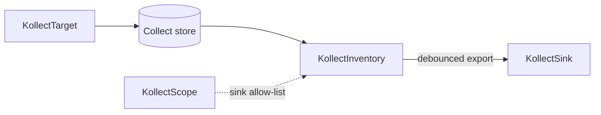

# KollectInventory

**Scope:** Namespace · **Reconciled:** Yes · **Short name:** `kinv`

!!! note "Payload location"
    Full export payloads live in sinks — `status` holds counts, conditions, and metadata refs only
    ([ADR-0103](../adr/0103-etcd-limit.md)). Query Postgres or Git for the authoritative snapshot.

## What it is for

A `KollectInventory` aggregates all collected rows from `KollectTarget` objects in the **same
namespace** and exports the marshalled JSON payload to one or more `KollectSink` backends. Export is
**debounced per inventory** — the in-memory store updates immediately on every watch event, but
sink writes coalesce unless the payload checksum or CR generation changes
([ADR-0703](../adr/0703-platform-architecture-pivot.md)).

Postgres and Kafka are the **primary** portal integration path; Git suits small single-cluster
installs. Full payloads live in sinks; `status` holds counts, conditions, and export metadata only
([ADR-0103](../adr/0103-etcd-limit.md)).

## How it fits the pipeline



| Relationship | Rule |
| --- | --- |
| Targets | All active targets in namespace contribute rows |
| Sinks | `spec.sinkRefs[]` — names in same namespace |
| Scope | When present, every sink must be listed in `scope.sinkRefs` |

Debouncing state machine: [DATA-FLOWS.md §1](../DATA-FLOWS.md#1-export-debouncing).

## Spec fields

| Field | Type | Required | Default | Description |
| --- | --- | --- | --- | --- |
| `spec.sinkRefs[]` | list | No | — | `KollectSink` names in same namespace |
| `spec.exportMinInterval` | duration | No | **30s** | Min gap between identical exports; bypass on checksum or generation change |
| `spec.maxExportBytes` | int64 | No | global cap | Max marshalled payload size |
| `spec.suspend` | bool | No | false | Pause reconciliation |
| `spec.httpEndpoint.enabled` | bool | No | false | Per-CR HTTP debug (operator gate also required) |
| `spec.httpEndpoint.port` | int32 | No | 8082 | Listen port when HTTP enabled |

## Sample usage

```sh
# Prerequisites: profile, target, sink in default namespace
kubectl apply -f config/samples/kollect_v1alpha1_kollectprofile.yaml
kubectl apply -f config/samples/kollect_v1alpha1_kollectsink_postgres.yaml
kubectl apply -f config/samples/kollect_v1alpha1_kollecttarget.yaml
kubectl apply -f config/samples/kollect_v1alpha1_kollectinventory.yaml

kubectl get kinv -n default team-inventory -w
kubectl describe kinv team-inventory -n default
```

Git-backed walkthrough (swap postgres sink for git sample):

```sh
kubectl apply -k config/samples/
kubectl get kinv,ktgt,ksink -A
```

Force faster export after spec change (generation bump):

```sh
kubectl patch kinv team-inventory -n default --type=merge \
  -p '{"spec":{"exportMinInterval":"10s"}}'
```

## Status conditions

| Type | When set | Meaning | Remediation |
| --- | --- | --- | --- |
| `Ready=True` | Healthy | Aggregating and exporting | None |
| `Synced=True` | Export OK | Last export succeeded | Check `status.lastExportTime` |
| `Synced=False` | Transient export error | `reason`: `Progressing` | Wait for retry/backoff |
| `Degraded=True` | Hard block | Scope, size, or terminal export | See reasons below |
| `SinkReachable=True/False` | Pre/post export | Sink probe or last export outcome | Fix [KollectSink](kollectsink.md) |

### Common `Degraded` reasons

| Reason | Cause | Fix |
| --- | --- | --- |
| `ScopeSinkDenied` | Sink not in scope | Add to `KollectScope.spec.sinkRefs` |
| `ScopeLookupFailed` | Cannot read scope | RBAC / API error |
| `SinkNotFound` | Bad `sinkRefs` entry | Correct sink name |
| `SinkUnreachable` | `ConnectionVerified=False` | Fix sink credentials / network |
| `PayloadTooLarge` | Exceeds `maxExportBytes` | Split targets, raise cap within global limit, or trim attributes |
| `ExportTerminal` | Non-retryable sink error | Fix sink config; check operator logs |
| `Progressing` | Transient network/429 | Usually self-heals; inspect `kollect_sink_errors_total` |

## RBAC

| Actor | Verbs | Resource | Notes |
| --- | --- | --- | --- |
| Team admins | `create`, `update`, `patch`, `delete` | `kollectinventories` | Configure export |
| Developers | `get`, `list`, `watch` | `kollectinventories` | Read status / counts |
| Operator | `get`, `list`, `watch` | `kollectinventories`, `kollecttargets`, `kollectsinks`, `kollectscopes` | Aggregate + export |
| Operator | `get`, `list`, `watch` | `secrets` | Sink credential resolution |
| Operator | `update`, `patch` | `kollectinventories/status` | Conditions and export metadata |

HTTP inventory read path (when enabled) requires caller SAR `get` on `kollectinventories` —
[ADR-0404](../adr/0404-inventory-api-auth.md).

## Common failure modes

| Symptom | Likely cause | Fix |
| --- | --- | --- |
| `itemCount` 0 | No matching targets or suspended targets | Check `ktgt` status; deploy matching workloads |
| Exports every 30s identical payload | Debounce working as designed | Lower `exportMinInterval` only if needed |
| No export for minutes | Debounced identical checksum | Change inventory material (deploy patch) or wait interval |
| Postgres empty table | Export not implemented / sink error | `kubectl logs -n kollect-system deploy/kollect-controller-manager` |
| `RequeueAfter` in logs | Debounce wait | Normal — see [DATA-FLOWS](../DATA-FLOWS.md) timing example |
| HTTP endpoint unreachable | Feature gate off | Enable Helm `featureGates.inventoryHttp` **and** `spec.httpEndpoint.enabled` |

## See also

- [KollectTarget](kollecttarget.md) · [KollectSink](kollectsink.md) · [KollectScope](kollectscope.md)
- [DATA-FLOWS.md](../DATA-FLOWS.md)
- [examples/deployment-inventory.md](../examples/deployment-inventory.md)
- [ADR-0602](../adr/0602-error-taxonomy.md) — error classes
