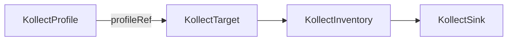

# KollectProfile

**Scope:** Namespace · **Reconciled:** No (static schema) · **Short name:** —

## What it is for

A `KollectProfile` defines **what** to collect: the target GroupVersionKind (GVK) and a list of
attribute extraction rules. Each rule maps a logical name (for example `image` or `labels`) to a
JSONPath or CEL expression evaluated against cached Kubernetes objects.

Profiles are **static configuration** — no controller reconciles them. The target controller loads
the profile referenced by `KollectTarget.spec.profileRef` when registering collection. Validation
happens at admission (CEL compile, JSONPath shape, forbidden `Secret.data` paths).

See [ADR-0003](../adr/0003-cel-jsonpath-extraction.md) and
[ADR-0031](../adr/0031-namespaced-profiles.md).

## How it fits the pipeline



| Relationship | Rule |
| --- | --- |
| `KollectTarget` → Profile | `spec.profileRef` names a profile in the **same namespace** |
| `KollectScope` → Profile | When scope exists, profile GVK must appear in `allowedGVKs` |
| Profile change | Secondary watch enqueues referring targets (beta) |

Full flow: [DATA-FLOWS.md](../DATA-FLOWS.md#2-collection-pipeline) ·
[examples/deployment-inventory.md](../examples/deployment-inventory.md).

## Spec fields

| Field | Type | Required | Description |
| --- | --- | --- | --- |
| `spec.targetGVK.group` | string | No | API group (empty for core) |
| `spec.targetGVK.version` | string | Yes | API version (e.g. `v1`) |
| `spec.targetGVK.kind` | string | Yes | Resource kind (e.g. `Deployment`) |
| `spec.attributes[]` | list | No | Extraction rules |
| `spec.attributes[].name` | string | Yes | Attribute key in export rows |
| `spec.attributes[].path` | string | Yes | JSONPath (`$.…`) or `cel:…` expression |
| `spec.attributes[].type` | string | No | Hint: `string`, `int`, `list`, `map`, … |
| `spec.attributes[].optional` | bool | No | Non-fatal when extraction yields no value |
| `spec.metrics[]` | list | No | KSM-style Prometheus series on operator `/metrics` ([ADR-0033](../adr/0033-custom-resource-aggregation-rfc.md)) |
| `spec.metrics[].name` | string | Yes | Bounded series identifier (e.g. `ready_replicas_total`) |
| `spec.metrics[].path` | string | Yes | Attribute name from `spec.attributes` to aggregate |
| `spec.metrics[].labels[]` | list | No | Optional label keys from attributes (max 5); emits `kollect_custom_resource_labeled_series` |

## Sample usage

Apply the Deployment profile sample:

```sh
kubectl apply -f config/samples/kollect_v1alpha1_kollectprofile.yaml
kubectl get kollectprofile -n default deployment-images -o yaml
```

Create a matching target (next step in the pipeline):

```sh
kubectl apply -f config/samples/kollect_v1alpha1_kollecttarget.yaml
kubectl get ktgt -n default nginx-deployments -o jsonpath='{.status.conditions}'
```

**Argo CD Application** schema:

```sh
kubectl apply -f config/samples/kollect_v1alpha1_kollectprofile_argo-application-summary.yaml
kubectl apply -f config/samples/kollect_v1alpha1_kollecttarget_argo-applications.yaml
```

Or apply the full sample set:

```sh
kubectl apply -k config/samples/
```

## Status conditions

| Type | When set | Meaning |
| --- | --- | --- |
| *(none wired)* | — | Static CR — no controller updates status today |

Admission webhook failures surface as Kubernetes events on create/update, not as status conditions.
Check `kubectl describe kollectprofile <name>` for validation messages.

## RBAC

| Actor | Verbs | Resource | Notes |
| --- | --- | --- | --- |
| Team / app engineers | `get`, `list`, `watch` | `kollectprofiles` | Read schemas in tenant namespace |
| Profile authors | `create`, `update`, `patch`, `delete` | `kollectprofiles` | Define extraction in release namespace |
| Operator | `get`, `list`, `watch` | `kollectprofiles` | Target controller resolves `profileRef` |

Platform teams typically grant profile write to namespace admins and read to developers. The operator
ClusterRole includes profile read cluster-wide when not in tenant mode.

## Common failure modes

| Symptom | Reason | Fix |
| --- | --- | --- |
| Admission denied: invalid CEL | Expression does not compile | Prefix with `cel:`; test in unit fixtures; see [ADR-0003](../adr/0003-cel-jsonpath-extraction.md) |
| Admission denied: empty path | `spec.attributes[].path` missing | Set JSONPath or CEL for every attribute |
| Admission denied: Secret.data | Path targets `Secret.data` | Use `Secret` metadata only or redact via operator `scrubKeys` (Phase 2) |
| Target `ProfileNotFound` | Name/namespace mismatch | Create profile in same namespace as target |
| Target `ScopeGVKDenied` | GVK not in `KollectScope` | Add GVK to scope `allowedGVKs` or remove scope |
| Empty export rows | Wrong GVK or optional-only attrs | Confirm `targetGVK` matches watched resources; mark sparse fields `optional: true` |
| Wildcard returns scalar | Single match only | Use `[*]` for all elements — [DATA-FLOWS §3](../DATA-FLOWS.md#3-attribute-extraction-jsonpath-arrays) |

## See also

- [KollectClusterProfile](kollectclusterprofile.md) — cluster-scoped platform variant
- [KollectTarget](kollecttarget.md) — binds a profile to selectors
- [KollectScope](kollectscope.md) — GVK allow-list
- [examples/deployment-inventory.md](../examples/deployment-inventory.md)
- [examples/helm-release-inventory.md](../examples/helm-release-inventory.md)
