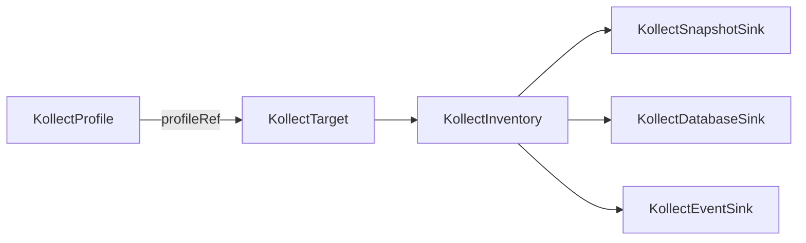

# KollectProfile

**Scope:** Namespace · **Reconciled:** No (static schema) · **Short name:** —

!!! tip "Static schema"
    Profiles are admission-validated configuration — no controller reconciles them. Changes enqueue
    referring targets via secondary watch (beta); plan profile edits during maintenance windows on
    large fleets.

## What it is for

A `KollectProfile` defines **what** to collect: the target GroupVersionKind (GVK) and a list of
attribute extraction rules. Each rule maps a logical name (for example `image` or `labels`) to a
JSONPath or CEL expression evaluated against cached Kubernetes objects.

Profiles are **static configuration** — no controller reconciles them. The target controller loads
the profile referenced by `KollectTarget.spec.profileRef` when registering collection. Validation
happens at admission (CEL compile, JSONPath shape, forbidden `Secret.data` paths).

See [ADR-0302](../adr/0302-cel-jsonpath-extraction.md) and
[ADR-0204](../adr/0204-namespaced-profiles.md).

## How it fits the pipeline



| Relationship | Rule |
| --- | --- |
| `KollectTarget` → Profile | `spec.profileRef` names a profile in the **same namespace** |
| `KollectScope` → Profile | When scope exists, profile GVK must appear in `allowedGVKs` |
| Profile change | Secondary watch enqueues referring targets (beta) |

Full flow: [DATA-FLOWS.md](../DATA-FLOWS.md#2-collection-pipeline) ·
[examples/deployment-inventory.md](../examples/deployment-inventory.md).

## Spec fields

| Field | Type | Required | Description |
| --- | --- | --- | --- |
| `spec.targetGVK.group` | string | No | API group (empty for core) |
| `spec.targetGVK.version` | string | Yes | API version (e.g. `v1`) |
| `spec.targetGVK.kind` | string | Yes | Resource kind (e.g. `Deployment`) |
| `spec.attributes[]` | list | No | Extraction rules (required unless `export.mode: Resource`) |
| `spec.attributes[].name` | string | Yes | Attribute key in export rows |
| `spec.attributes[].path` | string | Yes | JSONPath (`$.…`) or `cel:…` expression |
| `spec.attributes[].type` | string | No | Hint: `string`, `int`, `list`, `map`, … |
| `spec.attributes[].optional` | bool | No | Non-fatal when extraction yields no value |
| `spec.export` | object | No | Full-resource export with path pruning ([ADR-0306](../adr/0306-full-resource-export-pruning.md)) |
| `spec.export.mode` | string | No | `Attributes` (default) or `Resource` |
| `spec.export.as` | string | No | Attribute key for the embedded object (default `resource`) |
| `spec.export.include` | string | No | `MetadataOnly` \| `SpecOnly` \| `StatusOnly` \| `SpecAndStatus` (default) \| `All` |
| `spec.export.dedupeIdentity` | bool | No | Strip name/namespace/uid already on the Item envelope (default `true`) |
| `spec.export.prune.defaults` | bool | No | Apply built-in noise exclusions (default `true`) |
| `spec.export.prune.jsonPointers[]` | list | No | RFC 6901 pointers to drop (Argo CD `ignoreDifferences` style) |
| `spec.export.prune.jsonPaths[]` | list | No | kubectl/JSONPath keys to drop (filters/wildcards warn-only in Phase 1) |
| `spec.export.prune.scrubKeys[]` | list | No | Case-insensitive keys redacted at any depth, merged with operator `scrubKeys` |
| `spec.export.prune.cel[]` | list | No | CEL drop predicates — reserved for Phase 2, not yet enforced |
| `spec.metrics[]` | list | No | KSM-style Prometheus series on operator `/metrics` ([ADR-0304](../adr/0304-custom-resource-aggregation-rfc.md)) |
| `spec.metrics[].name` | string | Yes | Bounded series identifier (e.g. `ready_replicas_total`) |
| `spec.metrics[].path` | string | Yes | Attribute name from `spec.attributes` to aggregate |
| `spec.metrics[].labels[]` | list | No | Optional label keys from attributes (max 5); emits `kollect_custom_resource_labeled_series` |

## Example

A profile that extracts container images and a CEL-derived container count from `Deployment`
objects ([`config/samples/kollect_v1alpha1_kollectprofile.yaml`](https://github.com/konih/kollect/blob/main/config/samples/kollect_v1alpha1_kollectprofile.yaml)):

```yaml
apiVersion: kollect.dev/v1alpha1
kind: KollectProfile
metadata:
  name: deployment-images
  namespace: default
spec:
  targetGVK:
    group: apps
    version: v1
    kind: Deployment
  attributes:
    - name: image
      path: '$.spec.template.spec.containers[0].image'
      type: string
    - name: images
      path: '$.spec.template.spec.containers[*].image'
      type: list
    - name: containerCount
      path: "cel:size(object.spec.template.spec.containers)"
      type: int
    - name: labels
      path: '$.metadata.labels'
      type: map
      optional: true
```

More schemas live in [`config/samples/`](https://github.com/konih/kollect/tree/main/config/samples):
`*_kollectprofile_helm-release-summary.yaml`, `*_certificate-summary.yaml`,
`*_ingress-hosts.yaml`, `*_service-endpoints.yaml`, and the redaction-aware
`*_helm-release-values-redacted.yaml`.

## Full-resource export (`export.mode: Resource`)

For audit snapshots, exploratory profiles, or GitOps debugging where hand-authoring every
attribute is impractical, set `spec.export.mode: Resource` to embed a **pruned copy** of the target
object under `Item.attributes.<as>` (default key `resource`). Path pruning uses Argo CD–compatible
RFC 6901 `jsonPointers`, a JSONPath subset, and the existing scrub/redaction stack
([ADR-0306](../adr/0306-full-resource-export-pruning.md), [ADR-0303](../adr/0303-helm-release-inventory.md)).

Built-in defaults (`prune.defaults: true`, the default) drop high-churn noise:
`metadata.managedFields`, `metadata.resourceVersion`, `metadata.generation`, and the
`kubectl.kubernetes.io/last-applied-configuration` / `argocd.argoproj.io/tracking-id` annotations.

```yaml
apiVersion: kollect.dev/v1alpha1
kind: KollectProfile
metadata:
  name: deployment-snapshot
  namespace: default
spec:
  targetGVK:
    group: apps
    version: v1
    kind: Deployment
  export:
    mode: Resource
    as: resource
    include: SpecAndStatus
    prune:
      defaults: true
      jsonPointers:
        - /status/conditions
      jsonPaths:
        - '$.metadata.labels["pod-template-hash"]'
      scrubKeys:
        - password
  attributes:
    - name: containerCount
      path: 'cel:size(object.spec.template.spec.containers)'
      type: int
      optional: true
```

!!! warning "Sensitive kinds require opt-in"
    `export.mode: Resource` on a `Secret` target is rejected at admission unless the profile carries
    `kollect.dev/allow-full-resource-export: "true"`. `Secret.data` is always redacted regardless of
    opt-in. Full-object rows count toward `maxExportBytes` like any other row ([ADR-0405](../adr/0405-export-data-contract.md)).

## Sample usage

Apply the Deployment profile sample:

```sh
kubectl apply -f config/samples/kollect_v1alpha1_kollectprofile.yaml
kubectl get kollectprofile -n default deployment-images -o yaml
```

Create a matching target (next step in the pipeline):

```sh
kubectl apply -f config/samples/kollect_v1alpha1_kollecttarget.yaml
kubectl get ktgt -n default nginx-deployments -o jsonpath='{.status.conditions}'
```

**Argo CD Application** schema:

```sh
kubectl apply -f config/samples/kollect_v1alpha1_kollectprofile_argo-application-summary.yaml
kubectl apply -f config/samples/kollect_v1alpha1_kollecttarget_argo-applications.yaml
```

Or apply the full sample set:

```sh
kubectl apply -k config/samples/
```

## Status conditions

| Type | When set | Meaning |
| --- | --- | --- |
| *(none wired)* | — | Static CR — no controller updates status today |

Admission webhook failures surface as Kubernetes events on create/update, not as status conditions.
Check `kubectl describe kollectprofile <name>` for validation messages.

## RBAC

| Actor | Verbs | Resource | Notes |
| --- | --- | --- | --- |
| Team / app engineers | `get`, `list`, `watch` | `kollectprofiles` | Read schemas in tenant namespace |
| Profile authors | `create`, `update`, `patch`, `delete` | `kollectprofiles` | Define extraction in release namespace |
| Operator | `get`, `list`, `watch` | `kollectprofiles` | Target controller resolves `profileRef` |

Platform teams typically grant profile write to namespace admins and read to developers. The operator
ClusterRole includes profile read cluster-wide when not in tenant mode.

## Common failure modes

| Symptom | Reason | Fix |
| --- | --- | --- |
| Admission denied: invalid CEL | Expression does not compile | Prefix with `cel:`; test in unit fixtures; see [ADR-0302](../adr/0302-cel-jsonpath-extraction.md) |
| Admission denied: empty path | `spec.attributes[].path` missing | Set JSONPath or CEL for every attribute |
| Admission denied: Secret.data | Path targets `Secret.data` | Use `Secret` metadata only or redact via operator `scrubKeys` (Phase 2) |
| Admission denied: Resource export of Secret | `export.mode: Resource` on `Secret` without opt-in | Add `kollect.dev/allow-full-resource-export: "true"` annotation; `data` stays redacted |
| Admission denied: export.as duplicate | `export.as` collides with an `attributes[].name` | Rename `export.as` or the conflicting attribute |
| Admission denied: invalid JSON pointer | `export.prune.jsonPointers[]` not RFC 6901 | Start each pointer with `/`; escape `/`→`~1`, `~`→`~0` |
| Target `ProfileNotFound` | Name/namespace mismatch | Create profile in same namespace as target |
| Target `ScopeGVKDenied` | GVK not in `KollectScope` | Add GVK to scope `allowedGVKs` or remove scope |
| Empty export rows | Wrong GVK or optional-only attrs | Confirm `targetGVK` matches watched resources; mark sparse fields `optional: true` |
| Wildcard returns scalar | Single match only | Use `[*]` for all elements — [DATA-FLOWS §3](../DATA-FLOWS.md#3-attribute-extraction-jsonpath-arrays) |

## See also

- [KollectClusterTarget](kollectclustertarget.md) — references this profile by `name` + `namespace` for platform rollups ([ADR-0208](../adr/0208-cluster-static-refs-via-namespace.md))
- [KollectTarget](kollecttarget.md) — binds a profile to selectors
- [KollectScope](kollectscope.md) — GVK allow-list
- [examples/deployment-inventory.md](../examples/deployment-inventory.md)
- [examples/helm-release-inventory.md](../examples/helm-release-inventory.md)
