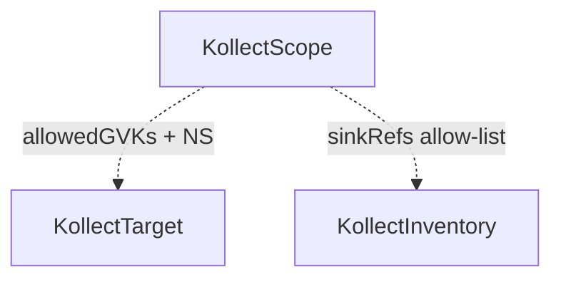

# KollectScope

**Scope:** Namespace · **Reconciled:** No (enforced by other controllers) · **Short name:** `kscope`

!!! warning "Hard degrade on violation"
    When a scope exists, target and inventory reconcilers **stop collection and export** on policy
    violation — conditions move to `Degraded`. Fix the scope or CR refs before expecting exports.

## What it is for

A `KollectScope` defines a **tenancy boundary** for a team namespace: which GVKs may be collected,
which workload namespaces targets may scrape, and which sinks inventories may export to. Inspired by
Argo CD AppProject-style policy ([ADR-0203](../adr/0203-namespaced-multi-tenancy.md)).
**Target intent** (include/exclude, `resourceRules`) lives on `KollectTarget`; Scope is the
**ceiling** only ([ADR-0207](../adr/0207-target-collection-filtering.md)).

The scope object itself is static — no dedicated controller. **Target** and **inventory**
reconcilers load the scope in the same namespace and **hard-degrade** (no collect, no export) on
violation.

## How it fits the pipeline



| Relationship | Rule |
| --- | --- |
| Target enforcement | Profile GVK ∈ `allowedGVKs`; workload NS ∈ `allowedNamespaces` |
| Inventory enforcement | Every `sinkRefs` entry ⊆ `scope.sinkRefs` |
| No scope | When absent, collection and export proceed without policy gate |

Enforcement diagram: [DATA-FLOWS.md §4](../DATA-FLOWS.md#4-kollectscope-enforcement-gate).

## Spec fields

| Field | Type | Required | Description |
| --- | --- | --- | --- |
| `spec.allowedGVKs[]` | list | No | Permitted target resource kinds (`group`, `version`, `kind`) |
| `spec.allowedNamespaces[]` | list | No | Permitted workload namespaces (empty = any allowed by targets) |
| `spec.deniedNamespaces[]` | list | No | Platform namespace blacklist — not overridable by Targets |
| `spec.sinkRefs[]` | list | No | Permitted `KollectSink` names for export |
| `spec.minExportInterval` | duration | No | Tenancy floor — inventory/sink intervals below this are rejected |

## Sample usage

Create a team namespace and scope:

```sh
kubectl create namespace team-a
kubectl apply -f config/samples/kollect_v1alpha1_kollectscope_team-a.yaml
kubectl get kscope -n team-a team-a-scope -o yaml
```

Verify enforcement blocks a disallowed GVK:

```sh
# Target referencing a Profile with GVK not in scope → Degraded ScopeGVKDenied
kubectl describe ktgt -n team-a <target-name>
```

Allow-list sinks for inventory:

```sh
# Inventory sinkRefs must be subset of scope.sinkRefs
kubectl get kinv -n team-a -o jsonpath='{.items[*].status.conditions[?(@.type=="Degraded")]}'
```

Set `spec.minExportInterval` to enforce a tenancy floor — inventory and sink intervals below this
value are rejected at admission ([ADR-0413](../adr/0413-export-interval-scheduling.md)). Sample:
`config/samples/kollect_v1alpha1_kollectscope_team-a.yaml` uses `minExportInterval: 1m`.

## Status conditions

| Type | When set | Meaning |
| --- | --- | --- |
| *(none)* | — | Static CR — violations surface on Target/Inventory `Degraded` |

Inspect downstream objects for policy outcomes:

```sh
kubectl get ktgt,kinv -n team-a -o custom-columns=\
NAME:.metadata.name,TYPE:.status.conditions[0].type,REASON:.status.conditions[0].reason
```

## RBAC

| Actor | Verbs | Resource | Notes |
| --- | --- | --- | --- |
| Platform / team admins | `create`, `update`, `patch`, `delete` | `kollectscopes` | Policy authors |
| Developers | `get`, `list`, `watch` | `kollectscopes` | Read boundaries |
| Operator | `get`, `list`, `watch` | `kollectscopes` | Target + inventory enforcement |

Grant scope write sparingly — it controls what teams can collect and where data may flow.

## Common failure modes

| Symptom | Reason on Target/Inventory | Fix |
| --- | --- | --- |
| Target not collecting | `ScopeGVKDenied` | Add profile GVK to `allowedGVKs` |
| Target not collecting | `ScopeNamespaceDenied` | Add workload namespace to `allowedNamespaces` |
| Inventory not exporting | `ScopeSinkDenied` | Add sink name to `scope.sinkRefs` |
| Unexpected open policy | No scope in namespace | Create `KollectScope` if enforcement required |
| `ScopeLookupFailed` | Operator cannot read scope | Fix RBAC on `kollectscopes` for operator SA |
| Empty `allowedGVKs` | All GVKs denied when enforced | Populate allow-list explicitly |

### Example: GVK denied

Profile targets `cert-manager.io/Certificate` but scope only lists `Deployment` and `Service` —
target shows `Degraded=True`, `reason=ScopeGVKDenied`. Add the Certificate GVK or use a permitted
profile.

## See also

- [KollectTarget](kollecttarget.md) · [KollectInventory](kollectinventory.md)
- [ADR-0203](../adr/0203-namespaced-multi-tenancy.md)
- [DATA-FLOWS.md](../DATA-FLOWS.md#4-kollectscope-enforcement-gate)
- [PLATFORM-DECISIONS.md](../PLATFORM-DECISIONS.md)
